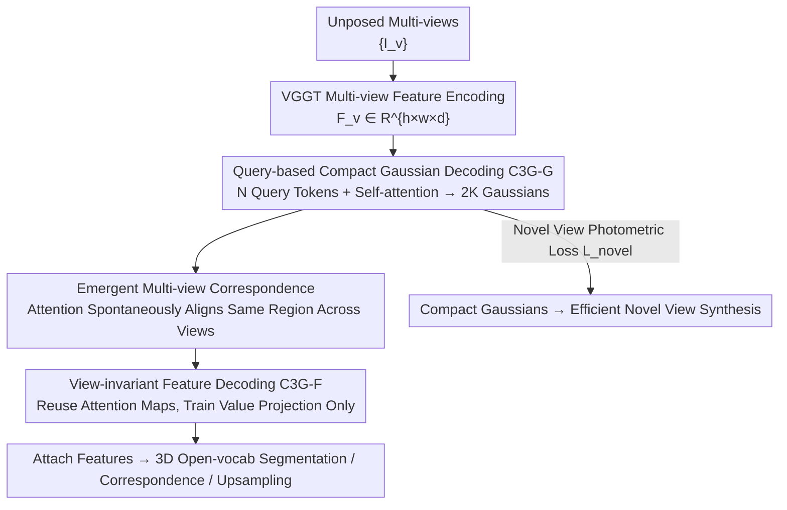

# Learning Compact 3D Representations from Feed-Forward Novel View Synthesis

**Conference**: CVPR 2026  
**Paper**: [CVF Open Access](https://openaccess.thecvf.com/content/CVPR2026/html/An_Learning_Compact_3D_Representations_from_Feed-Forward_Novel_View_Synthesis_CVPR_2026_paper.html)  
**Code**: https://cvlab-kaist.github.io/C3G (Project Page)  
**Area**: 3D Vision  
**Keywords**: 3D Gaussian Splatting, feed-forward reconstruction, compact representation, learnable queries, feature lifting

## TL;DR
C3G utilizes a small set of learnable query tokens to "discover and decode" approximately 2K compact 3D Gaussians placed at key spatial locations from unposed multi-view images using self-attention. Compared to pixel-wise methods, it maintains comparable novel view synthesis quality with ~65× fewer Gaussians. It further reuses emergent attention maps from the query decoder to lift arbitrary 2D features to 3D without additional training, significantly enhancing tasks like 3D open-vocabulary segmentation while reducing memory consumption and increasing rendering speed.

## Background & Motivation
**Background**: Recent mainstream feed-forward 3D reconstruction from unposed sparse multi-views relies on feed-forward 3D Gaussian Splatting (3DGS), where networks directly predict one (or more) Gaussians per pixel, followed by a 2D→3D feature lifting stage for scene understanding.

**Limitations of Prior Work**: Pixel-wise prediction suffers from two major drawbacks. First, it **generates significant redundancy and cross-view misaligned Gaussians**—often exceeding millions in multi-view or high-resolution settings, leading to artifacts and memory explosions. Second, it incurs **immense computational overhead for semantic understanding**—attaching rich semantic features to such a vast number of Gaussians is prohibitively expensive, forcing previous works to compress semantics into low-dimensional embeddings via autoencoders, which causes information loss and suboptimal scene understanding.

**Key Challenge**: The authors pose a fundamental question: Do reconstruction and understanding truly require "pixel-aligned" dense Gaussians? When humans perceive environment, they do not maintain a pixel-level mental reconstruction of every surface but rather form compact, semantically meaningful abstractions (key objects, spatial relations, overall structure). The pixel-wise paradigm uniformly allocates "representation capacity" to every pixel, contradicting this "allocation-on-demand" intuition.

**Goal**: To learn a compact representation that **places Gaussians only at necessary spatial locations** under feed-forward, unposed conditions without ground truth (GT) depth or decomposition labels, thereby saving memory and supporting lossless feature lifting.

**Key Insight**: Drawing from "selective attention" in human visual cognition, the model uses a small set of learnable query tokens to "discover" regions worth representing, rather than enforcing a rigid one-pixel-one-Gaussian mapping. Each token learns to aggregate relevant information across views to form a coherent 3D Gaussian.

**Core Idea**: Replace "pixel-wise regression" with "learnable query tokens + global self-attention" to generate compact global Gaussians. Then, reuse the emergent attention maps from the query decoder directly as feature aggregation weights, eliminating expensive back-projection and additional multi-view alignment modules.

## Method

### Overall Architecture
C3G consists of two components. C3G-G (Gaussian Decoder): Given $V$ unposed input images, features $F_v\in\mathbb{R}^{h\times w\times d}$ are first extracted using a pre-trained visual encoder VGGT (which possesses strong geometric priors). $N$ learnable query tokens $Q\in\mathbb{R}^{N\times d}$ and the image features are concatenated into a unified sequence $X=[Q;F]$ and passed through $L$ layers of global self-attention Transformers. This allows tokens to aggregate relevant information across all views, communicate to avoid redundancy, and iteratively refine which 3D region they represent. Finally, refined tokens $\bar Q_i$ are decoded into individual Gaussians $G_i$ via lightweight MLP heads. Training relies solely on photometric loss for novel view synthesis. C3G-F (Feature Decoder): By reusing the attention maps learned by C3G-G and training only the value projection, 2D features from any encoder can be lifted losslessly into multi-view consistent 3D features attached to the Gaussians.

### Key Designs

**1. Query-based Compact Gaussian Decoding: Using small sets of tokens to discover key regions instead of pixel-wise regression**

Addressing the redundancy and misalignment of pixel-wise methods, C3G treats $N$ learnable query tokens as "abstraction units." Each token is responsible for discovering and representing a specific 3D region. The core mechanism involves concatenating query tokens and multi-view image features into a sequence $X=[Q;F]\in\mathbb{R}^{(N+V\times h\times w)\times d}$, processed by $L$ layers of self-attention. This allows tokens to learn three things: aggregating visual information from specific regions across all views, communicating with other tokens to avoid overlap while ensuring coverage, and refining the 3D region they represent. Refined tokens $\bar Q_i$ are decoded into Gaussian parameters (mean $\mu_i$, opacity $\sigma_i$, covariance $\Sigma_i$, spherical harmonics $c_i$). Unlike pixel-wise methods that rigidly map pixels to Gaussians, query tokens flexibly attend to any region in any view, allocating capacity where needed—enabling the use of only ~2K Gaussians versus ~131K in pixel-wise approaches.

**2. Emergent Multi-view Correspondence: Attention spontaneously aligns across views without explicit supervision**

To address inconsistent pixel-wise features, the authors discovered a key emergent phenomenon: despite no explicit supervision for scene partitioning, and using only photometric reconstruction objectives, each query token's attention map spontaneously focuses on **spatially consistent regions across multiple views**. This stems from implicit optimization pressure—to accurately reconstruct novel views with a limited $N$ Gaussians, the model must place Gaussians in geometrically coherent regions. Consequently, tokens naturally learn multi-view correspondence. This property is crucial as it means cross-view correspondence is a byproduct of compact representation training rather than an extra learned overhead, directly paving the way for downstream feature lifting.

**3. View-invariant Feature Decoding C3G-F: Reusing attention maps to lift arbitrary features losslessly**

To solve the dual challenges of expensive back-projection and multi-view inconsistency in 2D→3D lifting, the authors reuse the emergent attention maps: ① Correspondence identification—since tokens already have high attention on their corresponding projected regions, expensive back-projection to find "which Gaussians rendered a pixel" is eliminated; ② Multi-view inconsistency—attention weights are used directly as interpolation weights to aggregate inconsistent features. Specifically, C3G-F copies the architecture and parameters of C3G-G, **freezes the attention weights**, and only trains the value projection while introducing new learnable feature tokens $Q'\in\mathbb{R}^{N\times d'}$. This ensures feature tokens attend to the same regions as their corresponding Gaussian tokens. Training uses a cosine similarity loss between rendered and GT features: $L_{\text{feat}}=1-\cos(\hat F_t/\|\hat F_t\|,\,F'_t/\|F'_t\|)$. Since no autoencoder compression is used, features are attached **losslessly**, significantly benefiting 3D understanding tasks.

### Loss & Training
The objective of C3G-G is to minimize the photometric difference between rendered Gaussians and GT novel views: $L_{\text{novel}}=\lambda_{\text{MSE}}L_{\text{MSE}}(\hat I_t,I_t)+\lambda_{\text{LPIPS}}L_{\text{LPIPS}}(\hat I_t,I_t)$, without requiring GT depth. A critical training technique is **progressive low-pass filtering** (borrowed from RAIN-GS): during rendering, 2D Gaussians are formulated as $G^{2D}_i(p)=\exp\!\big(-\tfrac12(p-\mu^{2D}_i)^\top(\Sigma^{2D}_i+sI)^{-1}(p-\mu^{2D}_i)\big)$, where the smoothing factor $s$ is annealed from a large value (e.g., 10) to 0.3. This provides robust gradients when Gaussian locations are noisy in early stages, avoiding mode collapse, and allows for fine details later. Ablations show training collapses without this filtering (PSNR/SSIM/LPIPS all N/A). Implementation details: $N=2048$, $L=2$, resolution $224\times224$, $\lambda_{\text{MSE}}=1, \lambda_{\text{LPIPS}}=0.05$. Trained using AdamW for 450K steps on 8×H100.

## Key Experimental Results

### Main Results
Novel View Synthesis (RealEstate10K, 12/24/36 views): C3G achieves quality comparable to pixel-wise/voxel-merging methods using only ~**2K Gaussians** and surpasses them after brief test-time optimization (TTO).

| Method (24 views) | PSNR↑ | #Gaussians↓ | Note |
|--------|------|------|------|
| AnySplat | 24.11 | 2,636K | Voxel-merging reduction |
| VGGT+NoPo | 21.24 | 1,204K | Pixel-wise; degrades with more views |
| **C3G (Ours)** | **23.80** | **2K** | ~1000× fewer Gaussians |
| C3G w/ TTO | **29.99** | 27K | Significantly leads after TTO |

3D Scene Understanding (ScanNet, lifting LSeg/MaskCLIP features for open-vocab segmentation):

| Method | LSeg mIoU↑ | MaskCLIP mIoU↑ | #Gaussians↓ | Mem↓ | FPS↑ |
|------|------|------|------|------|------|
| LSM (Feed-forward) | 0.503 | 0.286 | 131K | 61.5MB | 625 |
| **C3G (Ours)** | **0.513** | **0.369** | **2K** | **4.1MB** | **785** |

Ours dominates in memory (4.1MB vs 61.5MB, ~15× reduction), Gaussian count (~65× fewer), and rendering speed (785 vs 625 FPS), while achieving higher understanding metrics (MaskCLIP mIoU 0.369 vs 0.286).

### Ablation Study

| Configuration | Key Metrics (PSNR / SSIM / LPIPS) | Description |
|------|---------|------|
| Full (Low-pass + Unfrozen Encoder) | 22.39 / 0.713 / 0.259 | Full model |
| w/o Low-pass filtering | N/A | Gaussians fall outside frustum; collapse |
| Frozen Visual Encoder E | 18.44 / 0.553 / 0.408 | Prevents effective Gaussian generation |
| #G=2048 (Default) | 20.63 / 0.623 / 0.321 | Optimal |
| #G=4096 | 19.01 / 0.568 / 0.450 | Excess Gaussians trap in local optima |

### Key Findings
- **Low-pass filtering is the lifeline of stable training**: Without it, Gaussians fail to locate within the target frustum, resulting in sparse gradients and mode collapse. This is an effective solution to the core challenge of positioning Gaussians in feed-forward 3DGS.
- **More Gaussians are not always better**: Reconstruction improves from 256 to 2048, but 4096 leads to instability (excess Gaussians falling into suboptimal positions). $N=2048$ is fixed globally.
- **C3G-F eliminates the need for autoencoders**: Table 7 shows mIoU is similar between autoencoder (compressed) and lossless versions, but the lossless version yields higher PSNR (23.89 vs 23.60), proving that non-compressed features benefit both reconstruction and understanding.
- **Learning without strong geometric priors is possible**: Replacing the encoder with DINOv3 (no explicit geometric supervision) still allows query tokens to aggregate coherent Gaussians (PSNR 20.29), showing the framework does not strictly depend on VGGT's geometric bias.
- **Feature aggregation significantly improves correspondence**: On two-view correspondence (ScanNet PCK@10px), VGGT-Tracking+C3G improves the mean from 34.0 to **68.1**. DINOv2/v3 also improve from ~23–38 to ~68, validating C3G-F as an effective view-invariant feature decoder.

## Highlights & Insights
- **"Query Discovery" vs "Pixel-wise Regression"**: Migrating the DETR-style object query concept to feed-forward 3DGS is a brilliant move—allocating representation capacity by demand rather than per pixel leads to a ~65× reduction in Gaussians without quality loss.
- **Emergent Correspondence as a Free Lunch**: Trained only with photometric loss, attention spontaneously learns cross-view correspondence. The authors reuse this as alignment weights for feature lifting, avoiding expensive back-projection—a design philosophy where training byproducts become downstream capabilities.
- **Lossless Feature Lifting**: Because there are only ~2K Gaussians, high-dimensional semantic features can be attached directly without compression, avoiding the information loss common in prior works like LSM.

## Limitations & Future Work
- Primarily focused on indoor/RealEstate-style bounded scenes; scalability to large-scale outdoor, long-sequence, or dynamic scenes is not fully verified. Scalability of the 2K Gaussian budget for increasing input views lacks a degradation curve.
- Gaussian count is fixed at $N=2048$ and sensitive (instability at 4096); it lacks an adaptive mechanism based on scene complexity.
- Training cost is relatively high (450K steps on 8×H100) and depends on specific encoders like VGGT. While DINOv3 works, the optimal configuration for various backbones requires more systematic exploration.

## Related Work & Insights
- **vs LSM**: Both are feed-forward with two-view inputs, but LSM uses pixel-wise prediction (131K Gaussians) and feature compression. C3G uses queries for 2K Gaussians and lossless features, saving ~15× memory with higher understanding metrics.
- **vs AnySplat / ZPressor**: These methods perform post-hoc pruning/merging/voxelization, which does not solve the input view bias of pixel-wise prediction. C3G generates compact Gaussians directly from the generation stage.
- **vs CF3 / Feature-3DGS**: These require poses and per-scene optimization with millions of Gaussians. C3G is feed-forward, unposed, and uses 2K Gaussians, surpassing per-scene methods in ScanNet understanding with much higher FPS.
- **vs FiT3D / AnyUp**: FiT3D uses autoencoders for lifting with information loss and excess Gaussians. C3G-F leverages attention for lossless aggregation, achieving vastly superior correspondence accuracy (PCK 68.x vs ~24–39).

## Rating
- Novelty: ⭐⭐⭐⭐⭐ Using learnable queries to generate compact global Gaussians and reusing emergent attention for feature lifting fundamentally restructures the feed-forward 3DGS paradigm.
- Experimental Thoroughness: ⭐⭐⭐⭐⭐ Covers novel view synthesis, open-vocab segmentation, multi-view correspondence, and feature upsampling with comprehensive ablations.
- Writing Quality: ⭐⭐⭐⭐ Narrative flow from motivation (human abstraction) to method to emergent analysis is coherent, though some implementation details are scattered across tables.
- Value: ⭐⭐⭐⭐⭐ ~65× Gaussian reduction and lossless feature lifting directly address the memory/compute bottlenecks of feed-forward 3DGS.

<!-- RELATED:START -->

## Related Papers

- [\[CVPR 2026\] Cross-View Splatter: Feed-Forward View Synthesis with Georeferenced Images](cross-view_splatter_feed-forward_view_synthesis_with_georeferenced_images.md)
- [\[CVPR 2026\] From Rays to Projections: Better Inputs for Feed-Forward View Synthesis](from_rays_to_projections_better_inputs_for_feed-forward_view_synthesis.md)
- [\[CVPR 2026\] Splatent: Splatting Diffusion Latents for Novel View Synthesis](splatent_splatting_diffusion_latents_for_novel_view_synthesis.md)
- [\[CVPR 2026\] AnchorSplat: Feed-Forward 3D Gaussian Splatting with 3D Geometric Priors](anchorsplat_feed-forward_3d_gaussian_splatting_with_3d_geometric_priors.md)
- [\[CVPR 2026\] Dynamic-Static Decomposition for Novel View Synthesis of Dynamic Scenes with Spiking Neurons](dynamic-static_decomposition_for_novel_view_synthesis_of_dynamic_scenes_with_spi.md)

<!-- RELATED:END -->
