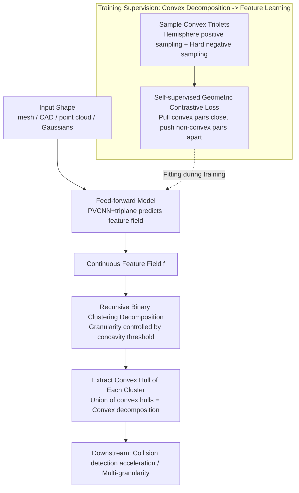

# Learning Convex Decomposition via Feature Fields

**Conference**: CVPR 2026  
**Paper**: [CVF Open Access](https://openaccess.thecvf.com/content/CVPR2026/html/Yang_Learning_Convex_Decomposition_via_Feature_Fields_CVPR_2026_paper.html)  
**Code**: None (Project page <https://research.nvidia.com/labs/sil/projects/learning-convex-decomp/>)  
**Area**: 3D Vision  
**Keywords**: Convex Decomposition, Feature Fields, Self-Supervised Contrastive Learning, 3D Shapes, Physical Simulation Acceleration

## TL;DR
The NP-hard combinatorial search problem of decomposing a 3D shape into several convex parts is reformulated as a feature learning problem: learning a continuous feature field on the shape surface followed by clustering. By designing a self-supervised contrastive loss derived from the geometric definition of convexity, the authors train the **first feed-forward, open-world** convex decomposition model. This model comprehensively outperforms classical methods like V-HACD and CoACD in terms of concavity and reconstruction error, and can directly generalize to meshes, CAD models, point clouds, and 3D Gaussians.

## Background & Motivation
**Background**: Convex decomposition aims to approximate complex non-convex 3D shapes with a collection of convex bodies. It serves as a crucial geometric acceleration structure for collision detection, signed distance queries, and animation rigging in physical simulation. Traditional methods fall into two categories: computational geometry approaches (e.g., V-HACD, CoACD) perform branch-and-bound or heuristic searches in the space of all possible partitions to satisfy a concavity threshold; learning-based approaches (e.g., BSP-Net, Cvx-Net) utilize a fixed set of half-spaces to assemble shapes via self-supervised reconstruction objectives.

**Limitations of Prior Work**: The search space of classical computational geometry methods scales combinatorially with all possible partitionings. Even with approximations like axis-aligned slicing and voxelization, they remain slow. Furthermore, the axis-aligned assumption often fractures tilted convex regions (e.g., slicing a crab shell into a massive number of unnecessary small fragments). Conversely, learning-based approaches are bottlenecked by reconstruction objectives. Relying on fixed half-spaces and reconstruction losses works reasonably well on narrow object categories like ShapeNet, but generalization collapses in open-world settings (e.g., Objaverse under drastic topological and geometric variations). Additionally, prior works target meshes almost exclusively, whereas modern 3D geometry increasingly originates from imprecise representations such as 3D Gaussians and 3D scans.

**Key Challenge**: Convex decomposition is fundamentally an NP-hard combinatorial covering problem. Optimization directly over discrete partition sets is both challenging and non-scalable. Meanwhile, learning-based methods employ shape reconstruction as a differentiable proxy objective, but **accurate reconstruction $\neq$ convex decomposition**. The proxy objective itself deviates from the core requirement of being "convex".

**Goal**: To train a model that delivers high-quality convex decompositions via direct feed-forward inference, supports self-supervised learning on open-world datasets, and generalizes across different modalities, a continuous objective is required. This objective must align with the essence of convexity while being amenable to large-scale stochastic optimization.

**Key Insight**: The authors return to the classical geometric definition of convexity: "a shape is convex if and only if the line segment connecting any two internal points lies entirely within the shape." This allows identifying whether any pair of surface points forms a "convex pair" (i.e., their connecting line does not exit the shape). A good decomposition should assign as many convex pairs as possible to the same component.

**Core Idea**: Instead of directly learning or optimizing a discrete set of convex bodies, the proposed method learns a **continuous feature field** over the shape surface. It maps "convex pairs" close together in the feature space while pushing "non-convex pairs" apart. This relaxes the convex decomposition problem into a feature embedding task, which is then solved by applying off-the-shelf clustering to partition the features, followed by extracting the convex hull of each cluster to obtain the decomposition.

## Method

### Overall Architecture
Taking a point cloud sampled from the shape surface as input, the model predicts in a feed-forward manner a continuous feature field $f:\mathcal{M}\to\mathbb{R}^k$ defined over the entire object. During training, this feature field is optimized using a self-supervised geometric contrastive loss derived from the definition of convexity. During inference, features are clustered to partition the shape into several components, and the convex hull is computed for each component, yielding the final convex decomposition. The entire pipeline converts a combinatorial optimization problem into three stages: "feature learning $\to$ clustering $\to$ convex hull extraction." The core advantage is that the intermediary features are supervised purely by geometry (without needing any human-annotated "optimal decompositions") and can be successfully learned by a feed-forward model across 340,000 shapes, resulting in open-world generalization and cross-modal capabilities.

### Key Designs

**1. Reformulating Convex Decomposition as Feature Learning: Replacing "Combinatorial Slicing" with "Convex-Pair Co-clustering"**

The difficulty lies in the fact that directly maximizing the number of co-clustered convex pairs over discrete partitions is an NP-hard combinatorial problem. The authors first formalize this objective. Let the set of convex pairs be defined as $\mathrm{ConvexPairs}(\mathcal{M})=\{(x,y):\lambda x+(1-\lambda)y\in\mathrm{Vol}(\mathcal{M}),\forall\lambda\in[0,1]\}$. A high-quality decomposition should maximize the number of convex pairs assigned to the same partition component:

$$\max_{\{S_i\}}\iint_{x,y\in\mathrm{ConvexPairs}(\mathcal{M})}\mathbf{1}_{G(x)=G(y)}\,dx\,dy$$

where $G$ is the assignment function mapping surface points to their respective components. Directly optimizing this formula yields an intractable combinatorial partitioning task. Consequently, the authors relax the "hard assignment" into a "continuous feature distance": learning a feature field $f$ that minimizes the feature distance $d(f_x,f_y)$ for convex pairs. However, minimizing this term alone leads to representation collapse where $f$ is a constant. Thus, an additional term is introduced to push non-convex pairs apart:

$$\min_f\iint_{x,y\in\mathrm{ConvexPairs}}d(f_x,f_y)-\iint_{x,y\notin\mathrm{ConvexPairs}}d(f_x,f_y),\quad\|f\|=1$$

This step serves as the core pivot of the work: transitioning formulation from computational discrete search to continuous embedding, which is differentiable, amenable to stochastic optimization, and learnable via feed-forward networks. The critical difference from prior learning-based approaches is that the supervision signal originates directly from "convexity" itself (where convex/non-convex pairs are identified via ray casting), rather than "shape reconstruction", which acts as an misaligned proxy.

**2. Self-Supervised Geometric Contrastive Loss + Convex Triplet Sampling: Efficient Supervision Aligned with Convexity**

Although the embedding objective is well-posed, the authors reformulate it into a relative contrastive style. This formulation is better suited for high-dimensional stochastic optimization and avoids imposing an arbitrary metric structure. Specifically, triplets $(x,p,n)$ are gathered, where $x, p$ represent a positive (convex) pair and $x, n$ represent a negative (non-convex) pair. The positive pair distance is optimized to be smaller than the negative pair distance, resulting in a balanced log-normalized contrastive loss:

$$\mathcal{L}_{cc}=-\tfrac12\Big[\log\tfrac{\mathrm{sim}(f_x,f_p)}{\mathrm{sim}(f_x,f_p)+\mathrm{sim}(f_x,f_n)}+\log\tfrac{\mathrm{sim}(f_p,f_x)}{\mathrm{sim}(f_p,f_x)+\mathrm{sim}(f_p,f_n)}\Big]$$

where the similarity metric is the exponential cosine similarity of spherically normalized features: $\mathrm{sim}(x,y)=\exp(x\cdot y/\tau)$, where $\tau$ denotes a softmax-like temperature parameter.

Sampling forms the other essential pillar of this design, verified by the ablation studies through two main components: ① **Hemispheric Positive Sampling**: Given an anchor point $x$, a ray is cast randomly into the hemisphere opposite to its surface normal (pointing inward). The intersection where the ray exits the shape surface is selected as $p$. This approach yields virtually guaranteed positive convex pairs, completely bypassing expensive rejection sampling. ② **Hard Negative Sampling**: Negative samples $n$ are generated on the surface via rejection sampling and tested to check if the connecting segment $x\!-\!n$ exits the shape. Crucially, the sampler **biases towards points closer in space to $x$**, following the distribution $P(n)\propto1/\|n-x\|^2$. Geometrically close yet non-convex pairs represent the hardest and most informative samples, greatly accelerating optimization. Crucially, these geometric queries require only point sampling and ray casting, which can be accelerated by hardware libraries such as Embree or OptiX, enabling on-the-fly triplet generation during training.

**3. Feed-forward Model (PVCNN + Triplane): Scaling Single-Shape Optimization to Open-world Generalization**

Although the aforementioned loss can be directly optimized per shape, the authors take a step forward by training a feed-forward network to perform self-supervised learning across 340,000 shapes. In shape-level optimization, every unseen shape requires its own optimization loop and demands a watertight mesh, rendering it highly sensitive to noise or missing structures. A feed-forward model provides three primary advantages: (a) near-real-time inference speed; (b) a smoother feature field that is robust to noisy and incomplete geometries; (c) cross-modality generalization, enabling direct processing of meshes, CAD models, point clouds, and 3D Gaussians without needing watertight meshes. Architecturally, the network takes a surface-sampled point cloud as input: a PVCNN encoder extracts point-wise features which are then orthogonally projected (via average reduction) onto three axis-aligned 2D planes to construct an initial triplane. This triplane is downsampled by 2D CNNs, reshaped, processed through a transformer, and upsampled via transposed CNNs to form the final triplane representation. The feature of any 3D query point is then gathered from the triplane. Reformulating the decomposition as a feature learning task (from Key Design 1) and utilizing pure geometric self-supervision (from Key Design 2) are what make "training on large-scale open-world datasets without ground-truth decomposition annotations" possible.

**4. Recursive Binary Clustering Decomposition: Controlling Granularity on a Unified Feature Field via Concavity Thresholds**

During inference, the feature field has already clustered "surface regions that belong together" in the feature space, though the exact partition count is not predefined. The authors address this via divide-and-conquer: they maintain a max-heap sorted by concavity. At each step, the component with the highest concavity is popped. If its concavity drops below a user-defined threshold $\varepsilon$, it is finalized. Otherwise, it is bisected into two components through clustering, and recursively processed until all components meet the threshold or the maximum component count $K$ is reached (see Algorithm 1). For mesh inputs, features are sampled per face, and hierarchical clustering under connectivity constraints is applied. For other modalities like point clouds, k-means is used based on a combination of feature and Euclidean distances. A major advantage of this approach is that **granularity is determined solely in post-processing**. The same set of learned features can generate decompositions at any granularity: increasing the threshold yields fewer, coarser segments, while lowering it produces finer, more detailed parts—entirely training-free.

### Loss & Training
The sole training objective is the contrastive loss $\mathcal{L}_{cc}$ defined above, augmented with a spherical normalization constraint $\|f\|=1$ to prevent unbounded feature growth. The training dataset consists of approximately 340,000 shapes filtered from Objaverse, normalized into the $[-1,1]^3$ range. From each shape, 100k points are sampled as inputs. For each shape, 10k triplets are generated, utilizing 64 positive and 512 negative samples per triplet. The feature dimension is 448, the triplane resolution is $512\times512\times128$ channels, and the transformer has 6 layers. Training takes approximately one week for 600k steps on 8 A100 GPUs with a batch size of 2 per card. During inference, feature generation takes about 5s, while recursive decomposition takes around 13s.

## Key Experimental Results

### Main Results
Evaluation is conducted on three datasets: V-HACD (61 models), PartObjaverse-Tiny (200 models), and ShapeNet (900 shapes selected across 13 classes). Performance is evaluated using concavity (the maximum surface-to-volume Chamfer distance between a component and its convex hull) and reconstruction error (the Chamfer distance between the input shape and the union of all convex hulls). **Lower is better** across both metrics, evaluated under comparable component counts.

| Method | VHACD Concavity↓ | VHACD Recon.↓ | PartObj Concavity↓ | ShapeNet Concavity↓ |
|------|------------|-------------|---------------|----------------|
| V-HACD | 0.1176 | 0.0213 | 0.1800 | 0.1155 |
| CoACD | 0.1095 | 0.0321 | 0.1388 | 0.0746 |
| BSP-Net (ShapeNet) | 0.2249 | 0.1227 | 0.2593 | 0.2107 |
| BSP-Net (Objaverse) | 0.1857 | 0.0297 | 0.1964 | 0.1592 |
| Cvx-Net (Objaverse) | 0.2880 | 0.0373 | 0.2970 | 0.2191 |
| **Ours** | **0.0973** | **0.0180** | **0.1257** | **0.0656** |

Across all three datasets, under comparable or even fewer component counts, Ours achieves the lowest concavity and reconstruction errors. While classical methods tend to fracture tilted convex regions (e.g., a crab shell) due to axis-aligned cutting assumptions, the proposed model preserves major convex structures better (e.g., a submarine), successfully separates adjacent convex parts (e.g., an elephant), and remains highly effective even under a small budget of components (e.g., an airplane). For learning-based models like Cvx-Net and BSP-Net, even when utilizing more convex bodies and training on Objaverse, reconstruction remains far from ideal, illustrating their inability to scale to open-world scenarios.

### Ablation Study
Removing components one by one, evaluated on V-HACD and Objaverse-Tiny (concavity/reconstruction, lower is better):

| Configuration | VHACD Concavity | VHACD Recon. | Obj Concavity | Description |
|------|-----------|-----------|----------|------|
| − Hard negative sampling | 0.0993 | 0.0186 | 0.1293 | Without hard-negative sampling |
| − Hemispheric positive sampling | 0.0999 | 0.0219 | 0.1286 | Without hemispheric positive sampling |
| − Recursive clustering | 0.1292 | 0.0191 | 0.1375 | Replaced with flat clustering |
| Single-shape optimization | 0.1134 | 0.0198 | 0.1300 | Without feed-forward, optimized per shape |
| **Full Model** | **0.0973** | **0.0180** | **0.1257** | — |

### Key Findings
- **Recursive binary clustering contributes the most**: Removing it causes the VHACD concavity to degrade drastically from 0.0973 to 0.1292, indicating that the divide-and-conquer strategy prioritized by concavity is vastly superior to flat clustering and acts as the key to controllable granularity.
- **Feed-forward model outperforms single-shape optimization**: The single-shape optimization yields a concavity of 0.1134, which is significantly worse than the full model's 0.0973. The feed-forward model is not only faster but also achieves better quality due to smoother feature distributions. Counterintuitively, learning a generalizable model proves superior to executing shape-specific optimizations.
- **Both sampling strategies are critical**: Excluding either hard negative sampling or hemispheric positive sampling degrades concavity and reconstruction. Hard negative sampling is particularly essential for separating adjacent convex parts.
- **Convex-aware features $\neq$ semantic segmentation features**: Applying the recursive algorithm to features from PartField (a 3D segmentation model) yields poor decomposition quality because its features represent semantic structures (e.g., an L-shape surface has uniform semantic features). In contrast, the features learned in this work are deeply convex-aware.
- **Downstream acceleration evaluation**: Integrating the proposed convex decomposition into the Newton physics engine for collision detection drops the simulation step time from 40ms (using raw meshes) to 8ms, achieving a $\sim 5\times$ acceleration.

## Highlights & Insights
- **Relaxing an NP-hard combinatorial problem into a feature embedding task** is the most elegant contribution of this paper: mapping the classical geometric definition of convexity (connecting segment staying within the object) to convex/non-convex pairs, and then to contrastive learning. This logical progression embeds the "convexity partition" constraint directly into the loss, circumventing the fundamental flaw of using reconstruction as a proxy.
- **Pure geometric self-supervision, zero decomposition annotations**: Since convex pairs are identified via ray tests, the supervision signal is derived entirely from the shape geometry. This is the root reason why the method seamlessly scales across 340,000 open-world shapes and generalizes across modalities.
- **Hard negative sampling biased towards spatial neighbors via $1/\|n-x\|^2$**: This translates a standard contrastive learning trick to geometry. Spatial neighbors that are non-convex carry the highest amount of information. This insight can readily transfer to other "shape/surface contrastive learning" pipelines.
- **Post-processing adjustable granularity**: Deploying the same learned feature field with varying concavity thresholds produces levels of decomposing coarseness dynamically without retraining, which is highly practical for industry asset production (e.g., Level of Detail - LOD).

## Limitations & Future Work
- The authors acknowledge that the model is trained on clean, object-level datasets, meaning it may not easily generalize to scene-level data or severely incomplete geometries. It also struggles with thin structures (e.g., fan blades). Future directions include training on larger scene datasets and incorporating noise injection.
- Limitations identified by the reviewer: The concavity evaluation adopts CoACD's metric and compares methods aligned by similar component counts; however, different techniques exhibit distinct curves across varying component counts, so single-point comparisons require cautious interpretation. Additionally, training the feed-forward model takes a week on 8 $\times$ A100 GPUs, presenting a high barrier to reproducibility (especially since the source code is currently not open-sourced).
- Future Work: The authors propose learning semantic-aware or motion-adaptive convex proxies, advancing convex decomposition from pure geometric layouts toward semantic and physical/dynamical priors.

## Related Work & Insights
- **vs V-HACD / CoACD (Classical Search Methods)**: These methods search within the partition space and prune branches with concavity thresholds, making them slow due to axis-aligned slicing and voxelization. They also fracture tilted convex regions. In contrast, Ours infers in a feed-forward manner (5s for features + 13s for decomposition) to achieve higher quality without relying on axis-aligned constraints.
- **vs BSP-Net / Cvx-Net (Learning Methods)**: These utilize fixed half-spaces and reconstruction loss for self-supervision, suffering from the fact that "good reconstruction $\neq$ convex decomposition", causing generalization to collapse in the open world. Ours replaces the layout proxy with a contrastive loss derived from the geometric definition of convexity, directly aligning the objective to convexity, which enables scaling to Objaverse and cross-modal processing.
- **vs PartField (3D Segmentation)**: Segmentation features express semantic components, which are ill-suited for convex partitioning. The features in this paper are strictly convex-aware, illustrating that "co-membership within a convex body" and "sharing a semantic part" are two distinct concepts, providing a clear boundary for similar geometric tasks.

## Rating
- Novelty: ⭐⭐⭐⭐⭐ Reformulates convex decomposition as a feature learning task and constructs a self-supervised contrastive loss based on the geometric definition of convexity. This represents the first feed-forward open-world convex decomposition model, presenting a true formulation-level innovation.
- Experimental Thoroughness: ⭐⭐⭐⭐ Comprises comparisons across three datasets, four ablation studies, and demonstrations in cross-modality and collision acceleration; quite thorough. However, the horizontal comparison of concavity aligned to component counts is crude, lacking detailed curve-level statistical analysis.
- Writing Quality: ⭐⭐⭐⭐⭐ The logical progression is distinct, leading from the classic definition of convexity to contrastive loss formulations and feed-forward models, complemented by outstanding figures.
- Value: ⭐⭐⭐⭐⭐ High-quality convex decomposition is highly sought after in physics simulation, robotics, and generative assets; achieving a $\sim 5\times$ collision acceleration and cross-modal generalization offers high practical utility.

<!-- RELATED:START -->

## Related Papers

- [\[CVPR 2026\] From Feature Learning to Spectral Basis Learning: A Unifying and Flexible Framework for Efficient and Robust Shape Matching](from_feature_learning_to_spectral_basis_learning_a_unifying_and_flexible_framewo.md)
- [\[ICML 2026\] Convex Distance Operator Transport: A Convex and Geometry-Preserving Formulation](../../ICML2026/3d_vision/convex_distance_operator_transport_a_convex_and_geometry-preserving_formulation.md)
- [\[CVPR 2026\] QuadSync: Quadrifocal Tensor Synchronization via Tucker Decomposition](quadsync_quadrifocal_tensor_synchronization_via_tucker_decomposition.md)
- [\[CVPR 2026\] LuxRemix: Lighting Decomposition and Remixing for Indoor Scenes](luxremix_lighting_decomposition_and_remixing_for_indoor_scenes.md)
- [\[ECCV 2024\] SlotLifter: Slot-guided Feature Lifting for Learning Object-centric Radiance Fields](../../ECCV2024/3d_vision/slotlifter_slot-guided_feature_lifting_for_learning_object-centric_radiance_fiel.md)

<!-- RELATED:END -->
