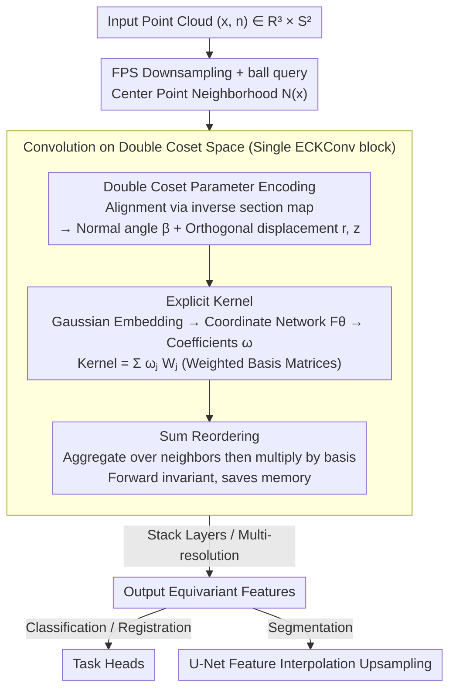

# ECKConv: Learning Coordinate-based Convolutional Kernels for Continuous SE(3) Equivariant Point Cloud Analysis

**Conference**: CVPR 2026  
**arXiv**: [2603.17538](https://arxiv.org/abs/2603.17538)  
**Code**: None  
**Area**: 3D Vision  
**Keywords**: Point Cloud Analysis, SE(3) Equivariance, Group Convolution, Double Coset Space, Coordinate Network, intertwiner framework

## TL;DR

ECKConv is proposed to define convolutional kernels on the double coset space $\text{SO(2)}\backslash\text{SE(3)}/\text{SO(2)}$ within the intertwiner framework. By explicitly parameterizing kernel functions via coordinate networks, it achieves both continuous SE(3) equivariance and large-scale scalability for the first time, validated across classification, registration, and segmentation tasks.

## Background & Motivation

In 3D point cloud deep learning, ensuring model symmetry relative to rigid motions (rotation + translation) is key to efficient learning. Group convolution is a representative method for extracting equivariant features, but existing implementations face a fundamental trade-off between **strict symmetry** and **scalability**:

**Background**: Group convolutions are divided into two main streams: discrete group methods (EPN, E2PN) which expand kernel parameters over discretized rotation groups, and steerable convolution methods (TFN, SE(3)-Transformer) which guarantee continuous equivariance via irreducible decompositions.

**Limitations of Prior Work**:
   - Discrete group methods discretize continuous rotations (e.g., discretizing SO(3) into finite rotations), leading to a discrepancy between model symmetry and group continuity, failing to strictly guarantee continuous SE(3) equivariance.
   - Steerable convolution methods, while theoretically elegant, require decomposing features and kernels into irreducible representations. This is computationally expensive (TFN achieves only 62.28% classification accuracy) and cannot scale to large-scale 3D scenes.

**Key Challenge**: Strict continuous equivariance vs. Memory/Computational scalability.

**Goal**: The intertwiner framework (Cohen et al.) suggested replacing the domain of group convolutions from the group space to coset spaces. However, the prior work CSEConv only achieved SO(3) symmetry (lacking translation) and used implicit kernels resulting in high memory consumption and poor scalability.

**Key Insight**: The authors observe that when reference points fall on the SO(2) subgroup (Z-axis), topologically identical point distributions lie on disjoint orbits (double cosets), each representable by three unique parameters. This implies equivariant operations can be constructed relying solely on these SE(3)-invariant parameters.

**Core Idea**: Use coordinate networks to explicitly parameterize convolutional kernels on the double coset space, simultaneously obtaining continuous SE(3) equivariance and memory scalability.

## Method

### Overall Architecture

The input to ECKConv is the point cloud $(x, n) \in \mathbb{R}^3 \times S^2$ (coordinates + normal vectors). Equivariant features are output after processing through multiple ECKConv blocks. The core operation within each block involves: for the ball query neighborhood of each center point, extracting SE(3)-invariant double coset parameters; computing kernel weights via a coordinate network; and performing a weighted sum of neighborhood features. The overall architecture adopts a multi-resolution design similar to PointNet++ (FPS downsampling + ball query), while segmentation tasks use a U-Net architecture with feature interpolation upsampling.

### Key Designs

**1. Convolution on Double Coset Space: Kernels depend on three SE(3)-invariant scalars**

Expanding kernels directly on the group forces either discretization (breaking continuous equivariance) or irreducible decomposition (computationally prohibitive). This work utilizes the intertwiner framework to change the domain: setting $G=\text{SE(3)}$, left/right subgroups $H_1=H_2=\text{SO(2)}$, and invariant representations $\rho_1=\rho_2=\text{id}$, the kernel function is defined on the double coset space $\text{SO(2)}\backslash\text{SE(3)}/\text{SO(2)}$. Convolution is expressed as a weighted sum over a ball neighborhood:

$$(f*\kappa)(x) = \sum_{x_i \in \mathcal{N}(x)} \kappa\big(s(x)^{-1}x_i\big)\, f(x_i),\qquad \kappa: \text{SE(3)/SO(2)} \to \mathbb{R}^{C_{out} \times C_{in}}$$

Crucially, each element in the double coset space is uniquely determined by three parameters $[\beta_g, r_g, z_g]$, and thus the kernel $\kappa$ depends only on these three scalars. Strict continuous equivariance is achieved because the rotational degrees of freedom around the Z-axis are "absorbed" by the action of the SO(2) subgroups—the kernel does not see them.

**2. Double Coset Parameter Encoding: Compressing local geometry into a normal angle and two orthogonal displacements**

The kernel input requires three SE(3)-invariant scalars. The domain space is decomposed into $\mathbb{R}^3 \times S^2$. For each point $x_i$ in the ball query neighborhood, it is first aligned to the local coordinate system of the center point using an inverse section map. Three values are extracted: the normal vector angle $\bar{\beta}_i = \arccos(\mathbf{n}^\top \cdot \mathbf{n}_i)$, the displacement component parallel to the normal $\bar{z}_i$, and the component perpendicular to the normal $\bar{r}_i$ (the latter two are normalized by the ball query radius). These three parameters fully describe the "normal relationship + spatial displacement in two orthogonal directions."

**3. Explicit Kernels: Coefficient networks with learnable basis matrices**

Predecessor CSEConv used implicit kernels with random Fourier features, requiring the network to output the entire $C_{out}\times C_{in}$ matrix. ECKConv decomposes the kernel into "coefficients + basis": the three double coset parameters are normalized to $[0,1]$, passed through Gaussian embedding $\text{Gau}(\cdot)\in\mathbb{R}^{3d}$ ($\psi(x,y)=\exp(-(x-y)^2/2\sigma^2)$), and then a coordinate network $F_\theta$ outputs an $A$-dimensional coefficient vector $\omega(\bar{x};\theta)\in\mathbb{R}^A$. The kernel value is the weighted sum of learnable basis matrices $\mathbf{W}_j$:

$$\kappa\big(s(x)^{-1}x_i\big) = \sum_{j=1}^{A} \omega_j(\bar{x}_i;\theta)\, \mathbf{W}_j$$

The network only needs to regress $A$ scalars instead of the whole matrix, enabling ECKConv-mini to improve CSEConv's 83.75%/2.95GB to 87.36%/0.72GB.

**4. Sum Reordering: Memory scalability for backpropagation**

While explicit kernels save parameters, a naive implementation still requires synthesizing a full kernel matrix for each neighbor before multiplication. Proposition 4.1 uses the associative property of matrix multiplication to reorder the summation:

$$\sum_i \Big(\sum_j \omega_j \mathbf{W}_j\Big) f(x_i) \;=\; \sum_j \mathbf{W}_j \sum_i \omega_j f(x_i)$$

Aggregating $\omega_j f(x_i)$ over neighbors first, then multiplying by the basis matrix, reduces gradient complexity from $\mathcal{O}(AKC_{in}C_{out})$ to $\mathcal{O}(A(KC_{in}+C_{in}C_{out}))$. This results in a massive memory reduction (e.g., 5.37GB vs CSEConv's 39.09GB in registration).

### Loss & Training

- Classification: Cross-entropy (label smoothing=0.2), Adam, lr 1e-4 cosine annealing to 1e-6, 200 epochs.
- Registration: $\mathcal{L} = \|\mathbf{R}_{pred}\mathbf{R}_{gt}^\top - \mathbf{I}\|_2^2 + \|\mathbf{t}_{pred} - \mathbf{t}_{gt}\|_2^2$ combined with DCP.
- Segmentation: U-Net + feature interpolation upsampling.
- S3DIS: Cropped $4m^2$, 4096 points for training, XY scaling + X-axis flipping augmentation, class-weighted cross-entropy. Inference with 1m stride + 3-fold voting. All on a single RTX 3090.

## Key Experimental Results

### Main Results

| Dataset/Task | Metric | ECKConv | Prev. SOTA | Gain |
|-------------|------|---------|----------|------|
| ModelNet40 (SO(3)/SO(3)) | Class. Acc. | 90.92% (Normal) | 88.58% (E2PN) | +2.34% |
| ModelNet40 Registration | Mean Angular Error | 0.63° | 1.62° (EPN) | 2.6× |
| ModelNet40 Registration | Max Angular Error | 8.57° | 178.95° (CSEConv) | Significant |
| ShapeNet (SO(3)/SO(3)) | Part Seg mIoU | 83.68% | 81.76% (VN) | +1.92% |
| S3DIS Area5 | Sem. Seg mIoU | 61.80% | 60.3% (RI-MAE) | +1.50% |

### Ablation Study

| Configuration | Accuracy / Memory | Description |
|------|--------------|------|
| ECKConv-mini (Explicit) | 87.36% / 0.72GB | Same arch CSEConv: 83.75% / 2.95GB, Acc +3.6%, 4.1x memory saving |
| ECKConv (Algorithm 1) | 90.19% | Heuristic normal estimation instead of ground truth |
| ECKConv-Normal | 90.92% | Using ground truth normals, optimal performance |
| A=12→22 (anchor bases) | 89.22→90.19% | Robustness against hyperparameter changes |
| Registration ECKConv vs CSEConv | 5.37GB vs 39.09GB | 7.3x memory saving |
| Segmentation ECKConv vs CSEConv | 10.26GB vs 66.46GB | 6.5x memory saving |

### Key Findings

- ECKConv maintains consistent accuracy across all training/test rotation combinations, verifying continuous SE(3) equivariance.
- Pose registration highlights the value of continuous equivariance: CSEConv (SO(3) symmetric only) fails catastrophically (Max Error 178.95°) due to lack of translation equivariance.
- In S3DIS semantic segmentation, ECKConv outperforms data augmentation methods (KPConv+SO(3) Aug: 57.42%) and rotation-invariant methods (RI-MAE: 60.3%), proving the value of SE(3) equivariance in large-scale scenes.

## Highlights & Insights

- **Unity of Theory and Practice**: Formulating SE(3) equivariance as kernel design on double coset spaces ensures strict symmetry theoretically while achieving engineering scalability via explicit kernels.
- **Sum Reordering**: Simply changing the order of summation (Proposition 4.1) reduces backpropagation complexity at zero cost to forward results. This trick provides a 7x memory saving.
- **Gaussian Embedding**: Mapping double coset parameters to a Gaussian kernel space leverages its bounded rank property to balance memory and generalization.
- **Pose Registration Experiment**: Demonstrates the essential difference between continuous and discrete equivariance. The failure of CSEConv effectively argues for the necessity of translation equivariance inside the kernel.

## Limitations & Future Work

- **Isotropy Constraint**: Due to the use of scalar features and double coset elements, the kernel is isotropic with respect to SO(2) action, making it less suitable for tasks requiring directional expression (e.g., normal estimation).
- **Normal Dependency**: Optimal performance requires ground truth normals; the Algorithm 1 alternative leads to a ~0.7% drop.
- **Gap with Non-Equivariant SOTA**: In classification, PTv3 (92.54%) remains ~1.6% higher, suggesting equivariance constraints may limit model capacity.
- **Unused Color Information**: S3DIS experiments only used coordinates and normals.
- **Untapped Attention Mechanisms**: Lack of integration with Transformers may limit global context modeling.

## Related Work & Insights

- **vs CSEConv**: Direct predecessor; ECKConv extends to continuous SE(3) and achieves scalability (4-7x saving) with superior performance.
- **vs E2PN**: Uses discrete SE(3) + attention pooling for scalability, but discretization leads to non-strict rotation equivariance.
- **vs Vector Neurons**: Model-agnostic SO(3) equivariance. ECKConv (83.68%) outperforms VN (81.76%) in segmentation, suggesting local SE(3) equivariance is superior to global SO(3) equivariance.
- **vs TFN/SE(3)-T**: Representative steerable convolutions are theoretically sound but practically limited by computational cost.

## Rating

- **Novelty**: ⭐⭐⭐⭐ First to achieve continuous SE(3) equivariance + scalable point cloud convolution in the intertwiner framework.
- **Experimental Thoroughness**: ⭐⭐⭐⭐ Covers four major tasks with extensive ablations on scalability.
- **Writing Quality**: ⭐⭐⭐⭐ Clear mathematical derivation and detailed supplementary materials.
- **Value**: ⭐⭐⭐⭐ Solves a core trade-off in the group convolution field.

<!-- RELATED:START -->

## Related Papers

- [\[CVPR 2026\] Adapting Point Cloud Analysis via Multimodal Bayesian Distribution Learning](adapting_point_cloud_analysis_via_multimodal_bayesian_distribution_learning.md)
- [\[CVPR 2026\] Efficient Hybrid SE(3)-Equivariant Visuomotor Flow Policy via Spherical Harmonics](efficient_hybrid_se3-equivariant_visuomotor_flow_policy_via_spherical_harmonics_.md)
- [\[AAAI 2026\] Graph Smoothing for Enhanced Local Geometry Learning in Point Cloud Analysis](../../AAAI2026/3d_vision/graph_smoothing_for_enhanced_local_geometry_learning_in_point_cloud_analysis.md)
- [\[CVPR 2026\] 4D Local Modeling Toward Dynamic Global Perception for Ambiguity-free Rotation-Invariant Point Cloud Analysis](4d_local_modeling_toward_dynamic_global_perception_for_ambiguity-free_rotation-i.md)
- [\[ECCV 2024\] Equi-GSPR: Equivariant SE(3) Graph Network Model for Sparse Point Cloud Registration](../../ECCV2024/3d_vision/equi-gspr_equivariant_se3_graph_network_model_for_sparse_point_cloud_registratio.md)

<!-- RELATED:END -->
