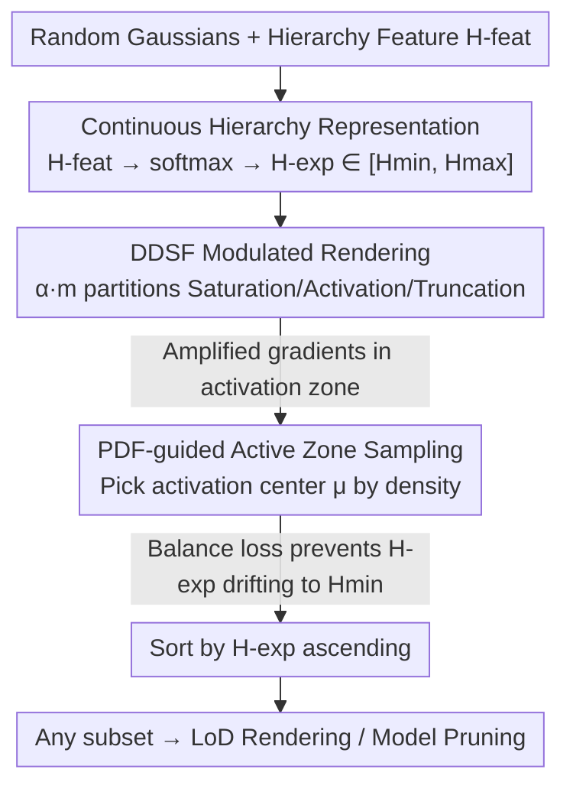

# Learning Differentiable Hierarchies in 3D Gaussian Splatting

**Conference**: CVPR 2026  
**Paper**: [CVF Open Access](https://openaccess.thecvf.com/content/CVPR2026/html/Pan_Learning_Differentiable_Hierarchies_in_3D_Gaussian_Splatting_CVPR_2026_paper.html)  
**Code**: TBD  
**Area**: 3D Vision  
**Keywords**: 3D Gaussian Splatting, Level-of-Detail, Differentiable Hierarchy, Model Pruning, Continuous Hierarchy Learning

## TL;DR
The authors append a learnable "level scalar" to each Gaussian and utilize a differentiable decreasing step function (DDSF) to simultaneously optimize full-model rendering and hierarchy ordering in a single-stage training. This allows 3DGS to perform LoD rendering and pruning for any number of Gaussians without multi-stage training, with a training overhead of only ~10% compared to standard 3DGS.

## Background & Motivation

**Background**: 3D Gaussian Splatting (3DGS) has gained popularity for its real-time rendering and high-quality novel view synthesis. However, scenes often contain millions of unordered Gaussians, leading to significant memory overhead. Low-power devices require compact models, and VR/AR need dynamic resolution foveated rendering, both of which require injecting "Level-of-Detail (LoD)" information into originally unstructured representations.

**Limitations of Prior Work**: Existing LoD methods either introduce additional data structures, spatial hierarchies, or implicit MLPs (e.g., FLoD, Octree-GS, Scaffold-GS), breaking standard 3DGS representations; or they manually pre-define hierarchy partitions and train each LoD separately (bottom-up LapisGS, top-down CLOD), resulting in poor scalability, decreased rendering quality, and significantly increased training times.

**Key Challenge**: Gaussians are unordered, necessitating an "importance order" for hierarchies. However, sorting requires knowing the contribution of each Gaussian to the scene, which itself depends on rendering. Hand-designed importance metrics or multi-stage training cannot **simultaneously** satisfy the coupled goals of "optimizing full-model rendering" and "learning hierarchies by contribution." Continuous LoD methods like CLOD fix the hierarchy as the insertion order, which cannot be adjusted later; furthermore, training subsets in the second stage causes the full model to "forget," leading to performance drops at 100% rendering.

**Goal**: To learn a continuous, data-driven Gaussian hierarchy without modifying the 3DGS representation or adding multi-stage training, allowing high-quality rendering by selecting a subset where H-exp is below a certain threshold.

**Key Insight**: Instead of discrete manual layering, a **continuous, bounded, and differentiable** hierarchy value is assigned to each Gaussian, turning "layering" into an attribute that can be directly optimized by rendering loss gradients.

**Core Idea**: A **Differentiable Decreasing Step Function (DDSF)** is used to modulate Gaussian opacity during training. Gaussians in the "activation zone" receive amplified gradients proportional to their rendering contribution, naturally pushing high-contribution Gaussians toward lower hierarchy values and learning a sorted continuous hierarchy in a single stage.

## Method

### Overall Architecture
The method appends a lightweight 2D **hierarchy feature H-feat** to each Gaussian in standard 3DGS, which is mapped via a softmax-weighted expectation to a bounded continuous scalar **H-exp $\in [H_{min}, H_{max}]$** (smaller H-exp indicates higher contribution/hierarchy). During training, two parallel rendering paths are executed: one for standard full Gaussian rendering, and another using DDSF to multiply each Gaussian's opacity $\alpha_i$ by a modulation coefficient $m_i = \sigma(H^{exp}_i; \mu)$ for "subset rendering." DDSF partitions Gaussians into three zones by an activation center $\mu$: saturation ($m\approx1$, normal contribution), activation ($0<m<1$, modulated), and truncation ($m\approx0$, excluded). The narrow, steep activation zone ensures that rendering errors generate amplified gradients, separating Gaussians by contribution. To ensure all H-feats are sufficiently trained, PDF-guided sampling selects the activation center based on the current H-exp probability density, ensuring the activation zone covers high-density intervals and spreads H-exp uniformly across the range. Post-training, Gaussians are sorted by H-exp, and subsets below a threshold can be used for LoD rendering or pruning.

### Key Designs

**1. Continuous Hierarchy Representation: Replacing discrete layers with differentiable scalars**

To address the issue that unordered Gaussians are hard to sort and manual layers are non-differentiable, this work adds a 2D unconstrained feature $H^{feat}=[h_1, h_2]$ to each Gaussian. This is mapped via softmax to a bounded interval: $[p_1, p_2]=\mathrm{Softmax}(h_1, h_2)$, $H^{exp}=[p_1, p_2]\cdot[H_{min}, H_{max}]^\top$. Directly optimizing a value clamped to a fixed range causes vanishing or unstable gradients; this "unconstrained feature + softmax expectation" parameterization ensures H-exp stays within $[H_{min}, H_{max}]$ while allowing gradients to smoothly control the relative contributions via softmax. H-feat does not change Gaussian geometry (position, covariance, SH coefficients remain untouched), keeping Gaussian primitives identical to 3DGS. Smaller H-exp indicates higher importance.

**2. DDSF Rendering: Simultaneous hierarchy learning and rendering preservation**

A differentiable layering framework must satisfy two coupled goals: optimizing hierarchies by contribution and optimizing subset rendering by learned hierarchies. A **Differentiable Decreasing Step Function (DDSF)** $\sigma$ acts as the modulation function. Opacity is multiplied by $m_i=\sigma(H^{exp}_i;\mu)\in[0,1]$. Rendering color is $C(x)=\sum_i T_i (m_i\alpha_i) c_i$, with transmittance $T_i=\prod_{j<i}(1-m_j\alpha_j)$. Forward pass: The saturation zone ($m\approx1$) is equivalent to classic rendering, and the truncation zone ($m\approx0$) effectively ignores Gaussians. Since the activation zone is narrow, the result approximates "rendering only the subset $H^{exp}<\mu$," preserving the training objective. Backward pass: The gradient w.r.t. H-exp is $\frac{\partial L}{\partial H^{exp}_i}=\frac{\partial L}{\partial C}\cdot\frac{\partial C}{\partial m_i}\cdot\frac{\partial \sigma}{\partial H^{exp}_i}$. Saturation/truncation zones have near-zero gradients, while the activation zone generates amplified gradients due to the steepness of $\sigma$, proportional to $\frac{\partial C}{\partial m_i}$ (rendering contribution). High-contribution Gaussians are pushed toward smaller H-exp, **naturally forming an importance-sorted hierarchy.** A sigmoid with $\beta=10$ is used for $\sigma$.

**3. PDF-guided Active Zone Sampling: Effective training for every Gaussian**

Since the DDSF activation zone is narrow, only Gaussians with H-exp near $\mu$ receive significant gradients. The activation center must move during iterations to cover the full range. However, H-exp often clusters due to initialization bias. **Uniform random** sampling of the center would lead to over-optimizing some Gaussians while under-training others. This work instead samples the activation center based on the **Probability Density Function (PDF)** of current H-exp values: $[H_{min}, H_{max}]$ is divided into $B$ bins to form a histogram $\mathrm{hist}(b)$, normalized to $p(H_b)=\mathrm{hist}(b)/\sum_{b'}\mathrm{hist}(b')$, and $\mu\sim\mathrm{Multinomial}(p(H))$ is sampled periodically. This focuses the activation zone on dense H-exp regions, ensuring hierarchies are effectively separated and pushing the distribution toward uniformity. $B=50$ is used.

### Loss & Training
Two rendering paths are executed in parallel: DDSF subset rendering and standard full rendering share the same rasterization pipeline. In implementation, the CUDA block size is expanded to include two threads per pixel—one applying the modulation $m$ (DDSF) and one multiplying by 1 (Full), yielding $I_{DDSF}$ and $I_{full}$. Computational overhead is minimal since most calculations are shared. The loss is a weighted sum $L=w_1 L^{full}_{ren}+w_2 L^{DDSF}_{ren}+w_3 L_{bal}$ ($w_1{=}1.0, w_2{=}0.01, w_3{=}0.001$), where $L_{ren}=(1-\lambda)L_1+\lambda\,\mathrm{SSIM}$ ($\lambda{=}0.2$). To prevent H-exp from drifting entirely toward $H_{min}$, a **hierarchy balance loss** $L_{bal}=w_3\frac{1}{N}\sum_i(H_{max}-H^{exp}_i)^2$ is added. For aggressive pruning, the activation center is fixed around the 60th percentile after 20k steps with increased $w_2, w_3$. $H_{min}{=}0, H_{max}{=}10$.

## Key Experimental Results

Evaluated on Mip-NeRF360, Tanks&Temples, and Deep Blending using an RTX 5090. Comparisons include PRoGS (re-sorting trained Gaussians), LapisGS (bottom-up), and CLOD (top-down). All use 3DGS-MCMC strategies with equal Gaussian counts.

### Main Results

LoD Rendering (Average PSNR↑ / Training Time TrainT↓, min:s):

| Splat Ratio | Method | Mip-NeRF360 | Tanks&Temples | Deep Blending | Note |
|------|------|------|------|------|------|
| 25% | CLOD | 28.26 | 23.65 | 26.86 | Previous best continuous LoD |
| 25% | Ours | 28.35 | 23.64 | 26.79 | Leading in most metrics |
| 50% | CLOD | 29.51 | 24.01 | 26.87 | |
| 50% | Ours | 29.47 | 24.20 | 26.92 | |
| 100% | CLOD | 29.59 | 24.12 | 26.86 | Performance drop at 100% |
| 100% | Ours | 29.74 | 24.27 | 27.02 | Steady improvement with ratio |

Training Time (100% setting, Mip-NeRF360): Ours is ~26:41, CLOD ~59:34, LapisGS ~78:20, compared to 3DGS-MCMC (23:53). Ours adds only ~10% overhead, while multi-stage methods take over 2x.

Model Pruning (Mip-NeRF360, #GS in millions):

| Method | PSNR↑ | SSIM↑ | LPIPS↓ | #GS↓ |
|------|------|------|------|------|
| 3DGS | 27.45 | 0.811 | 0.223 | 3.204 |
| Ours (3DGS, pruning) | 27.37 | 0.810 | 0.231 | 1.534 |
| 3DGS-MCMC | 29.73 | 0.891 | 0.107 | 3.093 |
| Ours (MCMC, pruning) | 29.67 | 0.895 | 0.111 | 1.622 |

Quality is maintained with roughly half the Gaussian count; the MCMC pruning model outperforms the non-tuned 60% LoD baseline.

### Ablation Study

| Config | PSNR↑ | SSIM↑ | LPIPS↓ | Description |
|------|------|------|------|------|
| Sigmoid ($\beta{=}10$, Default) | 25.24 | 0.88 | 0.09 | Full model (Truck sequence avg) |
| w/o $L_{bal}$ | 21.76 | 0.77 | 0.22 | H-exp drifts to Hmin, -3.48 PSNR |
| $\beta{=}0.1$ | 22.49 | 0.78 | 0.17 | Zone too wide, weak gradients |
| $\beta{=}100$ | 24.11 | 0.84 | 0.12 | Zone too steep, erratic learning |
| PDF Sampling (Default) | 25.24 | 0.88 | 0.09 | Full strategy |
| Random Sampling | 24.65 | 0.86 | 0.11 | -0.59 PSNR |

### Key Findings
- **Balance loss is critical**: Removing it causes PSNR to drop from 25.24 to 21.76 as H-exp drifts toward $H_{min}$, destroying hierarchy learning.
- **$\beta$ sensitivity**: Optimal at 10. Too small weakens gradients; too large makes H-exp changes too abrupt.
- **PDF sampling** outperforms random or quantile sampling by balancing sampling efficiency and hierarchy separation.
- Performance improves steadily with splat ratio, whereas CLOD often fluctuates or regresses between 60%-100% due to "forgetting" in its multi-stage design.

## Highlights & Insights
- **Hierarchy as a differentiable attribute**: No extra structures or geometry changes required. Adding a 2D feature allows rendering gradients to optimize sorting in a single stage, making it highly integrable.
- **Dual-purpose DDSF**: Approximates subset rendering in the forward pass while generating contribution-proportional gradients in the backward pass, unifying two coupled goals.
- **PDF-guided sampling** addresses the mechanism-inherent challenge of "gradients only effective in narrow zones." This concept (guiding sampling windows by density to ensure balanced optimization) is transferable to other local-window learning problems.
- **Parallel Rasterization** reuses the same CUDA kernel with two threads per pixel, keeping computational overhead negligible.

## Limitations & Future Work
- Aggressive pruning requires manual hyperparameter adjustments (fixing activation centers, increasing weights), rather than being purely automatic. Robustness across diverse scenes needs more discussion.
- Evaluated mainly on static scenes; performance on large-scale or dynamic scenes is not extensively explored.
- Hyperparameters like $[H_{min}, H_{max}]$, $B=50$, and $\beta=10$ are manually set; the relationship between range and granularity lacks systematic analysis.
- Future work: Making activation sampling, $\beta$, and loss weights learnable or adaptive.

## Related Work & Insights
- **vs FLoD / Octree-GS / Scaffold-GS**: These rely on extra structures or MLPs for LoD. Ours maintains standard 3DGS representations.
- **vs LapisGS**: LapisGS requires multi-stage training (>2x time). Ours is single-stage and data-driven.
- **vs CLOD**: CLOD fixes hierarchy to insertion order and regresses at 100% render. Ours learns flexible hierarchies and remains stable at full rendering.
- **vs LightGaussian / MaskGaussian**: These use manual scores or masks for pruning. Ours offers a continuous hierarchy alternative that supports pruning with minimal quality loss.

## Rating
- Novelty: ⭐⭐⭐⭐ Unifies discrete multi-stage layering into a single-stage differentiable process via DDSF.
- Experimental Thoroughness: ⭐⭐⭐⭐ Covers LoD and pruning across three datasets; however, lacks dynamic/large-scale validation.
- Writing Quality: ⭐⭐⭐⭐ Clear forward/backward analysis and intuitive illustrations.
- Value: ⭐⭐⭐⭐ Plug-and-play with minimal training overhead, highly practical for 3DGS LoD and compression.

<!-- RELATED:START -->

## Related Papers

- [\[CVPR 2026\] FilterGS: Traversal-Free Parallel Filtering and Adaptive Shrinking for Large-Scale LoD 3D Gaussian Splatting](filtergs_traversal-free_parallel_filtering_and_adaptive_shrinking_for_large-scal.md)
- [\[CVPR 2026\] iSplat: Iterative Learning for Fine-Grained Gaussian Splatting](isplat_iterative_learning_for_fine-grained_gaussian_splatting.md)
- [\[CVPR 2026\] Learning Explicit Continuous Motion Representation for Dynamic Gaussian Splatting from Monocular Videos](learning_explicit_continuous_motion_representation_for_dynamic_gaussian_splattin.md)
- [\[CVPR 2026\] AnchorSplat: Feed-Forward 3D Gaussian Splatting with 3D Geometric Priors](anchorsplat_feed-forward_3d_gaussian_splatting_with_3d_geometric_priors.md)
- [\[CVPR 2026\] Hermite Radial Basis Function for Surface Reconstruction via Differentiable Rendering](hermite_radial_basis_function_for_surface_reconstruction_via_differentiable_rend.md)

<!-- RELATED:END -->
