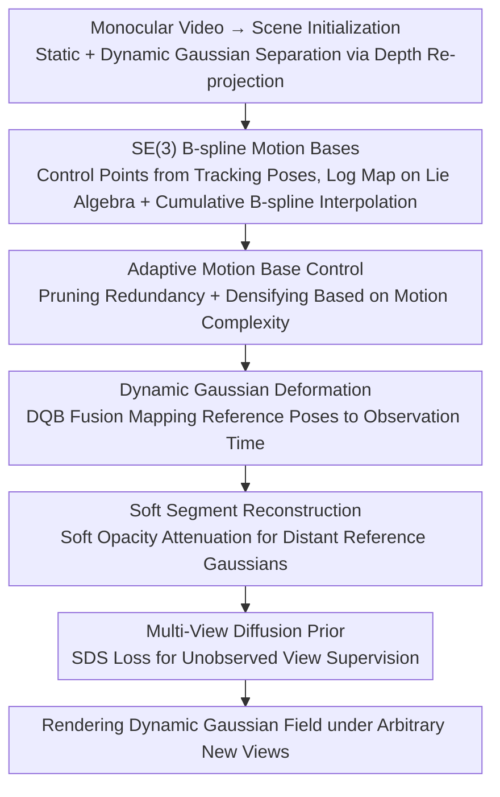

# Learning Explicit Continuous Motion Representation for Dynamic Gaussian Splatting from Monocular Videos

**Conference**: CVPR 2026  
**arXiv**: [2603.25058](https://arxiv.org/abs/2603.25058)  
**Code**: [https://github.com/hhhddddddd/se3bsplinegs](https://github.com/hhhddddddd/se3bsplinegs)  
**Area**: 3D Vision  
**Keywords**: Dynamic Gaussian Splatting, Monocular Video, SE(3) B-splines, Motion Representation, Novel View Synthesis

## TL;DR

This paper proposes to explicitly model the continuous position and orientation deformation trajectories of dynamic Gaussians through adaptive SE(3) B-spline motion bases. Combined with a soft segment reconstruction strategy and multi-view diffusion model priors, it achieves high-quality novel view synthesis of dynamic scenes from monocular videos, outperforming existing methods on iPhone and NVIDIA datasets.

## Background & Motivation

Reconstructing dynamic scenes from monocular videos is a core problem in computer vision with wide applications in VR/AR and film production. Existing 3D Gaussian Splatting-based methods exhibit significant deficiencies when handling dynamic scenes:

1.  **Implicit methods (e.g., D3DGS, 4DGS)** learn transformations from canonical space to observation space via MLPs or k-planes, which cannot guarantee the continuity of deformation trajectories.
2.  **Explicit methods (e.g., SplineGS)** use cubic Hermite splines to model continuous position deformation but ignore the continuous changes in Gaussian orientation.
3.  **Motion base-based methods (e.g., SoM, MoSca)** model deformation by learning affine transformations or motion scaffolds but do not uniformly handle the continuity of both position and orientation.

**Key Challenge**: Incontinuous orientation changes in dynamic Gaussians lead to severe artifacts in rendered images, especially in regions with complex motion. **Key Insight**: Utilizing SE(3) cumulative B-spline functions can mathematically guarantee the continuity of both position and orientation, providing a unified solution to this problem.

## Method

### Overall Architecture

The goal is to resolve rendering artifacts in motion regions caused by discontinuous orientation changes in monocular dynamic scene reconstruction. The solution provides each dynamic Gaussian with a mathematically continuous rigid motion trajectory. The pipeline functions as follows: First, the scene is decomposed into static and dynamic Gaussians using depth re-projection from monocular video. Instead of learning per-frame positions, dynamic Gaussians are attached to a set of learnable SE(3) B-spline motion bases, which interpolate continuous poses at any timestamp. An adaptive mechanism prunes or densifies control points based on motion complexity. A soft segment strategy fuses dynamic Gaussians from different reference times into the current observation time. Finally, a multi-view diffusion model provides supervision for unobserved views, enabling the rendering of a dynamic Gaussian field from any novel perspective.

### Key Designs

**1. SE(3) B-spline Motion Bases: Synchronizing Position and Orientation Continuity**

Implicit methods (D3DGS, 4DGS) lack continuity guarantees. While explicit SplineGS connects position deformations using Hermite splines, it ignores orientation; jumps in orientation cause rendering artifacts. This work models motion on the SE(3) group. Using 3D tracking poses $Q = [R, t]$ as initial control points, relative poses $\Delta Q = Q_i^{-1} Q_{i+1}$ are computed and mapped to the tangent space via the logarithmic map $\xi = \log(\Delta Q)$. Cumulative B-spline basis functions $\Omega_i(t)$ interpolate these into a continuous transformation at any time $t$:

$$T(t) = \left(\prod_{i=0}^{N_c-1} \exp(\Omega_i(t)\,\xi_i)\right) T_0$$

Since the transformation occurs on SE(3) rather than treating translation and rotation separately, both trajectories are synchronized by the same spline, ensuring mathematical continuity. This inherently eliminates orientation artifacts that Hermite splines cannot address.

**2. Adaptive Motion Base Control: Adapting Density to Motion Complexity**

Uniform control point distribution is inefficient for scenes with varying motion intensity. This method introduces pruning and densification. **Pruning** occurs every $N_{prune}=500$ iterations, identifying control points whose removal results in minimal trajectory deviation; points are deleted only if the error remains below $\epsilon_{prune}=5.0$. **Densification** occurs every $N_{densify}=500$ iterations, using the intersection of rendering error maps and dynamic masks to identify complex regions, where control points are duplicated and randomly perturbed. This allows control points to concentrate where needed, contributing significantly to performance (iPhone mPSNR drops by 1.33 without it).

**3. Soft Segment Reconstruction: Prioritizing Temporal Proximity in Fusion**

When mapping dynamic Gaussians from various reference timestamps to the observation time, larger temporal gaps result in less accurate rigid transformations. Instead of hard truncation, this method uses soft attenuation of opacity based on temporal distance:

$$o' = \text{sigmoid}\big(\text{scale} \cdot (1 - |t_{ref} - t_{obs}|)\big) \cdot o, \quad \text{scale}=5.0$$

As temporal distance increases, $o'$ decays, ensuring Gaussians from closer timestamps dominate the fusion while inaccuracies from distant frames are naturally suppressed. This is particularly effective for long-duration, complex motion videos like those in the iPhone dataset.

### Loss & Training

The total loss consists of six components: reconstruction loss $\mathcal{L}_{rec}$ (L1 + SSIM, $\beta=0.2$), geometric depth loss $\mathcal{L}_{geo}$ ($\lambda=0.075$), multi-view SDS loss $\mathcal{L}_{sds}$ ($\lambda=0.01$, providing priors for unobserved regions via a diffusion model), ARAP rigidity loss $\mathcal{L}_{arap}$, optical flow tracking loss $\mathcal{L}_{track}$, and camera smoothing loss $\mathcal{L}_{smo}$ ($\lambda=0.01$). Camera extrinsic parameters are optimized jointly as learnable parameters. The model is trained for 8000 iterations.

## Key Experimental Results

### Main Results

| Dataset | Metric | Ours | MoSca | SplineGS | SoM | Gain (vs MoSca) |
|--------|------|------|-------|----------|-----|----------------|
| iPhone | mPSNR↑ | **20.17** | 19.33 | 15.52 | 17.13 | +0.84 |
| iPhone | mSSIM↑ | **0.729** | 0.718 | 0.483 | 0.674 | +0.011 |
| iPhone | mLPIPS↓ | **0.274** | 0.274 | 0.371 | 0.279 | - |
| NVIDIA | PSNR↑ | **27.81** | 26.76 | 27.12 | 24.58 | +1.05 |
| NVIDIA | SSIM↑ | **0.871** | 0.854 | 0.872 | 0.651 | +0.017 |
| NVIDIA | LPIPS↓ | **0.049** | 0.070 | 0.052 | 0.124 | -0.021 |

Training takes only 30 minutes (single RTX 4090) with an inference speed of 45.124 FPS, balancing efficiency and quality.

### Ablation Study

| Configuration | iPhone mPSNR | iPhone mLPIPS | NVIDIA PSNR | NVIDIA LPIPS |
|------|-------------|---------------|-------------|--------------|
| Full model | **20.17** | **0.274** | **27.81** | **0.049** |
| w/o Adaptive Control | 18.84 | 0.350 | 26.87 | 0.128 |
| w/o Soft Segment | 19.02 | 0.328 | 27.06 | 0.085 |
| w/o $\mathcal{L}_{sds}$ | 19.39 | 0.288 | 27.13 | 0.074 |
| w/o $\mathcal{L}_{smo}$ | 19.18 | 0.295 | 27.15 | 0.076 |

Motion representation ablation (iPhone mPSNR): Pose transformation (SoM style) yields 18.17; Motion Scaffold (MoSca style) yields 19.26; Ours (SE(3) B-spline) yields **20.17**.

### Key Findings

- **Adaptive Control** is the most significant contributor (mPSNR drops from 20.17 to 18.84 on iPhone), proving motion base density must match scene complexity.
- **Soft Segment Reconstruction** yields higher gains on long-duration, complex motion sequences (iPhone) compared to NVIDIA datasets.
- **SE(3) B-spline representation** improves mPSNR by 2.0 and 0.91 over Pose transformation and Motion Scaffold respectively, validating the importance of unified position and orientation continuity.
- The method shows **robustness to tracking noise**; adding random noise within [-15, 15] results in negligible performance degradation (mPSNR 20.17→20.11).

## Highlights & Insights

- **Introduction of SE(3) cumulative B-splines** to dynamic 3DGS is the key contribution. While common in robotics and SLAM, its use for unified orientation and position modeling in 3DGS is novel and transferable to other continuous rigid motion tasks.
- The **Adaptive Pruning + Densification** strategy is pragmatic, allowing sparse control points for simple motions and automatic density for complex parts, optimizing both computation and quality.
- **30-minute training time** is highly competitive (e.g., vs 13 hours for MarbleGS), offering a clear efficiency advantage.

## Limitations & Future Work

- The model struggles with **large non-rigid deformations** (e.g., flowing clothes in dancing) as SE(3) B-splines are fundamentally rigid motion models.
- **SDS loss dependency** on diffusion models adds computational overhead and its generalization across diverse scenes requires further validation.
- **Dataset variety** is limited to 5 iPhone and 7 NVIDIA scenes.
- Future work could explore combining SE(3) B-splines with **non-rigid deformations** (e.g., blend shapes or SMPL) to handle more complex dynamics.

## Related Work & Insights

- **vs SplineGS**: Cubic Hermite splines (position only) vs SE(3) B-splines (position + orientation); the latter achieves 4.65 higher mPSNR on iPhone data.
- **vs MoSca**: Replaces the high-degree-of-freedom but discontinuous 4D Motion Scaffold with mathematically continuous B-splines.
- **vs SoM (Shape-of-Motion)**: Upgrades linear combinations of SE(3) bases to a continuous B-spline parameterization.
- The adaptive control mechanism can inspire similar resolution-adjusting strategies in NeRFs or point cloud processing.

## Rating

- **Novelty**: ⭐⭐⭐⭐ Solid application of SE(3) splines to 3DGS, though the mathematical framework is established in other fields.
- **Experimental Thoroughness**: ⭐⭐⭐⭐ Comprehensive ablations and robustness tests, though limited by dataset scale.
- **Writing Quality**: ⭐⭐⭐⭐ Clear methodology, complete derivations, and effective visualizations.
- **Value**: ⭐⭐⭐⭐ High practical value due to training efficiency and open-source availability.

<!-- RELATED:START -->

## Related Papers

- [\[CVPR 2026\] AnyLift: Scaling Motion Reconstruction from Internet Videos via 2D Diffusion](anylift_scaling_motion_reconstruction_from_internet_videos_via_2d_diffusion.md)
- [\[CVPR 2026\] ClipGStream: Clip-Stream Gaussian Splatting for Any Length and Any Motion Multi-View Dynamic Scene Reconstruction](clipgstream_clip-stream_gaussian_splatting_for_any_length_and_any_motion_multi-v.md)
- [\[CVPR 2026\] $L^{2}DGS$: Low-Light Dynamic Gaussian Splatting](l2dgs_low-light_dynamic_gaussian_splatting.md)
- [\[CVPR 2026\] Learning a Particle Dynamics Model with Real-world Videos](learning_a_particle_dynamics_model_with_real-world_videos.md)
- [\[CVPR 2026\] ExMesh: EXplicit Mesh Reconstruction with Topology Adaptation](exmesh_explicit_mesh_reconstruction_with_topology_adaptation.md)

<!-- RELATED:END -->
## Related Papers

- [\[CVPR 2026\] SharpTimeGS: Sharp and Stable Dynamic Gaussian Splatting via Lifespan Modulation](sharptimegs_sharp_and_stable_dynamic_gaussian_splatting_via_lifespan_modulation.md)
- [\[NeurIPS 2025\] Dynamic Gaussian Splatting from Defocused and Motion-blurred Monocular Videos](../../NeurIPS2025/3d_vision/dynamic_gaussian_splatting_from_defocused_and_motion-blurred_monocular_videos.md)
- [\[CVPR 2026\] MotionScale: Reconstructing Appearance, Geometry, and Motion of Dynamic Scenes with Scalable 4D Gaussian Splatting](motionscale_reconstructing_appearance_geometry_and_motion_of_dynamic_scenes_with.md)
- [\[CVPR 2026\] PhysHO: Physics-Based Dynamic 3D Gaussian Human and Object from Monocular Video](physho_physics-based_dynamic_3d_gaussian_human_and_object_from_monocular_video.md)
- [\[CVPR 2026\] MoCapAnything: Unified 3D Motion Capture for Arbitrary Skeletons from Monocular Videos](mocapanything_unified_3d_motion_capture_for_arbitrary_skeletons_from_monocular_v.md)

<!-- RELATED:END -->
