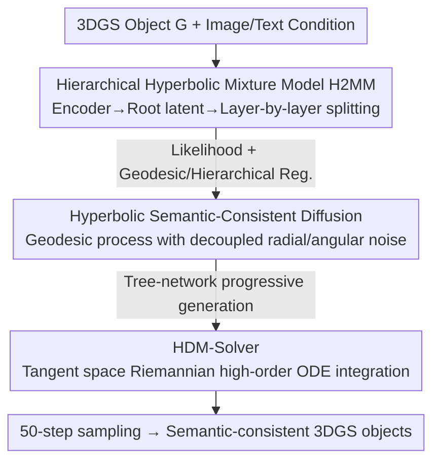

# Learning Hierarchical Hyperbolic Mixture Model for Part-aware 3D Generation

**Conference**: CVPR 2026  
**Paper**: [CVF Open Access](https://openaccess.thecvf.com/content/CVPR2026/html/Yang_Learning_Hierarchical_Hyperbolic_Mixture_Model_for_Part-aware_3D_Generation_CVPR_2026_paper.html)  
**Code**: To be confirmed  
**Area**: 3D Vision  
**Keywords**: Part-aware 3D generation, Hyperbolic space, Hierarchical mixture model, Geodesic diffusion, Riemannian ODE solver

## TL;DR
This paper embeds the hierarchical semantics of 3D object parts into hyperbolic space. It proposes the Hierarchical Hyperbolic Mixture Model (H2MM), a geodesic diffusion process that decouples radial and angular noise, and a high-order Riemannian ODE solver that preserves manifold geometry. The method achieves state-of-the-art results in quality (FID/KID) and speed for unconditional, category-conditional, and multimodal 3D generation.

## Background & Motivation

**Background**: 3D shape generation is a core direction in computer graphics and 3D vision. Early methods directly generated complete 3D objects using random vectors, which provided decent diversity but lacked fine-grained modeling and failed to recover precise semantics. Inspired by the human process of building complex objects from parts, recent **part-aware 3D generation** methods (e.g., SPAGHETTI, AutoPartGen, StdGEN) have proven more effective at recovering geometric details.

**Limitations of Prior Work**: ① Most part-aware methods treat all parts at the **same granularity**, ignoring the natural hierarchical organization and semantic dependencies between parts, leading to inconsistencies. Furthermore, they encode part latents in **Euclidean space**, where distributions representing tree-like structures suffer from low manifold utilization and slower training/inference. ② HGMMSplatting introduced hierarchical semantic trees but still encodes multi-level semantics in Euclidean space, limiting representation efficiency and hierarchical fidelity. ③ HyperSDFusion adopted hyperbolic space to capture coarse-to-fine relationships but treats each 3D object as an **indivisible whole**, using hyperbolic geometry only as a resolution refinement prior without explicit part-level semantic hierarchies. Moreover, it applies **simple isotropic Gaussian noise** in the tangent space, ignoring the **anisotropy** of hyperbolic geometry, destroying its structural properties, and failing to address sampling acceleration in hyperbolic space.

**Key Challenge**: The part relationships of 3D objects are inherently **tree-like or power-law** structures. Representing such hierarchies in Euclidean space is inefficient and results in poor fidelity. Existing hyperbolic methods either lack part-awareness or use incorrect noise models (isotropic noise erases the anisotropy used for encoding hierarchies) and lack fast samplers adapted to hyperbolic manifolds.

**Goal**: To learn a **part-aware hierarchical semantic embedding** in hyperbolic space, design an efficient hyperbolic diffusion strategy that preserves hierarchical structures, and provide a high-order ODE solver for correct integration on hyperbolic manifolds.

**Key Insight**: The volume of hyperbolic space grows **exponentially** with the radius, making it naturally suitable for tree hierarchies. Hierarchy levels can be naturally separated along the radial direction, while intra-level semantic variations are encoded along the angular direction. These two components should be treated as **decoupled**.

**Core Idea**: Use a hierarchical mixture model to embed multi-level 3DGS part semantics into a hyperbolic manifold (H2MM). Then, employ a geodesic diffusion process with **decoupled radial/angular noise** to generate semantics layer-by-layer, followed by 3DGS generation. Finally, use a **Riemannian high-order solver** to integrate along geodesics in the tangent space for accelerated, geometry-preserving sampling.

## Method

### Overall Architecture
Given a set of 3D Gaussians $G$ (representing object details), the method consists of three steps. First, **H2MM**: A hyperbolic encoder-decoder maps the 3DGS hierarchy from Euclidean to hyperbolic space. The encoder uses a shared hyperbolic MLP and permutation-invariant aggregation to obtain a hyperbolic root latent $z$. The decoder "splits" latents top-down, with each layer being a hyperbolic mixture model capturing increasingly fine part semantics, optimized by maximizing the likelihood between hyperbolic semantics and 3DGS. Second, **Hyperbolic Semantic-Consistent Diffusion**: Pre-trained MERU is used to extract hyperbolic hierarchical features as conditions. Decoupled **radial (hierarchy depth) + angular (intra-level semantics)** noise is injected along geodesics in the tangent space. An adaptive tree-like network scans data dependencies to generate semantics progressively. Third, **HDM-Solver**: The reverse ODE on the hyperbolic manifold is projected onto the tangent space for Riemannian high-order integration, equivalent to Möbius updates in hyperbolic space, preserving geometry while reducing sampling to 50 steps.

### Key Designs

**1. Hierarchical Hyperbolic Mixture Model (H2MM): Embedding Part Hierarchies in Hyperbolic Manifolds**

To address the limitations of Euclidean part representations and non-part-aware hyperbolic methods, H2MM constructs a top-down multi-layer hyperbolic mixture model. Each layer is defined as $p(G|\Omega^l)=\prod_{i=1}^{N}\sum_{j=1}^{J}\pi_j f(G_i|\theta^l_j)$, where $\theta^l_j=D(\mathrm{Log}_0(z^l_j))$ is decoded from hyperbolic latents, and $f(\cdot)$ is a Gaussian kernel. **Hierarchical splitting** updates child latents from parent latents via hyperbolic cross-attention and hyperbolic MLPs: $z^{l+1}=\sum_i\sum_j S(j)A^{i,j}_H M^i_H(z^l_i)$, where the signaling function $S(j)$ constrains splitting to respective child nodes. Optimization is driven by hyperbolic likelihood and geometric regularization: $L_{nll}=-\frac1{|G|}\sum_d[\,l_{log}(G|\Omega^{l=d})+\frac1{\sigma^2}\|z^{l=d}\|_H]$ and $L_{H}=\sum_{l\neq l'}\max(0,\tau-d_H(\bar z^l,\bar z^{l'}))+\sum_k d_H(z,z^d_k)$ to ensure inter-layer separation and minimize total geodesic distance.

**2. Hyperbolic Semantic-Consistent Diffusion: Geodesic Generation with Decoupled Noise**

To solve the isotropic noise issue in HyperSDFusion, this work moves noise injection and prediction to the tangent space, using $\mathrm{Exp}/\mathrm{Log}$ to transition between the manifold and tangent space. Gaussian noise is **decoupled into radial and angular components**: $x_t=\sqrt{\alpha_t}\,x_0+\sqrt{1-\alpha_t}\,(\epsilon_r+\Lambda_c(x_0)\,\epsilon_a)$, $z_t=\mathrm{Exp}_{z_0}(x_t)$, where $\Lambda_c(x_0)=\tanh(\sqrt{|c|}\|x_0\|)/(\sqrt{|c|}\|x_0\|)$ is a curvature factor that **suppresses angular noise** at large radial coordinates, preserving the anisotropy where the radial direction encodes depth and the angular direction encodes semantics. Reverse denoising uses a tangent space noise predictor $\hat x_0=s_\theta(\mathrm{Log}_0(z_t),t)$. **Progressive part-level generation** utilizes a tree-topology network to scan dependencies, generating root semantics $z$ first, then subsequent layers conditioned on preceding layers and input features.

**3. Hyperbolic Diffusion Model Solver (HDM-Solver): Rewriting ODE Solving as Riemannian Integration**

Standard ODE solvers assume Euclidean vector spaces; applying them directly to hyperbolic latents causes updates to drift off the manifold and destroys geodesic structures. This work projects the reverse ODE $\frac{dz_t}{dt}=u_t(z_t)$ onto the tangent space $T_0\mathcal{B}^n_c$: $\frac{dx_t}{dt}=T_0(u_t(z_t)),\ x_t=\mathrm{Log}_0(z_t)$. Converting the manifold ODE to a Euclidean ODE in the tangent space allows for reliable Euler updates, which are then mapped back via $\mathrm{Exp}$. This is equivalent to updating via Möbius operations in hyperbolic space. The first-order HDM-Solver is: $\tilde x_{t_i}=\frac{\alpha_{t_i}}{\alpha_{t_{i-1}}}\otimes\tilde x_{t_{i-1}}\ominus(\sigma_{t_i}(e^{h_i}-1)\otimes\epsilon_G(\tilde x_{t_{i-1}},t_{i-1}))$. This reinterprets the diffusion ODE solver as a **Riemannian integrator**, preserving manifold geometry and enabling high-fidelity 50-step sampling.

### Loss & Training
The H2MM stage uses $L_{nll}$ and $L_H$. The diffusion stage first trains latent prediction $L_{latent}=\mathbb{E}\|\{z^{l=d}_0\}-\epsilon_{\theta_1}(\{z^{l=d}_t\},t,c)\|^2$, then 3DGS generation $L_{diff}=\mathbb{E}\|\hat y_{\theta_2}(G_t,t,\{z^{l=d}\},c)-G\|_2^2$, combined with $L_{img}$ (VGG multi-resolution, pixel, and alpha losses). Each object uses 36,864 Gaussian primitives. Diffusion follows a cosine noise schedule with 1,000 steps, while the HDM-Solver uses 50 sampling steps.

## Key Experimental Results

Datasets: ShapeNet Car/Chair, OmniObject3D, and Objaverse (LVIS subset). Metrics: FID/KID for 50k samples vs. GT. Multimodal tasks use CLIP scores and user studies.

### Main Results

Unconditional (ShapeNet) and Category-conditional (OmniObject3D) generation, FID-50K↓ / KID-50K(‰)↓:

| Method | Car FID | Car KID | Chair FID | Chair KID | Omni FID | Omni KID |
|------|------|------|------|------|------|------|
| GET3D | 17.15 | 9.58 | 19.24 | 10.95 | - | - |
| DiffTF | 51.88 | 41.10 | 47.08 | 31.29 | 46.06 | 22.86 |
| GaussianCube | 13.01 | 8.46 | 15.99 | 9.95 | 11.62 | 2.78 |
| HGMMSplatting | 11.03 | 7.16 | 12.74 | 8.61 | 10.57 | 2.02 |
| **Ours** | **9.89** | **6.24** | **11.03** | **6.91** | **9.12** | **1.93** |

Text-to-3D (CLIP Score↑ / Inference Time s↓) and Image-to-3D:

| Task | Method | Main Metric | Note |
|------|------|------|------|
| Text→3D | DiffSplat | CLIP 28.32 / 8.64s | Weak geometry-texture coordination |
| Text→3D | **Ours** | **CLIP 31.02 / 3.92s** | High quality in ~4 seconds |
| Image→3D | G.Cube | PSNR 25.83 / LPIPS 0.1531 / FID-5K 16.45 | |
| Image→3D | **Ours** | **PSNR 27.63 / LPIPS 0.1102 / FID-5K 14.99** | Leading in all metrics |
| Part Editing | DiffSplat | FID 16.34 / CLIP-S 28.96 / User Study 4.1 | |
| Part Editing | **Ours** | **FID 15.27 / CLIP-S 29.38 / User Study 4.6** | |

### Ablation Study

| Config | Key Metric | Description |
|------|---------|------|
| Hyperbolic (Default) | NLL 0.97 / IoU 0.96 / FID 12.26 / KID 2.31 | Hyperbolic space |
| Euclidean | NLL 1.21 / IoU 0.89 / FID 16.94 / KID 4.96 | Switching to Euclidean drops semantic accuracy and quality |
| Decoupled (Default) | FID 12.34 / KID 2.31 / CLIP-S 30.27 | Decoupled radial/angular noise |
| Coupled | FID 16.72 / KID 3.56 / CLIP-S 27.36 | Coupled noise degrades FID by 4.38 |
| Tree (Default) | FID 27.1 / KID 0.014 | Tree-structured network |
| w/o Tree | FID 31.4 / KID 0.021 | Removing tree structure increases FID by 4.3 |

> ⚠️ Note: FID scales in Tab.3 (27~32) for the Tree ablation differ from the main results (9~12), likely due to a different subset or evaluation setting. Relative comparisons hold.

### Key Findings
- **Hyperbolic > Euclidean**: Hyperbolic space's exponential volume growth identifies hierarchies along the radial direction, reducing semantic overlap and improving NLL/IoU/FID/KID. HDM-Solver further suppresses projection errors.
- **Noise Decoupling is Crucial**: Coupling noise worsens FID from 12.34 to 16.72, as decoupling allows the model to stabilize global structure (radial) while maintaining local shape flexibility (angular).
- **Tree Network + Progressive Generation**: Both are effective; tree topologies simplify the generation flow, while progressive refinement yields more precise per-layer semantics.
- **Efficiency**: Achieving Text-to-3D in ~4 seconds with only 50 sampling steps while maintaining superior quality.

## Highlights & Insights
- **Decoupling "Radial = Depth, Angular = Semantics"**: This is a profound observation. The curvature factor $\Lambda_c$ suppresses angular noise at large radii, which is exactly why the anisotropic nature of hyperbolic geometry is preserved for hierarchical encoding.
- **Diffusion ODE as a Riemannian Integrator**: The paper clarifies that direct Euclidean solvers drift off-manifold, requiring a reinterpretation of ODE solving as integration along geodesics to maintain manifold geometry throughout the process.
- **Explicit Hierarchical Modeling**: H2MM uses top-down splitting and hyperbolic cross-attention to explicitly model part hierarchies, unlike previous methods that either ignore parts or ignore hierarchies.

## Limitations & Future Work
- The method stack is significant (H2MM + Hyperbolic Diffusion + Riemannian Solver + Tree Network), leading to a high barrier to reproduction with many hyperparameters ($c, \tau, \lambda$, layer counts).
- Fixed primitive counts (36,864 Gaussians) may not scale to extremely complex scenes or massive open-vocabulary generation.
- Future work: Adaptive part counts or hierarchies; learning curvature as a parameter; exploring higher-order HDM-Solvers to further reduce steps.

## Related Work & Insights
- **vs SPAGHETTI / AutoPartGen / StdGEN (Euclidean Part-aware)**: These treat parts at a single level and use Euclidean latents; this work explicitly models hierarchies in hyperbolic space.
- **vs HGMMSplatting (Euclidean Hierarchy)**: HGMM uses Euclidean trees; this work demonstrates that hyperbolic manifolds offer significantly higher fidelity for such structures (e.g., Car FID 11.03 → 9.89).
- **vs HyperSDFusion (Global Hyperbolic)**: While it uses hyperbolic space, it lacks part-level semantics and correct noise models; this work achieves part-awareness and properly adapted diffusion.

## Rating
- Novelty: ⭐⭐⭐⭐⭐ Systematic integration of hyperbolic part hierarchies, decoupled diffusion, and Riemannian ODE solvers.
- Experimental Thoroughness: ⭐⭐⭐⭐ Extensive multi-task coverage and ablation; some metric scale inconsistencies in ablations.
- Writing Quality: ⭐⭐⭐⭐ Clear motivation and complete formulation; however, notation is dense.
- Value: ⭐⭐⭐⭐ Provides a robust paradigm for hierarchical 3D generation in non-Euclidean spaces.

<!-- RELATED:START -->

## Related Papers

- [\[CVPR 2026\] Learning a Particle Dynamics Model with Real-world Videos](learning_a_particle_dynamics_model_with_real-world_videos.md)
- [\[CVPR 2026\] FreeScale: Scaling 3D Scenes via Certainty-Aware Free-View Generation](freescale_scaling_3d_scenes.md)
- [\[CVPR 2026\] 3D-Aware Multi-Task Learning with Cross-View Correlations for Dense Scene Understanding](3d-aware_multi-task_learning_with_cross-view_correlations_for_dense_scene_unders.md)
- [\[CVPR 2026\] EI-Part: Explode for Completion and Implode for Refinement](ei-partexplode_for_completion_and_implode_for_refinement.md)
- [\[CVPR 2026\] iLRM: An Iterative Large 3D Reconstruction Model](ilrm_an_iterative_large_3d_reconstruction_model.md)

<!-- RELATED:END -->
