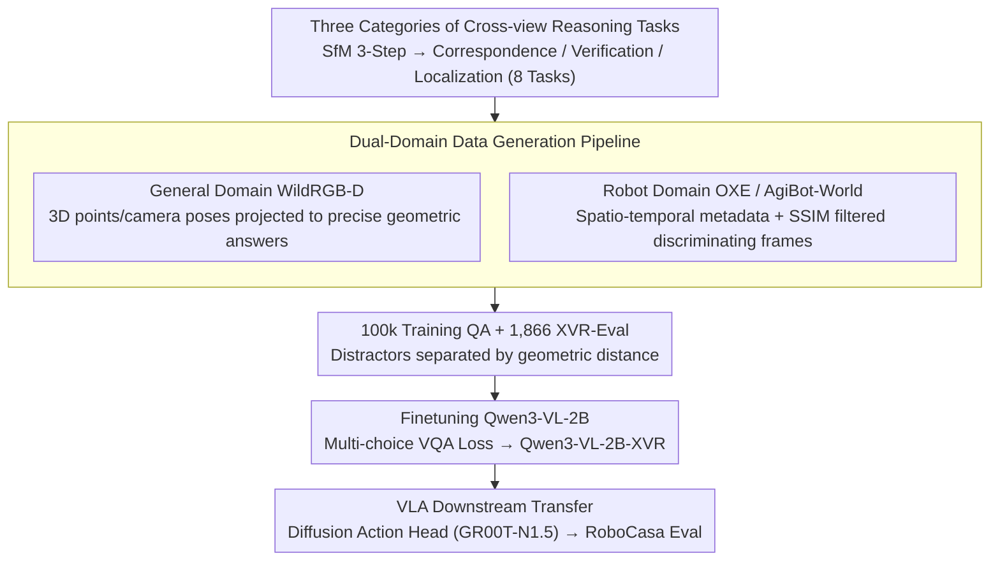

# Learning Multi-View Spatial Reasoning from Cross-View Relations

**Conference**: CVPR 2026  
**arXiv**: [2603.27967](https://arxiv.org/abs/2603.27967)  
**Code**: [https://cross-view-relations.github.io](https://cross-view-relations.github.io)  
**Area**: 3D Vision  
**Keywords**: Multi-view Spatial Reasoning, Cross-view Relations, Vision-Language Models, Robot Manipulation, Dataset Construction

## TL;DR

XVR (Cross-View Relations) constructs a large-scale multi-view Visual Question Answering (VQA) dataset with 100,000 samples. By explicitly training VLMs on three categories of tasks—correspondence, geometric verification, and viewpoint localization—it significantly enhances cross-view spatial reasoning capabilities, achieving notable improvements across multi-view benchmarks and robotic manipulation tasks.

## Background & Motivation

Vision-Language Models (VLMs) excel at single-view vision tasks but struggle significantly with multi-view spatial reasoning, which is crucial for robotic systems to understand 3D environments and perform cross-view manipulation.

1.  **Limitations of Prior Work (Single-view)**: Existing spatial reasoning datasets and benchmarks are almost exclusively single-view, providing limited information and frequent occlusions.
2.  **Lack of Depth in Multi-view Understanding**: Even existing multi-view datasets (e.g., AllAnglesBench) focus only on "what objects are seen" in each view rather than the geometric relations between views.
3.  **Key Challenge (Lack of Explicit Supervision)**: Without explicit cross-view relation training, VLMs tend to generate predictions that appear plausible within a single view but remain spatially inconsistent across views.

Key Insight: Inspired by the Structure-from-Motion (SfM) pipeline, which integrates multi-view information through three key steps (establishing correspondence $\to$ verifying geometric consistency $\to$ estimating camera poses), the authors convert these steps into three categories of cross-view supervision tasks and build the XVR dataset to directly train VLMs for cross-view reasoning.

## Method

### Overall Architecture

The core problem this paper addresses is that VLMs are proficient at identifying objects in a single image but cannot explain "which point in this image corresponds to which point in that image" or "whether the 3D spaces in these two views are consistent." The mechanism of XVR is to decompose the classic SfM pipeline into supervision signals that VLMs can learn: first, it **automatically** casts multiple-choice questions with correct answers from two data domains using 3D geometry and spatio-temporal metadata; then, it finetunes a small model on this data; finally, the finetuned backbone is connected to a robotic VLA to verify transfer performance. The pipeline yields 100,000 training samples and 1,866 XVR-Eval test samples, covering 8 tasks with an average of 4.32 images per question, with Qwen3-VL-2B as the finetuning target.

### Key Designs

**1. Three Categories of Cross-View Reasoning Tasks: Translating SfM into VLM-learnable QA**

SfM integrates multi-view information via correspondence, verification, and pose estimation. XVR segments tasks into these three categories to let models explicitly learn "between-view" relations. **Correspondence** requires the model to match the same 3D point across views (point correspondence) or align arrows pointing in the same direction across views (directional correspondence). **Verification** asks the model to judge if two views describe an internally consistent 3D space (spatial verification) and identify temporal outliers in an image sequence (temporal verification). **Localization** focuses on estimating "from which viewpoint this image was taken," subdivided into viewpoint localization, directional view localization, cross-scene localization, and language-conditioned localization. These eight tasks cover the fundamental requirements for multi-view 3D understanding. Task difficulty is controlled—distractors are geometrically calculated to ensure that incorrect answers reflect a genuine lack of spatial understanding.

**2. Dual-Domain Data Generation Pipeline: Geometry from General Domain, Viewpoints & Time from Robot Domain**

To build questions at scale without manual labeling, the pipeline derives ground-truth QA from existing geometric metadata. The **General Domain** utilizes calibrated multi-view RGB-D captures from WildRGB-D. 3D points or camera positions are sampled and projected into multiple views ($3\text{D}\to2\text{D}$); the answers for correspondence and localization tasks come directly from these projections. Distractors are spatially distanced to avoid trivial solutions. The **Robot Domain** uses manipulation trajectories from OXE and AgiBot-World. Spatio-temporal metadata and camera identifiers are used to generate verification and localization questions. SSIM is used to filter out sequences where visual differences are too subtle, ensuring that "temporal mismatch" questions are visually decidable. The two domains are complementary: the general domain provides pixel-level geometric supervision, while the robot domain adds the viewpoint variety and temporal dynamics of real manipulation.

**3. VLA Downstream Transfer: Integrating Cross-View Perception into Robotic Manipulation**

To test if improved perception translates into action, the authors used the finetuned Qwen3-VL-2B-XVR as the VLA backbone. A diffusion action head (following the GR00T-N1.5 architecture) was added and trained in the RoboCasa simulation on Franka Emika arm tasks. This step tests the hypothesis that "Better Cross-View Spatial Perception $\to$ Better Embodied Manipulation." Success here would indicate that XVR teaches general spatial capabilities rather than just isolated VQA tricks.

### Loss & Training

Finetuning utilizes a standard multi-choice VQA loss. Critical quality control includes: retaining only high-quality samples from the General Domain (point cloud density $\ge 1\text{M}$); and keeping only sequences in the Robot Domain with $\ge 3$ cameras, $\ge 20\text{s}$ trajectories, and sufficient motion dynamics. XVR-Eval is constructed from data sources never seen during training to ensure generalization.

## Key Experimental Results

### Main Results

| Model | XVR-Eval Overall | Type |
|------|-----------------|------|
| Random | 32.64% | Baseline |
| Human | 83.85% | Human Baseline |
| Eagle2-2B | 16.99% | Open-source |
| Qwen3-VL-2B-Instruct | 36.82% | Open-source |
| Qwen3-VL-4B-Instruct | 45.02% | Open-source |
| Claude-4.5-Sonnet | 51.18% | Closed-source |
| GPT-5 | 61.74% | Closed-source |
| **Qwen3-VL-2B-XVR (Ours)** | **68.06%** | Finetuned |

The XVR-finetuned 2B model outperforms all closed-source models (including GPT-5), achieving a $1.8\times$ improvement over its base model.

### Ablation Study (XVR-Eval Sub-task Analysis)

| Task | Qwen3-VL-2B | Qwen3-VL-2B-XVR | Gain |
|------|-------------|-----------------|------|
| Point Correspondence | 46.59% | **94.32%** | +47.73 |
| Spatial Verification | 23.11% | **84.85%** | +61.74 |
| Viewpoint Localization | 19.50% | **57.68%** | +38.18 |
| Directional Correspondence | 26.14% | **53.79%** | +27.65 |
| Temporal Verification | 45.29% | 41.18% | **-4.11** |

External Benchmark Transfer: Performance on MindCube-Tiny and RoboSpatial-Home consistently improved, with the Compatibility sub-task increasing by +7.6% and the Among sub-task by +7.0%.

VLA Manipulation Success (RoboCasa): The "TurnOffMicrowave" scenario saw the largest gain ($\approx +13\%$), with significant gains also seen in "CoffeePressButton" and "PnPCabToCounter".

### Key Findings

- **Point Correspondence and Spatial Verification saw the most dramatic gains** (+47.73 and +61.74 pp, respectively), exceeding human levels, suggesting geometric matching tasks benefit most from explicit cross-view training.
- **Temporal Verification was the only task to decline** (-4.11 pp), as XVR training biases towards spatial geometric reasoning, potentially weakening temporal sensitivity—indicating a trade-off between spatial and temporal reasoning.
- **2B Model > GPT-5**: The value of explicit cross-view supervision exceeds model scale; Qwen3-VL-2B-XVR (2B parameters) defeated GPT-5.
- Gemini-Robotics-ER-1.5 scored only 6.22% on Viewpoint Localization (below random guessing), suggesting specialized robot training alone cannot substitute for explicit cross-view relation supervision.
- Cross-domain transfer is effective—XVR trained on "outside-looking-in" configurations still improved performance on "inside-looking-out" MindCube tasks.

## Highlights & Insights

- **SfM-to-VLM Training Mapping**: Translating the correspondence-verification-localization pipeline into VLM-learnable QA is an elegant and effective way to inject geometric knowledge into large models.
- **Small Model + Explicit Supervision > Large Model + Zero-shot**: This significant finding suggests that for structured tasks like spatial reasoning, data quality and task design are more critical than model scale.
- **VLA Transfer Success**: Pathing from "better spatial perception" to "better manipulation" validates the practical utility of XVR for downstream robotics.
- **Dual-Domain Pipeline Design**: Automatically generating large-scale training data by leveraging existing metadata (camera params, trajectories) serves as a valuable template for future data-centric work.

## Limitations & Future Work

- **Temporal Reasoning Degradation**: XVR emphasizes static multi-view spatial reasoning, sacrificing temporal dynamic understanding; future work could incorporate explicit temporal relation training.
- **Simulation-only VLA Evaluation**: RoboCasa simulation cannot fully reflect the complexity of real-world physics; real-robot validation is required.
- **Domain Diversity**: General domain data primarily comes from WildRGB-D (mostly tabletop objects); expanding to outdoor or large-scale scenes could further improve generalization.
- **Multitask Integration**: Co-training with other 3D perception tasks like depth or surface normal estimation has not yet been explored.

## Related Work & Insights

- **vs MultiSPA**: While MultiSPA provides multi-frame data with depth and correspondence, it lacks explicit structured cross-view geometric supervision; XVR's relations are more formally structured.
- **vs MindCube**: MindCube evaluates scene imagination from limited views; XVR's transfer gains there suggest cross-view training generalizes to spatial imagination.
- **vs SpatialVLM/RoboSpatial**: While these inject 3D cues into single-view understanding, XVR extends this to multi-view relation understanding, representing more comprehensive spatial intelligence.
- **vs pi0.5**: While pi0.5 enhances VLM backbones for embodied reasoning, XVR provides a data-driven path to achieve similar goals.

## Rating

- Novelty: ⭐⭐⭐⭐⭐ The SfM-to-VLM mapping is highly innovative and theoretically grounded.
- Experimental Thoroughness: ⭐⭐⭐⭐⭐ Comprehensive comparisons with 10 VLMs, internal/external benchmarks, VLA transfer, and human baselines.
- Writing Quality: ⭐⭐⭐⭐⭐ Clear structure, rigorous task definitions, well-designed visuals, and deep analysis.
- Value: ⭐⭐⭐⭐⭐ Fills a gap in multi-view spatial reasoning training data and demonstrates clear utility for VLA.

<!-- RELATED:START -->

## Related Papers

- [\[CVPR 2026\] 3D-Aware Multi-Task Learning with Cross-View Correlations for Dense Scene Understanding](3d-aware_multi-task_learning_with_cross-view_correlations_for_dense_scene_unders.md)
- [\[CVPR 2026\] Cross-View Splatter: Feed-Forward View Synthesis with Georeferenced Images](cross-view_splatter_feed-forward_view_synthesis_with_georeferenced_images.md)
- [\[CVPR 2026\] Intrinsic Image Fusion for Multi-View 3D Material Reconstruction](intrinsic_image_fusion_for_multi-view_3d_material_reconstruction.md)
- [\[CVPR 2026\] DirectFisheye-GS: Enabling Native Fisheye Input in Gaussian Splatting with Cross-View Joint Optimization](directfisheye-gs_enabling_native_fisheye_input_in_gaussian_splatting_with_cross-.md)
- [\[CVPR 2026\] Masking Matters: Unlocking the Spatial Reasoning Capabilities of LLMs for 3D Scene-Language Understanding](masking_matters_unlocking_the_spatial_reasoning_capabilities_of_llms_for_3d_scen.md)

<!-- RELATED:END -->
