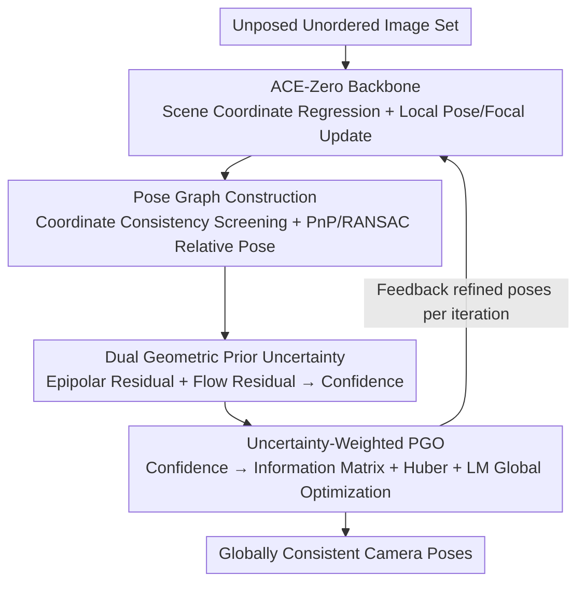

# Learning Scene Coordinate Reconstruction from Unposed Images via Pose Graph Optimization

**Conference**: CVPR 2026  
**Paper**: [CVF Open Access](https://openaccess.thecvf.com/content/CVPR2026/html/Tse_Learning_Scene_Coordinate_Reconstruction_from_Unposed_Images_via_Pose_Graph_CVPR_2026_paper.html)  
**Code**: To be confirmed  
**Area**: 3D Vision  
**Keywords**: Scene coordinate regression, Pose graph optimization, Unsupervised SfM, Uncertainty modeling, ACE-Zero

## TL;DR
Introduces Pose Graph Optimization (PGO) on top of the unsupervised scene coordinate regression framework ACE-Zero. It automatically constructs edges using predicted scene coordinates and estimates confidence for each edge via a dual geometric prior (epipolar + optical flow) for weighted global optimization. This pulls locally refined, drift-prone camera poses into global consistency, matching or exceeding COLMAP in PSNR while compressing reconstruction time from 38h to 30min.

## Background & Motivation
**Background**: Structure-from-Motion (SfM), which recovers camera poses and 3D structures from unordered image sets, is shifting from traditional "feature matching + triangulation + bundle adjustment" pipelines to learning-based methods that directly regress scene coordinates or camera poses. ACE-Zero is a representative method: it bootstraps camera parameters and scene geometry from a set of unposed images without ground truth poses or depth, training a scene coordinate regression network via self-supervised reprojection loss.

**Limitations of Prior Work**: Pose refinement in ACE-Zero is "purely local"—a learned optimizer updates each image's pose based only on its own information, never enforcing cross-image consistency. Consequently, in large-scale, texture-less, or repetitive scenes, or those with significant initial pose noise, it accumulates drift and global misalignment (as shown in Paper Fig. 1: PSNR drops from 28.1 to 19.1 after local refinement of COLMAP-initialized poses).

**Key Challenge**: Learning-based inference excels at regressing geometry from single images but lacks global constraints; conversely, classical global optimization (PGO / Global Bundle Adjustment) excels at cross-view consistency but requires explicit pairwise pose constraints and a visibility graph—exactly what ACE-Zero does not produce. These two paradigms possess complementary strengths but remain disconnected.

**Goal**: To integrate PGO into ACE-Zero, two specific sub-problems must be addressed: (1) Since ACE-Zero does not provide pairwise constraints, how can reliable pose graph edges be constructed unsupervised from its output? (2) Since scene coordinate predictions are noisy and lack uncertainty estimates, how can confidence be estimated for each constraint to perform robust weighted optimization and avoid overfitting or instability?

**Key Insight**: The authors observe that while ACE-Zero does not directly provide constraints, it predicts dense 3D scene coordinates for every pixel. These coordinates can establish geometrically consistent correspondences between image pairs to derive relative pose constraints. Furthermore, the reliability of these constraints can be evaluated using "ground-truth-independent" geometric priors like epipolar geometry and optical flow.

**Core Idea**: Stitch learning-based inference and graph optimization into a hybrid framework via "edge construction through scene coordinate consistency + confidence estimation via geometric priors," allowing global geometric reasoning to compensate for the missing multi-view consistency in neural inference.

## Method

### Overall Architecture
The method inserts a "graph construction → uncertainty estimation → weighted global optimization" pose refinement module into each round of the ACE-Zero self-supervised iterative reconstruction cycle. The ACE-Zero backbone continues to handle scene coordinate regression and local pose/focal length updates. The three newly introduced steps promote local updates to globally consistent trajectories and feed the optimization results back into the next iteration, enabling coordinates and poses to improve each other in a closed loop. The entire pipeline requires no ground truth poses, depth, or 3D annotations.

### Key Designs

**1. Automatic Pose Graph Construction from Coordinate Consistency: Converting ACE-Zero Output into Teachable Graphs**

This step addresses the problem that ACE-Zero does not produce pairwise constraints for PGO. Instead of relying on feature matching, the authors use dense scene coordinates for geometric consistency filtering: for a 3D point $X_i^t$ predicted for a pixel in image $I_i$, it is projected onto $I_j$ using the current inverse pose $T_j^{-1}$ of image $j$, yielding $\hat{x}_j^t = \pi(T_j^{-1} X_i^t)$. The scene coordinate $X_j^t$ predicted by $I_j$ at that location is then retrieved to calculate the 3D consistency error $e_{\text{match}}^t = \lVert X_j^t - X_i^t \rVert$. A match is considered consistent if the error is below a threshold $\tau$ (with optional symmetric back-projection check). RANSAC + PnP are applied to sufficient consistent matches to solve for the relative pose $Z_{ij} = [R_{ij}\,|\,t_{ij}] \in SE(3)$ (satisfying $X_j^t \approx R_{ij} X_i^t + t_{ij}$), which serves as an edge in the graph; nodes represent camera poses $T_i$. The threshold $\tau$ is gradually tightened from 0.2m to 0.05m over iterations—staying lenient early on when predictions are coarse and becoming strict later to filter noise. This converts "dense coordinates from neutral networks" into "sparse pairwise constraints for graph optimization."

**2. Dual Geometric Priors for Uncertainty: Estimating Confidence Independent of Ground Truth**

Since scene coordinate predictions are noisy and RANSAC can fail with sparse inliers, the quality of constructed edges varies, and naive PGO can be skewed by bad edges. The authors use two complementary geometric priors to estimate confidence for each match. **Epipolar Prior**: Uses the relative pose to compute the essential matrix $E_{ij} = [t_{ij}]_\times R_{ij}$, deriving the epipolar line $l_j^t = K_j^{-\top} E_{ij} K_j^{-1} x_i^t$ in $I_j$ corresponding to $x_i^t$. The vertical distance from the projected point $\hat{x}_j^t$ to this line serves as the epipolar residual $e_{\text{epi}}^t$; a smaller residual indicates higher geometric consistency. However, empirical tests (Fig. 2) show that the epipolar residual is insufficiently sensitive to small pose perturbations, sometimes decreasing even with added translation noise; thus, it is used as a heuristic indicator rather than a strict validator. **Optical Flow Prior**: Uses RAFT to estimate dense flow $F_{i\to j}$ for flow-based correspondence $\tilde{x}_j^t = x_i^t + F_{i\to j}(x_i^t)$, then calculates $e_{\text{flow}}^t = \lVert \hat{x}_j^t - \tilde{x}_j^t \rVert_2$. Optical flow, derived from image content, is more robust to pose errors, compensating for the epipolar prior's dependence on global pose accuracy. Finally, the confidence score for each match is a weighted sum $\sigma_{ij}^t = \alpha_1 e_{\text{epi}}^t + \alpha_2 e_{\text{flow}}^t$ (implementation uses $\alpha_1=0.4, \alpha_2=0.6$).

**3. Uncertainty-Weighted Iterative Global PGO: Letting Reliable Constraints Dominate**

With edges and confidence scores established, PGO solves for absolute poses $\{T_i\}$ to maximize consistency across all relative constraints. The objective is $\min_{\{T_i\}} \sum_{(i,j)\in E} \lVert \mathrm{Log}(Z_{ij}^{-1} T_i^{-1} T_j) \rVert^2_{\Omega_{ij}}$, where $\mathrm{Log}(\cdot)$ is the logarithmic map from $SE(3)$ to $\mathfrak{se}(3)$ and $\Omega_{ij}$ is the information matrix. Crucially, the information matrix is driven by confidence: the mean confidence $\sigma_{ij}$ of all matches for an edge is calculated, and $\Omega_{ij}$ is set to $\frac{1}{\sigma_{ij}^2 + \epsilon} I$. Low-confidence edges (large residuals) result in smaller information matrices, automatically downweighting their impact during optimization. The first frame is anchored with a tight prior (std $10^{-6}$), while standard factors use a std of 0.1. A Huber loss (scale 1.0) provides outlier robustness, and loose priors (std 10) on isolated nodes prevent optimization collapse. This PGO is not a post-processing step but is embedded in **every iteration** of ACE-Zero: local updates are immediately propagated globally, correcting drift on the fly, and the next iteration proceeds from more consistent poses.

## Key Experimental Results

Evaluation Protocol: As real-world scenes rarely provide ground truth poses, the authors use COLMAP poses as pseudo-ground-truth and indirectly measure pose quality via "self-supervised novel view synthesis PSNR." After estimating all poses, the data is split into training/test sets to train Nerfacto; images synthesized for test poses are compared against real test images to compute PSNR (dB). Higher PSNR indicates more accurate poses. Evaluations were performed on 7-Scenes (relocalization), Mip-NeRF 360 (view synthesis), and Tanks and Temples (reconstruction) using a single NVIDIA 3090.

### Main Results

| Dataset | Metric | Ours (full) | ACE-Zero | COLMAP (default) | Note |
|--------|------|-----------|----------|-----------------|------|
| 7-Scenes | Avg PSNR↑ | **21.7** | 21.2 | 21.2 | Matches/Exceeds ACE-Zero and COLMAP |
| 7-Scenes | Avg Recon Time↓ | **30min** | 1h | 38h | ~76× faster than COLMAP default |
| Mip-NeRF 360 | Avg PSNR↑ | **24.3** | 22.9 | **24.7** | Substantially exceeds ACE-Zero, nears COLMAP |
| Tanks&Temples | PSNR↑ | Generally Better than ACE0 | — | — | Tested on both short (150-500) and long (4k-22k) image sets |

Note: On Mip-NeRF 360, the recent dense RGB SLAM method VGGT-SLAM performed poorly (avg 14.3 PSNR) due to large discrepancies between sequential frames, significantly below ACE-Zero and Ours.

### Ablation Study
Gradually adding components on 7-Scenes / Mip-NeRF 360 (PSNR↑):

| Configuration | 7-Scenes Avg | Mip-NeRF 360 Avg | Note |
|------|--------------|-------------------|------|
| vanilla PGO | 12.6 | 13.8 | Connecting PGO without confidence leads to collapse from bad edges |
| w/o uncertainty | 18.5 | 21.0 | Without weighting, performance remains significantly lower |
| Ours (full) | **21.7** | **24.3** | PGO with dual-prior confidence weighting is best |

### Key Findings
- **Uncertainty weighting is the game-changer:** Naive PGO (vanilla) averages only 12.6 / 13.8, nearly half the performance of ACE-Zero (21.2 / 22.9). Blind global optimization is poisoned by noisy edges; only weighted PGO based on geometric priors translates global consistency into performance gains.
- **Superior Efficiency:** The abstract highlights that convergence requires roughly half the iterations of the baseline. On 7-Scenes, 30min vs. ACE-Zero's 1h and COLMAP default's 38h demonstrates that global constraints accelerate rather than hinder convergence.
- **Epipolar Prior as a "Soft Indicator":** The authors honestly note that epipolar residuals are non-monotonic with respect to pose perturbations (Fig. 2), necessitating the complementary optical flow prior.

## Highlights & Insights
- **Cleverly derives sparse constraints from dense output:** While other hybrid methods replace traditional sub-modules or require structured input, this method does not modify ACE-Zero or add supervision. It builds graph edges pureley from the geometric consistency of scene coordinates, transforming a "black box" that doesn't produce constraints into an optimizable object.
- **Sound Design Motivation for Dual Priors:** Epipolar geometry is global but sensitive to pose accuracy; optical flow is local but robust to pose errors. Combining them to cover each other's blind spots based on "failure modes" is a more insightful approach than simple integration.
- **Clean Interface for Confidence to Information Matrix:** Mapping heuristic geometric residuals to $1/(\sigma^2+\epsilon)$ for the PGO information matrix allows a standard graph optimizer to "recognize" reliable edges without training an uncertainty head.

## Limitations & Future Work
- **Strong Dependence on External Modules:** The framework relies on ACE-Zero as a base and requires RAFT for flow and ZoeDepth for initialization; failures in upstream models propagate. Parameters like threshold $\tau$ and weights $\alpha_1, \alpha_2$ require manual tuning.
- **Heuristic Uncertainty:** The authors admit epipolar residuals are not strictly correlated with true pose error, serving only as a soft metric. A theoretically grounded uncertainty measure is still missing for extreme noise scenarios.
- **COLMAP as Pseudo-GT:** Using PSNR as an indirect proxy via COLMAP poses leaves some ambiguity; direct metrics like Absolute Trajectory Error (ATE/RPE) are absent.
- **Future Directions:** Making uncertainty learnable and back-propagatable to the coordinate regression network, or unifying graph construction and confidence estimation into a lightweight head to reduce reliance on external models like RAFT.

## Related Work & Insights
- **vs. ACE-Zero**: The direct baseline. ACE-Zero's purely local refinement is prone to drift; the addition of global PGO + uncertainty improves multi-view consistency and speeds up convergence.
- **vs. DeepSFM / GraphSfM**: These methods replace traditional SfM steps with neural modules but often assume structured input (sequences); this work addresses the harder unordered, unposed setting.
- **vs. VGGT-SLAM / DROID-SLAM**: Contemporary dense neural SLAM methods struggle with the large view gaps in datasets like Mip-NeRF 360; this work's coordinate-based graph construction is more robust to non-sequential data.
- **vs. UA-Pose / UnPose**: These methods derive uncertainty from networks or diffusion models; this work uses pure geometric priors (epipolar + flow) for confidence, requiring no extra training.

## Rating
- Novelty: ⭐⭐⭐⭐ The combination of "dense-to-sparse graph construction" and "dual-prior weighted PGO" is clear, though components are based on mature technologies.
- Experimental Thoroughness: ⭐⭐⭐⭐ Strong results across multiple benchmarks; direct pose error metrics are missing, making PSNR a conservative proxy.
- Writing Quality: ⭐⭐⭐⭐ Motivations and failure modes are explained clearly and honestly.
- Value: ⭐⭐⭐⭐ Successfully addresses the global consistency weakness in learning-based SfM with significant speedups, providing high utility for unsupervised reconstruction.

<!-- RELATED:START -->

## Related Papers

- [\[CVPR 2026\] Learning 3D Representations for Spatial Intelligence from Unposed Multi-View Images](learning_3d_representations_for_spatial_intelligence_from_unposed_multi-view_ima.md)
- [\[CVPR 2026\] CoLoR: The Devil is in Scene Coordinate Regression for Large-Scale Visual Localization](color_the_devil_is_in_scene_coordinate_regression_for_large-scale_visual_localiz.md)
- [\[ICCV 2025\] Scene Coordinate Reconstruction Priors](../../ICCV2025/3d_vision/scene_coordinate_reconstruction_priors.md)
- [\[CVPR 2026\] Uni3R: Unified 3D Reconstruction and Semantic Understanding via Generalizable Gaussian Splatting from Unposed Multi-View Images](uni3r_unified_3d_reconstruction_and_semantic_understanding_via_generalizable_gau.md)
- [\[ICLR 2026\] UFO-4D: Unposed Feedforward 4D Reconstruction from Two Images](../../ICLR2026/3d_vision/ufo-4d_unposed_feedforward_4d_reconstruction_from_two_images.md)

<!-- RELATED:END -->
