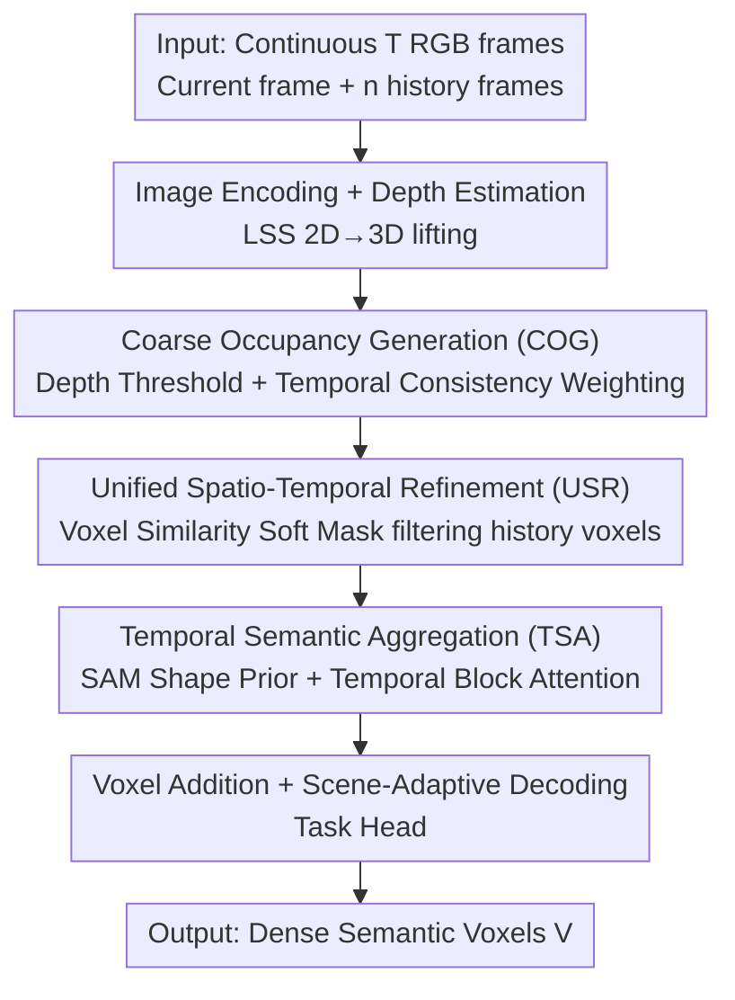

# Learning Spatial-Temporal Consistency for 3D Semantic Scene Completion

**Conference**: CVPR 2026  
**Paper**: [CVF Open Access](https://openaccess.thecvf.com/content/CVPR2026/html/Xue_Learning_Spatial-Temporal_Consistency_for_3D_Semantic_Scene_Completion_CVPR_2026_paper.html)  
**Code**: None  
**Area**: 3D Vision  
**Keywords**: Semantic Scene Completion, Temporal Consistency, Occupancy Prediction, Voxel Refinement, Camera-aware

## TL;DR
ConSSC lifts historical RGB frames into a unified 3D occupancy space, utilizing "Hierarchical Voxel Refinement" for geometric completion and "Temporal Semantic Aggregation" for semantic completion. Without any additional sensors, it establishes a new SOTA for camera-only semantic scene completion on SemanticKITTI and KITTI-360 (IoU 48.17 / 48.79, mIoU 19.20 / 20.85).

## Background & Motivation

**Background**: Semantic Scene Completion (SSC) involves jointly inferring voxel-level occupancy and semantic labels from partial observations, serving as a critical 3D perception task for autonomous driving and robot navigation. While LiDAR-based solutions offer high precision, they are costly. Consequently, camera-only SSC routes (starting with MonoScene) have gained traction due to lower costs and rich appearance cues.

**Limitations of Prior Work**: Single-frame camera solutions are limited by occlusion and field-of-view, leading to unobserved regions and blurry predictions. Subsequent works (VoxFormer-T, HTCL-S, etc.) introduced temporal frames but mostly relied on **simple stacking of multi-frame features**, lacking explicit temporal correspondence modeling. This results in geometric and semantic drift over time and incomplete completion.

**Key Challenge**: While temporal information can fill unobserved areas, the precise alignment of 2D/3D cues from historical frames to current voxels remains unsolved. Coarse-grained BEV or voxel fusion cannot satisfy the fine-grained spatial-temporal correspondence required for dense SSC.

**Goal**: To improve both geometric consistency (completing occluded structures) and semantic consistency (correcting ambiguous labels in occluded areas) using only cameras without extra sensors.

**Key Insight**: The authors lift historical frames into a unified 3D scene-level occupancy framework, leveraging two complementary cues: similarity between historical voxels (geometry) and multi-view 2D visibility with shape priors (semantics).

**Core Idea**: Geometry is completed by generating a "coarse occupancy from depth" followed by "hierarchical refinement based on historical voxel similarity." Semantics are aggregated using "SAM shape priors + temporal attention" to fuse multi-view semantic information, ensuring precise alignment rather than naive stacking.

## Method

### Overall Architecture
ConSSC takes continuous $T$ RGB frames $\{I_t, I_{t-1}, \dots\}$ as input and outputs the semantic probability $V \in \mathbb{R}^{X \times Y \times Z \times C}$ for the voxel grid in front of the current frame. The pipeline involves: an image encoder extracting current and historical features; a pre-trained depth model estimating depth maps; and Lift-Splat-Shoot (LSS) performing 2D→3D lifting to obtain initial voxels. These voxels first enter **Hierarchical Voxel Refinement (HVR)** for geometry completion, using historical depth maps for coarse occupancy and voxel similarity for refinement. They then enter **Temporal Semantic Aggregation (TSA)** for semantic completion, utilizing SAM-extracted shape masks and temporal attention. Finally, the two voxel paths are merged and passed through a scene-adaptive decoder and task head for prediction.

### Key Designs

**1. Coarse Occupancy Generation (COG): Anchoring voxels with a reliable geometric initialization**

Addressing the unreliability of occupancy priors due to single-frame occlusion, COG estimates occupancy from depth maps rather than direct regression. Depth maps are discretized into distributions, and depth estimates $d_f(x,y)$ are retrieved via the maximum probability index. Occupancy is determined by a threshold: 1 if $d \le d_f(x,y)$, else 0. Critically, a temporal weight is calculated for **historical frames**: based on the depth difference $\Delta d = |d_t(x,y) - d_{t-k}(x,y)|$, a Gaussian kernel $w(x,y) = \exp(-\Delta d^2 / 2\sigma^2)$ measures consistency. The final occupancy probability is a weighted fusion $P_{occ} = (1-w)\cdot Occ_t + w \cdot Occ_{hist}$. The resulting coarse occupancy $O_{coarse}$ partitions voxels into "occluded areas for refinement" and "unobserved areas for hallucination," providing a more reliable workspace.

**2. Unified Spatio-Temporal Refinement (USR): Filtering "trustworthy" history voxels via soft masks**

While COG identifies "where to complete," USR determines "what to complete." Simple stacking introduces outdated noise, so historical voxels are filtered by similarity. The element-wise difference $\Delta v$ between current $V_t$ and historical $V_{hist}$ is computed, using learnable channel-wise weights $w_V$ for a weighted squared difference $\Delta_w = (\Delta v)^2 \odot w$. This is summed across features into $\Delta_{total}$ and mapped to a similarity score $s = 1/(1+\Delta_{total})$. A learnable threshold $\gamma$ generates a continuous soft mask $M = \mathrm{sigmoid}(s-\gamma)$, which is multiplied with $V_{hist}$ to isolate credible voxels $V'_{hist}$. An identity residual $V_{refined} = V'_{hist} + \theta \cdot V_{hist}$ ensures gradient flow. These refined voxels explicitly enhance temporal instability or occluded areas; for entirely unobserved zones, Deformable Cross-Attention learns the hallucination.

**3. Temporal Semantic Aggregation (TSA): Correcting semantic labels via SAM priors**

To refine semantic labels in occluded regions, TSA utilizes semantic cues from historical RGB frames. A frozen MobileSAM extracts segmentation masks $F^t_{sam}$ for each frame. Temporal stability of objects is measured by pixel-wise inner products $c_{i,j}(x,y)$, with unstable matches truncated via threshold $\phi$. A stability score $s_i$ is normalized into frame-level weights $w_i = \mathrm{softmax}(s_i)$, assigning higher weights to clear observations. Semantic features are aggregated as $F_{sim} = \sum_i w_i \cdot F^i_{sam}$. Two-step attention follows: $F_{sim}$ acts as Query and $F_{sam}$ as Key, processed across spatial blocks with a learnable temporal position bias $P_{time}$. The aggregated $F_{agg}$ is projected back to voxels via depth distributions, resulting in $V_{agg}$, which is combined with $V_{refined}$.

### Loss & Training
The model follows a set prediction paradigm. Predictions are matched with ground truth using the Hungarian algorithm. Each pair is trained with mask loss $L_{mask}$, Dice loss $L_{dice}$, and classification loss $L_{cls}$. Total loss: $L = \lambda_{mask}L_{mask} + \lambda_{dice}L_{dice} + \lambda_{cls}L_{cls}$ with weights $\{5, 5, 2\}$. A ResNet50 backbone is used with $T=4$ frames. Training runs for 30 epochs using AdamW on two RTX A6000 GPUs.

## Key Experimental Results

### Main Results
Evaluation was conducted on two large-scale outdoor SSC benchmarks using only RGB inputs. IoU measures geometric occupancy, and mIoU measures semantics.

| Dataset | Metric | ConSSC (Ours) | Prev. Best (Temporal) | Prev. Best (Single) |
|--------|------|------|----------|----------|
| SemanticKITTI (test) | IoU / mIoU | **48.17 / 19.20** | SOAP 47.54 / 18.72 | ScanSSC 44.54 / 17.40 |
| SSCBench-KITTI-360 (test) | IoU / mIoU | **48.79 / 20.85** | — | SOAP 48.48 / 20.17 |

ConSSC outperforms the single-frame SOTA ScanSSC by 3.63 IoU / 1.80 mIoU on SemanticKITTI. It also exceeds temporal methods like VoxFormer-T, HTCL-S, and SOAP. On KITTI-360, it shows superior performance in structured regions like building and car.

### Ablation Study
Ablations on SemanticKITTI validation set:

| Config | IoU(%) | mIoU(%) | Description |
|------|--------|---------|------|
| Baseline | 44.47 | 16.95 | Standard temporal feature interaction |
| + COG | 47.47 | 17.24 | Depth-guided initialization |
| + USR | 48.01 | 18.17 | Similarity-based voxel refinement |
| + COG + USR | 48.86 | 18.66 | Full HVR |
| + TSA | 47.92 | 18.13 | Semantic aggregation only |
| Full（HVR + TSA） | **49.10** | **19.10** | Complementary combination |

### Key Findings
- **TSA provides the highest mIoU Gain**: SAM-driven masks suppress noisy voxels and strengthen cross-frame consistency, suggesting semantic completion benefits more from temporal correspondence than geometry.
- **Soft Mask and Similarity Alignment are critical**: Replacing USR with convolution fusion or removing the soft mask results in significant drops, proving that filtering historical voxels by similarity is central to refinement.
- **Optimal frame count**: Performance gains plateau after 3-4 historical frames. The authors selected $T=4$ as the optimal trade-off between temporal information and computational cost.

## Highlights & Insights
- **Decoupling geometry and semantics** into separate branches (HVR and TSA) is a clean and effective design, with ablations confirming their complementarity.
- **Soft mask with learnable thresholds** is a transferable trick for any temporal fusion task where one needs to filter historical noise adaptively.
- **Leveraging foundation models as shape priors** (using frozen MobileSAM) is a lightweight example of injecting high-level structural knowledge into dense prediction tasks with minimal cost.

## Limitations & Future Work
- **Dependency on external models**: COG and TSA rely heavily on the quality of the specific depth estimator and SAM. Cascade errors in these components were not fully explored.
- **Dynamic objects**: The cross-frame alignment based on depth and similarity may struggle with fast-moving objects. Performances in categories like bicycle and motorcyclist remain volatile.
- **Fixed frame trade-offs**: While $4$ frames work well empirically, future work could explore adaptive frame selection or explicit motion compensation to better align dynamic regions.

## Related Work & Insights
- **vs VoxFormer-T**: VoxFormer-T lacks explicit temporal modeling; ConSSC uses soft masks and depth consistency for fine-grained alignment.
- **vs HTCL-S**: HTCL-S uses cross-frame affinity but remains relatively coarse-grained. ConSSC introduces SAM priors and Decoupled branches for better occlusion handling.
- **vs SOAP**: Both use historical features for occlusion recovery, but ConSSC achieves higher mIoU and emphasizes explicit spatial-temporal consistency over simple reuse.

## Rating
- Novelty: ⭐⭐⭐⭐ The combination of soft mask filtering and SAM shape priors in camera-only SSC is innovative.
- Experimental Thoroughness: ⭐⭐⭐⭐ Solid results on two benchmarks with detailed architectural ablations.
- Writing Quality: ⭐⭐⭐ Generally clear, though some layout issues were noted in the original manuscript.
- Value: ⭐⭐⭐⭐ Pushes the SOTA for low-cost autonomous driving perception using only cameras.

<!-- RELATED:START -->

## Related Papers

- [\[CVPR 2026\] TGSFormer: Scalable Temporal Gaussian Splatting for Embodied Semantic Scene Completion](tgsformer_scalable_temporal_gaussian_splatting_for_embodied_semantic_scene_compl.md)
- [\[CVPR 2026\] LaS-Comp: Zero-shot 3D Completion with Latent-Spatial Consistency](las-comp_zero-shot_3d_completion_with_latent-spatial_consistency.md)
- [\[CVPR 2026\] Multi-modal Frequency Decomposition Network for Semantic Scene Completion](multi-modal_frequency_decomposition_network_for_semantic_scene_completion.md)
- [\[AAAI 2026\] Towards Temporal Fusion Beyond the Field of View for Camera-based Semantic Scene Completion](../../AAAI2026/3d_vision/towards_temporal_fusion_beyond_the_field_of_view_for_camera-based_semantic_scene.md)
- [\[CVPR 2026\] Semantic Foam: Unifying Spatial and Semantic Scene Decomposition](semantic_foam_unifying_spatial_and_semantic_scene_decomposition.md)

<!-- RELATED:END -->
