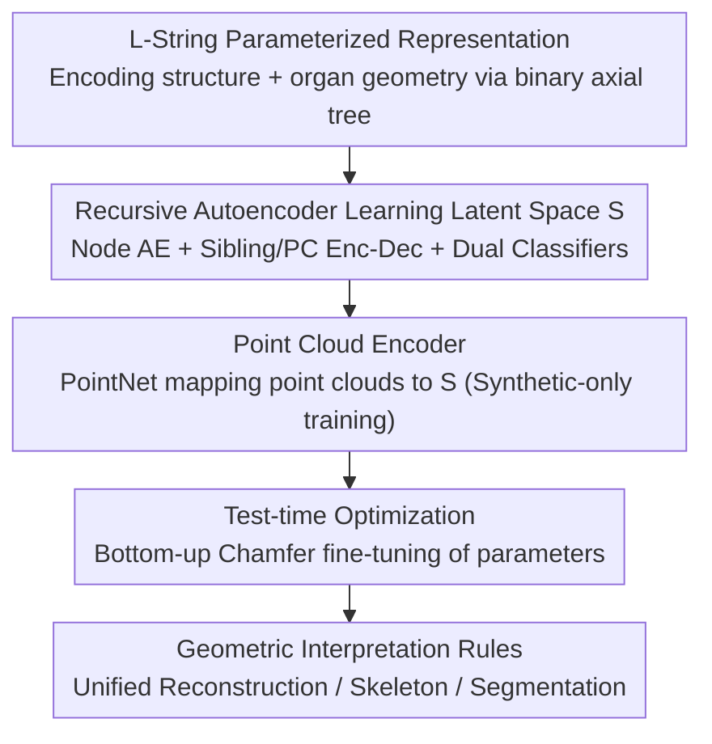

# Learning to Infer Parameterized Representations of Plants from 3D Scans

**Conference**: CVPR 2026  
**Paper**: [CVF Open Access](https://openaccess.thecvf.com/content/CVPR2026/html/Ghrer_Learning_to_Infer_Parameterized_Representations_of_Plants_from_3D_Scans_CVPR_2026_paper.html)  
**Code**: https://gitlab.inria.fr/sghrer/3d-L-plants  
**Area**: 3D Vision / Plant Phenotyping / Structured Reconstruction  
**Keywords**: Plant Phenotyping, L-System, Recursive Neural Networks, Parameterized Reconstruction, Point Cloud

## TL;DR
This paper uses a Recursive Neural Network (RvNN) to learn a "shape space" for plants, directly inferring unordered 3D point clouds into a parameterized L-String (binary axial tree). This approach simultaneously outputs the branching topology of the plant and the geometric parameters of each organ. Trained entirely on synthetic data generated by procedural models, the method generalizes to real scans and provides unified support for three phenotyping tasks: 3D reconstruction, skeleton extraction, and organ segmentation.

## Background & Motivation

**Background**: Plant phenotyping (quantifying how genotypes grow in environments) requires extracting high-level information from observations—3D geometric reconstruction, organ segmentation, and skeleton extraction. Observations are typically 2D images or 3D scans. Existing work either focuses on "inverse modeling" (finding growth rules that generate a given plant) or "task-specific" methods (solving only one of the three tasks).

**Limitations of Prior Work**: Inverse modeling is difficult; current methods are only applicable to **leafless** branching structures (like bare branches) and fail for leafy annual plants. Task-specific methods are localized, non-generalizable, and do not output structured parameterized representations. Demeter, the closest work to this paper, can learn parameterized plant models but requires **manually annotated 3D scans** for training, demands **pre-segmented inputs** for inference, and follows a cumbersome three-step reconstruction process—making annotation and preprocessing expensive and error-prone.

**Key Challenge**: Plants have many organs and are 3D branching systems with thin organs positioned close to each other, causing strong self-occlusion and ambiguity. Recovering both "structure (topology)" and "geometry (parameters of each organ)" from a cluster of unordered point clouds is extremely difficult. Point clouds have variable point counts, and L-Strings vary simultaneously in both discrete (number/type of modules) and continuous (angle/length parameters) dimensions, making direct regression extremely challenging.

**Goal**: To infer a parameterized representation from a 3D scan point cloud that encodes both the branching structure and organ geometry, which can then be directly reused for multiple phenotyping tasks.

**Key Insight**: The authors leverage biologically inspired procedural models (L-Systems), which describe plant development using recursive rules. These rules guide the network design (recursiveness) and enable the bulk generation of synthetic training data with ground truth, circumventing the need for expensive manual annotation.

**Core Idea**: A Recursive Autoencoder is used to learn a latent shape space $S$ on L-Strings (binary axial trees), and a point cloud encoder is trained to map scans into $S$. During inference, the pipeline follows "Point Cloud → $S$ → Recursive Decoding → L-String," translating "unordered point clouds" into a "structured parameter tree."

## Method

### Overall Architecture
The objective is to infer an L-String $l$ from an input point cloud $P$. Since point clouds are unordered and have variable sizes, while L-Strings vary in both discrete and continuous dimensions, direct regression is infeasible. The authors split the task: first, learn a latent space $S$ capable of encoding L-Strings, then train an encoder to map point clouds to $S$. Training proceeds in two steps: first, a Recursive Autoencoder learns $S$ on synthetic L-Strings (including node autoencoders, sibling/parent-child recursive encoders/decoders, and two auxiliary classifiers); next, a PointNet point cloud encoder is trained to align point clouds to the latent points of their corresponding L-Strings in $S$. During inference, the point cloud yields a latent point via the encoder, which is reconstructed into an L-String by the recursive decoder. Finally, test-time optimization aligns the output with the input, and reconstruction, skeletonization, and segmentation are achieved through geometric interpretation rules.

### Key Designs

**1. L-String Parameterized Representation: Encoding Topology and Geometry with Binary Axial Trees**

Addressing the pain point that task-specific methods do not output structure and inverse modeling only handles leafless branches, the authors use L-Systems to represent plants as strings of parameterized modules with brackets (L-String). Modules correspond to organs (stem, cotyledon, petiole, leaf, branch), each with a set of parameters (e.g., stem diameter/length, growth/bending/phyllotaxis angles). Brackets mark the start and end of branches. Adjacent modules have parent-child relationships, and open brackets allow for multiple branches and sibling relationships, thereby encoding the plant's **axial tree** architecture. To utilize binary tree recursive networks, the authors merge modules that "always appear together in the species" into a **node** (merging rules are defined once per species to ensure a binary tree). Thus, the L-String provides both topology (which organ connects to which) and geometry (continuous parameters for each organ), providing the structured information missing from input scans.

**2. Recursive Autoencoder and Latent Space S: Compressing Bottom-Up into a Latent Point via RvNN + Dual Classifiers**

To map variable-length, variable-structure L-Strings into a fixed-dimensional latent space $S$, the authors learn an encoder/decoder pair $E: L \to S$, $D: S \to L$ such that $l \approx D(E(l))$. Since different node types have different parameter dimensions, node-specific autoencoders $(E_{node,i}, D_{node,i})$ (single-layer fully connected + tanh) first map nodes into $S$. Then, based on the relationship between two nodes (sibling or parent-child), recursive encoder pairs $(E_{sib},D_{sib})$ and $(E_{pc},D_{pc})$ are learned to merge them two-by-two recursively from leaves to root until the entire tree is compressed into a single latent point in $S$. Decoding reverses this process, but requires knowing which decoder to use at each point; thus, two auxiliary classifiers are jointly trained: $C_{split}$ determines if a latent point should split (parent-child or sibling) or stop (leaf node), and $C_{node}$ identifies the node type for leaf latent points. Training uses a node-level reconstruction loss $L_{rec} = \sum_n L_{rec}(n)$ (weighted MSE of organ parameters) and two cross-entropy losses for classification: $L_{total} = L_{rec} + L_{split} + L_{node}$. This recursive structure naturally fits the "self-similar branching" nature of plants.

**3. Point Cloud Encoder: Mapping Unordered Point Clouds to Latent Points with Synthetic-only Training**

The final step is the mapping from "Scan to $S$." The authors use PointNet to learn the mapping $E_{points}: P \to S$. Training utilizes paired data (point cloud $P$ and its corresponding L-String $l$): passing $l$ through the recursive encoder yields a ground-truth latent point $s$, while passing $P$ through $E_{points}$ yields a predicted $\hat{s}$. The model minimizes $L_{points} = \sum_j (\hat{s}_j - s_j)^2$. Training is conducted **entirely on synthetic point clouds generated by L-Py** (simulating acquisition noise for robustness), bypassing manual annotation of real scans. Experiments show this model generalizes directly to unannotated real-world scans.

**4. Test-time Optimization + Geometric Interpretation: Suppressing Accumulation Error and Solving Three Tasks**

Errors in decoded module parameters accumulate along the growth axis—for instance, a slight error in the base stem angle deviates the entire plant's direction. The authors apply **test-time optimization** to align the output with the input: starting from the base, they first optimize the 3D angle and length parameters of the main stem, followed by the petioles (length/elasticity) and then the leaves (size/curvature). The objective is the **bidirectional Chamfer distance** between the reconstructed plant and the input point cloud, iterated twice bottom-up. Once aligned, the three downstream tasks are derived via **geometric interpretation rules**: **Reconstruction** (extracting the 3D plant from $l$), **Skeleton** (reconstructing minimal-width stems/midribs), and **Segmentation** (propagating organ labels from the annotated reconstruction to the input $P$ via k-nearest neighbors).

### Loss & Training
The latent space uses $L_{total} = L_{rec} + L_{split} + L_{node}$; the point cloud encoder uses $L_{points}$ for MSE regression. The dataset consists of synthetic Chenopodium Album: 10 structures × 100 plants = 1000 pairs of (L-String, Point Cloud), split 8/1/1 for train/val/test. Hardware: Quadro RTX 5000. ⚠️ Node merging rules must be manually defined once per species.

## Key Experimental Results

**Custom Metrics**: **Accuracy↓** (one-way Chamfer from reconstruction to GT); **Completeness↓** (one-way Chamfer from GT to reconstruction); **Size** (output representation size); **# Comp.** (number of connected components in the mesh); **LN Accuracy↑** (leaf count matching %); **LAI Accuracy↑** (Leaf Area Index accuracy); **Topology↑** (percentage of plants with correct topology via tree edit distance); skeleton and segmentation evaluated via **bidirectional Chamfer distance**.

### Main Results (3D Reconstruction vs. SIREN)
Comparison with SIREN (the best-performing plant point cloud reconstruction method verified by Prasad et al.) across three input types:

| Input | Method | Accuracy↓ | Completeness↓ | Size | Time | # Comp. | LN↑ | LAI↑ | Topo↑ |
|------|------|-----------|---------------|------|------|---------|-----|------|-------|
| Clean | SIREN | 0.0012 | 0.0006 | 780.88 KB | 7m14s | 33 | ✗ | ✗ | ✗ |
| Clean | **Ours** | 0.0059 | 0.0090 | **17.56 KB** | **4m01s** | **1** | 98% | 93% | 75% |
| Noisy | SIREN | 0.0121 | 0.0008 | 780.88 KB | 7m27s | 268 | ✗ | ✗ | ✗ |
| Noisy | **Ours** | **0.0054** | **0.0074** | **17.56 KB** | **3m56s** | **1** | 98% | 93% | 78% |
| Depth | SIREN | 0.0013 | 0.0022 | 780.88 KB | 6m44s | 49 | ✗ | ✗ | ✗ |
| Depth | **Ours** | 0.0060 | 0.0089 | **17.57 KB** | **3m47s** | **1** | 98% | 94% | 78% |

Under clean data, SIREN exhibits smaller distance errors, but it degrades sharply under noise (Accuracy 0.0012→0.0121, components 33→268, breaking into fragments). Ours is robust to noise/omissions, outperforms SIREN under noise, and is 1-2 orders of magnitude more compact and nearly twice as fast while providing phenotype data (leaf count/LAI/topology) that SIREN cannot.

### Skeleton Extraction (Bidirectional Chamfer↓)
| Method | Clean(Full) | Noisy(Full) | Depth(Full) | Clean(Branch) |
|------|-------------|-------------|-------------|---------------|
| Xu et al. | 0.0102 | 0.0110 | 0.0145 | ✗ |
| Chaudhury et al. | 0.0139 | 0.0154 | 0.0449 | ✗ |
| Livny et al. | 0.0257 | 0.0282 | —(Crash) | ✗ |
| **Ours** | 0.0178 | 0.0174 | 0.0199 | 0.0161 |

Baselines only accept leafless inputs and have fixed output scales. Ours performs consistently across three test sets, is noise-robust, and uniquely supports both "leaf-on full skeleton" and "branch-only" scales.

### Segmentation & Generalization
- Semantic segmentation comparison with PlantNet and PSegNet: Ours is competitive with strong baselines and **outperforms PSegNet in petiole segmentation**, remaining robust to noise and partial data.
- Generalized to 5 real Chenopodium Album scans using only synthetic training: Reconstruction/segmentation was generally good, and skeletons closely followed topology (Figure 6 in the original paper), validating sim-to-real generalization.

### Key Findings
- Compact parameterized representation is a core advantage (17.5KB vs 780KB), ensuring natural connectivity (# Comp.=1) and robustness against fragmentation.
- Implicit methods like SIREN excel at fitting clean points but lack structural priors, failing under noise and unable to provide phenotypic metrics.
- "One representation for three uses": The same L-String yields reconstruction, skeleton, and segmentation, matching task-specific strong baselines while avoiding separate modeling.

## Highlights & Insights
- Reformulating "plant understanding from scans" as "inferring a parameterized L-String" brings structural priors into reconstruction. This is the root cause of its noise robustness and ability to output phenotypic metrics, a methodology transferable to other procedurally modeled objects (blood vessels, road networks).
- Twofold use of procedural models: Guiding the recursive network architecture and serving as a synthetic data factory to bypass manual annotation. A clear example of "synthetic data + inductive bias alignment."
- Bottom-up Chamfer optimization at test-time effectively suppresses error accumulation along the growth axis, providing a lesson for any regression problem where chain/tree parameters propagate errors.

## Limitations & Future Work
- **Per-species Model Requirement**: Requires an L-System for the species to generate training data and manual node-merging rules, limiting scalability.
- Only applicable to plants representable as binary axial trees; unable to model monocots (e.g., wheat, maize) due to observability constraints.
- Evaluation is primarily on small annual Chenopodium Album; generalization to large trees or denser canopies is not fully verified.
- Potential improvements: Exploring latent spaces shared across species, automatically learning node merging rules, and relaxing the binary tree assumption.

## Related Work & Insights
- **vs. Demeter (Cheng et al.)**: Also learns parameterized plant models, but Demeter requires manual annotations and pre-segmented inputs. Ours uses purely synthetic training and accepts raw scans.
- **vs. SIREN (Implicit Reconstruction)**: SIREN has high clean-data accuracy but lacks structure and fails under noise. Ours trades some clean-data precision for compactness, robustness, and phenotypic output.
- **vs. Inverse Modeling (Guo / Št'ava et al.)**: They infer L-System rules for leafless branches from 2D images. Ours processes 3D scans, handles leafy annuals, and reconstructs specific instances rather than just learning rules.
- **vs. Task-specific Methods**: They solve single tasks. Ours provides a unified representational output that matches specialized baselines.

## Rating
- Novelty: ⭐⭐⭐⭐⭐ Reformulating plant understanding as L-String inference using RvNN for a synthetic-only trained plant shape space is a pioneering approach.
- Experimental Thoroughness: ⭐⭐⭐⭐ Systematic across tasks and inputs, though limited to one species without validation on large plants.
- Writing Quality: ⭐⭐⭐⭐ Clear structure and excellent visualizations, though concepts like L-String merging have a high barrier for non-specialists.
- Value: ⭐⭐⭐⭐ Direct value for plant phenotyping and crop modeling; the structured+synthetic training paradigm can extend to other tree-like reconstructions.

<!-- RELATED:START -->

## Related Papers

- [\[CVPR 2026\] EvObj: Learning Evolving Object-centric Representations for 3D Instance Segmentation without Scene Supervision](evobj_learning_evolving_object-centric_representations_for_3d_instance_segmentat.md)
- [\[CVPR 2026\] 3D sans 3D Scans: Scalable Pre-training from Video-Generated Point Clouds](3d_sans_3d_scans_scalable_pre-training_from_video-generated_point_clouds.md)
- [\[CVPR 2026\] Learning to Solve PDEs on Neural Shape Representations](learning_to_solve_pdes_on_neural_shape_representations.md)
- [\[CVPR 2026\] AffordMatcher: Affordance Learning in 3D Scenes from Visual Signifiers](affordmatcher_affordance_learning_in_3d_scenes_from_visual_signifiers.md)
- [\[CVPR 2026\] A Cookbook of 3D Vision: Data, Learning Paradigms, and Application](a_cookbook_of_3d_vision_data_learning_paradigms_and_application.md)

<!-- RELATED:END -->
