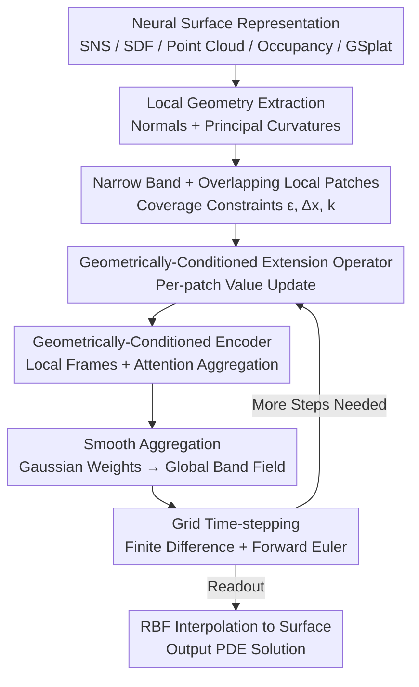

# Learning to Solve PDEs on Neural Shape Representations

**Conference**: CVPR2026  
**arXiv**: [2512.21311](https://arxiv.org/abs/2512.21311)  
**Code**: [Project Page](https://welschinger.github.io/Learning-to-Solve-PDEs-on-Neural-Shape-Representations/)  
**Area**: 3D Vision / Geometry Processing / Neural Surface Representations  
**Keywords**: Surface PDEs, Closest Point Method, Neural Implicit Surfaces, Differentiable Solvers, Geometrically-Conditioned Operators

## TL;DR
This paper learns the "normal extension" step—the most critical component of the classic Closest Point Method (CPM)—using a lightweight, geometrically-conditioned neural operator. This enables **solving surface PDEs directly on neural surface representations (SNS / SDF / Occupancy Fields / Point Clouds / Gaussian Splatting)** without mesh extraction or per-instance optimization. The pipeline is fully differentiable and, after being trained once on a single example shape (Spike), generalizes to unseen shapes, topologies, and input functions with accuracy comparable to CPM.

## Background & Motivation

**Background**: Solving partial differential equations (PDEs) on surfaces (such as heat diffusion, Poisson, and harmonic interpolation) is core to geometry processing and shape analysis. Mainstream solvers (FEM/SFEM, finite differences) are built on **discrete triangle meshes**, with established theoretical guarantees for accuracy and stability.

**Limitations of Prior Work**: Modern 3D assets are increasingly represented as **neural representations**—point clouds/splats, neural implicit fields (DeepSDF, Occupancy Networks), overfitted INRs (SIREN), and Spherical Neural Surfaces (SNS). These representations are naturally differentiable, topology-agnostic, and compatible with generative pipelines, but **mesh-centric PDE solvers do not operate in their domain**. Consequently, users must either extract a mesh using Marching Cubes before solving (destroying end-to-end differentiability and introducing round-trip errors) or use surface PINNs for per-instance residual training (requiring retraining for every new shape, leading to poor generalization and high runtime costs).

**Key Challenge**: Embedding methods like CPM are inherently suitable—they embed the surface PDE into a narrow band around the surface and solve it using standard finite differences on a Cartesian grid. However, CPM relies on an **explicit "extend-restart" loop**: at each step, the surface function must be extended along the normal to the narrow band (closest point extension, ensuring constant values along the normal) before performing volume solving. This explicit extension requires repeated closest-point projection queries, creating a bottleneck tied to explicit geometry and forming an obstacle to interfacing with neural representations.

**Goal**: ① Design a **representation-agnostic** surface PDE solver that directly consumes neural geometry; ② Maintain the accuracy of CPM while eliminating the overhead of explicit extension; ③ Ensure the pipeline is fully differentiable to be integrated as a neural network layer.

**Key Insight**: The authors observe that the extension step in CPM is **inherently local**—the extension of a narrow-band point depends only on its nearby local geometry (normals, principal curvatures) and neighborhood samples. Since this is a local mapping, it can be implicitly learned by a **small, geometrically-conditioned operator**.

**Core Idea**: Replace the "explicit closest point extension + restart" with a "learned local extension operator," allowing the PDE to be solved directly where the neural data resides.

## Method

### Overall Architecture
The method decomposes "solving PDEs on neural surfaces" into a **grid-to-grid iterative loop**: local geometry (normal $\mathbf{n}$, principal curvature directions $\mathbf{t}_1, \mathbf{t}_2$) is extracted from samples of an arbitrary neural surface $\mathcal{S}$. A Cartesian narrow band $\mathcal{B}_\mathcal{S}$ of width $\varepsilon$ is established around the surface and covered by a family of **overlapping local patches** $\{\mathcal{P}_i\}$. Within its local coordinate system, each patch undergoes a "value update" (implicitly performing the normal-constant extension) via a **geometrically-conditioned neural operator** $\mathcal{N}_\Theta$. The local predictions from all patches are smoothly aggregated into a global band field $\tilde{U}_t$. Since $\tilde{U}_t$ is constant along the normal, standard finite differences and forward Euler can be used to advance one time step to $U_{t+1}$. This process repeats, and finally, the solution is read by restricting the band field back to the surface using Radial Basis Functions (RBF). The entire pipeline involves no mesh extraction or CPM-style extend–restrict round-trips.

### Key Designs

**1. Learning the CPM Extension Operator: Replacing the "Explicit Extension + Restart" Loop with a Forward Prediction**

CPM solving involves volume finite differences in a narrow band combined with a "closest point extension" at each step to ensure normal constancy. The pain point is that this extension step is explicit and tied to explicit geometry, requiring repeated closest-point projections $\mathrm{cp}(x):=\arg\min_{y}\|x-\mathcal{S}(y)\|$ and polynomial interpolation, which is slow and difficult to interface with neural representations. The key insight of this paper is that extension depends only on **local** geometry, allowing it to be replaced by a learned local operator $\mathcal{N}_\Theta$. Given a band field $U_t$ at time $t$, let its local restriction to patch $\mathcal{P}_i$ be $u_t^i:=U_t|_{\mathcal{B}_i}$. The operator takes the per-patch band values and local geometry as input and outputs the normal-constant update:

$$\tilde{u}_t^i = \mathcal{N}_\Theta^{(\mathcal{P}_i,\,u_t^i)}(\hat{\mathcal{B}_i})$$

Here, $\tilde{(\cdot)}$ denotes "constant along the surface normal." Once the band field is constant, the ambient operator restricted to the surface equals the intrinsic operator, allowing surface Laplacians to be replaced by standard finite difference stencils. Unlike the original CPM, which performs explicit extend–restrict round-trips between the surface and the grid, this method "internalizes" the extension into a single forward pass.

**2. Overlapping Local Patches + Coverage Condition: Decomposing Global Problems into Learnable Local Units while Ensuring Coverage**

To allow a "local operator" to cover the entire narrow band, $\mathcal{S}$ and $\mathcal{B}_\mathcal{S}$ are decomposed into a family of overlapping patches centered at surface points. Each patch $\mathcal{P}_i:=(\mathcal{L}_i,\mathcal{B}_i,\mathcal{F}_i)$ is anchored at a surface center point $p_i^c$: $\mathcal{L}_i$ is the local frame $(\mathbf{n},\mathbf{t}_1,\mathbf{t}_2)$, $\mathcal{B}_i$ collects the nearest $k$ band nodes, and $\mathcal{F}_i$ collects regional surface features (points + normals). All quantities are transformed into the local frame (denoted with a hat: $\hat{\mathcal{B}}_i,\hat{\mathcal{F}}_i$) to achieve **translation and rotation invariance**, which is critical for generalization.

To prevent coverage gaps when the grid spacing $\Delta x$ is small or bandwidth $\varepsilon$ is large, the authors derive a quantitative constraint based on the **Gauss sphere problem**: the number of grid points within a sphere of radius $\varepsilon/\Delta x$ is approximately $N_3 \approx \tfrac{4}{3}\pi(\varepsilon/\Delta x)^3$. To ensure every band point is covered by at least one patch, the following must hold:

$$\varepsilon \le \Delta x\left(\tfrac{3k}{4\pi}\right)^{1/3}$$

This coverage condition turns the hyperparameter selection from a trial-and-error process into a verifiable inequality.

**3. Geometrically-Conditioned Neural Encoder: Attention-style Aggregation + Local Frames for Ingesting Arbitrary Geometry**

The core of the extension operator is a lightweight encoder consisting of three small MLPs $(\Phi_{\theta_1},\Phi_{\theta_2},\Phi_{\theta_3})$ and a learnable scalar $\lambda$. The input includes a query point $q$, local band points $\hat{\mathcal{B}}_i$ with their current values $u^i$, and local surface features $\hat{\mathcal{F}}_i$ (positions + normals in the local frame). An attention-like mechanism uses query point $q$ to compute spatial weights over neighboring band samples, while $\hat{\mathcal{F}}_i$ **modulates** this aggregation to condition the update on local geometry. To handle varying numbers of surface features $N_i$ per patch, mean pooling is applied to $\mathcal{F}_i$ to obtain a fixed-length descriptor. Formally:

$$\mathcal{N}_\Theta:\ \mathbb{R}^3\times\mathbb{R}^{k\times3}\times\mathbb{R}^{N_i\times6}\times\mathbb{R}^{k}\ \longrightarrow\ \mathbb{R}$$

This design leverages the "extension only depends on local info" property of embedding methods, allowing a small network to generalize across shapes and representations.

### Loss & Training
**Single-shape Training + Monomial Supervision**: Training is performed on a single representative shape, *Spike* (using an SNS representation). The rationale is that the network only relies on first- and second-order geometric quantities (normals and curvatures), and the curvature distribution of *Spike* is rich enough to cover the necessary local geometry. The supervision signal uses **monomials** of degree $\le 5$: $\mathcal{M}:=\{(x,y,z)\mapsto x^iy^jz^k\mid i{+}j{+}k\le5\}$. For each $g \in \mathcal{M}$, the network takes $g(\mathcal{B}_i)$ as input, with the target being the extended value $g(\Pi_i)$ (where $\Pi_i$ is the closest point projection).

**Two Losses**: ① A primary MSE loss ensures accurate function value reconstruction: $L_{\mathrm{MSE}}=\frac{1}{k|\mathcal{D}||\mathcal{M}|}\sum \|\mathcal{N}_\Theta^{(\mathcal{P}_i,g)}(\hat{\mathcal{B}}_i)-g^{\mathrm{GT}}\|_2^2$; ② A normal consistency loss $L_{\mathrm{NC}}=\sum_q|\langle\nabla_q\mathcal{N}_\Theta(q),\mathbf{n}(\mathrm{cp}(q))\rangle|$, which encourages the field gradient to be orthogonal to the surface normal.

## Key Experimental Results

### Main Results
**Spherical Convergence (Poisson, with analytical GT)**—Comparison with SFEM and CPM at four resolutions, reporting Normalized Mean Absolute Error (NMAE) and Normalized Maximum Error (NMaxE):

| Solver | Resolution | NMAE ↓ | NMaxE ↓ | Time(s) |
|--------|--------|--------|---------|---------|
| SFEM | Very fine | $1.11\times10^{-4}$ | $1.29\times10^{-4}$ | 5.46 |
| CPM | Fine | $1.46\times10^{-2}$ | $3.49\times10^{-2}$ | 30.2 |
| CPM | Very fine | $1.48\times10^{-2}$ | $3.52\times10^{-2}$ | 335.0 |
| **Ours** | Fine | $1.33\times10^{-2}$ | $3.17\times10^{-2}$ | 38.0 |
| **Ours** | Very fine | $1.32\times10^{-2}$ | $3.23\times10^{-2}$ | **72.6** |

Conclusion: **Accuracy is comparable to CPM**, but at the "Very fine" resolution, the runtime is **72.6s vs. 335.0s for CPM** (approx. 4.6× speedup) due to the removal of the expensive explicit extension/round-trip steps.

**ShapeNet Generalization (Poisson, NRMSE ×$10^{-2}$)**—Training only on Spike (spike-only) and testing on 5 unseen objects (A–E) from ShapeNet:

| Method | A | B | C | D | E |
|------|------|------|------|------|------|
| GINO (spike-only) | 13.59 | 13.89 | 8.58 | 6.67 | 7.38 |
| CPM (training-free) | 1.92 | 0.892 | 0.936 | 0.889 | 0.600 |
| **Ours (spike-only)** | **1.05** | 0.909 | 0.986 | **0.354** | **0.364** |

Key Finding: Under the same train-test split (only seeing *Spike*), the proposed method consistently outperforms GINO. GINO's error is an order of magnitude higher because it assumes a fixed discretization and is not designed for neural implicit geometry.

### Ablation Study
| Configuration | Conclusion |
|------|------|
| Normal Consistency $L_{\mathrm{NC}}$ | Small weights stabilize error reduction; excessive weights biase the solution toward a trivial normal-invariant field. |
| Local Features | Position + Normal are most critical; precise curvature yields only marginal gains. |
| Band Receptive Field $k$ | Increasing $k$ shows diminishing returns; a medium value ($k\sim400$) balances accuracy and computation. |
| Model Capacity | A shallow and narrow MLP is sufficient; increasing width/depth yields marginal improvements. |

### Key Findings
- **The extension step is the truly learnable core of CPM**: Replacing it with a locally learned operator allows a classic solver to become representation-agnostic and differentiable.
- **Locality leads to data efficiency and generalization**: Since the operator only considers first/second-order local geometry, the curvature distribution of a single *Spike* is sufficient for training.
- **Differentiability is practical**: In toy experiments, heat source intensity $h$ was optimized through the solver backpropagation, converging from $0.8$ to $1.0002$ (target $1.0$).

## Highlights & Insights
- **"Learning only what needs to be learned"**: Instead of learning the entire PDE solution end-to-end, the method precisely targets the extension step—the only part of CPM tied to explicit geometry. This "surgical" learning approach is data-efficient and stable.
- **Upper bound for coverage via the Gauss sphere problem**: By transforming the engineering risk of "patch gaps" into a verifiable inequality, hyperparameter selection is grounded in theory.
- **Monomial supervision as a proxy for ground truth**: By leveraging the insight that PDE solutions are smooth and well-approximated by low-order Taylor coefficients, training on monomials degree $\le5$ avoids the need for massive PDE simulation datasets.

## Limitations & Future Work
- **Self-intersection and Medial Axis**: SDF gradients become unreliable near self-intersections or the medial axis, degrading extension quality—a common issue for all closest-point methods.
- **Evolving Surfaces**: For PDEs where the surface moves (e.g., curvature flow), the narrow band must be reconstructed and resampled, which may reduce the amortized gains.
- **Dependence on Underlying Quality**: If the neural representation is inaccurate near the surface, the geometric cues (normals/curvatures) become unreliable, leading to a degradation of the entire pipeline.

## Related Work & Insights
- **vs. CPM (Closest Point Method)**: This work is built on CPM but replaces its **explicit extension-restart loop** with a single geometrically-conditioned forward pass, making it faster and compatible with neural representations.
- **vs. Surface PINN**: PINN methods require per-instance optimization and retraining for every new shape. This method is trained once and generalizes.
- **vs. GINO / Neural Operators**: These methods typically rely on classic solver supervision and assume fixed discretizations. This work is natively designed for neural implicit geometry.

## Rating
- Novelty: ⭐⭐⭐⭐⭐ 
- Experimental Thoroughness: ⭐⭐⭐⭐ 
- Writing Quality: ⭐⭐⭐⭐ 
- Value: ⭐⭐⭐⭐⭐ 

<!-- RELATED:START -->

## Related Papers

- [\[CVPR 2026\] Learning 3D Shape Fidelity Metric from Real-world Distortions](learning_3d_shape_fidelity_metric_from_real-world_distortions.md)
- [\[CVPR 2026\] EvObj: Learning Evolving Object-centric Representations for 3D Instance Segmentation without Scene Supervision](evobj_learning_evolving_object-centric_representations_for_3d_instance_segmentat.md)
- [\[CVPR 2026\] Learning to Infer Parameterized Representations of Plants from 3D Scans](learning_to_infer_parameterized_representations_of_plants_from_3d_scans.md)
- [\[CVPR 2026\] Neural Dynamic GI: Random-Access Neural Compression for Temporal Lightmaps in Dynamic Lighting Environments](neural_dynamic_gi_random-access_neural_compression_for_temporal_lightmaps_in_dyn.md)
- [\[CVPR 2026\] Dynamic Black-hole Emission Tomography with Physics-informed Neural Fields](dynamic_black-hole_emission_tomography_with_physics-informed_neural_fields.md)

<!-- RELATED:END -->
