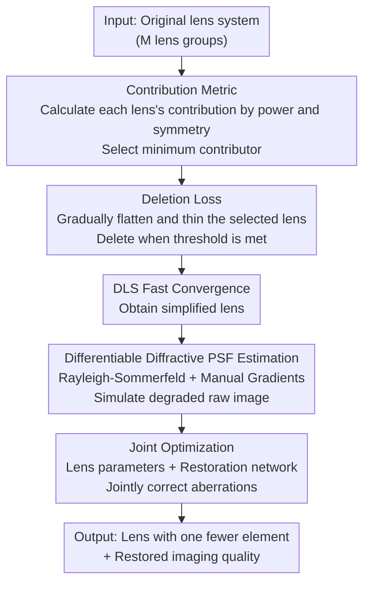

# Lens Component Deletion based on Differentiable Ray Tracing

**Conference**: CVPR 2026  
**Paper**: [CVF Open Access](https://openaccess.thecvf.com/content/CVPR2026/html/Zhang_Lens_Component_Deletion_based_on_Differentiable_Ray_Tracing_CVPR_2026_paper.html)  
**Code**: https://github.com/WenguanZhang/HappyLens (Project Page)  
**Area**: Computational Imaging / Differentiable Ray Tracing / Joint Optical Design  
**Keywords**: Lens deletion, Differentiable ray tracing, Diffractive PSF, Joint optimization, Aberration correction

## TL;DR
To meet the miniaturization and cost-reduction needs of micro-optical lenses, an "automated lens deletion" pipeline is proposed. It uses a contribution metric to automatically identify the least significant lens in a system, applies a deletion loss to gradually flatten and thin it until safe removal, and employs a differentiable PSF estimation based on Rayleigh-Sommerfeld diffraction theory. This allows for joint optimization of the simplified lens and a post-processing restoration network, maintaining imaging quality comparable to the original system even after removing a lens component.

## Background & Motivation
**Background**: Optical lens systems in electric vehicles, smartphones, and portable cameras increasingly pursue compactness and low cost. Traditionally, designing lenses with fewer elements relies on experienced optical engineers repeatedly performing manual adjustments in commercial software (e.g., Zemax), which often takes days or weeks. Recently, differentiable ray tracing has emerged, allowing joint optimization of lenses and downstream networks, showing potential in tasks like diffractive optical elements, full-spectrum imaging, extended depth of field, HDR, and depth estimation.

**Limitations of Prior Work**: Existing joint design pipelines face two main issues. First, simplified designs rely heavily on expert experience—replacing multiple spherical lenses with aspherical or freeform surfaces can correct aberrations but significantly increases manufacturing difficulty and cost. Methods using MTF or Seidel aberration coefficients as constraints still require extensive manual parameter tuning. Second, many "differentiable image degradation simulation" methods only model **geometric degradation** (geometric PSF) and ignore diffraction effects. For micro-imaging systems, geometric PSF deviates greatly from real degradation, leading to distortion when joint optimization is deployed.

**Key Challenge**: "Automatically deleting a lens component" is inherently a discrete and non-differentiable action. Simply removing a group of lenses often causes the system to collapse (failure to image or optimize). To compensate for the aberrations after deletion, a differentiable PSF model that is both **sufficiently accurate and memory-efficient** for micro-systems is required; otherwise, joint optimization cannot be executed.

**Goal**: To transform the process of "which lens to delete + how to delete safely + how to restore after deletion" into an automated, differentiable, and end-to-end pipeline.

**Key Insight**: Instead of a "hard cut," lens deletion should involve quantifying the contribution of each lens physically to select the least impactful one, then using a loss function to **progressively flatten and thin** it until it can be removed without pain. Simultaneously, geometric PSF is replaced with diffractive PSF, and gradients are manually derived to bypass the memory explosion of automatic differentiation.

**Core Idea**: Replace manual expert simplification with "contribution-based selection + progressive flattening via deletion loss + joint restoration using differentiable diffractive PSF," turning the discrete deletion operation into a stable and optimizable continuous process.

## Method

### Overall Architecture
The pipeline consists of two main modules. **Module 1 (Lens Deletion and Optimization)**: In each optimization round, a contribution metric calculates each lens's contribution to the system to select the target for deletion. To prevent system collapse from direct removal, a deletion loss is introduced to force the selected lens to gradually "flatten and thin" until it meets a threshold for complete removal. Subsequently, Damped Least Squares (DLS, a Zemax standard) is used for rapid convergence. **Module 2 (Joint Optimization for Restoration)**: A differentiable PSF estimation based on the Rayleigh-Sommerfeld diffraction model simulates the degraded raw image of the deleted system (space-variant convolution + remosaicing). A restoration network (DeepSN) performs aberration correction within an ISP post-processing chain, where lens parameters and network parameters are trained jointly.

### Key Designs

**1. Contribution Metric: Automated physical judgment of which lens to delete**

To "automatically select a lens," an objective standard is needed to measure each lens's importance; otherwise, engineers must rely on intuition. Inspired by existing work, the authors characterize each refractive surface through **optical power contribution** and **symmetry**. For a lens with $N$ surfaces, the power contribution of the $i$-th surface at incident angle $\theta_i$ and wavelength $\lambda$ is $p_i(\lambda,\theta_i)=\left(\frac{n_{i+1}(\lambda)}{l_{i+1}}-\frac{n_i(\lambda)}{l_i}\right)\cdot\sin\phi_i$, and its symmetry is $a_i(\lambda,\theta_i)=\left(\frac{u_{i+1}}{n_{i+1}(\lambda)}-\frac{u_i}{n_i(\lambda)}\right)\cdot\sin\theta_i\cdot n_i(\lambda)$. Leveraging GPUs, the authors include **all sampled rays** (rather than just chief and marginal rays) for statistics. The total power contribution $P_i$ and symmetry $A_i$ are summed for all rays, and the lens contribution is defined as: $C=\left(\sum_{i=1}^{N}P_i\right)\cdot\left(\sum_{i=1}^{N}A_i\right)$. Finally, $C_j$ for all lenses are normalized to sum to 1, and the lens with the smallest contribution is deleted. Compared to traditional methods using few rays, this full-ray statistic makes the assessment closer to real imaging, reducing the risk of deleting the wrong lens.

**2. Deletion Loss: Turning "hard deletion" into "progressive flattening"**

Directly removing a lens often leads to total system failure. The deletion loss approach avoids immediate removal by forcing the lens to **slowly flatten and thin**, transitioning smoothly to a removable state. The $i$-th surface of the lens is represented by a quadric $z_i(x,y)=\frac{(x^2+y^2)c_i}{1+\sqrt{1-(1+\kappa_i)(x^2+y^2)c_i^2}}$ ($c_i$ is curvature radius, $\kappa_i$ is conic constant). The deletion loss includes two terms: a flattening loss $L_{\text{flat}}=\sum_{i=1}^{N}\max|z_i(x,y)|$ to make the surface planar, and a residual loss $L_{\text{res}}=\sum_{i=1}^{N-1}\max|-z_i(x,y)+t_i+z_{i+1}(x,y)|$ to force overall thinning ($t_i$ is thickness). Deletion occurs when $L_{\text{flat}}<\Omega$ or $L_{\text{res}}<\Omega$ (threshold $\Omega=\alpha\cdot\max(D_1,\dots,D_N)$, where $D_i$ is clear aperture, empirical $\alpha=0.02$). The deletion loss weight $\omega_{\text{del}}=100$ and optical loss weight $\omega_{\text{opt}}=1$. Ablation shows that removing a lens directly without this loss causes the system to get stuck in poor local minima (Avg Spot RMS of Double Gauss worsened from 1.2µm to 42.5µm).

**3. Differentiable Rayleigh-Sommerfeld Diffractive PSF: Accurate and memory-efficient modeling**

Diffraction effects cannot be ignored in micro-lenses; pure geometric PSF is too inaccurate. The authors adopt Rayleigh-Sommerfeld diffraction theory: rays are traced forward to the image plane, then backward to the exit pupil. The complex amplitude at image point $(x,y)$ is $E(x,y)=\iint_\Sigma \frac{jk r^{-1}}{-2\pi r}E(x_0,y_0)e^{jkr}\cos(\vec n,\vec r)\,dx_0dy_0$, and the PSF is $\mathrm{PSF}(x,y)=E^*(x,y)E(x,y)$. The key engineering insight is that automatic differentiation (AD) causes memory explosion by storing all intermediate variables. The authors **manually derived analytical gradients for the PSF with respect to coordinates and optical paths** (e.g., $\frac{\partial\mathrm{PSF}}{\partial x}=\frac{\partial\mathrm{PSF}}{\partial r}\frac{x-x_0}{r}$), calculating gradients directly from forward tracing data. This significantly reduces VRAM usage without increasing computation time, allowing for more PSFs and sufficient memory for network training.

**4. Joint Optimization: Training lens and restoration network together**

Deleting a lens introduces additional aberrations. If the lens is fixed and only the restoration network is trained (separate design), the restoration quality is limited. This work jointly trains lens parameters and the restoration network (DeepSN) using a total loss: $L_{\text{total}}=L_{\text{img}}+\omega\cdot L_{\text{opt}}$. $L_{\text{img}}$ follows DeepSN's image loss, while $L_{\text{opt}}=L_{\text{spot}}+L_{\text{dist}}+L_{\text{efl}}+L_{\text{fno}}+L_{\text{ttl}}+L_{\text{bfl}}+L_{\text{gla\,min}}+L_{\text{gla\,max}}+L_{\text{air\,min}}+L_{\text{surf}}$ constrains both imaging metrics (RMS spot, distortion) and physical constraints (focal length, F-number, total length, back focal length, glass/air thickness, surface slope). Ablation shows that without $L_{\text{opt}}$, parameters deviate significantly, and PSNR for USP4488788 drops from 40.79 to 38.22. Joint training allows the lens to "actively deform towards better restorability."

## Key Experimental Results

### Experimental Settings
Validated on two systems: short focus patent USP4488788 (5 elements, EFL 6.84mm, FOV 62°, F/3.35) and classic Double Gauss (6 elements in 4 groups, EFL 22.5mm, FOV 20°, F/3.95). Data used FiveK dataset with 3840×2160 raw images for training and 4800×2700 for testing. NVIDIA RTX 4090, Adam optimizer, learning rate 1e-3 for both lens and network, patch 256×256, batch 16.

### Main Results: Post-deletion imaging quality (FiveK)

| Lens | Method | Restored PSNR↑/SSIM↑/LPIPS↓ | EFFL | F# | Avg Spot RMS |
|------|------|------|------|------|------|
| Double Gauss | Original | -/-/- | 22.50mm | 3.95 | 1.0µm |
| Double Gauss | Del. Separate | 40.90/0.9785/0.0169 | 22.50mm | 3.95 | 1.2µm |
| Double Gauss | **Del. Joint (Ours)** | **41.26/0.9797/0.0166** | 22.50mm | 3.94 | 1.2µm |
| USP4488788 | Original | -/-/- | 6.83mm | 3.20 | 3.5µm |
| USP4488788 | Del. Separate | 40.65/0.9745/0.0345 | 6.83mm | 3.20 | 2.7µm |
| USP4488788 | **Del. Joint (Ours)** | **40.79/0.9759/0.0287** | 6.83mm | 3.20 | 2.5µm |

After deleting one lens, joint design restoration quality exceeds separate design and is comparable to or better than the original system—specifically, Avg Spot RMS for USP4488788 decreased from 3.5µm to 2.5µm.

### Ablation Study

| Configuration | Key Result | Description |
|------|---------|------|
| Forced Del. C1 / C2 | System Failure | Deleting the wrong lens causes collapse |
| Forced Del. C5 | ✓ but Spot RMS 9.8µm | Deleting sub-optimal lens results in poor spot |
| w/ Contribution Metric (Del. C4) | ✓ Spot RMS 2.7µm | Automatically selecting the right lens is best |
| Double Gauss w/ Deletion Loss+DLS | ✓ Spot RMS 1.2µm | Progressive flattening ensures stability |
| Double Gauss w/o Deletion Loss+DLS | Stuck in local minima, Spot RMS 42.5µm | Direct deletion leads to optimization failure |
| USP4488788 w/o $L_{\text{opt}}$ | Restored 38.22/0.9598, EFFL to 7.45mm | Focal length/F# out of control |
| USP4488788 w/ $L_{\text{opt}}$ | Restored 40.79/0.9759, EFFL 6.83mm | Physical constraints preserve the system |

### Key Findings
- **Lens selection is critical**: Forcing deletion of C1/C2 causes total failure. While C5 removal works, its spot size is poor (9.8µm). The contribution metric correctly identifies C4, yielding the best spot size (2.7µm).
- **Deletion loss is vital for optimization stability**: Removing it causes Double Gauss's Spot RMS to worsen 35x (1.2µm→42.5µm).
- **Joint > Separate**: Joint optimization encourages the lens to adapt to the restoration network, outperforming fixed-lens designs.
- **Diffractive PSF is necessary**: Geometric PSF deviates significantly in micro-systems; the proposed RS-diffractive PSF closely matches Zemax in color fidelity and blur shape.

## Highlights & Insights
- **Converting discrete deletion to continuous optimization**: The deletion loss uses flattening and thinning terms to smooth "lens deletion" into a continuous process, which could be extended to other architecture search tasks.
- **Bypassing AD memory wall with manual gradients**: Deriving analytical gradients for diffractive PSF instead of relying on AD drastically saves memory while maintaining speed—a practical engineering trick for physical simulations.
- **Full-ray contribution assessment**: Utilizing GPUs to include all sampled rays for contribution statistics is more accurate than traditional chief/marginal ray methods.
- **Physical constraints in loss**: Embedding focal length, F-number, and total length as differentiable constraints ensures the optimized lens is manufacturable.

## Limitations & Future Work
- Validated only on two classic lenses (USP4488788, Double Gauss) and demonstrated only "single lens deletion." Scalability to multi-lens deletion or complex freeform systems is not fully verified.
- Specific contribution values are in the supplementary material; generalizability across different lens architectures needs more proof.
- Dependency on Zemax's DLS for convergence means the pipeline is not entirely independent of commercial software.
- Restoration ceiling is partially limited by the DeepSN network capacity.

## Related Work & Insights
- **vs. Geometric PSF Joint Design (e.g., DeepLens)**: They only model geometric degradation, which is inaccurate for micro-systems. This work uses RS-diffractive PSF with manual gradients for accuracy and memory efficiency.
- **vs. Traditional Expert Simplification**: Manual tuning and aspherical replacement are costly. This work uses automated selection and progressive deletion to reduce reliance on expertise.
- **vs. Separate Design**: Joint optimization consistently yields higher restoration quality.

## Rating
- Novelty: ⭐⭐⭐⭐ Progressive deletion loss and manual diffractive gradients are meaningful engineering innovations.
- Experimental Thoroughness: ⭐⭐⭐ Good ablation on two lenses, but variety of lenses and deletion counts are limited.
- Writing Quality: ⭐⭐⭐⭐ Formulas and pipelines are clear and well-documented.
- Value: ⭐⭐⭐⭐ High practical value for miniaturization and cost reduction in mobile and automotive optics.

<!-- RELATED:START -->

## Related Papers

- [\[CVPR 2026\] Geometric-Photometric Event-based 3D Gaussian Ray Tracing](geometric-photometric_event-based_3d_gaussian_ray_tracing.md)
- [\[CVPR 2026\] Stochastic Ray Tracing for the Reconstruction of 3D Gaussian Splatting](stochastic_ray_tracing_for_the_reconstruction_of_3d_gaussian_splatting.md)
- [\[ICCV 2025\] Radiant Foam: Real-Time Differentiable Ray Tracing](../../ICCV2025/3d_vision/radiant_foam_real-time_differentiable_ray_tracing.md)
- [\[CVPR 2026\] MeshSplatting: Differentiable Rendering with Opaque Meshes](meshsplatting_differentiable_rendering_with_opaque_meshes.md)
- [\[CVPR 2026\] D-Prism: Differentiable Primitives for Structured Dynamic Modeling](d-prism_differentiable_primitives_for_structured_dynamic_modeling.md)

<!-- RELATED:END -->
