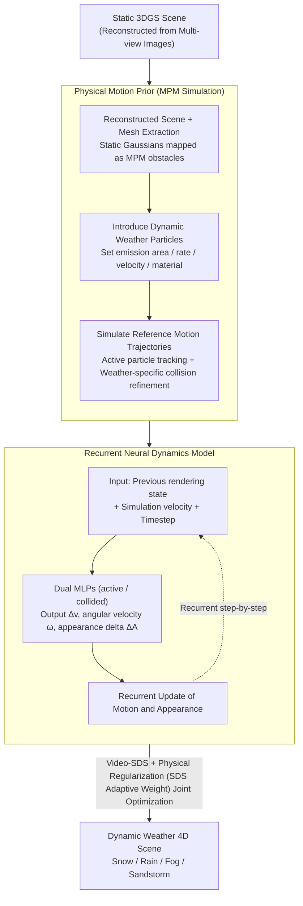

# Let it Snow! Animating 3D Gaussian Scenes with Dynamic Weather Effects via Physics-Guided Score Distillation

**Conference**: CVPR2026  
**arXiv**: [2504.05296](https://arxiv.org/abs/2504.05296)  
**Code**: [Project Page](https://galfiebelman.github.io/let-it-snow/)  
**Area**: 3D Vision  
**Keywords**: 3D Gaussian Splatting, Dynamic scene editing, Weather effects, Physics simulation, Score Distillation Sampling, MPM

## TL;DR

Proposes the Physics-Guided Score Distillation framework, which utilizes Material Point Method (MPM) simulations as motion priors to guide Video-SDS optimization. This approach generates dynamic weather effects (snow, rain, fog, sandstorms) with physically plausible motion and realistic appearance within static 3DGS scenes.

## Background & Motivation

**High Demand for Dynamic Scene Editing**: While 3D Gaussian Splatting (3DGS) efficiently reconstructs static scenes, adding temporal dynamic effects like weather remains a high-threshold manual task.

**Static Editing Methods Lack Temporal Evolution**: Methods such as ClimateNeRF and GaussCtrl only perform static appearance modifications and cannot model continuous particle emission and accumulation processes.

**Physics Simulators Lack Realistic Appearance**: Physics-based methods like PhysGaussian and PAC-NeRF provide plausible motion but fail to synthesize realistic appearances for newly introduced dynamic elements.

**Uncontrollable Motion in Data-Driven 4D Generation**: Methods like DreamGaussian4D and Animate124 rely on diffusion models for motion generation, resulting in incoherent motion in complex multi-particle scenes requiring continuous emission.

**Key Challenge between Motion and Appearance**: Physics simulations provide strong but unrealistic motion priors, while Video-SDS generates realistic appearances but cannot independently learn complex motions—the two must be unified.

**Limitations of Prior Work in 4D Editing**: Existing methods typically operate on a fixed set of Gaussians and do not support the continuous emission, accumulation, and removal mechanisms required for weather effects.

## Method

### Overall Architecture

The core objective is to add dynamic weather effects (snow, rain, fog, sandstorms) to reconstructed static 3DGS scenes, necessitating both physically plausible motion and realistic appearance. The challenge lies in the fact that physics simulations provide rational motion without realism, while Video-SDS generates realistic appearances but fails to learn complex multi-particle motion.

This work adopts a two-stage approach: first, it calculates reference motion trajectories for dynamic particles using Material Point Method (MPM) simulation as a prior; subsequently, it trains a recurrent neural dynamics model to jointly optimize motion and appearance under the "soft constraint" of this prior via Physics-Guided Score Distillation.

### Key Designs

**1. Physical Motion Prior: Providing Weather Particles with Physically Plausible Trajectories**

Since Video-SDS alone cannot learn continuous multi-particle motions (e.g., where particles are emitted, how they fall and accumulate), physics simulation is used to establish a motion skeleton. Specifically, 3DGS is reconstructed for the static scene and a mesh is extracted to map static Gaussians as MPM particles (obstacles). Dynamic particles are then introduced (with defined emission regions, rates, initial velocities, and material properties) to simulate trajectories via MPM. Active particle tracking is designed to remove particles that become stationary or exit boundaries to support large-scale simulations. For collisions where MPM coarse grids are insufficient, weather-specific refinements are used: snow is projected onto surfaces with interpolation of nearby Gaussians for natural accumulation; rain uses a 3D moisture grid to track water with Gaussian smoothing and temporal decay; sand moves along normals with anisotropic scaling.

**2. Recurrent Neural Dynamics Model: Joint Refinement of Motion and Appearance atop Physics Priors**

Physical trajectories solve the issue of motion plausibility, but newly introduced particles lack realistic appearance, and a bridge is needed between simulation trajectories and the frames expected by diffusion models. The model takes the rendering state at the previous timestep (position, rotation, appearance), physical simulation velocity, and timestep as input. It utilizes two MLPs—one for "active" and one for "collided" states—using Fourier features for position/velocity and sinusoidal encoding for time. The model outputs velocity correction $\Delta\mathbf{v}$, angular velocity $\boldsymbol{\omega}$, and appearance increment $\Delta\mathcal{A}$. Motion is updated recurrently via $\mathbf{v}_g(t)=\mathbf{v}_g^{\text{init}}(t)+\Delta\mathbf{v}_g$ and $\mathbf{x}_g(t)=\mathbf{x}_g(t{-}1)+\mathbf{v}_g(t)$, while appearance parameters are initialized by an LLM based on weather text descriptions. In this setup, the physics prior serves as a "soft constraint" that can be fine-tuned by the network, maintaining motion plausibility while allowing Video-SDS to drive the appearance toward realism.

### Loss & Training

The total loss is:

$$\mathcal{L}_{\text{total}} = \mathcal{L}_{\text{Video-SDS}} + \lambda_{\text{xyz}}\mathcal{L}_{\text{xyz}} + \lambda_{\text{vel}}\mathcal{L}_{\text{vel}} + \lambda_{\text{rot}}\mathcal{L}_{\text{rot}} + \lambda_{\text{app}}\mathcal{L}_{\text{app}}$$

The Video-SDS loss provides realistic supervision via a text-to-video diffusion model; $\mathcal{L}_{\text{xyz}}$ and $\mathcal{L}_{\text{vel}}$ pull learned trajectories and velocities toward simulation values using L2 loss; $\mathcal{L}_{\text{rot}}$ prevents rotation drift using quaternionic angular distance; $\mathcal{L}_{\text{app}}$ penalizes excessive appearance increments to suppress recurrent accumulation errors. A key mechanism is the SDS Adaptive Weight: all regularization weights are dynamically scaled by $|\mathcal{L}_{\text{Video-SDS}}|$. This strengthens physical guidance when the diffusion model is uncertain and relaxes constraints when it is confident, eliminating manual parameter tuning.

## Main Results

### Experimental Setup

- **Datasets**: MipNeRF 360 (Garden, Bicycle, Stump) + Tanks and Temples (Playground, Truck), 5 scenes total.
- **Weather Effects**: Snow, Rain, Fog, Sandstorm + Creative text variants (purple snow, glowing yellow sand, magic particles).
- **Evaluation Metrics**: CLIP_Sim, CLIP_Dir, VQAScore, ViCLIP-T, VE-Bench.

### Comparison with Baselines (Table 1)

| Method | CLIP_Sim↑ | CLIP_Dir↑ | VQAScore↑ | ViCLIP-T↑ | VE-Bench↑ |
|------|-----------|-----------|-----------|-----------|-----------|
| ClimateNeRF (F+S) | 0.23 | 0.07 | 0.87 | 0.15 | 0.28 |
| GaussCtrl (F+S) | 0.25 | 0.08 | 0.71 | 0.16 | 0.24 |
| **Ours (F+S)** | **0.29** | **0.12** | **0.92** | **0.20** | **0.45** |
| GaussCtrl (All) | 0.24 | 0.07 | 0.64 | 0.15 | 0.21 |
| **Ours (All)** | **0.28** | **0.11** | **0.89** | **0.19** | **0.41** |

Ours outperforms static editing methods across all image and video metrics, with a particularly significant Gain in VE-Bench (+61%).

### Ablation Study (Table 2)

| Variant | CLIP_Sim | CLIP_Dir | VQAScore | ViCLIP-T | VE-Bench |
|------|----------|----------|----------|----------|----------|
| w/o Collision Handling | 0.24 | 0.10 | 0.83 | 0.16 | 0.34 |
| w/o Appearance Opt. | 0.25 | 0.10 | 0.82 | 0.16 | 0.37 |
| w/o Motion Simulation | 0.18 | 0.03 | 0.35 | 0.08 | 0.13 |
| w/o Physics Guidance | 0.26 | 0.10 | 0.85 | 0.17 | 0.37 |
| **Full Method** | **0.28** | **0.11** | **0.89** | **0.19** | **0.41** |

### Key Findings

- **Removing Motion Simulation (w/o Motion) causes the worst degradation**: Video-SDS alone cannot learn physical motion for continuous multi-particle emission, with VQAScore dropping from 0.89 to 0.35.
- **Physics Guidance is critical for joint optimization**: Fixing physical motion without joint optimization (w/o PG) hinders Video-SDS appearance optimization.
- **Collision Handling is indispensable**: Without it, particles hover above surfaces, preventing natural accumulation.
- **SDS Adaptive Weighting outperforms fixed weights**: Fixed weights are problematic—small weights lead to noise artifacts, while large weights over-constrain and hinder appearance refinement.
- Compared to the 4D editing baseline Instruct-4DGS, which lacks a physics prior, our model maintains much higher motion coherence (VQAScore 0.89 vs 0.57).

## Highlights & Insights

- **Elegant Core Insight**: Reconceptualizing physics simulation as a "soft-constrainable motion prior" rather than a hard constraint perfectly reconciles the conflict between physical plausibility and visual realism.
- **SDS Adaptive Weighting**: Dynamically adjusts physical constraint strength based on diffusion model uncertainty, avoiding tedious weight tuning.
- **General Weather Framework**: A single framework supports four distinct weather effects (snow/rain/fog/sandstorm) and responds to creative text prompts.
- **Thorough Ablation**: Provides comprehensive evidence by systematically ablating collision handling, motion/appearance optimization, physics guidance, adaptive weighting, and individual loss terms.

## Limitations & Future Work

- **Lack of Two-way Interaction**: Dynamic particles do not cause deformation or movement of static scene elements.
- **Static Gaussian Appearance Unchanged**: Static elements do not reflect environmental lighting or shadow changes brought by weather.
- **Trajectory Drift Threshold**: If the optimized trajectory deviates too far from the physics prior, the guided velocity signal becomes unreliable.
- **Dependency on MPM Quality**: The final result is directly influenced by the quality of the physical motion prior.
- **Computational Overhead**: The two-stage pipeline of MPM simulation and Video-SDS optimization is computationally heavy.

## Related Work & Insights

- **Static 3D Editing**: ClimateNeRF (ICCV'23) adds static weather without temporal dynamics; GaussCtrl (ECCV'24) performs text-guided Gaussian editing but is limited to appearance changes.
- **Physics-Driven Animation**: PhysGaussian (CVPR'24) uses MPM to drive existing scene elements but cannot synthesize appearances for new elements; RainyGS focuses solely on rain and cannot generalize to other weather.
- **4D Generation/Editing**: Gaussians2Life and Instruct-4DGS use Score Distillation for 4D editing but lack motion control in continuous multi-particle scenarios.
- **Position of Ours**: Fills the gap in "dynamic weather scene editing" by being the first to unify physics simulation priors and Video-SDS in a single optimization framework.

## Rating

- Novelty: ⭐⭐⭐⭐ — The unified framework of physics-guided SDS is innovative, and the adaptive weighting design is clever.
- Experimental Thoroughness: ⭐⭐⭐⭐⭐ — Extensive testing across 5 scenes × 4 weather types × multi-view, with detailed ablations.
- Writing Quality: ⭐⭐⭐⭐ — Clear structure, well-integrated charts, and well-articulated motivation.
- Value: ⭐⭐⭐⭐ — Opens a new direction for dynamic 3DGS editing, with high extensibility to other dynamic effects.

<!-- RELATED:START -->

## Related Papers

- [\[CVPR 2026\] GaussianFluent: Gaussian Simulation for Dynamic Scenes with Mixed Materials](gaussianfluent_gaussian_simulation_for_dynamic_scenes_with_mixed_materials.md)
- [\[CVPR 2026\] Cross-Instance Gaussian Splatting Registration via Geometry-Aware Feature-Guided Alignment](cross-instance_gaussian_splatting_registration_via_geometry-aware_feature-guided.md)
- [\[CVPR 2026\] Featurising Pixels from Dynamic 3D Scenes with Linear In-Context Learners](featurising_pixels_from_dynamic_3d_scenes_with_linear_in-context_learners.md)
- [\[CVPR 2026\] FastEventDGS: Deformable Gaussian Splatting for Fast Dynamic Scenes from a Single Event Camera](fasteventdgs_deformable_gaussian_splatting_for_fast_dynamic_scenes_from_a_single.md)
- [\[CVPR 2026\] Dynamic-Static Decomposition for Novel View Synthesis of Dynamic Scenes with Spiking Neurons](dynamic-static_decomposition_for_novel_view_synthesis_of_dynamic_scenes_with_spi.md)

<!-- RELATED:END -->
