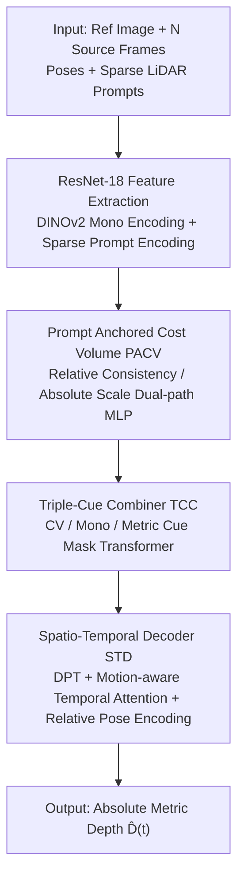

# LiDAR Prompted Spatio-Temporal Multi-View Stereo for Autonomous Driving

**Conference**: CVPR 2026  
**Paper**: [CVF Open Access](https://openaccess.thecvf.com/content/CVPR2026/html/Sun_LiDAR_Prompted_Spatio-Temporal_Multi-View_Stereo_for_Autonomous_Driving_CVPR_2026_paper.html)  
**Code**: https://github.com/Akina2001/DriveMVS.git  
**Area**: 3D Vision  
**Keywords**: Multi-view stereo, metric depth, LiDAR prompt, temporal consistency, autonomous driving

## TL;DR
DriveMVS injects sparse LiDAR as "geometric prompts" into Multi-View Stereo (MVS): serving both as hard constraints to anchor the absolute scale of the cost volume and as soft features fused via a Triple-Cue Combiner with monocular and geometric priors. A spatio-temporal decoder ensures cross-frame consistency, enabling the model to achieve metric accuracy, temporal stability, and generalization under zero-shot cross-domain settings (KITTI MAE 0.49 m, AbsRel 2.56%).

## Background & Motivation

**Background**: Closed-loop simulation and world modeling for autonomous driving rely on recovering precise **metric depth** from casually captured driving videos. As L4 fleets move toward "minimalist LiDAR" configurations (fewer beams) to reduce costs, building a robust metric depth pipeline using sparse LiDAR has become a critical necessity.

**Limitations of Prior Work**: Three mainstream approaches have inherent drawbacks: ① Monocular foundation models (Depth-Anything, MoGe-2) generalize well but suffer from **scale ambiguity** and temporal inconsistency; ② General MVS (MVSAnywhere) provides high geometric fidelity but estimates frames **independently**, leading to temporal flickering and degradation in low-parallax/static/textureless scenes where epipolar cues are unreliable; ③ Feed-forward multi-view models (VGGT, MapAnything) offer fast inference but **poor absolute depth accuracy**. Even with multi-modal fusion using sparse LiDAR as anchors, the prompts themselves are sparse, intermittent, and unevenly distributed; systems relying only on current-frame cues fail when input is missing.

**Key Challenge**: Metric accuracy, multi-view/temporal consistency, and cross-domain generalization are mutually competing objectives—forcing multi-view geometry causes scale collapse in weak-parallax scenes, while forcing monocular priors loses absolute scale, and both lack temporal constraints.

**Goal**: To simultaneously achieve four objectives under minimalist LiDAR configurations: metric-level accuracy (even when multi-view cues fail), temporal consistency (flicker-free), robustness to intermittent or slightly misaligned prompts, and zero-shot cross-domain generalization.

**Key Insight**: Two observations: (1) Sparse but metrically accurate LiDAR can act as geometric prompts to anchor depth to an absolute scale; (2) Deep fusion of heterogeneous cues is the key to resolving ambiguity, supplemented by a spatio-temporal decoder for cross-frame consistency.

**Core Idea**: Embed LiDAR prompts into MVS in two ways—anchoring the cost volume as hard constraints and fusing as soft features via triple-cue integration—and propagate scale using a motion-aware spatio-temporal decoder to unify metric accuracy, temporal consistency, and generalization.

## Method

### Overall Architecture
DriveMVS operates on a sequence of length $T$. At each timestep $t$, it takes a reference image $I_r(t)$, $N$ source images, corresponding intrinsics/extrinsics, and sparse metric prompts $P(t)$ from various perspectives. The model $M_\theta$ outputs a per-pixel logit map $x(t)$, which is converted into absolute metric depth $\hat D(t)$ via the cost volume. The pipeline includes: ResNet-18 for extracting features from reference and source images; the **Prompt Anchored Cost Volume (PACV)**, which explicitly splits sparse prompts into "relative consistency" and "absolute scale anchoring" paths via MLPs; the **Triple-Cue Combiner (TCC)**, which uses a Mask Transformer to jointly reason over three heterogeneous features: CV cues, monocular cues (DINOv2/Depth-Anything-V2), and metric cues (sparse prompt encoding); and finally, the **Spatio-Temporal Decoder (STD)**, which builds on DPT upsampling with embedded motion-aware temporal attention to output continuous and stable video depth.

### Key Designs

**1. Prompt Anchored Cost Volume (PACV): Decoupling "Relative Matching" and "Absolute Scale"**

To address the issue where epipolar cues are blurred in low-parallax or textureless regions leading to scale collapse, PACV explicitly decouples two fundamentally different tasks. The baseline cost volume processes metadata (feature dot products $F_r \cdot F^i_s$, ray directions, relative poses, valid masks) through an MLP for $D=64$ log-uniformly sampled depth hypothesis planes $k$, computing scores via cross-view softmax—this primarily learns **relative consistency**. PACV adds an additional path: using the same metadata to derive a relative consistency cost $CV_{rel}(k,j)$ while simultaneously building an **absolute metric cost** $CV_{abs}(k,j)$ by taking the absolute difference between the current depth hypothesis $d_k$ and $N+1$ downsampled sparse prompts (using a mask value of $-1$ for invalid pixels). These are concatenated into an anchored feature $\phi(k,j)=\mathrm{Concat}(CV_{rel}, CV_{abs})$. An MLP then solves for weights and scores $\omega(k,j), s(k,j)$, aggregated as $CV_{anchor}(k)=\sum_j \mathrm{Softmax}(\omega)\odot s$. By forcing the network to reason over both consistency and absolute metric cues from prompts before scoring, the system avoids cost volume collapse in unreliable regions.

**2. Triple-Cue Combiner (TCC): Structured Fusion of Heterogeneous Cues**

A cost volume alone is geometrically anchored but **structure-agnostic**. TCC is an $L=12$ layer Mask Transformer that jointly reasons over three complementary cues: CV cues $F_{cv}$ (from the cost volume patchifier, containing depth hypotheses and geometric anchors without structure), monocular cues $F_{mono}$ (DINOv2 initialized with Depth-Anything-V2 weights, providing global context and relative depth priors), and metric cues $F_{metric}$ (high-fidelity absolute constraints from a sparse-aware prompt encoder). Each block follows a "Mask Transformer → Cross-Cue Merging → Mask Transformer" sequence. The Cross-Cue Merging step performs the core fusion: geometrically anchored $F'_{cv}$ and monocular $F'_{mono}$ (with strong relative priors) are element-wise added as $Z = F'_{cv} \oplus F'_{mono}$. Then, $Z$ acts as the Query and $F'_{metric}$ as Key/Value for cross-attention: $\hat F_{cv} = Z + \mathrm{CA}(Q=Z, K=V=F'_{metric})$. Critically, this interaction is restricted to valid prompt positions within a spatio-temporal neighborhood, ensuring local fidelity and temporal consistency.

**3. Spatio-Temporal Decoder (STD): Motion-Aware Temporal Attention**

Independent per-frame decoding causes flickering. STD is based on DPT upsampling to full resolution, with **motion-aware temporal self-attention** embedded in the upsampling blocks to jointly process fused tokens and adjacent reference frames. To capture cross-frame pose changes, a **relative pose encoder** embeds relative camera poses into the feature stream before temporal attention. Absolute positional embeddings are used to capture inter-frame relationships. Absolute metric depth is recovered by log-space rescaling of the sigmoid output within the cost volume boundaries $[d_{min}, d_{max}]$:
$$\hat D(t) = \exp(\log d_{min} + \log(d_{max}/d_{min})\cdot \sigma(x(t)))$$
This allows the absolute scale to propagate smoothly along the video.

### Loss & Training
The model uses supervision from [28]: L1 loss on log-depth $L_{depth}$, gradient loss $L_{grad}$, and normal loss $L_{normals}$. Temporal stability is enforced via a temporal loss $L_{temporal}$ from [8], which penalizes inconsistent depth changes between adjacent frames: $L = \alpha(L_{depth}+L_{grad}+L_{normals}) + \beta L_{temporal}$, with $\alpha=\beta=1$. Training is performed on four synthetic MVS datasets (TartanAir, TartanGround, VKITTI2, MVS-Synth). Sparse prompts are synthesized by back-projecting ground truth depth with added noise. During training, each prior modality is randomly dropped (p=0.5) to encourage robustness to partial inputs.

## Key Experimental Results

### Main Results
Zero-shot evaluation was conducted on three **unseen** datasets (KITTI/DDAD using 16-beam and Waymo using 8-beam LiDAR prompts). Metrics: MAE (meters), AbsRel (%), and $\tau < 1.25$ (%).

| Dataset | Metric | DriveMVS (Ours) | Second Best (w/ Prompt) | General MVS (No Prompt) |
| :--- | :--- | :--- | :--- | :--- |
| KITTI | MAE / AbsRel / τ | **0.49 / 2.56 / 98.78** | PriorDA 0.61 / 2.98 / 98.57 | MVSAnywhere 1.78 / 10.48 / 90.91 |
| DDAD | MAE / AbsRel / τ | **2.64 / 5.45 / 95.25** | PriorDA 2.79 / 5.82 / 94.50 | MVSAnywhere 4.18 / 10.16 / 91.71 |
| Waymo | MAE / AbsRel / τ | **1.24 / 4.46 / 95.95** | Marigold-DC 1.94 / 8.04 / 91.98 | MVSAnywhere 3.30 / 11.43 / 89.80 |

The model achieved the top rank across all datasets, demonstrating significant advantages over feed-forward, monocular, and prompted monocular paradigms.

### Ablation Study
Ablation on KITTI for the three modules and two losses:

| Config | PACV | TCC | STD | $L_t$ | AbsRel↓ | τ↑ | TAE↓ |
| :--- | :---: | :---: | :---: | :---: | :---: | :---: | :---: |
| Baseline | | | | | 10.37 | 91.05 | 0.338 |
| Hybrid | ✓ | ✓ | | | 4.11 | 97.84 | 0.338 |
| Ours Full | ✓ | ✓ | ✓ | ✓ | **2.56** | **98.78** | **0.296** |

### Key Findings
- **PACV + TCC drive metric accuracy**: Introducing prompt-anchored cost volumes and triple-cue fusion reduced AbsRel from 10.37 to 4.11, proving that explicit absolute scale injection is the key to accuracy gains.
- **STD + Temporal Loss ensure smoothness**: The TAE (temporal alignment error) dropped from 0.338 to 0.296 primarily due to the spatio-temporal decoder.
- **Robustness to extreme scenes**: In rainy, low-light, or static scenarios, DriveMVS shows much less degradation compared to per-frame methods due to continuous scale anchoring and temporal constraints.

## Highlights & Insights
- **Dual-Embedding of LiDAR Prompts**: Using sparse prompts as both a hard constraint for anchoring (PACV) and a soft feature for attention (TCC) decouples absolute scale from relative geometry, solving the MVS scale collapse problem.
- **Prompt Dropout (p=0.5)**: Training with random modality dropout results in a unified model naturally robust to intermittent inputs, permitting flexible sensor configurations without retraining.
- **Synthetic-to-Real Pipeline**: Training on synthetic data with simulated noise and achieving zero-shot generalization indicates that explicit scale anchoring mitigates the sim-to-real gap.

## Limitations & Future Work
- **Reliance on Synthetic Data**: Sim-to-real gaps in LiDAR noise distributions and motion distortion have not been fully quantified.
- **Fixed Beam Configurations**: Performance under extremely sparse (e.g., 4-beam) or non-uniformly distributed prompts and tolerance for timestamp offsets between LiDAR and images require further validation.
- **Compute Overhead**: The temporal layers are limited to low-resolution stages to manage compute; the benefit of full-resolution temporal modeling remains unexplored.

## Related Work & Insights
- **vs. MVSAnywhere**: Both use monocular priors and MVS, but MVSAnywhere flickers and collapses under low parallax; DriveMVS reduces KITTI AbsRel from 10.48 to 2.56.
- **vs. PriorDA / PromptDA**: These use sparse depth for monocular prediction but lack multi-view geometric reasoning.
- **vs. VGGT / MapAnything**: These feed-forward models are fast but lack absolute metric accuracy; DriveMVS prioritizes reliability and consistent scale for autonomous driving.

## Rating
- Novelty: ⭐⭐⭐⭐ (Dual-embedding and decoupled cost volume are innovative in MVS)
- Experimental Thoroughness: ⭐⭐⭐⭐⭐ (Comprehensive zero-shot tests, temporal consistency, and wide range of comparisons)
- Writing Quality: ⭐⭐⭐⭐ (Clear motivation and structural decoupling)
- Value: ⭐⭐⭐⭐⭐ (Highly practical for autonomous driving simulation and perception with minimalist sensors)

<!-- RELATED:START -->

## Related Papers

- [\[CVPR 2026\] Ghosts in the Point Clouds: De-glaring LiDAR in the Transient Domain](ghosts_in_the_point_clouds_de-glaring_lidar_in_the_transient_domain.md)
- [\[CVPR 2026\] Intrinsic Image Fusion for Multi-View 3D Material Reconstruction](intrinsic_image_fusion_for_multi-view_3d_material_reconstruction.md)
- [\[CVPR 2026\] Changes in Real Time: Online Scene Change Detection with Multi-View Fusion](changes_in_real_time_online_scene_change_detection_with_multi-view_fusion.md)
- [\[CVPR 2026\] 3D-Aware Multi-Task Learning with Cross-View Correlations for Dense Scene Understanding](3d-aware_multi-task_learning_with_cross-view_correlations_for_dense_scene_unders.md)
- [\[CVPR 2026\] EcoSplat: Efficiency-controllable Feed-forward 3D Gaussian Splatting from Multi-view Images](ecosplat_efficiency-controllable_feed-forward_3d_gaussian_splatting_from_multi-v.md)

<!-- RELATED:END -->
