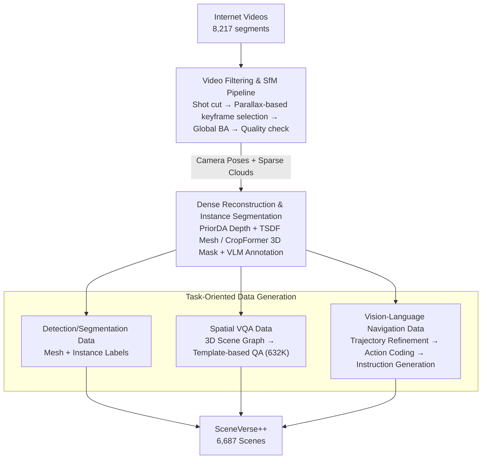

# Lifting Unlabeled Internet-level Data for 3D Scene Understanding

**Conference**: CVPR 2026  
**arXiv**: [2604.01907](https://arxiv.org/abs/2604.01907)  
**Code**: [Project Page](https://sv-pp.github.io/)  
**Area**: 3D Vision  
**Keywords**: 3D Scene Understanding, Internet Videos, Automatic Data Engine, Vision-Language Navigation, Spatial Reasoning

## TL;DR

This work presents SceneVerse++, an automated data engine that generates 3D scene understanding training data from 6,687 unlabeled internet videos. It demonstrates the feasibility of advancing 3D scene understanding using internet-level data across three tasks: 3D object detection (+20.6 F1@.25), spatial VQA (+14.9%), and vision-language navigation (+14% SR).

## Background & Motivation

3D scene understanding is a critical capability for humans and embodied AI, spanning from geometric perception (depth estimation, object detection) to semantic understanding (segmentation, visual grounding) and high-level reasoning (spatial QA, navigation). Success in this field heavily relies on large-scale annotated real-world 3D datasets.

**Key Challenge**: Unlike 2D images that are easily obtainable and annotatable from the web, 3D scene data acquisition and labeling are extremely expensive, requiring specialized hardware (RGB-D/LiDAR), 3D mesh reconstruction, and intensive human semantic annotation. Since ScanNet, the academic community has seen almost no order-of-magnitude leap in 3D data scale. However, the internet contains massive unlabeled video data that naturally captures the 3D world.

**Key Insight**: An automated data engine can be designed to transform unlabeled internet videos into training data for 3D scene understanding. Unlike previous approaches that simply chain sub-modules (reconstruction, segmentation, semantic labeling), this work systematically analyzes the bottlenecks of automated data generation and provides guidelines for scaling end-to-end models across diverse perception granularities. **Core Idea**: Through a carefully designed data engine, internet videos can become a viable path to bridge the 3D annotation scarcity gap and enhance the capabilities of end-to-end models.

## Method

### Overall Architecture

This work addresses the stagnation of 3D data scaling by automatically "lifting" massive unlabeled internet videos into training data for 3D scene understanding. The pipeline follows a three-step process: filtering usable segments from raw videos and computing camera poses and sparse point clouds via Structure-from-Motion (SfM); completing sparse geometry into dense meshes and assigning instance-level segmentation and semantic labels; and finally, transcribing 3D scenes into training samples for three downstream tasks: detection/segmentation, spatial VQA, and Vision-Language Navigation (VLN). From 8,217 initial videos, the engine identifies 6,687 usable scenes, each equipped with images, camera poses, dense reconstructions, instance segmentations, and high-level reasoning annotations.

### Key Designs

**1. Video Filtering and SfM Pipeline: Extracting Triangulable Geometry from Noisy Web Videos**

Internet videos contain significant content (outdoor, portraits, cuts) that is detrimental to 3D reconstruction. The pipeline uses TransNetV2 for shot detection, filtering out low-quality and non-indoor segments. A critical step is **selecting keyframes based on parallax rather than uniform time intervals**; large parallax ensures stable triangulation, whereas uniform sampling introduces redundant frames during static segments. After pose estimation and sparse reconstruction via Global BA, quality screening is performed using spatial coverage and re-projection error. To handle memory constraints in long videos, optimized pseudo-trajectory pixels are used, enabling full global optimization.

**2. Dense Reconstruction and Instance Segmentation Pipeline: Scaling via Quality-Speed Trade-offs**

Once sparse SfM results are obtained, they must be completed into usable 3D scenes. The method balances between high-quality but slow neural rendering and fast but memory-limited end-to-end reconstruction. The chosen path is a **compromise between metric depth and SfM geometry**: SfM sparse points are projected back to frames as depth priors; PriorDA predicts dense metric depth under these priors; and TSDF fusion generates water-tight meshes. For segmentation, CropFormer produces frame-wise masks, which are aggregated into 3D using cross-view consensus and spatial consistency. VLMs then generate text descriptions and semantic labels for each instance. This combination reduces per-scene cost to an average of 71s for reconstruction and 96s for segmentation.

**3. Task-Oriented Data Generation: Translating 3D Scenes into Task Formats**

Reconstructed scenes provide different supervision for downstream tasks. Detection and segmentation utilize meshes and instance labels directly. For spatial VQA, 3D scene graphs are constructed, and 632K QA pairs are generated using templates covering relative distance, orientation, and quantity. VLN is the most challenging: room-tour videos feature irregular human movement, while benchmarks like R2R require goal-oriented shortest paths and natural instructions. Thus, a three-stage VLN pipeline is used—preprocessing trajectories into start-to-finish segments, encoding geometric motion into discrete action sequences, and generating navigation instructions from these sequences.

### Loss & Training

- **3D Detection**: SpatialLM (based on MLLM) is pre-trained on SceneVerse++ and fine-tuned on ScanNet.
- **3D Segmentation**: Mask3D is pre-trained on SceneVerse++ and fine-tuned on ScanNet.
- **Spatial VQA**: Qwen2.5-VL-3B/7B is fine-tuned using LoRA on 202K generated samples.
- **VLN**: LLaVA-Video serves as the base model, pre-trained on SceneVerse++ before R2R fine-tuning.

## Key Experimental Results

### Main Results

| Dataset/Task | Metric | Ours (SceneVerse++) | Baseline | Gain |
| :--- | :--- | :--- | :--- | :--- |
| ScanNet 3D Detection | F1@.25 (PT+FT) | 58.6 | 38.0 (Original SpatialLM) | +20.6 |
| ScanNet 3D Detection | F1@.25 (Zero-shot) | 30.9 | 29.0 (SpatialLM) | +1.9 |
| ARKitScenes 3D Detection| F1@.25 (Zero-shot) | 35.8 | 35.1 (SpatialLM) | +0.7 |
| ScanNet 3D Segment. | AP25 (PT+FT) | 38.5 | 36.1 (From scratch) | +2.4 |
| VSI-Bench VQA (3B) | Avg Accuracy | 42.8 (SV++ Zero-shot) | 27.9 (Baseline) | +14.9 |
| VSI-Bench VQA (7B) | Avg Accuracy | 46.4 (SV++ Zero-shot) | 36.6 (Baseline) | +9.8 |
| R2R VLN | SR (PT+FT) | 0.228 | 0.088 (R2R only) | +0.14 |

### Ablation Study

| Configuration | Key Metric | Description |
| :--- | :--- | :--- |
| Full SceneVerse++ PT + R2R FT | SR 0.228 | Optimal strategy |
| Mixed Training (R2R + SV++) | SR 0.188 | PT then FT outperforms joint training |
| w/o Trajectory Refinement (TR) | SR 0.036→FT 0.177 | Raw trajectories are low quality; TR is critical |
| w/o Instruct. Enhancement (IE) | SR 0.022→FT 0.074 | Language diversity significantly impacts performance |
| SV++ Zero-shot VQA (ARKit) | 48.0 (3B) | Approaches supervised SN/SN++ performance (49.0) |

### Key Findings

- In 3D detection, real-world distribution priors from SceneVerse++ pre-training yield massive fine-tuning gains (F1@.25 from 38.0 to 58.6).
- In 3D segmentation, Mask3D is sensitive to domain shifts due to its reliance on specific graph-cut results; zero-shot performance is lower, though pre-training still benefits fine-tuning.
- Spatial VQA shows the greatest improvement in general spatial knowledge (relative distance/direction) but is weaker in domain-specific metrics (object count, room size), reflecting domain gaps.
- For VLN, trajectory refinement and instruction enhancement are critical; raw internet videos are not directly usable.
- A clear overfitting inflection point exists: initial training improves both in-domain and out-of-domain metrics, after which out-of-domain performance saturates or declines.

## Highlights & Insights

- Systematically analyzes the bottlenecks of the end-to-end pipeline from internet videos to 3D understanding, rather than just assembling sub-modules.
- Covers three representative tasks spanning low-level perception (detection/segmentation) to high-level reasoning (VQA/VLN).
- Significant data scale: 6,687 scenes exceeds ARKitScenes, averaging 49 objects and 21 categories per scene.
- Valuable discussion on model scalability: models relying on pre-computed segmentation (Mask3D) are harder to scale than those operating on raw modalities (SpatialLM).

## Limitations & Future Work

- Reliance on multiple sub-modules (SfM, depth, segmentation, VLM labels) leads to cascaded error propagation.
- Video filtering still requires minimal human labeling (<10s/scene) to ensure high data quality.
- The domain-specific bias in 3D segmentation highlights the need for more robust model architectures.
- Internet videos are primarily indoor room-tours; coverage of outdoor or dynamic scenes is limited.
- Sub-modules within the pipeline are often trained on small task-specific benchmarks, limiting overall generalization.

## Related Work & Insights

- **vs ScanNet/ScanNet++**: High-quality 3D datasets but limited in scale (ScanNet ~1.5k scenes); SceneVerse++ uses automation to reach 6.7k scenes, trading some quality for massive scale.
- **vs RoomTour3D/NaVILA**: Also uses internet videos but is limited to a single navigation task; SceneVerse++ supports detection, segmentation, VQA, and VLN.
- **vs Miao et al.**: Uses 2D single-view data + estimated depth to generate 3D labels, but is restricted to existing 2D datasets and lacks inter-frame consistency.
- **Insight**: Sub-module development should focus on "robust in-the-wild 3D understanding," measuring not just task-specific performance but also the contribution to automated data generation pipelines.

## Rating

- Novelty: ⭐⭐⭐⭐ Innovative systematic use of internet videos for comprehensive 3D understanding.
- Experimental Thoroughness: ⭐⭐⭐⭐⭐ Comprehensive evaluation across three tasks with detailed ablation and training dynamic analysis.
- Writing Quality: ⭐⭐⭐⭐ Clear structure with deep discussion and honest analysis of limitations.
- Value: ⭐⭐⭐⭐⭐ Provides a systematic roadmap and practical guide for data scaling in 3D scene understanding.

<!-- RELATED:START -->

## Related Papers

- [\[CVPR 2026\] Masking Matters: Unlocking the Spatial Reasoning Capabilities of LLMs for 3D Scene-Language Understanding](masking_matters_unlocking_the_spatial_reasoning_capabilities_of_llms_for_3d_scen.md)
- [\[CVPR 2026\] Fast SceneScript: Fast and Accurate Language-Based 3D Scene Understanding via Multi-Token Prediction](fast_scenescript_fast_and_accurate_language-based_3d_scene_understanding_via_mul.md)
- [\[CVPR 2026\] Zoo3D: Zero-Shot 3D Object Detection at Scene Level](zoo3d_zero-shot_3d_object_detection_at_scene_level.md)
- [\[CVPR 2026\] PointTPA: Dynamic Network Parameter Adaptation for 3D Scene Understanding](pointtpa_dynamic_network_parameter_adaptation_for_3d_scene_understanding.md)
- [\[CVPR 2026\] Consistent Instance Field for Dynamic Scene Understanding](consistent_instance_field_for_dynamic_scene_understanding.md)

<!-- RELATED:END -->
