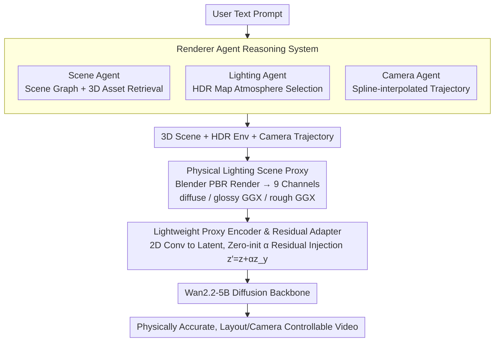

# Lighting-grounded Video Generation with Renderer-based Agent Reasoning

**Conference**: CVPR 2026  
**arXiv**: [2604.07966](https://arxiv.org/abs/2604.07966)  
**Code**: None  
**Area**: 3D Vision / Video Generation  
**Keywords**: Lighting controllable video generation, 3D scene proxy, physical rendering, diffusion model, scene agent

## TL;DR

LiVER proposes a lighting-driven video generation framework that utilizes a renderer agent to convert text descriptions into explicit 3D scene proxies (including layout, lighting, and camera trajectories). By employing physical rendering to generate diffuse/glossy/rough GGX scene proxies and injecting them into a video diffusion model, the approach achieves physically accurate lighting effects and precise scene control.

## Background & Motivation

While diffusion models have made significant progress in video generation, controllability remains a core bottleneck. Existing methods primarily improve visual quality through data-driven approaches but fall short in explicitly modeling scene factors such as layout, lighting, and camera trajectories. Although prior works have attempted to introduce 3D-aware conditions (e.g., CameraCtrl, MotionCtrl), these methods nearly entirely ignore physically accurate lighting modeling—rendering effects like shadows, reflections, and ambient occlusion often appear unrealistic on real-world materials like skin, metal, or glass.

**Key Challenge**: Prior work either focuses solely on geometry/motion control while ignoring lighting or entangles lighting with other attributes, making decoupled control impossible. **Key Insight**: Ours decouples scene lighting attributes into controllable 2D rendering channels (diffuse, glossy GGX, rough GGX) through a physical renderer, preserving the physical information of the 3D scene while injecting it into a video diffusion model as an image sequence.

**Core Idea**: **Use a renderer agent to automatically convert text into 3D scenes → Obtain lighting-aware scene proxies via PBR rendering → Inject physical lighting signals into a video diffusion model via a lightweight encoder and three-stage training**.

## Method

### Overall Architecture

LiVER aims to address the issues of uncontrollable and non-physical lighting in text-to-video generation: when users provide only a single sentence, models often must "hallucinate" shadows, reflections, and ambient occlusion, resulting in unrealistic effects on materials like skin, metal, and glass. The solution involves first translating the text into a real 3D scene, using a physical renderer to calculate accurate lighting, and then "painting" the calculated lighting into an image sequence to feed into the video diffusion model.

The pipeline operates as follows: First, a set of renderer agents parses the user's text to extract objects, spatial relationships, lighting atmosphere, and camera movement, forming a structured scene graph and retrieving 3D models from an asset library. Next, this 3D scene, along with HDR environment maps and camera trajectories, is passed to Blender for rendering, yielding a "scene proxy" $y \in \mathbb{R}^{F \times 9 \times H \times W}$ containing physical lighting information (three sets of RGB rendering channels stacked). Finally, a lightweight encoder compresses this proxy into the video latent space and injects it into the Wan2.2-5B diffusion backbone via a residual adapter to guide the generation of videos with physically correct lighting and controllable layouts/cameras. The key is that the 3D scene is only used to "calculate lighting," while the diffusion model receives 2D rendering channels, preserving physical meaning while bypassing the challenge of directly processing complex 3D representations.

### Key Designs

**1. Renderer Agent Reasoning System: Breaking Text into Renderable 3D Control Signals**

Casual users cannot manually create 3D scenes, yet video diffusion models require explicit geometry, lighting, and camera information for control. LiVER employs three agents to translate text into these signals: the Scene Agent parses object categories and spatial relationships to build a scene graph $\mathcal{G}=(V,E)$ and retrieves assets from Objaverse-XL; the Lighting Agent extracts lighting cues (e.g., "warm mood") to select matching HDR environment maps from Poly Haven; the Camera Agent translates motion semantics (e.g., "orbit," "dolly zoom") into keyframes and uses spline interpolation for smooth trajectories. This step is fully automated, lowering the barrier to entry while keeping intermediate products (scene graphs, maps, trajectories) explicitly readable and editable for professional refinements.

**2. Physically-grounded Scene Proxy: Flattening Lighting into 2D via PBR Channels**

Passing a full 3D scene to a video diffusion model is too complex, yet a standard render entangles lighting and materials. LiVER uses a PBR renderer to decompose lighting into three layers based on reflection frequency: the diffuse channel handles low-frequency ambient light and soft shadows, the rough GGX channel handles mid-frequency wide reflections, and the glossy GGX channel handles high-frequency specular highlights. These three layers form an RGB sequence stacked into a 9-channel image sequence:

$$y = [x^{\text{DIFF}},\, x^{\text{GGX1}},\, x^{\text{GGX2}}] = R(s^i, l^i, c^i)$$

where $R$ is the renderer, and $s^i / l^i / c^i$ represent the scene, lighting, and camera for the $i$-th frame, respectively. This retains the realistic lighting calculated by physical rendering while expressing it in an image format familiar to diffusion models.

**3. Lightweight Proxy Encoder and Residual Adapter: Gently Infusing Lighting Signals into the Backbone**

For lighting signals to take effect, they must align with the latent space of the video diffusion model without overwhelming the pre-trained backbone's generation capabilities. LiVER uses a 2D convolutional encoder to downsample the 9-channel scene proxy to features $z^y \in \mathbb{R}^{F \times C \times H' \times W'}$ with the same resolution as VAE latents, followed by residual injection via a zero-initialized learnable scalar $\alpha$:

$$z' = z + \alpha \cdot z^y$$

Zero-initialization ensures that at the start of training ($\alpha \approx 0$), the injection is negligible, allowing the model to maintain its original video quality. As training progresses, $\alpha$ grows, and the lighting proxy gradually takes control, avoiding the collapse caused by hard injection.

### A Complete Example

Consider the prompt: "a ceramic vase on a wooden table, warm afternoon light, camera slowly orbits around it." The Scene Agent identifies the "vase" and "table" and their "on" relationship, builds a scene graph, and retrieves 3D models. The Lighting Agent captures "warm afternoon" and selects a warm-toned HDR map. The Camera Agent identifies "orbit," creates a trajectory around the object, and smoothes it with splines. Blender renders the 3D scene frame-by-frame, outputting diffuse / rough GGX / glossy GGX layers—specular highlights of the ceramic glaze appear in the glossy channel, the wooden table's diffuse reflection in the diffuse channel, and the warm tone across all layers. These 9-channel sequences are encoded and injected into Wan2.2-5B via $z' = z + \alpha z^y$. In the final video, highlights on the vase move with the camera, and shadow directions align with the warm light—all calculated via physical rendering rather than hallucinated by the diffusion model.

### Loss & Training

A three-stage training scheme is adopted:
- **Stage 1 - Conditional Path Training**: Freeze the video diffusion backbone and train only the proxy encoder and adapter (10 epochs) to learn coarse control signals from the scene proxy.
- **Stage 2 - Joint LoRA Fine-tuning**: Unfreeze LoRA layers in the backbone and train jointly with the encoder/adapter (10 epochs) for fine-grained semantic alignment.
- **Stage 3 - Lighting Diversity Expansion**: Continue joint training with a 1:1 mix of real and synthetic data to enhance the model's generalization to diverse lighting phenomena.

The training loss follows the standard flow matching objective: $\mathcal{L} = \mathbb{E}_{z,\epsilon,t}[|u_\theta(z_t, y, c^{\text{txt}}, t) - v_t|^2]$.

## Key Experimental Results

### Main Results

| Method | FVD ↓ | FID ↓ | CLIP ↑ | ATE ↓ | LE ↓ | mIoU ↑ |
|------|-------|-------|--------|-------|------|--------|
| CameraCtrl | 48.03 | 98.29 | 28.75 | 2.15 | 0.06 | 0.68 |
| MotionCtrl | 63.13 | 97.21 | 26.67 | 3.42 | 0.07 | 0.66 |
| VideoFrom3D | 36.94 | 157.89 | 24.51 | 17.55 | 0.05 | 0.74 |
| **LiVER** | **32.56** | **129.56** | **30.97** | **2.48** | **0.04** | **0.87** |

In a 16-frame comparison against CameraCtrl/MotionCtrl, LiVER achieves FVD=32.45, FID=42.32, and CLIP=29.62, demonstrating comprehensive leadership.

### Ablation Study

| Config | Key Effect | Description |
|------|---------|------|
| W/O Synthetic Data | Uniform/Incorrect Lighting | Lacks dynamic lighting diversity, overfits to limited real-world lighting patterns. |
| W/O Staged Training | Almost Static Output | Difficult to simultaneously learn control signals and adapt to pre-trained model. |
| Full Model | Best Performance | Staged scheme ensures stable convergence and high-quality generation. |

### Key Findings

- Synthetic data is critical for lighting diversity: Training only on real data leads to flat, uniform lighting.
- Staged training is key to stable convergence: End-to-end training results in nearly static outputs.
- A user study (25 participants × 20 groups) shows LiVER outperforms competitors across Video Quality (83.4%), Scene Control (83.3%), Camera Control (72.1%), and Lighting Control (59.3%).

## Highlights & Insights

- Using PBR lighting decomposition (diffuse/glossy/rough) as conditional signals for video generation is an elegant design—retaining physical meaning while remaining compatible with 2D workflows.
- The renderer agent design allows the system to be both automated for general use and manually editable for professional film-grade requirements.
- The zero-initialization residual injection strategy is a mature engineering choice ensuring pre-trained model capabilities are not compromised.

## Limitations & Future Work

- Initial 3D reconstruction is coarse; geometric details and material effects rely heavily on the accuracy of text descriptions and are sensitive to prompts.
- The quality and coverage of 3D asset retrieval are constrained by existing asset libraries.
- Currently supports only HDR environment maps as global lighting, lacking fine-grained control for local light sources.
- Rendering scene proxies requires engines like Blender, increasing the complexity of the inference pipeline.

## Related Work & Insights

- **vs CameraCtrl**: CameraCtrl only controls camera motion; LiVER additionally achieves decoupled control of lighting and layout.
- **vs VideoFrom3D**: VideoFrom3D requires training a style LoRA for each test sample (~40 mins) and ignores lighting, whereas LiVER is end-to-end and lighting-aware.
- **vs Light-A-Video/LumiSculpt**: These methods focus on video relighting but entangle lighting with other physical properties; LiVER achieves decoupling via 3D scene proxies.
- **Insight**: Using intermediate PBR rendering results as conditional signals for generative models is a generalizable paradigm.

## Rating

- Novelty: ⭐⭐⭐⭐ Using PBR rendering channels as video generation conditions is innovative; the combination of Agent + Renderer + Diffusion model is well-designed.
- Experimental Thoroughness: ⭐⭐⭐⭐ Quantitative/qualitative results, user studies, and ablations are complete, though the dataset size (11K videos) is relatively small.
- Writing Quality: ⭐⭐⭐⭐ Clear structure, detailed method descriptions, and high-quality illustrations.
- Value: ⭐⭐⭐⭐ Significant practical value for film production and virtual content creation, advancing controllable video generation.

<!-- RELATED:START -->

## Related Papers

- [\[CVPR 2026\] VISTA: A Test-Time Self-Improving Video Generation Agent](vista_a_test-time_self-improving_video_generation_agent.md)
- [\[CVPR 2026\] Thinking with Video: Video Generation as a Promising Multimodal Reasoning Paradigm](thinking_with_video_video_generation_as_a_promising_multimodal_reasoning_paradig.md)
- [\[CVPR 2026\] TGT: Text-Grounded Trajectories for Locally Controlled Video Generation](tgt_text-grounded_trajectories_for_locally_controlled_video_generation.md)
- [\[CVPR 2026\] Reasoning Diffusion for Unpaired Test Time Out-of-distribution Text-Image to Video Generation](reasoning_diffusion_for_unpaired_test_time_out-of-distribution_text-image_to_vid.md)
- [\[ICML 2026\] MotiMotion: Motion-Controlled Video Generation with Visual Reasoning](../../ICML2026/video_generation/motimotion_motion-controlled_video_generation_with_visual_reasoning.md)

<!-- RELATED:END -->
