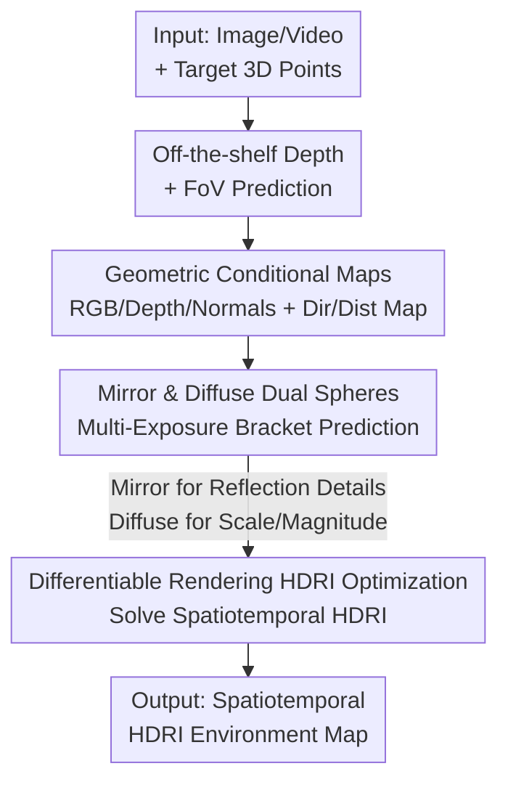

# Lighting in Motion: Spatiotemporal HDR Lighting Estimation

**Conference**: CVPR 2026  
**Paper**: [CVF Open Access](https://openaccess.thecvf.com/content/CVPR2026/html/Bolduc_Lighting_in_Motion_Spatiotemporal_HDR_Lighting_Estimation_CVPR_2026_paper.html)  
**Code**: To be confirmed  
**Area**: 3D Vision / Inverse Rendering / Computational Photography  
**Keywords**: HDR Lighting Estimation, Spatiotemporal Lighting, Diffusion Models, Light Probe, Differentiable Rendering

## TL;DR
LIMO reformulates lighting estimation at a specific 3D point in a single image or video as recursively "inpainting mirror and diffuse spheres of different exposures at that point using a diffusion model," and then fuses these spheres into an HDRI via differentiable rendering. Consequently, it simultaneously achieves spatial grounding accuracy, temporal variation, full-range HDR magnitude accuracy, indoor/outdoor generalizability, and realistic reflection details—making it the first framework to possess all five capabilities.

## Background & Motivation
**Background**: To insert virtual objects into images (vfx composition, AR) and make them look consistent, the objects must be lit with illumination that matches the scene. The traditional approach involves physically placing light probes (mirror/diffuse spheres) to capture HDR photographs, obtaining HDRI environment maps to feed into the rendering pipeline. Lighting estimation aims to automatically recover such HDRIs from a single image.

**Limitations of Prior Work**: The authors decompose the requirements for a "truly general lighting estimation method" into five core capabilities: (1) capability to ground to **specified 3D locations** in a scene (as lighting varies by position/occlusion); (2) support for **temporal** variations (camera movement revealing new light sources, moving objects causing occlusion, or dynamic lighting); (3) predicting a **highly accurate HDR scale** (both large-area indirect lighting and intense light sources that are orders of magnitude brighter); (4) applicability to both **indoor near-field and outdoor far-field** environments; and (5) generating plausible lighting distributions with **both high-frequency details and low-frequency directionality**. Existing methods only satisfy subsets of these criteria (see Table 1): some output a single global lighting environment from an image/video, some only target indoor or outdoor scenes, and others achieve spatial variation but lack the temporal dimension. Recent temporal-aware methods (such as 4D Lighting [42]) struggle to anchor predictions accurately within the local scene context.

**Key Challenge**: High-frequency reflection realism and highly accurate HDR magnitudes are inherently conflicting in their representations. Mirror spheres provide sharp reflection details, but the energy of concentrated light sources is confined to extremely few pixels, requiring multiple exposure brackets to estimate accurately. Conversely, anchoring lighting to a specific 3D location cannot rely solely on depth maps—even at the same depth, lighting can vary dramatically depending on the orientation or distance relative to scene elements.

**Goal**: To simultaneously fulfill the aforementioned five capabilities within a single framework and output explicit HDRIs that can be directly used in existing composition pipelines.

**Key Insight**: Rather than regressing an abstract lighting representation, it is more effective to leverage powerful image/video diffusion priors to "paint what a physical sphere should look like at a specified 3D point"—which aligns perfectly with the inpainting/generation tasks that pre-trained diffusion models excel at. These spheres of different exposures and materials can then be retroactively resolved to recover a physically accurate HDRI.

**Core Idea**: Using a diffusion model to inpaint a multi-exposure, multi-material (mirror and diffuse) sphere bracket at a specified 3D location in the scene using specially designed geometric conditional maps for accurate spatial anchoring, and finally fusing the predicted spheres into a spatiotemporal HDRI via differentiable rendering.

## Method

### Overall Architecture
The input of LIMO is an image (or video) along with a set of target 3D points in the scene. The output consists of HDRI environment maps at these points that vary over time. The entire pipeline is sequentially divided into three steps:

1. **Geometric Conditional Map Computation**: First, an off-the-shelf depth predictor [5] is used to obtain pixel-wise depth, and an off-the-shelf FoV estimator [44] is leveraged to obtain the camera field of view. These are used to calculate a set of conditional maps fed into the diffusion model: the RGB image (with the sphere region masked out to prevent background leakage), the depth map, the sphere normal map, and two newly proposed geometric maps (the direction map $I_{dir}$ and the distance map $I_{dist}$) designed to associate the "scene surface" with the "sphere position."
2. **Multi-exposure Sphere Prediction**: These conditional maps are concatenated with the input noise and fed into a fine-tuned diffusion model. Text prompts are used to specify "which sphere type + which exposure bracket" (e.g., `"Diffuse sphere [EV0]"`), driving the model to inpaint the corresponding sphere at the target 3D point. By repeatedly querying combinations of `{mirror, diffuse} × {EV 0, -3, -6, -9, -12}`, a stack of bracketed exposure spheres is obtained.
3. **HDRI Optimization and Reconstruction**: Utilizing differentiable rendering, the stack of spheres is treated as "observed sphere renders under an HDRI," and an optimization process solves for the underlying HDRI that simultaneously explains all exposures, materials, and frames, while applying temporal constraints to ensure consistency across video frames.

> In the diagram, the three contribution nodes—`Geometric Conditional Maps`, `Mirror & Diffuse Dual Spheres`, and `Differentiable Rendering HDRI Optimization`—correspond to the three key designs detailed below. `Depth + FoV Prediction` acts as a pre-existing processing step and is not detailed as a core design contribution.

### Key Designs

**1. Geometric Conditional Maps: Letting "relative positions" beyond depth anchor lighting on specific 3D points**

The most challenging problem is spatial grounding. For the same pixel depth, when a sphere is placed deeper into the scene (e.g., transitioning from shadow to direct sunlight), the lighting should change drastically. However, if only depth is used as a condition, the network outputs almost identical spheres (Figure 6). Based on this, the authors argue that "depth alone is insufficient for anchoring" and introduce two new geometric maps. For pixel $i$ in the image, the direction $I_{dir,i}$ and distance $I_{dist,i}$ to the sphere center $c$ are defined as:

$$I_{dir,i} = \begin{cases} \dfrac{p_i - c}{\lVert p_i - c\rVert}, & \text{not on the sphere surface} \\ v_i - 2(v_i \cdot n_i)\,n_i, & \text{on the sphere surface} \end{cases}, \qquad I_{dist,i} = \lVert p_i - c\rVert$$

where $p_i$ is the world coordinate of the pixel (calculated from depth, view direction $v_i$, and camera FoV), and $c$ is the sphere center. For pixels representing the sphere surface, the reflected ray direction is used (calculated from sphere surface normal $n_i$ and view direction $v_i$). Intuitively, the direction map allows the model to align "the reflection direction of a pixel on the sphere" with "the point in the scene located in the same direction relative to the sphere center," thereby determining which part of the scene the incoming light from that direction originates from. The distance map $I_{dist}$ is log-normalized. All maps $\{I_{rgb}, I_n, I_d, I_{dir}, I_{dist}\}$ are individually encoded into latents using a pre-trained VAE, then concatenated channel-wise. The input channels of the denoising network's patch embedding convolution are expanded by duplicating the initial weights and dividing by the number of new channels. Ablation studies show that removing the geometric map causes a worse performance drop than removing the diffuse sphere (Table 4), confirming its critical role in spatial grounding.

**2. Mirror + Diffuse Dual Spheres, Discrete Multi-exposures: Resolving the dilemma between "reflection details" and "magnitude accuracy"**

Only using mirror spheres (e.g., [6,31]) suffers from the limitation where the energy of concentrated light sources is confined to very few pixels, demanding too many exposure brackets for accurate estimation [38]. LIMO tackles this by predicting **diffuse spheres** in tandem. Diffuse surfaces integrate the energy of concentrated light sources over medium exposure levels, allowing a small number of exposure brackets to recover accurate intensities [10]. Mirror spheres, on the other hand, continue to capture high-frequency reflection details. Along the exposure dimension, instead of interpolating between extreme exposures like [31,42], the authors feed the EV as a **discrete text prompt** to the pre-trained text encoder (inspired by [3]). Empirical results show that the discrete EV set $\{0,-3,-6,-9,-12\}$ yields more accurate EV predictions. During training, the target sphere corresponding to the target EV is used as supervision, while the region outside the sphere is kept at the default EV0. A text condition specifying the sphere type is added, using prompts like `"{sphere type} [EV{value}]"`. Ablation studies indicate that removing the diffuse spheres significantly degrades **color metrics (angular error)**, indicating that diffuse spheres primarily assist in estimating dynamic range and color.

**3. Differentiable Spatiotemporal HDRI Optimization: Fusing sphere stacks into a physically consistent and temporally stable HDRI**

With the predicted pile of "mirror/diffuse × multi-exposure × multi-frame" spheres, how are they fused into a single HDRI? The authors define a rendering function $R(L_t, m)$ which renders a sphere with material $m \in \{\text{mirror}, \text{diffuse}\}$ under an HDRI illumination $L_t$ at frame $t$. They formulate the optimization as:

$$\arg\min_{L} \sum_{t\in T}\sum_{e\in E}\sum_{m\in M} \ell\big(\mu(e,m,t) - e\,R(L_t, m)\big)$$

where $\mu(e,m,t)$ is the sphere generated by the fine-tuned diffusion model at frame $t$, exposure $e$, and material $m$. The loss is defined as $\ell = \ell_2(\hat{y}_t, y_t) + \tfrac{\lambda}{2}\big(\ell_1(\hat{y}_t,\hat{y}_{t-1}) + \ell_1(\hat{y}_t,\hat{y}_{t+1})\big)$, where the first term aligns the rendered spheres with the predictions, and the latter two terms serve as temporal smoothness constraints between adjacent frames. $L$ is represented as a spatiotemporal HDRI volume initialized with a constant gray value (0.5), and optimized via Adam gradient descent. $R$ is implemented in PyTorch as a dual-mode (reflection/diffuse) renderer utilizing cosine and light source multiple importance sampling. During optimization, instead of computing the full sum, a random combination of exposure/material is sampled at each step, and $L$ is represented using a Laplacian pyramid [18] to accelerate convergence. This step explicitly back-projects generative appearance observations into physical lighting, guaranteeing that the output directly meshes with existing composition pipelines.

### Loss & Training
Training data is generated entirely synthetically: using Blender [7] + BlenderKit [12] assets to procedurally generate indoor and outdoor environments. In each render, a grid of spheres is placed (mutually invisible, with fixed image-space size and randomized depth) to obtain multiple training samples. However, during training/inference, the network regresses only a single sphere at a time. The sphere depth is sampled according to $d = d_{min} + (d_{max}-d_{min})u^{\gamma}$ ($d_{min}{=}0.25, d_{max}{=}0.98, \gamma{=}0.4, u\sim U(0,1)$), scaled by the minimum depth in the sphere's bounding region to obtain its scene-scale depth. Each sphere is rendered as float16 EXR in perfect mirror (roughness=0, metallic=1) and perfect diffuse (roughness=1, metallic=0) materials to preserve HDR values. Video data is split into three types of animated scenes: dynamic sphere position, dynamic camera, and dynamic lighting (randomly rotating HDRI azimuth/modifying intensity/rotating directional sun light). At the model level, two networks are fine-tuned: the image model uses Flux.1 Schnell [22] (12,896 images, 512×512, 150k steps), and the video model uses Wan2.2 5B [43] (30,096 sequences of 21 frames, 512×512, 250k steps). Both models are augmented with color, exposure, and degradation augmentations, and trained on 8×A100 GPUs for 50 hours and 188 hours, respectively.

## Key Experimental Results

### Main Results (Single Image, Table 2)
Evaluated on synthetic Infinigen Indoor [32], real-world Laval Indoor SV [17], and Laval Outdoor [21] datasets. Sphere metrics (mirror/diffuse/glossy/matte) are computed after relighting and compared against DiffusionLight [31] and 4D Lighting [42]. The table below lists the RMSE↓, SI-RMSE↓, SSIM↑, and Angular Error (Ang.Err)↓ for both mirror and diffuse materials:

| Dataset | Method | RMSE(Mirr/Diff)↓ | SI-RMSE(Mirr/Diff)↓ | SSIM(Mirr/Diff)↑ | Ang.Err(Mirr/Diff)↓ |
|--------|------|------|------|------|------|
| Infinigen | DiffusionLight | 0.40 / 0.47 | 1.52 / 0.70 | 0.68 / 0.83 | 14.3 / 9.7 |
| Infinigen | 4D Lighting | 0.34 / 0.36 | 1.36 / 0.62 | 0.72 / 0.86 | 14.7 / 11.2 |
| Infinigen | **LIMO (image)** | **0.25 / 0.16** | **0.41 / 0.11** | **0.78 / 0.95** | **4.4 / 2.3** |
| Infinigen | LIMO (video) | 0.26 / 0.22 | 0.42 / 0.13 | 0.79 / 0.95 | 4.4 / 2.7 |
| Laval Indoor SV | 4D Lighting | 0.35 / 0.27 | 0.91 / 0.22 | 0.80 / 0.94 | 6.8 / 5.0 |
| Laval Indoor SV | **LIMO (image)** | **0.30 / 0.20** | **0.60 / 0.17** | **0.81 / 0.97** | **4.6 / 2.6** |
| Laval Outdoor | 4D Lighting | 0.37 / 0.25 | 0.69 / 0.12 | 0.77 / 0.97 | 7.4 / 2.9 |
| Laval Outdoor | **LIMO (image)** | **0.27 / 0.12** | **0.37 / 0.07** | **0.79 / 0.99** | **3.9 / 1.2** |

The image-based LIMO outperforms existing methods across almost all materials and metrics on the three datasets, closely followed by the video-based variant. The authors attribute the slight superiority of the image model to its larger capacity (12B vs 5B for video) and the fact that video optimization must also accommodate temporal consistency. The angular error dropped from 14.7 (4D Lighting on Infinigen Mirror) to 4.4, demonstrating a substantial improvement in color reconstruction.

### Video Experiments (Table 3)
A self-constructed video test set (5 augmented Blender demos) contains four scene types: dynamic object, dynamic camera, dynamic lighting, and combination. In terms of frame-by-frame metrics, the image-based LIMO remains ahead with the video-based model in second place. However, the video-based LIMO significantly outperforms the image-based version across three temporal metrics (T-LPIPS↓, T-LPIPS-Diff↓, and Warped Err↓):

| Scene | Method | T-LPIPS-Diff(Mirr)↓ | Warped Err(Mirr)↓ | RMSE(Mirr)↓ |
|------|------|------|------|------|
| Dynamic Object | 4D Lighting | 0.0418 | 0.0439 | 0.39 |
| Dynamic Object | LIMO (image) | 0.0886 | 0.1887 | 0.28 |
| Dynamic Object | **LIMO (video)** | **0.0227** | 0.0589 | 0.30 |
| Dynamic Lighting | 4D Lighting | 0.0067 | 0.0158 | 0.39 |
| Dynamic Lighting | **LIMO (video)** | **0.0065** | **0.0108** | 0.34 |

The authors point out that T-LPIPS can be misleading (as video naturally exhibits motion); they therefore introduce T-LPIPS-Diff (the difference in T-LPIPS between the prediction and ground truth) to evaluate whether "the extent of temporal variations is accurately predicted." For mirror renders, 4D Lighting remains largely static (insufficient temporal variation), whereas LIMO (video) tracks closer to ground truth. While 4D Lighting yields lower Warped Err on some scenes, the authors attribute this to its over-smoothed MLP representation, which fails in dynamic lighting scenes requiring "sudden changes or discontinuities in lighting," where LIMO (video) excels in temporal metrics.

### Ablation Study (Table 4, Infinigen, Image Model)

| Configuration | RMSE(Diff)↓ | Ang.Err(Diff)↓ | Description |
|------|------|------|------|
| w/o Diffuse, Geo | 0.210 | 3.60 | Removing both diffuse spheres and geometric maps |
| w/o Diffuse | 0.207 | 3.39 | Removing diffuse spheres only |
| w/o Geo | 0.229 | 3.13 | Removing geometric maps only (RMSE is worst) |
| **LIMO (full)** | **0.160** | **2.25** | Full model |

### Key Findings
- **Geometric maps are more critical than diffuse spheres**: Removing only the geometric maps (w/o Geo, RMSE 0.229) degrades performance further than removing only the diffuse spheres (w/o Diffuse, RMSE 0.207), proving that the core of spatial grounding lies in the newly proposed geometric conditional maps.
- **A counter-intuitive phenomenon**: Removing both geometric maps and diffuse spheres (0.210) yields slightly better results than removing only the geometric maps (0.229). The authors explain: diffuse spheres only help when the geometric layout is accurately mapped. When geometric maps are missing, causing spatial confusion, diffuse spheres instead introduce contradictory context. Consequently, removing both is more "self-consistent" than removing only geometric maps.
- **Diffuse spheres primarily govern color and magnitude**: Removing them noticeably degrades the angular error (color), validating their role in establishing accurate dynamic range and color values.

## Highlights & Insights
- **Reformulating "lighting estimation" as "inpainting a sphere at a designated point"**: By elegantly leveraging the generation/inpainting capabilities that image/video diffusion priors are exceptionally suited for, LIMO bypasses the challenge of directly regressing abstract lighting representations, while naturally allowing queries at arbitrary 3D positions.
- **Geometric conditional maps tackle the "insufficient depth" blindspot**: Combining sphere-to-pixel directions and distances into two complementary maps aligns "reflection directions" with "corresponding scene components." This represents a key trick for making spatial grounding robust and is readily generalizable to other conditional generation tasks where image content must be anchored to 3D locations.
- **Mirror/diffuse specialization + discrete multi-exposures**: Let mirrors manage details and diffuse manage intensity, using discrete EVs as text prompts rather than continuous interpolation. This strategy of "distributing different frequency bands of lighting across different physical interfaces" is highly inspiring for HDR reconstruction.
- **Differentiable rendering backend integration**: Concretely back-projecting predicted appearance observations into target physical HDRIs maintains generative realism while guaranteeing that outputs seamlessly plug into production-grade pipelines, bridging "learning-based" and "controlled" workflows.

## Limitations & Future Work
- The authors acknowledge that because training spheres are rendered as 3D objects with non-zero dimensions, some samples violate the "directional lighting" assumption (e.g., shadows cast directly onto the sphere surface), posing the HDRI optimization as an ill-posed inverse problem.
- LIMO is not explicitly trained to utilize specific lighting cues (such as human faces, which are common in videos). Future iterations could shift toward point-based lighting representation and introduce facial dataset annotations with known lighting.
- Own observation: The training depends heavily on synthetic data (Blender). Although it generalizes well on the real-world Laval dataset, the synthetic-to-real domain gap remains a latent risk. The video model's frame-wise quality is slightly inferior to the image model due to the restricted 5B parameter capacity, showcasing a realistic trade-off between individual frame quality and temporal smoothness.
- Inference requires querying the diffusion model iteratively for "dual materials × 5 exposure levels × multiple frames" and performing differentiable optimization, incurring substantial computational costs. Real-time acceleration remains a direction for improvement.

## Related Work & Insights
- **vs DiffusionLight [31]**: It relies exclusively on mirror spheres and is not adaptable to sphere 3D locations, leading to significantly lower scores in spatially varying scenes; LIMO uses dual-spheres + geometric maps to achieve both spatial grounding and HDR magnitude accuracy.
- **vs 4D Lighting [42]**: Also generates multiple spheres via diffusion but builds a unified NeRF-like implicit representation over video frames, resulting in overly smoothed predictions that miss lighting dynamics. LIMO achieves frame-by-frame HDRI with temporal constraints, aligning closely with ground truth in terms of temporal fluctuation (T-LPIPS-Diff).
- **vs mirror-only sphere methods [6]**: LIMO validates that diffuse spheres are indispensable for estimating the scale of concentrated light sources, driving substantial physical accuracy gains.
- **vs diffusion-driven object insertion methods [28,46,49]**: Those approaches directly learn the composition process, bypassing HDR estimation entirely, but sacrifice the artistic control typical of traditional Image-Based Lighting (IBL) pipelines. LIMO adheres to explicit HDRI recovery, seamlessly integrating into legacy composition environments.

## Rating
- Novelty: ⭐⭐⭐⭐⭐ The first to encompass all five capabilities within a single framework; both the geometric conditional maps and the dual-sphere multi-exposure strategy are exceptionally solid.
- Experimental Thoroughness: ⭐⭐⭐⭐ Complete evaluations across indoor/outdoor landscapes, synthetic/real datasets, single/video streams, and ablations, though real-world video evaluations are scarce due to the lack of ground-truth spatiotemporal physical probe data.
- Writing Quality: ⭐⭐⭐⭐⭐ The five-capability framework is logically structured. Detailed explanations of both methodology and ablation studies (including the explanation of the counter-intuitive phenomenon) are highly satisfying.
- Value: ⭐⭐⭐⭐⭐ Directly interfaces with industry-grade VFX/AR asset creation pipelines, demonstrating high practical utility.

<!-- RELATED:START -->

## Related Papers

- [\[CVPR 2026\] UniLight: A Unified Representation for Lighting](unilight_a_unified_representation_for_lighting.md)
- [\[CVPR 2026\] OLATverse: A Large-scale Real-world Object Dataset with Precise Lighting Control](olatverse_a_large-scale_real-world_object_dataset_with_precise_lighting_control.md)
- [\[CVPR 2026\] LuxRemix: Lighting Decomposition and Remixing for Indoor Scenes](luxremix_lighting_decomposition_and_remixing_for_indoor_scenes.md)
- [\[CVPR 2026\] Lighting-grounded Video Generation with Renderer-based Agent Reasoning](lighting-grounded_video_generation_with_renderer-based_agent_reasoning.md)
- [\[CVPR 2026\] Disco-GS: Gaussian Splatting in Dynamic Color Lighting](disco-gs_gaussian_splatting_in_dynamic_color_lighting.md)

<!-- RELATED:END -->
