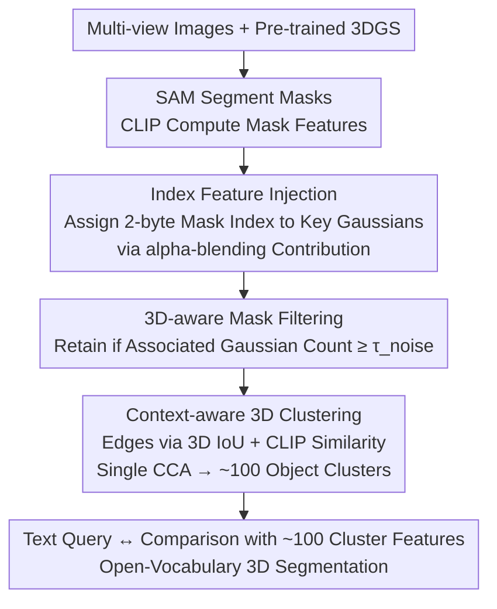

# LightSplat: Fast and Memory-Efficient Open-Vocabulary 3D Scene Understanding in Five Seconds

**Conference**: CVPR 2026  
**arXiv**: [2603.24146](https://arxiv.org/abs/2603.24146)  
**Code**: [Project Page](https://vision3d-lab.github.io/lightsplat/)  
**Area**: 3D Vision / Scene Understanding  
**Keywords**: Open-Vocabulary 3D Scene Understanding, 3D Gaussian Splatting, Semantic Index Injection, Training-free Framework, Clustering Inference

## TL;DR

LightSplat proposes a fast and memory-efficient training-free framework that achieves open-vocabulary 3D scene understanding with a 50-400x speedup and 64x reduced memory compared to existing SOTA. It achieves this by assigning compact 2-byte semantic indices to 3D Gaussians (instead of high-dimensional CLIP features), coupled with a lightweight index-feature mapping and single-step 3D clustering.

## Background & Motivation

Open-vocabulary 3D scene understanding aims to segment arbitrary objects in 3D environments via natural language queries, with applications in robotics, 3D editing, and AR/VR. Existing methods primarily rely on 3D Gaussian Splatting (3DGS) to distill 2D semantics into 3D scenes, but face three core bottlenecks:

1.  **High Computational Cost**: Feature distillation is bottlenecked by iterative optimization, requiring repeated alignment of rendered views with CLIP embeddings (e.g., LangSplat requires 100 minutes).
2.  **High Memory Overhead**: Storing high-dimensional language features for every Gaussian leads to redundant storage and excessive per-Gaussian comparisons (4×512 bytes per Gaussian).
3.  **Semantic Degradation**: Features become blurred when Gaussians are projected back to 2D, as indirect supervision is often misaligned with 3D geometry.

**Key Challenge**: The mapping from 2D semantics to 3D could be achieved via direct indexing, yet existing methods unnecessarily depend on iterative optimization and dense feature storage. **Key Insight**: Object semantics can be directly lifted from 2D to 3D using compact mask indices, eliminating the need for per-Gaussian feature storage and iterative training.

## Method

### Overall Architecture

The **Goal** of LightSplat is to enable natural language querying of any object within a pre-trained 3DGS scene with minimal time and memory cost. The **Mechanism** involves abandoning the mainstream approach of "storing language features in every Gaussian followed by iterative optimization" in favor of a pipeline consisting of deterministic single-step operations.

The workflow proceeds as follows: First, SAM is used on each view to segment object masks, and CLIP computes features for each mask. Next, these 2D mask identities are "projected" back to 3D—a 2-byte mask index is assigned only to key Gaussians based on their contribution to the mask rendering, rather than embedding 512-dimensional features. Then, a 3D-aware mask filtering step removes noisy masks lacking geometric support. Edges are then constructed between masks based on 3D overlap and semantic similarity, followed by a Connected Component Analysis (CCA) to collapse thousands of Gaussians into approximately 100 object-level clusters. Finally, during inference, the query text is only compared against these ~100 cluster features, rather than hundreds of thousands of individual Gaussians.

### Key Designs

**1. Index Feature Injection: Replacing Per-Gaussian High-Dim Features with 2-byte Indices**

The **Design Motivation** is that high-dimensional features should not be stored in every Gaussian and iteratively optimized. LightSplat uses the unique identity of each 2D SAM mask as an integer index. Gaussians only store "which mask I belong to," while the actual features are stored separately in an index-feature mapping table. Specifically, alpha-blending weights are used to measure the contribution of each Gaussian to a specific mask $l$:

$$w_n^{(l)}(u,v) = \alpha_n \cdot T_n^{(l)}(u,v)$$

Only Gaussians with a contribution exceeding the threshold $\tau_{\text{contrib}}$ are assigned the corresponding 2-byte mask index. Visually irrelevant Gaussians are excluded to prevent semantic bleeding into the background. This reduces storage from 4×512 bytes for CLIP features to a mere 2-byte index per Gaussian, achieving approximately 1024x compression for the storage component without losing semantics.

**2. 3D-aware Mask Filtering: Removing Noisy Masks without Geometric Support**

**Limitations of Prior Work** include SAM producing unreliable masks in single views (e.g., artifacts). LightSplat utilizes the 2D-3D correspondence established in the previous step to judge mask reliability by counting its associated Gaussians:

$$\mathcal{M}_{\text{filtered}} = \{m_k \mid |\mathcal{G}_k| \geq \tau_{\text{noise}}\}$$

Masks with too few associated Gaussians (often view-dependent fragments) are discarded. This step uses the presence of a stable 3D structure as a proxy for reliability, thereby enhancing semantic consistency across multiple views.

**3. Context-aware 3D Clustering: Single-step CCA Convergence to Object Level**

To handle redundancy where the same object is represented by multiple masks and many Gaussians, LightSplat constructs an undirected graph $G=(V,E)$ where nodes are filtered masks. An edge is added if the 3D Gaussian sets of two masks have an IoU exceeding $\tau_{\text{IoU}}$ and their CLIP features have a cosine similarity exceeding $\tau_{\text{feat}}$. A single Connected Component Analysis collapses these into 3D clusters. Each cluster feature is the average of its constituent mask features. This collapses the search space from $10^5$ Gaussians to ~$10^2$ clusters, reducing inference time from seconds to 0.1s.

### Loss & Training

Ours is a training-free method requiring no optimization. All steps (index injection, filtering, graph construction, clustering) are deterministic single-step operations.

## Key Experimental Results

### Main Results

**LERF-OVS 3D Object Selection**:

| Method | Mean mIoU | Mean mAcc@0.25 | Distillation Time |
| :--- | :--- | :--- | :--- |
| LangSplat | 7.66 | 9.37 | 100 min |
| OpenGaussian | 42.15 | 56.22 | 50 min |
| Dr.Splat | 43.58 | 63.87 | 4 min |
| **Ours (LightSplat)** | **47.58** | **68.32** | **4.2 s** |

**DL3DV-OVS**:

| Method | Mean mIoU | Mean mAcc@0.25 | Distillation Time |
| :--- | :--- | :--- | :--- |
| LUDVIG | 29.21 | 56.89 | 12 min |
| **Ours (LightSplat)** | **44.98** | **60.82** | **4.8 s** |

**ScanNet Semantic Segmentation (19 classes)**:

| Method | mIoU | mAcc | Distillation Time | Inference Time | Memory/Gaussian |
| :--- | :--- | :--- | :--- | :--- | :--- |
| Dr.Splat | 6.69 | 15.76 | 4 min | 8.1 s | 128 byte |
| **Ours (LightSplat)** | **13.69** | **23.01** | **5 s** | **0.1 s** | **2 byte** |

### Ablation Study

| Configuration | Mean mIoU | Function |
| :--- | :--- | :--- |
| W/o Mask Filtering | 44.73 | Noisy masks degrade semantic quality |
| W/o 3D Clustering | 44.56 | Lack of object-level consistency |
| Full Model | 47.58 | Optimal with both filtering and clustering |

### Key Findings

- LightSplat achieves 47.58 mIoU (SOTA) on LERF-OVS with a distillation time of only 4.2 seconds—approx. 57x faster than Dr.Splat and 1429x faster than LangSplat.
- 2-byte index vs. 128-byte CLIP features (quantized) achieves a 64x memory saving.
- Inference only requires comparison with ~100 clusters; on ScanNet, inference time drops from 8.1s to 0.1s.
- Superiority is more pronounced in large-scale outdoor scenes (DL3DV-OVS), where mIoU improves from 29.21 (Prev. SOTA) to 44.98.

## Highlights & Insights

- **Core Idea**: The indirect semantic representation using a 2-byte index and a mapping table is a brilliant simplification that retains full semantic information while drastically reducing overhead.
- **Novelty**: The entirely training-free pipeline makes it a true plug-and-play solution, requiring zero GPU training time.
- **Efficiency**: Single-step clustering (CCA) replaces iterative optimization, ensuring every stage of the pipeline is streamlined.

## Limitations & Future Work

- Dependency on pre-trained 3DGS quality: Artifacts in 3D reconstruction can negatively impact index injection.
- Hyperparameter sensitivity: Thresholds ($\tau_{\text{contrib}}, \tau_{\text{noise}}, \tau_{\text{IoU}}, \tau_{\text{feat}}$) may require tuning for different scenes.
- Fine-grained semantics: Distinguishing between visually similar but semantically distinct objects remains limited by the underlying CLIP features.
- Fixed clustering granularity: May not adapt well to scenes requiring multi-level hierarchical semantic understanding.

## Related Work & Insights

- **vs. Dr.Splat**: Dr.Splat requires iterative feature aggregation and Product Quantization training; LightSplat is single-step and performs better.
- **vs. LUDVIG**: LUDVIG uses graph diffusion with higher computational cost; LightSplat significantly outperforms it on DL3DV-OVS (29.21 → 44.98).
- **vs. LangSplat/LEGaussians**: These rely on rendering-guided iterative optimization, which is two orders of magnitude slower and yields lower performance.
- **Insight**: The "Index + Mapping Table" paradigm for indirect semantic representation can be generalized to other 3D feature storage scenarios.

## Rating

- **Novelty**: ⭐⭐⭐⭐⭐ (The insight of replacing high-dim features with 2-byte indices is simple yet powerful, overturning the assumption that iterative optimization is necessary.)
- **Experimental Thoroughness**: ⭐⭐⭐⭐ (Covers three datasets and multiple metrics, though ablation could be deeper.)
- **Writing Quality**: ⭐⭐⭐⭐ (Clear motivation and high-quality flowcharts; consistent mathematical notation.)
- **Value**: ⭐⭐⭐⭐⭐ (50-400x speedup and 64x memory reduction offer immense practical value for real-time AR/VR.)

<!-- RELATED:START -->

## Related Papers

- [\[CVPR 2026\] EmbodiedSplat: Online Feed-Forward Semantic 3DGS for Open-Vocabulary 3D Scene Understanding](embodiedsplat_online_feed-forward_semantic_3dgs_for_open-vocabulary_3d_scene_und.md)
- [\[CVPR 2026\] JOPP-3D: Joint Open Vocabulary Semantic Segmentation on Point Clouds and Panoramas](jopp3d_joint_open_vocabulary_semantic_segmentation.md)
- [\[CVPR 2026\] Consistent Instance Field for Dynamic Scene Understanding](consistent_instance_field_for_dynamic_scene_understanding.md)
- [\[CVPR 2026\] Curvature-Aware Captioning: Leveraging Geodesic Attention for 3D Scene Understanding](curvature-aware_captioning_leveraging_geodesic_attention_for_3d_scene_understand.md)
- [\[CVPR 2026\] 3D-Aware Multi-Task Learning with Cross-View Correlations for Dense Scene Understanding](3d-aware_multi-task_learning_with_cross-view_correlations_for_dense_scene_unders.md)

<!-- RELATED:END -->
