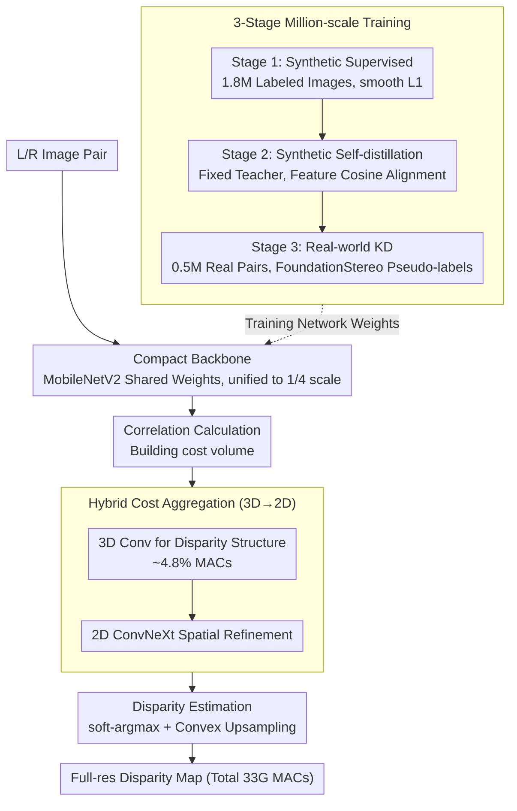

# Lite Any Stereo: Efficient Zero-Shot Stereo Matching

**Conference**: CVPR 2026  
**arXiv**: [2511.16555](https://arxiv.org/abs/2511.16555)  
**Code**: [tomtomtommi/LiteAnyStereo](https://tomtomtommi.github.io/LiteAnyStereo/)  
**Area**: 3D Vision  
**Keywords**: Stereo Matching, Zero-shot Generalization, Efficient Inference, Hybrid Cost Aggregation, Knowledge Distillation

## TL;DR

Lite Any Stereo is proposed, which utilizes a hybrid 2D-3D cost aggregation module and a three-stage million-scale data training strategy (supervised → self-distillation → real-world knowledge distillation). With less than 1% of the computation (33G MACs) compared to SOTA precise methods, it ranks 1st on four real-world benchmarks, demonstrating for the first time that ultra-lightweight models can possess strong zero-shot generalization capabilities.

## Background & Motivation

The field of stereo matching suffers from a **severe decoupling between precision and efficiency**:

**Background**: Current stereo matching methods are divided into two camps: precise methods (FoundationStereo, Selective-IGEV, etc.) utilize deep priors from foundation models or large-scale computation for high accuracy but require thousands of G MACs; efficient methods (LightStereo, BANet, etc.) pursue real-time inference but suffer from lower accuracy.

**Limitations of Prior Work**: Most efficient methods are fine-tuned only for specific domains (e.g., KITTI) and lack zero-shot generalization. There is a common belief in the community that lightweight models naturally cannot possess zero-shot capabilities due to limited capacity.

**Key Challenge**: Efficiency vs. zero-shot generalization—the community assumes these two are mutually exclusive.

**Key Insight**: Although StereoAnything attempts to train efficient models using 30M pseudo-disparity maps generated by monocular depth models, the quality of monocular depth is limited, and efficient models still lag significantly behind precise methods.

**Mechanism**: The authors argue that the problem lies not in the model capacity itself, but in (a) architectures failing to fully exploit complementary 2D and 3D information, and (b) training strategies failing to leverage existing large-scale unlabeled real-world data.

**Core Idea**: Through hybrid cost aggregation and a three-stage training strategy, ultra-lightweight models can bridge the sim-to-real gap and achieve strong zero-shot generalization.

## Method

### Overall Architecture

A feed-forward network with a four-stage pipeline: shared-weight feature extraction (MobileNetV2 backbone, multi-scale features unified to 1/4 resolution) → correlation calculation (building cost volume $\mathbf{C}(d,h,w) = \frac{1}{N_c}\langle \mathbf{F}_L^{1/4}(h,w), \mathbf{F}_R^{1/4}(h,w-d) \rangle$) → hybrid 3D-2D cost aggregation → disparity estimation (soft-argmax + convex upsampling to full resolution). Overall computation is only 33G MACs. Generalization capability is not derived from the network itself but fed via a three-stage million-scale training strategy orthogonal to the inference process.

### Key Designs

**1. Compact Backbone: Using the right small network rather than a larger/newer one**

Zero-shot stereo matching usually relies on stacking depth priors (DepthAnything) or large networks for precision, which pushes computation to thousands of G MACs. This work does the opposite, using ImageNet-pretrained MobileNetV2 as a shared-weight feature extractor. It extracts features at four scales $\{1/4, 1/8, 1/16, 1/32\}$ and unifies them back to 1/4 resolution via residual upsampling. Notably, newer backbones like ConvNeXt v2 are not necessarily better: in ablations, it performs slightly better on ETH3D (5.03 vs 5.39) but worse on Middlebury (10.52 vs 10.89). Overall, MobileNetV2's channel configuration fits stereo matching better. Not introducing external depth priors is the key prerequisite for compressing the network to 33G MACs.

**2. Hybrid Cost Aggregation: Letting minimal 3D convolution handle "disparity structure"**

Pure 2D aggregation collapses the disparity dimension into channels, losing structural continuity in the disparity direction. Pure 3D aggregation preserves this but is expensive, and many levels in the disparity dimension contribute minimally. This method sequences them as 3D→2D:

$$\mathbf{C}_{agg} = \mathbf{G}_{2D}(\mathbf{G}_{3D}(\mathbf{C}))$$

Multi-scale 3D convolutions (kernel $(3,3,3)$) first establish structural awareness across the disparity direction, accounting for only ~4.8% of computation. This is then passed to ConvNeXt layers for efficient 2D spatial refinement. The authors compared four integration sequences—parallel bilateral, 2D→3D, 3D→2D, and interleaved—and 3D→2D was found to be optimal (Tab. 2a: ETH3D 5.39 vs. 6.48 for pure 2D and 8.55 for bilateral). This indicates that "building disparity structure before spatial refinement" is the correct information flow. The 3D ratio follows the law of diminishing returns: increasing it from 4.8% to 9.5% and 15.6% caused Middlebury performance to degrade from 9.50 to 10.06 and 10.34—under a fixed MACs budget, more 3D convolution crowds out 2D refinement space.

**3. Three-stage Million-scale Training: Synthetic data for foundation, real data for generalization**

Architecture alone cannot bridge the sim-to-real gap; generalization is derived from a three-step training strategy. Step 1 is synthetic data supervision: training for 150K steps on 1.8M labeled synthetic images (SceneFlow, FallingThings, FSD, CREStereo, etc.) using smooth L1 to establish basic matching ability. Step 2 is self-distillation on synthetic data: the teacher and student share the same architecture (both initialized from Step 1); the teacher receives clean input while the student receives heavily perturbed input. Student learning of domain-invariant representations is forced via feature cosine alignment:

$$\mathcal{L}_{feat} = 1 - \frac{1}{HW}\sum_{i=1}^{HW} \cos(F_i, F_i')$$

Teacher update logic is critical—comparing fixed weights, EMA, and hard copy of student weights, the fixed teacher performed best (K.12: 3.64 vs 3.97 vs 4.22), as stable anchors are more beneficial for low-capacity lightweight students. Step 3 bridges the real domain: using 0.5M unlabeled real stereo pairs (Flickr1024, InStereo2k, etc.), fine-tuning for 100K steps using pseudo-labels from a frozen FoundationStereo. Data quality was found to be more important than quantity—low-quality data (e.g., Stereo4D or poorly rectified HRWSI) can degrade generalization.

### Loss & Training

- Stage ①: $\mathcal{L}_{disp} = \text{smooth}_{L_1}(\mathbf{D} - \mathbf{D}_{gt})$
- Stage ②: $\mathcal{L}_{disp} + \mathcal{L}_{feat}$ (Feature Cosine Alignment)
- Stage ③: Pseudo-label $\text{smooth}_{L_1}$ loss, with no further self-distillation (no additional gain observed).
- Config: 150K+50K+100K steps, batch 176, A100 GPU, AdamW + one-cycle LR (peak 2e-4), crop 256×512 → fine-tune 320×736, $D_{max}=192$.

## Key Experimental Results

### Main Results (Million-scale Zero-shot Generalization)

| Dataset | Metric | Lite Any Stereo | Prev. Best Efficient Method | Precise Method Ref | MACs |
|--------|------|----------------|-----------------|-------------|------|
| KITTI 2012 | D1 | **3.04** | 4.00 (StereoAnything-L) | 2.51 (FoundationStereo) | 33G vs 84G vs 12824G |
| KITTI 2015 | D1 | **3.87** | 4.81 (StereoAnything-L) | 2.83 (FoundationStereo) | Same as above |
| ETH3D | Bad 1.0 | **3.53** | 3.81 (StereoAnything-L) | 0.49 (FoundationStereo) | Same as above |
| Middlebury | Bad 2.0 | **7.51** | 9.82 (StereoAnything-L) | 1.12 (FoundationStereo) | Same as above |
| DrivingStereo Weather | D1 | **8.74** | - | 10.71 (FoundationStereo) | 33G vs 12824G |

Note: On the DrivingStereo weather subset, Lite Any Stereo (33G MACs) outperformed its teacher model, FoundationStereo, which has 389x more computation.

### Ablation Study

| Training Stage Ablation | K.12 | K.15 | ETH3D | Middlebury | Description |
|-------------|------|------|-------|------------|------|
| Stage ① only | 4.05 | 4.55 | 4.43 | 8.49 | Synthetic supervised baseline |
| + Stage ② | 3.66 | 4.53 | 4.69 | 7.03 | Self-distillation: K.12/Mid gain |
| + Stage ③ | **3.04** | **3.87** | **3.53** | 7.51 | Real KD: K.12/ETH3D gain |

| Aggregation (Tab.2a) | K.12 | K.15 | ETH3D | Middlebury |
|-------------------|------|------|-------|------------|
| Pure 2D | 5.02 | 5.01 | 6.48 | 11.29 |
| 3D→2D (Default) | 4.78 | 4.64 | 5.39 | 10.89 |
| Bilateral (Parallel) | 5.10 | 5.10 | 8.55 | 12.00 |
| Interleaved | 4.61 | 4.73 | 6.20 | 11.34 |

### Key Findings

- Only 4.8% of 3D computation provides significant disparity structure awareness—increasing it hurts performance due to MACs budget constraints.
- 3D→2D serial aggregation outperforms all other hybrid schemes, suggesting that modeling disparity structure before spatial refinement is the correct flow.
- Self-distillation with a fixed teacher is superior to EMA or hard copy—stable anchors allow lightweight students to learn domain-invariant features more effectively.
- Training strategies show **architectural universality**: consistent improvements were observed when applied to LightStereo-M and BANet-2D.
- Inference speed is consistently fast: 21ms on GTX 1080 Ti, 19ms on RTX 2080 Ti, 23ms on RTX 3090, 17ms on RTX 4090, with 2K input requiring only 2.5GB VRAM.
- On the DrivingStereo weather subset, the student outperforming the teacher (8.74 vs 10.71) suggests distillation + domain tuning can result in more robust representations than large models.

## Highlights & Insights

- **Breaking Cognitive Barriers**: Proves for the first time that ultra-lightweight models (<1% MACs) can match or exceed the zero-shot performance of precise methods, challenging the "lightweight = weak generalization" consensus.
- **Minimalist Hybrid Aggregation**: Captures critical structural information with only 4.8% 3D computation, showing that the role of 3D convolution in the disparity dimension is "finishing touch" rather than "brute force."
- **Universal Training Strategy**: The three-stage strategy works for various architectures (LightStereo, BANet) and can serve as a standard training paradigm for efficient stereo matching.
- **Student Surpassing Teacher**: The student outperforming FoundationStereo on DrivingStereo indicates that distillation plus domain specialization can yield superior performance on specific distributions compared to foundation models.

## Limitations & Future Work

- **Gap with Prior-based Methods**: Without using depth priors like DepthAnything, the performance ceiling is lower (ETH3D: 3.53 vs FoundationStereo 0.49).
- **Pseudo-label Bottleneck**: Stage 3 quality depends entirely on FoundationStereo—if the teacher fails in a scene, the student cannot learn it correctly.
- **Middlebury Indoor Scenes**: Indoor data scale is limited; Middlebury performance degraded slightly from 7.03 to 7.51 after Stage 3, indicating insufficient indoor real data.
- **Fixed Max Disparity**: $D_{max}=192$ may limit applications in extreme disparity scenes.
- **Challenging Objects**: Transparency and reflective objects remain difficult.
- Temporal consistency was not explored; multi-frame stereo video could provide further improvements.

## Related Work & Insights

- **vs LightStereo**: Both are lightweight 2D-based methods (33G MACs), but LightStereo has weak zero-shot generalization. Lite Any Stereo achieves a reduction from 4.10 to 3.04 on K.12 via minimal 3D aggregation and three-stage training.
- **vs StereoAnything**: Also pursues efficient generalization but relies on monocular depth pseudo-labels (30M samples), which are lower quality than the stereo pseudo-labels used here. StereoAnything-L requires 84G MACs vs. 33G for this work.
- **vs FoundationStereo**: Used as the Stage 3 teacher. The student outperforming the teacher on specific weather data suggests unique advantages of lightweight architectures in specific distributions.
- **vs BANet**: A concurrent high-efficiency method (36G MACs) with poor zero-shot generalization in SceneFlow-only settings (ETH3D: 44.89), which improves significantly to 4.05 using the proposed three-stage training.

## Rating

- **Novelty**: ⭐⭐⭐⭐ First SOTA zero-shot stereo matching results at extremely low computation.
- **Experimental Thoroughness**: ⭐⭐⭐⭐⭐ Five real-world benchmarks, multi-GPU timing, extensive ablations, and universality validation.
- **Writing Quality**: ⭐⭐⭐⭐ Clear structure, informative charts, and systematic ablations.
- **Value**: ⭐⭐⭐⭐⭐ Directly advances practical deployment of stereo matching; training strategy has broad reference value.

<!-- RELATED:START -->

## Related Papers

- [\[CVPR 2026\] Fast-FoundationStereo: Real-Time Zero-Shot Stereo Matching](fast-foundationstereo_real-time_zero-shot_stereo_matching.md)
- [\[CVPR 2026\] What Makes Good Synthetic Training Data for Zero-Shot Stereo Matching?](what_makes_good_synthetic_training_data_for_zero-shot_stereo_matching.md)
- [\[CVPR 2026\] PromptStereo: Zero-Shot Stereo Matching via Structure and Motion Prompts](promptstereo_zero-shot_stereo_matching_via_structure_and_motion_prompts.md)
- [\[CVPR 2026\] PIP-Stereo: Progressive Iterations Pruner for Iterative Optimization based Stereo Matching](pip-stereo_progressive_iterations_pruner_for_iterative_optimization_based_stereo.md)
- [\[ICCV 2025\] ZeroStereo: Zero-shot Stereo Matching from Single Images](../../ICCV2025/3d_vision/zerostereo_zero-shot_stereo_matching_from_single_images.md)

<!-- RELATED:END -->
