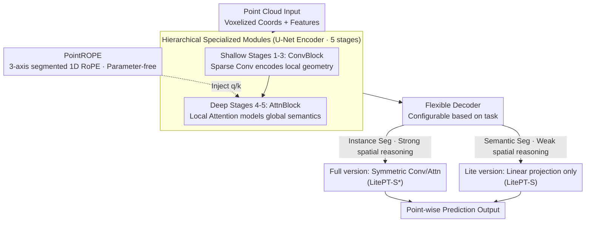

# LitePT: Lighter Yet Stronger Point Transformer

**Conference**: CVPR 2026  
**arXiv**: [2512.13689](https://arxiv.org/abs/2512.13689)  
**Code**: [GitHub](https://github.com/prs-eth/LitePT)  
**Area**: 3D Vision / Point Cloud Processing  
**Keywords**: Point Cloud Transformer, Hybrid Architecture, Positional Encoding, Efficient Inference, 3D Semantic Segmentation

## TL;DR

LitePT proposes a hierarchical hybrid architecture that utilizes sparse convolutions in shallow layers and attention in deep layers, based on an in-depth analysis of their respective roles across U-Net levels. By introducing the parameter-free PointROPE positional encoding, LitePT achieves 3.6x fewer parameters, 2x faster speed, and 2x memory savings compared to Point Transformer V3, while matching or exceeding its performance across multiple point cloud benchmarks.

## Background & Motivation

3D point cloud understanding is a fundamental task in robotics, autonomous driving, localization and mapping, and environmental monitoring. The current state-of-the-art architecture, Point Transformer V3 (PTv3), achieves leading performance on several benchmarks. However, PTv3 is not a pure Transformer—**67% of its parameters are allocated to sparse convolutional layers** (acting as conditional positional encoding), while the Transformer components (attention + MLP) account for only 30% of the parameters.

The core question is: Is it necessary to use both convolution and attention at every layer of the U-Net? The authors discovered an intuitive pattern through experiments:
- **Shallow Layers (High Resolution)**: Primarily encode local geometric features where convolution is sufficient and attention is computationally expensive.
- **Deep Layers (Low Resolution)**: Require capturing semantic and global context where attention is more efficient and suitable, whereas convolution leads to parameter bloat.

**Core Idea**: Use only convolution in shallow layers and only attention in deep layers, replacing expensive convolutional positional encoding with the parameter-free PointROPE.

## Method

### Overall Architecture

LitePT adopts a standard U-Net structure with 5 stages. The key difference lies in the computational modules used at different stages: the first 3 stages ($i \leq L_c=3$) utilize pure ConvBlocks (sparse convolution + linear layer + LayerNorm + residual connection), while the final 2 stages ($i > L_c$) utilize pure AttnBlocks (local attention enhanced by PointROPE). The decoder is selected based on the task, offering either a lightweight version (linear projection only) or a full version (symmetric convolution/attention configuration).

### Key Designs

**1. Hierarchical Specialized Modules: Convolution in shallow layers and attention in deep layers**

PTv3 integrates convolution and attention into every layer, resulting in high latency in shallow layers due to attention and high parameter counts in deep layers due to convolution—wasting resources at both ends. LitePT assigns roles by stage; the $i$-th block is either purely convolutional or purely attentional:

$$\mathcal{B}_i = \begin{cases} \text{ConvBlock}_i & i \leq L_c \\ \text{AttnBlock}_i & i > L_c \end{cases}$$

This separation is based on the inverse cost-benefit ratio of operations at different resolutions. In shallow layers with high token counts, the quadratic complexity of attention leads to latency explosions, while local geometry is already well-encoded by convolution. In deep layers with fewer tokens, attention provides global modeling at a controllable cost, whereas convolution bloats parameters due to high channel counts. Thus, keeping convolution shallow and attention deep simultaneously removes the "shallow attention latency bottleneck" and the "deep convolution parameter bottleneck."

**2. PointROPE: Applying RoPE to 3D coordinates for parameter-free positional encoding**

After switching to pure attention in deep layers, positional information is still required. PTv3 relied on sparse convolution for this—which accounted for 67% of its parameters. LitePT replaces this with a zero-parameter solution: the feature dimension $d$ is divided into three parts, each sub-space is bound to the x, y, or z coordinate axis, and a 1D RoPE is applied using voxel grid coordinates:

$$\tilde{\mathbf{f}_i} = [\text{RoPE}_{1D}(\mathbf{f}^x_i, x_i);\ \text{RoPE}_{1D}(\mathbf{f}^y_i, y_i);\ \text{RoPE}_{1D}(\mathbf{f}^z_i, z_i)]$$

Splitting by axis maintains the separability of the three directions, while the relative rotation property of RoPE allows the attention mechanism to naturally perceive relative geometric relationships between points without learnable weights. With an optimized CUDA implementation, it eliminates PTv3's heavy positional encoding parameters without sacrificing runtime speed.

**3. Flexible Decoder: Adjusting complexity based on task difficulty**

Once the encoder is defined, the decoder complexity is tuned for downstream tasks. Since semantic segmentation is point-wise classification with weak spatial reasoning requirements, LitePT-S uses a lightweight decoder with only linear projections. For instance segmentation, which requires distinguishing object boundaries and stronger spatial reasoning, LitePT-S* uses a symmetric hierarchical decoder that mirrors the encoder's convolution/attention distribution.

### Loss & Training

Following standard point cloud segmentation training pipelines, cross-entropy loss is used. Three model scales are provided:
- LitePT-S: $C=(36,72,144,252,504), B=(2,2,2,6,2)$, 12.7M parameters
- LitePT-B: $C=(54,108,216,432,576), B=(3,3,3,12,3)$, 45.1M parameters
- LitePT-L: $C=(72,144,288,576,864), B=(3,3,3,12,3)$, 85.9M parameters

## Key Experimental Results

### Main Results

**Efficiency Comparison (ScanNet, RTX 4090)**:

| Method | Params | Train Latency | Train Memory | Inference Latency | Inference Memory |
|------|--------|----------|----------|----------|----------|
| PTv3 | 46.1M | 110ms | 5.8G | 51ms | 4.1G |
| **LitePT-S** | **12.7M** | **72ms** | **2.3G** | **21ms** | **2.0G** |

**Outdoor Semantic Segmentation (nuScenes)**:

| Method | Params | mIoU |
|------|--------|------|
| PTv3 | 46.1M | 80.4 |
| **LitePT-S** | **12.7M** | **82.2** |

**Indoor Semantic Segmentation (Structured3D)**:

| Method | Params | Val mIoU |
|------|--------|----------|
| PTv3 | 46.1M | 82.4 |
| **LitePT-S** | **12.7M** | **83.6** |

**Instance Segmentation (ScanNet, PointGroup)**:

| Method | Params | mAP50 |
|------|--------|-------|
| PTv3 | 46.2M | 61.7 |
| **LitePT-S*** | **16.0M** | **64.9** |

### Ablation Study

**Choice of Convolution/Attention Split Point $L_c$ (nuScenes)**:

| Setting | Params | Latency | mIoU |
|------|--------|------|------|
| A-A-A-A-A ($L_c=0$) | 11.8M | 35.1ms | 82.1 |
| C-C-C-A-A ($L_c=3$) | 12.7M | 21.5ms | **82.2** |
| C-C-C-C-C ($L_c=5$) | 26.9M | 13.5ms | 75.4 |

**PointROPE Ablation**:

| Configuration | mIoU |
|------|------|
| Without PointROPE | 79.6 |
| PointROPE (b=100) | **82.2** |

### Key Findings

- Removing shallow attention has almost no impact on mIoU but significantly improves efficiency; removing deep convolution significantly reduces parameters while mIoU remains stable—validating the hierarchical design hypothesis.
- PointROPE contributes 2.6 mIoU points and is robust to the frequency parameter $b$ (effective from 10 to 10,000).
- LitePT-S achieves 1.8 higher mIoU on nuScenes and 3.2 higher mAP50 on ScanNet instance segmentation with roughly 1/4 of PTv3's parameters.
- The model exhibits excellent scalability: LitePT-L (85.9M params) remains faster and more memory-efficient than PTv3.

## Highlights & Insights

- The analysis-driven architectural design methodology is noteworthy: using visualization (PCA) and ablation experiments to reveal division-of-labor patterns before guiding the design.
- The "shallow convolution, deep attention" principle, while simple, effectively challenges the assumption that both operations are necessary at every layer.
- PointROPE is a natural and elegant extension of RoPE from NLP to 3D point clouds, being parameter-free with an optimized CUDA implementation.
- Even when the parameter count is doubled with LitePT-L (85.9M), it remains more efficient than PTv3 (46.1M)—indicating that the efficiency gains are structural rather than just a result of scaling down.

## Limitations & Future Work

- The optimal split point $L_c=3$ may vary by dataset and task; currently, it is applied uniformly without fine-grained adjustment.
- Application to non-U-Net architectures (e.g., pure encoder architectures) has not yet been verified.
- Theoretical guarantees regarding rotation invariance for PointROPE require further analysis.
- Performance on tasks such as point cloud registration or completion remains unknown, as only segmentation and detection were validated.

## Related Work & Insights

- **vs PTv3**: LitePT-S matches or exceeds PTv3 with 3.6x fewer parameters, 2x faster speed, and 2x less memory. The core difference is the hierarchical specialized design vs. unified hybrid blocks.
- **vs MinkUNet**: MinkUNet (39.2M params) is a pure convolutional network. LitePT-S (12.7M) has fewer parameters but uses deep attention to compensate for global context capability.
- **vs ConDaFormer/KPConvX**: These methods use convolution-augmented attention uniformly in every layer, whereas LitePT’s hierarchical design is more efficient.
- **Insight**: Re-evaluating the roles of components at different levels of a hybrid architecture may be more effective than improving individual modules.

## Rating

- Novelty: ⭐⭐⭐⭐ Simple yet powerful design principles; PointROPE is a natural yet effective extension; the core insight (hierarchical division of labor) is executed thoroughly.
- Experimental Thoroughness: ⭐⭐⭐⭐⭐ Covers semantic/instance segmentation and object detection across multiple indoor/outdoor datasets with detailed efficiency and ablation studies.
- Writing Quality: ⭐⭐⭐⭐⭐ Exemplary analysis-driven narrative style, excellent charts, and convincing conclusions.
- Value: ⭐⭐⭐⭐⭐ Highly significant for practical deployment due to 3.6x parameter reduction and 2x speedup; code is open-sourced.

<!-- RELATED:START -->

## Related Papers

- [\[CVPR 2026\] ART: Articulated Reconstruction Transformer](art_articulated_reconstruction_transformer.md)
- [\[CVPR 2026\] Fast Spatial Tracking with Visual Geometry Transformer](fast_spatial_tracking_with_visual_geometry_transformer.md)
- [\[CVPR 2026\] MVGGT: Multimodal Visual Geometry Grounded Transformer for Multiview 3D Referring Expression Segmentation](mvggt_multimodal_visual_geometry_grounded_transformer_for_multiview_3d_referring.md)
- [\[CVPR 2026\] MimiCAT: Mimic with Correspondence-Aware Cascade-Transformer for Category-Free 3D Pose Transfer](mimicat_mimic_with_correspondence-aware_cascade-transformer_for_category-free_3d.md)
- [\[CVPR 2026\] Deformation-based In-Context Learning for Point Cloud Understanding](deformation-based_in-context_learning_for_point_cloud_understanding.md)

<!-- RELATED:END -->
