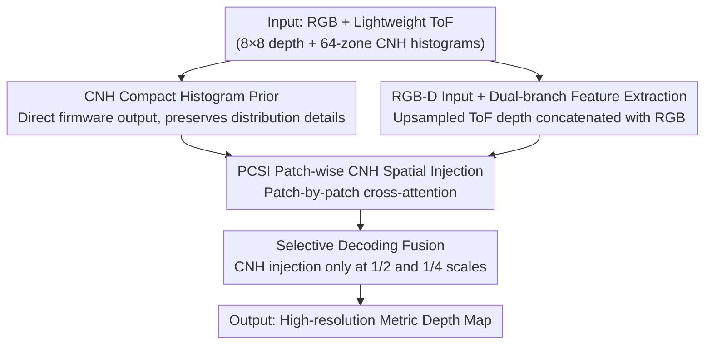

# LiteSense: Lifting Lightweight ToF with RGB for High-Resolution Metric Depth Estimation

**Conference**: CVPR 2026  
**Paper**: [CVF Open Access](https://openaccess.thecvf.com/content/CVPR2026/html/Li_LiteSense_Lifting_Lightweight_ToF_with_RGB_for_High-Resolution_Metric_Depth_CVPR_2026_paper.html)  
**Code**: Yes (The paper states that the source code and dataset are open-sourced on GitHub; ⚠️ please refer to the original text for the specific address)  
**Area**: 3D Vision  
**Keywords**: Metric Depth Estimation, RGB-ToF Fusion, Compact Normalized Histograms, Lightweight Network, Cross-modal Attention

## TL;DR
LiteSense fuses Compact Normalized Histograms (CNH) from multi-zone ToF sensors with RGB images using patch-wise cross-attention within a U-Net. With only 5.5M parameters, it approaches the performance of SOTA large models in indoor metric depth estimation and significantly outperforms the comparable RGB-ToF method DELTAR.

## Background & Motivation
**Background**: Metric depth estimation involves recovering absolute scale, high-resolution, and cross-scene consistent depth from images. Two mainstream approaches exist: pure visual monocular models (MiDaS, ZoeDepth, Metric3D, Depth Anything) achieve strong generalization through massive data, while active sensors (LiDAR, Structured Light, ToF) obtain absolute scale via physical ranging.

**Limitations of Prior Work**: Monocular models lack explicit metric supervision, making it difficult to stably recover absolute scale. Furthermore, they often require hundreds of millions of parameters and thousands of GFLOPs, making edge deployment difficult. Although lightweight ToF sensors (e.g., VL53L8CH) are inexpensive, they have extremely low resolution (8×8), making it impossible to reconstruct dense geometry in isolation. Fusing the two is a natural progression, but existing solutions (using sparse LiDAR as a prompt or fusing ToF depth with variance maps like DELTAR) suffer from high computational overhead and loss of detail due to the vast resolution disparity.

**Key Challenge**: A resolution gap exists between the absolute scale priors (from low-resolution ToF) and high-resolution textures (from RGB). Directly upsampling 8×8 depth to align with high-resolution RGB either blurs details or causes depth distribution crosstalk between unrelated regions due to global attention.

**Goal**: To preserve absolute scale and recover high-resolution details under a strict lightweight budget, enabling real-time deployment on edge devices.

**Key Insight**: The authors noted that new-generation multi-zone ToF sensors output CNH directly in firmware—a normalized return histogram for each zone. This set remains compact yet fully preserves the depth distribution within each zone, retaining significantly more distributional detail than the "mean + variance approximation of a single Gaussian" used by DELTAR.

**Core Idea**: To represent ToF "depth values" and "CNH distributions" separately. Depth values are upsampled and concatenated with RGB as a scale prior, while the CNH distribution is injected via a Patch-wise CNH Spatial Injection (PCSI) module specifically within corresponding spatial regions. This avoids inter-zone crosstalk, enabling high-resolution metric depth estimation with a minimal network.

## Method

### Overall Architecture
LiteSense is a U-Net-style encoder-decoder network. Inputs include an RGB image, low-resolution ToF depth, and CNH histograms for 64 zones; the output is a high-resolution metric depth map within the co-visible region of the camera and ToF. The process involves four steps: first, upsampled ToF depth and RGB are concatenated into an RGB-D input to provide a coarse scale prior; second, a dual-branch structure (Spatial branch + Histogram branch) extracts RGB-D features and CNH distribution features; third, the PCSI module injects CNH into RGB-D features within each local patch; finally, a multi-stage decoder progressively upsamples to reconstruct dense depth, performing CNH fusion only at intermediate scales to avoid blocking artifacts.

### Key Designs

**1. CNH Compact Normalized Histogram as Auxiliary Prior: Replacing Compressed Gaussian Sampling with Direct Firmware Distributions**

This design addresses the pain point of "maximizing ToF measurements." DELTAR approximates each zone's depth with a single Gaussian via mean and variance, then samples discrete depth values, losing significant detail. LiteSense instead uses CNH: each zone provides an 18-bin normalized return histogram covering 0–5.4 m (approx. 4.0 m effective), describing "photon return counts at different distances." The authors emphasize that intuitive methods like "depth-weighted histogram aggregation" or "Gaussian mixture fitting" destroy the physical interpretability of the raw signal. Therefore, they choose to **separate the representation** of depth values and CNH distributions: depth values provide scale through the RGB-D channel, while CNH distributions provide complementary structural guidance through an independent branch. Ablations show CNH is significantly superior to "depth-only" or "DELTAR-style sampling," proving the raw distribution is critical for accuracy.

**2. RGB-D Input + Dual-branch Mixed Feature Extraction: Injecting Absolute Scale into Channels and Encoding Distribution in High Dimensions**

Low-resolution ToF depth is upsampled and concatenated with RGB as an RGB-D input, allowing the depth channel to provide an initial global scale prior. The Spatial Block utilizes a modified MobileNetV4-Small, with four downsampling blocks extracting multi-scale features at 1/2, 1/4, 1/8, and 1/16 scales. The Histogram Block first normalizes each zone's CNH individually (ensuring each histogram reflects only the relative distribution within that zone) and encodes it via an MLP encoder without downsampling. Avoiding downsampling ensures the raw structure of the 64 distributions is preserved to capture subtle inter-zone depth differences. Ablations proved that injecting depth as a channel is superior to using it as a fusion feature.

**3. PCSI Patch-wise CNH Spatial Injection: Eliminating Inter-zone Crosstalk with Local Cross-attention**

CNH zones are physically independent; global cross-attention would cause spatially unrelated regions to interfere with each other. PCSI draws inspiration from tile-based super-resolution by splitting the encoded RGB-D feature map $F\in\mathbb{R}^{H\times W\times C_I}$ and CNH embeddings $H\in\mathbb{R}^{N^2\times C_H}$ into $N\times N$ non-overlapping patches ($N^2=64$, perfectly aligned with ToF zones). Each patch $F_i$ is modulated only by its corresponding CNH feature $H_i$: $\tilde{F}_i=\phi(F_i,H_i)$, where $\phi(\cdot)$ is implemented as cross-attention (RGB-D features as Query, CNH features as Key/Value). This "independent intra-zone modulation" eliminates crosstalk and allows each region to learn fine-grained distributions under its own CNH prior.

**4. Selective Decoding Fusion: Injecting CNH only at Intermediate Scales to Obviate Patch Boundary Artifacts**

The decoder is a U-Net-style progressive upsampler, but CNH enhancement is fused **only at the 1/2 and 1/4 scales**. The motivation is twofold: first, PCSI must partition feature maps into 64 patches to align with ToF zones; patches must be large enough for meaningful interaction with CNH, and 1/2 and 1/4 resolutions represent the smallest granularity that retains effective local structure. Second, fusion at every stage would introduce visible block boundary artifacts; restricting it to intermediate scales maintains global spatial continuity.

### Loss & Training
The total loss is the sum of scale-invariant log loss and gradient MAE: $L=L_{\text{SILog}}+L_{\text{Grad}}$. SILog uses the variant $L_{\text{SILog}}=\alpha\sqrt{\frac{1}{T}\sum_i g_i^2+\lambda(\frac{1}{T}\sum_i g_i)^2}$ with residuals $g_i=\log(d_i)-\log(d_{gt,i})$, where $\lambda=0.85$ and $\alpha=10$. The gradient term $L_{\text{Grad}}=\frac{1}{HW}\sum_{i,j}|\nabla d_{i,j}-\nabla d_{gt,i,j}|$ emphasizes boundary details. Training uses AdamW (initial lr 0.001, weight decay 0.01) with warm-up and cosine annealing on a single RTX 3090, 416×416 input, batch size 32, for 50 epochs without pre-training.

## Key Experimental Results

**Metric Definitions**: AbsRel is Absolute Relative error, RMSE is Root Mean Square Error (meters), $\delta_i$ is the threshold accuracy—the percentage of pixels satisfying $\max(\hat{d}/d,\ d/\hat{d})<1.25^i$. #Params and #FLOPs measure lightweight efficiency.

### Main Results
Comparison with monocular metric depth (MMDE) and guided methods on NYUv2 (FLOPs calculated at 416×416):

| Method | Category | δ1 ↑ | RMSE ↓(m) | AbsRel ↓ | #Params ↓(M) | #FLOPs ↓(G) |
|------|------|------|-----------|----------|--------------|-------------|
| HybridDepth | MMDE (SOTA) | 0.989 | 0.128 | 0.026 | 59.15 | 377.82 |
| Metric3D-V2-L | MMDE | 0.989 | 0.183 | 0.047 | 302.91 | 548.05 |
| DA-V2-S | MMDE | 0.961 | 0.228 | 0.063 | 24.18 | 82.61 |
| DELTAR | Guided (RGB-ToF) | 0.952 | 0.311 | 0.064 | 18.55 | 79.98 |
| **Ours** | Guided | **0.982** | **0.197** | **0.029** | **5.48** | **33.87** |

Key takeaway: Compared to the similar RGB-ToF method DELTAR, $\delta_1$ improved from 0.952 to 0.982 and AbsRel decreased from 0.064 to 0.029. Parameters were reduced to 5.48M (approx. 30% of DELTAR, a 70% saving), and FLOPs were the lowest at 33.87G. It closely approaches the SOTA HybridDepth with only a fraction of the computational cost.

Zero-shot generalization (Trained on NYUv2, tested directly on SUN RGB-D):

| Method | δ1 ↑ | RMSE ↓(m) | AbsRel ↓ |
|------|------|-----------|----------|
| ZoeDepth | 0.918 | 0.402 | 0.105 |
| Metric3D-V2-L | 0.962 | 0.410 | 0.107 |
| DELTAR | 0.950 | 0.367 | 0.063 |
| **Ours** | **0.980** | **0.228** | **0.032** |

Ours achieves the highest accuracy on unseen indoor scenes, validating the value of ToF scale priors for generalization. Further validation on the THDR3K real-world dataset showed $\delta_1$ of 0.959 (simulated) and 0.914 (real), outperforming DELTAR (0.907).

### Ablation Study
Component ablation on NYUv2 (baseline is RGB-only):

| ToF Depth | CNH Histogram | PCSI | δ1 ↑ | RMSE ↓(m) | AbsRel ↓ | Description |
|----------|-----------|------|------|-----------|----------|------|
| — | — | — | 0.663 | 0.718 | 0.216 | RGB-only baseline |
| Feature Fusion | — | — | 0.891 | 0.449 | 0.099 | ToF Depth as feature |
| Channel Concat | — | — | 0.926 | 0.359 | 0.080 | ToF Depth as channel (better) |
| — | CNH | — | 0.948 | 0.352 | 0.056 | CNH alone outperforms depth |
| Channel Concat | CNH | — | 0.962 | 0.290 | 0.046 | Depth+CNH, Global Attention |
| Channel Concat | CNH | ✓ | **0.982** | **0.197** | **0.029** | Full Model |

### Key Findings
- CNH is the primary accuracy driver: Adding CNH alone ($\delta_1 = 0.948$) outperforms adding ToF depth alone (0.891/0.926), showing raw distributions are more informative than discrete values.
- "Depth as Channel" exceeds "Depth as Feature": Concatenating upsampled depth as an RGB-D channel (0.926) utilizes ToF spatial cues better than side-branch feature fusion (0.891).
- PCSI is indispensable: Replacing patch-wise injection with global cross-attention results in a significant drop (from 0.982 to 0.962), proving the necessity of preventing inter-zone crosstalk for high-resolution detail.
- Deployment metrics: At 480×480 input, GPU (RTX-3060) takes ~15 ms, CPU (i5-12400F) ~160 ms, and NPU (RK3576) ~570 ms (unquantized), achieving near-real-time performance across heterogeneous hardware.

## Highlights & Insights
- "Separating depth values and CNH distributions" is the most clever design choice: Depth provides scale via channels, while distribution provides structure via a side branch, avoiding the loss of physical interpretability found in Gaussian fitting.
- PCSI applies the "patch alignment" of tile-based super-resolution to cross-modal attention, using spatial alignment as a prior to limit attention range. This is more direct than adding regularization to global attention and is applicable to any "zone-based sensor + dense image" scenario.
- "Selective fusion at intermediate scales" reflects engineering insight into the trade-off between fusion granularity and blocking artifacts, solving the issue via resolution placement rather than extra modules.
- Approaching 300M-scale SOTA with only 5.48M parameters demonstrates that model capacity can be significantly compressed when strong physical priors (ToF) are available.

## Limitations & Future Work
- The authors admit weaker boundary estimation for tiny objects; ToF mainly improves global scale consistency rather than edge sharpness.
- Accuracy drops significantly beyond 3.5 m due to the sensor's physical limit (~4.0 m), suggesting limited applicability for outdoor or large-scale scenes. ⚠️
- A domain gap exists between simulated and real CNH distributions, necessitating fine-tuning. THDR3K dataset size is also limited (2738 pairs, 16 scenes).
- Potential improvements: Modeling CNH as a learnable continuous representation instead of fixed-bin histograms, or introducing boundary refinement branches.

## Related Work & Insights
- **vs DELTAR**: Both fuse multi-zone ToF and RGB, but DELTAR uses Gaussian approximations which lose detail and result in a larger model; LiteSense uses raw CNH + PCSI, achieving higher accuracy and 70% fewer parameters.
- **vs Monocular Large Models**: Models like Metric3D or Depth Anything rely on millions of pre-training samples and 300M+ parameters; LiteSense approaches their accuracy without pre-training by utilizing ToF priors.
- **vs LiDAR-prompt methods (e.g., PriorDA)**: LiDAR provides sparse points, while lightweight ToF provides low-resolution but spatially continuous depth maps, which are better suited for channel concatenation. PriorDA underutilizes multi-zone ToF compared to this work.

## Rating
- Novelty: ⭐⭐⭐⭐ Introduces CNH to depth estimation and designs PCSI; a clear combination of new sensor features and mature modules.
- Experimental Thoroughness: ⭐⭐⭐⭐ Strong results across NYUv2/SUN RGB-D/THDR3K with full ablation and multi-hardware deployment, though the real-world dataset is small.
- Writing Quality: ⭐⭐⭐⭐ Motivation and design are well-explained with clear diagrams and formulas.
- Value: ⭐⭐⭐⭐ Practical for edge 3D perception; open-sourced data fills a gap in the RGB-ToF-CNH domain.

<!-- RELATED:START -->

## Related Papers

- [\[CVPR 2026\] MD2E: Modeling Depth-to-Edge Cues for Monocular Metric Depth Estimation](md2e_modeling_depth-to-edge_cues_for_monocular_metric_depth_estimation.md)
- [\[CVPR 2026\] Depth Any Panoramas: A Foundation Model for Panoramic Depth Estimation](depth_any_panoramas_a_foundation_model_for_panoramic_depth_estimation.md)
- [\[CVPR 2026\] Dense Metric Depth Completion from Sparse Direct Time-of-Flight Sensors](dense_metric_depth_completion_from_sparse_direct_time-of-flight_sensors.md)
- [\[CVPR 2026\] Depth Hypothesis Guided Iterative Refinement for Event-Image Monocular Depth Estimation](depth_hypothesis_guided_iterative_refinement_for_event-image_monocular_depth_est.md)
- [\[CVPR 2026\] ARES: Unifying Asymmetric RGB-Event Stereo for Probabilistic Scene Flow Estimation](ares_unifying_asymmetric_rgb-event_stereo_for_probabilistic_scene_flow_estimatio.md)

<!-- RELATED:END -->
