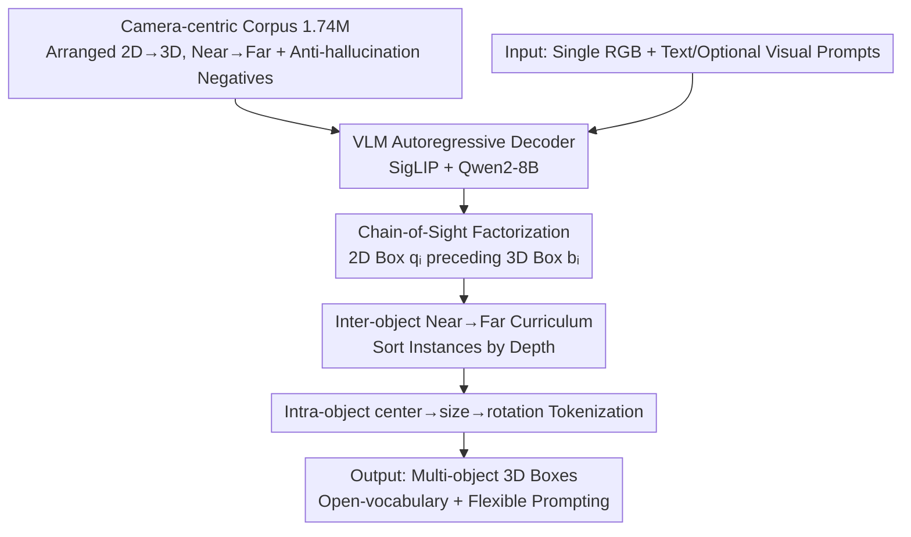

# LocateAnything3D: Vision-Language 3D Detection with Chain-of-Sight

**Conference**: CVPR 2026  
**Paper**: [CVF Open Access](https://openaccess.thecvf.com/content/CVPR2026/html/Man_LocateAnything3D_Vision-Language_3D_Detection_with_Chain-of-Sight_CVPR_2026_paper.html)  
**Code**: None (⚠️ No address provided in the paper text)  
**Area**: Object Detection (Open-vocabulary Monocular 3D Detection / Vision-Language Models)  
**Keywords**: Monocular 3D Detection, Vision-Language Models, Chain-of-Sight, Autoregressive Decoding, Open-vocabulary

## TL;DR
LocateAnything3D reformulates monocular multi-object 3D detection as a next-token prediction task for VLMs—first by having the decoder output 2D boxes as a "visual Chain-of-Sight," and then by solving 3D boxes following a curriculum of near-to-far and center→size→rotation. Without any specialized 3D heads, it increases the $AP_{3D}$ on Omni3D from 24.92 to 38.90.

## Background & Motivation
**Background**: VLMs have achieved high proficiency in 2D open-world perception (localization, description, reasoning), utilizing a single model and decoding interface to process arbitrary image content across domains; however, monocular 3D detection remains a missing piece in the VLM toolbox.

**Limitations of Prior Work**: Traditional monocular 3D detectors perform well in narrow domains but rely on task-specific heads, closed label spaces, and precise camera calibration, losing the universality, compositionality, and instruction-following capabilities of VLMs. Recent attempts either attach a specialized 3D head to an open-vocabulary 2D detector (OVMono3D, DetAny3D) or prompt foundation models with auxiliary geometric inputs, but most only solve single-object grounding or introduce custom modules that break the inherent simplicity of VLMs.

**Key Challenge**: 3D boxes require the simultaneous prediction of three sets of strongly coupled parameters: center, size, and rotation, while monocular cues are inherently ambiguous. If the autoregressive decoder directly outputs 3D tokens from the start, early tokens are difficult to predict and contain low information density; blurry distant objects can contaminate the entire sequence prefix, leading to a breakdown in subsequent decoding.

**Goal**: To identify the "most VLM-native recipe" that allows multi-object monocular 3D detection to work directly without adding specialized heads or disrupting text/visual prompt interfaces.

**Key Insight**: Humans often "recognize what and where an object is in 2D first" before inferring distance, size, and pose. The authors transplant this 2D-to-3D visual reasoning sequence into autoregressive decoding—early tokens should be simple, high-information, and attributable.

**Core Idea**: Utilize Chain-of-Sight (CoS)—outputting the 2D box of each instance first as a high-confidence "visual chain-of-thought" to anchor pixel evidence before solving the 3D box; this is coupled with a near→far inter-object curriculum and a center→size→rotation intra-object tokenization, transforming open-world monocular 3D detection into a "simple, learnable, and easy-to-decode" next-token problem.

## Method

### Overall Architecture
The input consists of a single RGB image plus free-text queries (optional visual prompts: boxes/clicks), which drive an autoregressive VLM decoder to output a structured sequence: for each instance, a 2D box $q_i$ is followed immediately by a 3D box $b_i$, until `<eos>`. The design incorporates three curriculum layers: instances sorted near→far, 2D as CoS leading to 3D within each instance, and center→size→rotation tokenization inside each 3D box. The training corpus is constructed in a camera-centric format presented exactly in decoding order.

### Key Designs

**1. Chain-of-Sight Factorization: Using 2D Boxes as Visual Chains to Anchor 3D**

Addressing the issue where direct 3D decoding leads to difficult early tokens and hallucinations, CoS interleaves 2D and 3D in the sequence: the decoder outputs $S=(q_1,b_1,q_2,b_2,\dots,\langle eos\rangle)$, where each 2D box $q_i$ is followed by its 3D box $b_i$. The conditional probability is factorized as $P(S\mid I,c)=\prod_i \underbrace{P(q_i\mid I,c,S_{<i})}_{\text{2D localization}}\underbrace{P(b_i\mid I,c,S_{<i},q_i)}_{\text{3D estimation}}\cdot P(\langle eos\rangle\mid\cdot)$. Compared to direct autoregression on 3D boxes ($P(B\mid I,c)=\prod_i P(b_i\mid I,c,b_{<i})$), the intermediate $q_i$ serves three functions: focusing the search on correct pixels, binding 3D tokens to visible evidence to reduce hallucinations, and aligning with the principle that early tokens should be simple and informative. This is analogous to text CoT for complex reasoning—committing to image space first before solving 3D. It also naturally supports visual prompts: if a user provides a box/click, the decoder can directly continue the 3D tokens for that instance without switching heads or losses.

**2. Inter-object Near→Far Curriculum: Sorting by Depth to Solve High-Evidence Instances First**

Traditional 2D detectors often use scanline or left-to-right ordering, which is unrelated to 3D geometry—two adjacent 2D boxes may have vastly different depths. Distant, blurry instances appearing early in the sequence can bias subsequent decoding. This method sorts instances by 3D center depth (near→far). Solving near objects first has three benefits: ① Utility (near objects are most critical for interaction/safety); ② Evidence Quality (near objects have stronger monocular cues); ③ Context (once near geometry is fixed, it constrains distant objects via relative scale and occlusion). Ablations show random order is worst (17.5), scanline is better (30.6), and near→far is best (33.1).

**3. Intra-object center→size→rotation Tokenization: Ordering Parameters by Observability**

A 3D box $b_i=(t_i,d_i,R_i)$ (camera-coordinate center $t\in\mathbb{R}^3$, metric size $d\in\mathbb{R}_+^3$, rotation $R\in SO(3)$) can be represented in multiple ways. Corner-based encoding listing 8 vertices is ambiguous for autoregressive decoders and intensifies early token errors. This work uses semantically ordered triplets with a fixed center→size→rotation sequence, corresponding to a decreasing order of observability: "Where is it → How big is it → How is it oriented." Fixing position constrains scale, and fixing scale stabilizes rotation estimation. Predictions are in the camera frame to avoid scene-level coordinate estimation, improving generalization. Ablations show CSR (33.1) outperforms CRS (32.9) and RSC (28.8).

**4. Camera-centric Large-scale Corpus + Anti-hallucination Negatives**

To train CoS end-to-end, supervision must be presented exactly in the decoding order. The authors unified six datasets (ARKitScenes, SUN-RGBD, Hypersim, Objectron, KITTI, nuScenes) into a shared JSONL format using camera coordinates. Stage I involved normalized multi-box alignment: one category per line per image, instances sorted by depth, filtering blurred targets (visibility > 0.16, truncation < 0.84), resulting in ~480K items. An additional 1.0M single-object grounding descriptions were auto-labeled using a strong VLM. Stage II packed data into two-turn dialogues. Explicit supervision for "no match" was included: sampling absent categories (including hard negatives like car/van) to make the model output a `<no object/>` sentinel token, capped at 10%. The final 1.74M training dialogues cover indoor/outdoor and multi-camera setups.

### Loss & Training
The strategy involves a 2D detection and grounding pre-training stage followed by end-to-end training on the full CoS sequence (2D→3D), targeting standard cross-entropy over token sequences. The implementation uses a SigLIP vision encoder + Qwen2-8B backbone + lightweight MLP projector. Images are cut into up to 12 adaptive tiles plus a global thumbnail (448px each). Training utilized bfloat16 + FlashAttention 2, 16384-token context, AdamW (lr 1e-5, weight decay 0.05), and ZeRO-3, requiring 46 hours on 64 H100 GPUs for 37K steps.

## Key Experimental Results

**Key Metric Description**: $AP_{3D}$ is the 3D Average Precision, calculated by averaging across volumetric 3D IoU thresholds $\tau\in\{0.05,0.10,\dots,0.50\}$. Evaluation uses a target-aware protocol (prompting only categories present in the ground truth) to focus on 3D localization quality.

### Main Results
Omni3D full benchmark (unified indoor/outdoor) 3D detection, $AP_{3D}$:

| Method | Req. External/GT 2D | $AP_{3D}$ ↑ |
|------|------------------|--------|
| OVMono3D | Req. Ext. 2D Detector | 22.98 |
| Cube R-CNN | Closed-vocabulary | 23.26 |
| DetAny3D | Prompable 3D | 24.92 |
| DetAny3D w/ GT 2D Box | Given GT 2D | 34.38 |
| **LocateAnything3D (Ours)** | Single-image E2E, No Ext. 2D | **38.90** |

Takeaway: The 38.90 $AP_{3D}$ is a +13.98 absolute gain over the previous best (DetAny3D 24.92). Even when the competitor is provided with ground truth 2D boxes (34.38), ours remains +4.52 higher—indicating that joint 2D/3D learning in a single autoregressive interface is more effective than attaching 3D heads to external 2D proposals.

Zero-shot performance on novel categories (target-aware) $AP_{3D}$:

| Method | KITTI Novel | SUN-RGBD | ARKitScenes |
|------|-----------|----------|-------------|
| OVMono3D + G-DINO 2D | 4.71 | 16.78 | 13.21 |
| DetAny3D + G-DINO 2D | 25.73 | 21.07 | 24.56 |
| **LocateAnything3D (Single-img, no ext. 2D)** | **25.87** | **26.33** | **29.06** |

Ours achieves the strongest zero-shot results across all benchmarks; it does not rely on external 2D detectors, suggesting "2D-before-3D" reasoning transfers effectively to unseen categories.

### Ablation Study
Ablation of the three-layer design on Omni3D OUT ($AP_{out3D}$):

| Design Layer | Variant | $AP_{out3D}$ ↑ |
|--------|------|-----------|
| Inter-object Curriculum | Random Order | 17.5 |
| Inter-object Curriculum | Left-to-Right | 30.6 |
| Inter-object Curriculum | **Near→Far** | **33.1** |
| Intra-object Factorization | No 2D (Direct 3D) | 22.7 |
| Intra-object Factorization | 3D then 2D | 26.2 |
| Intra-object Factorization | **2D then 3D (CoS)** | **33.1** |
| 3D Tokenization | Rotation-Size-Center | 28.8 |
| 3D Tokenization | Center-Rotation-Size | 32.9 |
| 3D Tokenization | **Center-Size-Rotation** | **33.1** |

### Key Findings
- Removing the 2D Chain-of-Sight is most detrimental: direct 3D prediction drops to 22.7, and 3D-then-2D only reaches 26.2, significantly lower than CoS (33.1).
- Sequence position carries semantics: random order is the worst (17.5), proving that token order itself is informative; near→far is more stable than scanline (30.6).
- Tokenization order matters: CSR (33.1) is optimal, as delaying rotation until after scale stabilizes pose estimation.
- End-to-end > attached heads: even when competitors are given GT 2D boxes, they lag behind, highlighting the interface advantage of joint 2D-3D learning.

## Highlights & Insights
- Analogizing "text CoT for stable reasoning" to "2D as visual CoS for stable 3D" is an elegant cross-modal transfer—any structured prediction where "early tokens should be attributable" can benefit from this explicit intermediate evidence.
- "Curriculum-aligned supervision" is a core engineering insight: the data was not just collected but ordered (near→far, 2D→3D) to match the decoding distribution, a "data-decoding co-design" applicable to other structural tasks.
- Using center→size→rotation based on observability instead of corner encoding solves the early-error amplification problem simply and effectively.
- Achieving SOTA without specialized heads preserves the unified interface for open-vocabulary and visual prompting, serving as a convincing step toward using VLMs as the perception backbone for embodied AI.

## Limitations & Future Work
- High training cost: 64 H100s for 46 hours and 1.74M dialogues is a high entry barrier; the 8B model is also heavy for inference. ⚠️
- Restricted to monocular single images: it does not utilize temporal consistency from video; the ambiguity of distant objects is mitigated by curricula but not eliminated.
- Dependency on camera intrinsics: robustness when intrinsics are unknown or noisy was not fully discussed. ⚠️
- Limited qualitative analysis of failure cases (occlusion/truncation) in the main text.

## Related Work & Insights
- **vs OVMono3D / DetAny3D**: Both "lift" 2D detection to 3D or attach 3D heads to foundation models, requiring external components; ours joint-learns 2D and 3D in one decoder, yielding significantly higher $AP_{3D}$ and zero-shot transfer.
- **vs Cube R-CNN**: A closed-vocabulary specialist; ours retains open-vocabulary and instruction-following (38.90 vs 23.26).
- **vs Corner-based 3D encoding**: Corner codes are ambiguous and amplify errors; our CSR semantic ordering is more learnable and calibrated.
- **vs Text CoT**: Transfers CoT from language to vision—2D boxes as "visual CoS" provide a general paradigm for structured geometric prediction in VLMs.

## Rating
- Novelty: ⭐⭐⭐⭐⭐ Formulating multi-object monocular 3D detection as a pure next-token problem with CoS and dual curricula is highly innovative.
- Experimental Thoroughness: ⭐⭐⭐⭐ Solid evidence across Omni3D and zero-shot benchmarks; however, robustness analyses were relegated to supplementary material.
- Writing Quality: ⭐⭐⭐⭐⭐ The motivation is logically sound, clearly explaining the "why" behind 2D-first, near-far, and CSR ordering.
- Value: ⭐⭐⭐⭐⭐ Bridging open-vocabulary recognition and metric 3D understanding while maintaining a unified VLM interface is a major step for embodied perception.

<!-- RELATED:START -->

## Related Papers

- [\[CVPR 2026\] Unleashing the Power of Chain-of-Prediction for Monocular 3D Object Detection](unleashing_the_power_of_chain-of-prediction_for_monocular_3d_object_detection.md)
- [\[CVPR 2026\] MonoVLM: Monocular 3D Visual Grounding with Vision Language Models](monovlm_monocular_3d_visual_grounding_with_vision_language_models.md)
- [\[CVPR 2026\] AREA3D: Active Reconstruction Agent with Unified Feed-Forward 3D Perception and Vision-Language Guidance](area3d_active_reconstruction_agent_with_unified_feed-forward_3d_perception_and_v.md)
- [\[CVPR 2026\] Zero-Shot Depth Completion with Vision-Language Model](zero-shot_depth_completion_with_vision-language_model.md)
- [\[CVPR 2026\] Towards Intrinsic-Aware Monocular 3D Object Detection](towards_intrinsic-aware_monocular_3d_object_detection.md)

<!-- RELATED:END -->
