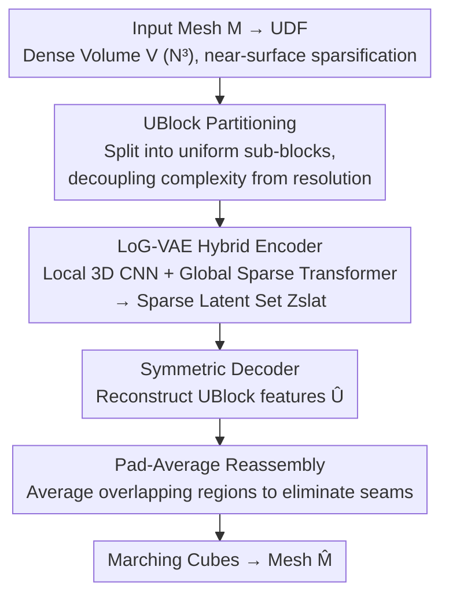

# LoG3D: Ultra-High-Resolution 3D Shape Modeling via Local-to-Global Partitioning

**Conference**: CVPR 2026  
**Paper**: [CVF Open Access](https://openaccess.thecvf.com/content/CVPR2026/html/Yang_LoG3D_Ultra-High-Resolution_3D_Shape_Modeling_via_Local-to-Global_Partitioning_CVPR_2026_paper.html)  
**Code**: To be confirmed  
**Area**: 3D Vision / 3D Generation  
**Keywords**: Unsigned Distance Field (UDF), 3D VAE, Local-to-Global, Ultra-high-resolution reconstruction, Sparse Transformer

## TL;DR
LoG3D partitions high-resolution Unsigned Distance Fields (UDF) into uniform sub-voxel blocks called UBlocks. It employs a hybrid VAE with "local 3D convolution + global sparse Transformer" for block-wise encoding and decoding, combined with a Pad-Average strategy to eliminate boundary seams. This pushes the reconstruction resolution of 3D VAEs to $2048^3$ for the first time, achieving SOTA in both reconstruction accuracy and generation quality.

## Background & Motivation

**Background**: 3D generative AI has progressed rapidly, but high-fidelity 3D content generation remains significantly more difficult than 2D. Mainstream methods trade off between various representations: point clouds, meshes, 3DGS, and implicit fields. Signed Distance Fields (SDF) in implicit representations are currently the dominant paradigm due to their excellence in modeling continuous surfaces.

**Limitations of Prior Work**: SDFs rely on "consistent inner/outer signs," necessitating **expensive and lossy watertight preprocessing** of input meshes. This step discards geometric details and fails entirely for open surfaces or non-manifold geometries (e.g., open shells, complex internal structures). While point clouds bypass watertight constraints, they are sensitive to sampling density as discrete representations, often resulting in holes and discontinuities in reconstructed surfaces.

**Key Challenge**: A deeper issue lies in the VAE architecture itself—sparse voxel models generally utilize an "aggressive compression-decompression" pipeline: downsampling the entire input into a single global latent variable before upsampling for reconstruction. This **global-bottleneck design naturally discards high-frequency geometric details**, which are vital for fidelity. Furthermore, VecSet-style VAEs suffer from "modality mismatch": compressing discrete local point features into global latent sets while requiring decoding back into continuous local fields, forcing the attention mechanism to handle both "semantic abstraction" and "modality conversion."

**Goal**: To find a representation and architecture that can handle arbitrary topologies (open/non-manifold) while pushing the reconstruction resolution to ultra-high levels ($2048^3$) without losing high-frequency details.

**Key Insight**: The authors turn to **Unsigned Distance Fields (UDF)** as the core representation—it bypasses error-prone sign calculation, is naturally robust to noise and real-world data defects, remains topology-agnostic, and faithfully represents non-manifold geometry that SDFs cannot handle. As a continuous field, it is more compatible with neural networks than discrete point clouds.

**Core Idea**: Replace the global bottleneck with a "Local-to-Global (LoG)" architecture. High-resolution UDFs are first partitioned into fixed-size UBlocks. Lightweight 3D CNNs preserve local details within each block, while sparse Transformers model long-range dependencies between blocks to ensure global consistency. This **decouples model complexity from input resolution**, achieving unprecedented scalability.

## Method

### Overall Architecture
LoG-VAE is a local-to-global variational autoencoder designed for ultra-high-resolution 3D shape modeling, operating entirely on UDFs. Given a triangle mesh $\mathcal{M}$, the process is: convert to UDF and discretize into a dense volume $V\in\mathbb{R}^{N\times N\times N}$ → retain near-surface voxels based on a distance threshold $\tau$ to obtain a sparse representation → **Partition** into uniform UBlocks with padding → Hybrid Encoder $\mathbf{E}$ (local 3D convolution + global sparse Transformer) maps to a sparse latent vector set $\mathcal{Z}_{slat}$ → Symmetric Decoder $\mathbf{D}$ reconstructs $\hat{\mathcal{U}}$ → Reassemble into a complete UDF volume using **Pad-Average** to eliminate seams → Extract final mesh $\hat{\mathcal{M}}$ via Marching Cubes. The entire network is trained under UDF loss supervision.

### Key Designs

**1. UBlock Partitioning: Decoupling Model Complexity from Input Resolution**

This is the cornerstone of the paper, directly addressing the "global bottleneck loses high-frequency details" pain point. The mesh is first converted to a UDF and discretized into a dense volume $V\in\mathbb{R}^{N\times N\times N}$, followed by sparsification to keep only near-surface voxels: $\mathcal{V}_{sparse}=\{(\mathbf{x}_i,u(\mathbf{x}_i))\mid u(\mathbf{x}_i)<\tau\}$. By setting $\tau=4/N$ and truncating other distances to $5/N$, with overall min-max normalization to $[0,1]$, the volume is partitioned into a $D\times D\times D$ sub-volume grid (UBlocks). The sub-block resolution $D$ is determined by a partition factor $s$ ($D=N/s$), selecting only $L$ "active" blocks containing sparse voxels: $\mathcal{U}=\{(\mathbf{f}_i, \mathbf{p}_i)\}_{i=1}^L$, where $\mathbf{f}_i\in\mathbb{R}^{D\times D\times D}$ are normalized UDF values and $\mathbf{p}_i\in\mathbb{Z}^3$ are grid coordinates. For typical sparse shapes, $L\ll s^3$. Crucially, the model only operates on fixed-size UBlocks; **scaling to $2048^3$ only increases the number of sparse tokens $L$ without changing any model parameters**, avoiding the irreversible loss of high-frequency details inherent in traditional global compression.

**2. LoG-VAE Hybrid Encoder/Decoder: Local Convolutions for Detail, Global Sparse Transformer for Consistency**

This design resolves the dilemma between "modality mismatch in VecSet" and "limited receptive fields of local convolutions." The encoder $\mathbf{E}$ is a hybrid framework: it first uses 3D convolution + 3D max-pooling within each UBlock to extract local geometric features and progressively downsample spatial resolution. Then, treating sparse UBlocks as **variable-length tokens**, it borrows from TRELLIS to add 3D coordinate-based positional embeddings to each valid voxel and utilizes **shifted window attention** to model long-range dependencies between valid blocks. The decoder $\mathbf{D}$ is symmetric to the encoder, alternating between global sparse attention layers and local 3D CNN blocks to upsample the latent representation $\mathcal{Z}_{slat}$ back to $\hat{\mathcal{U}}$, which is then mapped back to original spatial positions in the $N^3$ volume to recover distance values. The process is defined as $\mathcal{Z}_{slat}=\mathbf{E}(\mathcal{U}),\ \hat{\mathcal{U}}=\mathbf{D}(\mathcal{Z}_{slat})$. Since UDF values are always non-negative, Marching Cubes extracts the mesh using an isosurface threshold $\theta=1/N$. Local convolutions enable high-fidelity compression/restoration of local details, while the sparse Transformer ensures global structural integrity, preventing a single attention mechanism from being overburdened.

**3. Pad-Average Strategy: Eliminating Block Boundary Seams via Overlapping Padding + Averaging**

The side effect of partitioning is boundary discontinuity—neighboring UBlocks have different feature representations, which can cause surface roughness and topological fractures at seams. Pad-Average solves this in two steps: first, it applies padding to each UBlock, expanding the input resolution from $D^3$ to $(D+2\alpha)^3$ (where $\alpha$ is padding size). The total number of blocks $L$ remains the same, but adjacent blocks now overlap spatially, providing context for the Transformer to learn inter-block correlations. During reassembly, overlapping blocks are mapped back to the $N^3$ volume, and **values in overlapping regions are averaged** to determine the final UDF value, smoothing the transition. This dual action of "padding for context + averaging for seam removal" suppresses boundary artifacts while maintaining geometric fidelity. Ablations show that gains saturate after $\alpha=2$, with larger values significantly increasing memory usage; thus, $\alpha=2$ is the default.

### Loss & Training
Supervision is applied to all spatial positions of all UBlocks ($|\hat{\mathcal{U}}|=|\mathcal{U}|=L$). The reconstruction term is a regression loss on UDF values $\mathcal{L}_{udf}=\frac{1}{|\hat{\mathcal{U}}|}\sum_{(\mathbf{x},\hat u(\mathbf{x}))\in\hat{\mathcal{U}}}\lVert u(\mathbf{x})-\hat u(\mathbf{x})\rVert_2^2$, with KL divergence regularization on the latent representation $\mathcal{Z}_{slat}$ to constrain the latent space: $\mathcal{L}_{total}=\mathcal{L}_{udf}+\lambda\mathcal{L}_{KL}$. In practice, **Huber loss replaces standard L2** for the reconstruction term due to its robustness against outliers. The implementation is based on TRELLIS official code, trained on approximately 500,000 high-quality meshes (strictly filtered from ABO/HSSD/Objaverse-XL). It is first trained at $1024^3$ ($s=128, D=8$) and then fine-tuned to support $2048^3$ ($s=256, D=8$) to learn multi-scale details progressively. Default $\alpha=2$, latent channels 16, trained on 8×H20 for 5 days with batch=1 and AdamW initial learning rate $5\times10^{-5}$.

## Key Experimental Results

Baselines include Hunyuan3D-2.1 / TRELLIS / Dora (all $256^3$), Direct3D-S2 / TripoSF (both $1024^3$), using official pretrained weights. Metrics: **CD** (Chamfer Distance, lower is better), **F1** (calculated at thresholds 0.01 and 0.001); detail metrics **NMSE** (Mean Squared Error of multi-view normals) and **SNE** (Sharp Normal Error, specifically measuring reconstruction of salient regions and sharp edges). Test sets include a Toys4k subset (high-frequency details) and a self-curated iHome set (household items, purposely different from the training distribution to test OoD generalization).

### Main Results
LoG3D comprehensively outperforms all baselines across every metric on both datasets at $1024^3$, with further improvements when scaled to $2048^3$ (CD ×10⁵, F1 ×10²):

| Method | Resolution | NMSE ↓ | SNE ↓ | CD ↓ | F1(0.001) ↑ |
|------|--------|--------|-------|------|-------------|
| Hunyuan3D-2.1 | 256³ | 3.00 | 18.74 | 0.54 | 7.22 |
| TRELLIS | 256³ | 3.30 | 14.51 | 0.39 | 20.01 |
| Direct3D-S2 | 1024³ | 3.17 | 12.35 | 0.23 | 21.99 |
| TripoSF | 1024³ | 1.27 | 6.38 | 0.07 | 36.16 |
| **Ours-1024** | 1024³ | 0.34 | 1.13 | 0.06 | 42.85 |
| **Ours-2048** | 2048³ | **0.29** | **0.85** | 0.06 | **42.98** |

(Data above for Toys4k. Ours-2048 also leads on iHome, e.g., SNE drops to 0.94 and F1(0.001) reaches 39.37.) The authors emphasize that compared to Direct3D, this model has the same compression ratio, and twice the compression of TripoSF, yet performs significantly better. Furthermore, scaling to $2048^3$ only increases sparse tokens without modifying parameters.

### Ablation Study
Conducted on Toys4k at $1024^3$, removing core modules (CD ×10⁵, F1 ×10²):

| Configuration | NMSE ↓ | SNE ↓ | CD ↓ | F1(0.001) ↑ | Description |
|------|--------|-------|------|-------------|------|
| Full Pipeline | 0.34 | 1.13 | 0.06 | 42.85 | Complete model |
| w/o UBlocks (Local Conv) | 2.13 | 3.74 | 0.09 | 41.77 | Replaced with standard DS/US; significant quality drop |
| w/o Global Sparse Transformer | 0.96 | 2.92 | 0.07 | 42.48 | Visible seams and discontinuous surfaces |
| w/o Pad-Average | 0.58 | 1.90 | 0.07 | 42.55 | Boundary artifacts and roughened surfaces |

Ablation of padding value $\alpha$: At $\alpha=0/1/2/3$, NMSE was 0.58/0.40/0.34/0.33 and SNE was 1.90/1.24/1.13/1.13. Gains saturated at $\alpha=2$.

### Key Findings
- **UBlock Local Convolutions contribute the most**: Removing them caused NMSE to jump from 0.34 to 2.13 and SNE from 1.13 to 3.74, as they operate on full-resolution local blocks to preserve high-frequency details that standard downsampling irreversibly loses.
- **Global Sparse Transformer prevents "fracturing"**: Quantitative results dropped and qualitative seams appeared when removed, proving its role in coordinating consistency across UBlock boundaries.
- **Dual roles of Pad-Average are indispensable**: Padding provides overlapping context for the Transformer, while averaging smoothens transitions during reassembly; $\alpha=2$ is the optimal trade-off between fidelity and memory.
- **Architectural decoupling brings true scalability**: Performance continues to improve from $1024^3$ to $2048^3$ rather than saturating, validating that decoupling model size from input resolution is effective.

## Highlights & Insights
- **"Partitioning + Local Full-Resolution Processing" breaks the global bottleneck**: Using UBlocks to decouple complexity from resolution is key to pushing 3D VAEs into the unprecedented $2048^3$ range. This logic is transferable to any voxel generation task plagued by global compression loss.
- **Choosing UDF over SDF is a visionary representation decision**: By bypassing expensive and lossy watertight preprocessing, it naturally supports open surfaces, non-manifolds, and complex geometries with internal structures—shapes that are either ill-posed or computationally prohibitive for SDFs.
- **Pad-Average is a simple yet effective "seam killer"**: Using overlapping padding + averaging of overlapped regions solves the common flaw of partitioning (boundary artifacts) with almost zero extra parameters, serving as a plug-and-play trick for various block-based reconstruction tasks.

## Limitations & Future Work
- The authors admit the framework **only handles geometry and lacks an explicit texture generation mechanism**; creating textured assets requires external components (e.g., spectral texture fields).
- Voxel reconstruction at $2048^3$ incurs heavy computational overhead for Marching Cubes; GPU-accelerated isosurface extraction is suggested to mitigate this.
- Thresholds like $\theta=1/N$ for UDF and $\tau=4/N$ for sparsification are empirical values set by resolution; their robustness against extremely thin-walled or ultra-fine structures requires more discussion. Hybrid encoding + multi-block padding also results in significant training costs (8×H20 for 5 days).

## Related Work & Insights
- **vs SDF-based (Sparc3D / Direct3D-S2)**: These use SDF fields directly as input and target, eliminating modality conversion with high reconstruction quality but **inheriting SDF's strict watertight requirement**, making them unable to handle open/non-manifold geometry. LoG3D bypasses this with UDF, offering superior topology flexibility and better metrics at the same compression ratio.
- **vs VecSet-style VAEs (3DShape2VecSet / CLAY / TripoSG / Dora)**: These compress discrete local point features into global latent sets before decoding back to continuous fields, resulting in modality mismatch that requires increasingly heavy parametric models to bridge. LoG3D's "UDF in, UDF out" consistent design + block-wise local processing avoids this "double burden."
- **vs Sparse Voxel VAEs (XCube / TRELLIS / TripoSF)**: This work follows the sparse voxel + shifted window attention skeleton of TRELLIS but replaces the global compression-decompression with a local-to-global UBlock approach to specifically solve high-frequency detail loss and resolution-complexity coupling, enabling the first stable scaling to $2048^3$.

## Rating
- Novelty: ⭐⭐⭐⭐ The combination of UDF representation + UBlock partitioning + hybrid local-global VAE successfully pushes resolution into a new regime, though individual components are evolutions of existing ideas.
- Experimental Thoroughness: ⭐⭐⭐⭐⭐ Multiple baselines and metrics, Toys4k + self-curated iHome (OoD), module-wise ablations, and padding value ablations provide solid evidence.
- Writing Quality: ⭐⭐⭐⭐ Clear logic from motivation to method to experiments; note that some OCR-related equation artifacts may exist in the source (⚠️ refer to original text for equations).
- Value: ⭐⭐⭐⭐⭐ Decisively scales 3D VAEs to $2048^3$ while supporting arbitrary topologies, representing a tangible breakthrough for high-fidelity 3D content generation.

<!-- RELATED:START -->

## Related Papers

- [\[CVPR 2026\] PatchAlign3D: Local Feature Alignment for Dense 3D Shape Understanding](patchalign3d_local_feature_alignment_for_dense_3d_shape_understanding.md)
- [\[CVPR 2026\] Modeling Spatiotemporal Neural Frames for High Resolution Brain Dynamics](modeling_spatiotemporal_neural_frames_for_high_resolution_brain_dynamic.md)
- [\[CVPR 2026\] 4D Local Modeling Toward Dynamic Global Perception for Ambiguity-free Rotation-Invariant Point Cloud Analysis](4d_local_modeling_toward_dynamic_global_perception_for_ambiguity-free_rotation-i.md)
- [\[AAAI 2026\] SmartSplat: Feature-Smart Gaussians for Scalable Compression of Ultra-High-Resolution Images](../../AAAI2026/3d_vision/smartsplat_feature-smart_gaussians_for_scalable_compression_of_ultra-high-resolu.md)
- [\[CVPR 2026\] High-Fidelity Mobile Avatars with Pruned Local Blendshapes](high-fidelity_mobile_avatars_with_pruned_local_blendshapes.md)

<!-- RELATED:END -->
