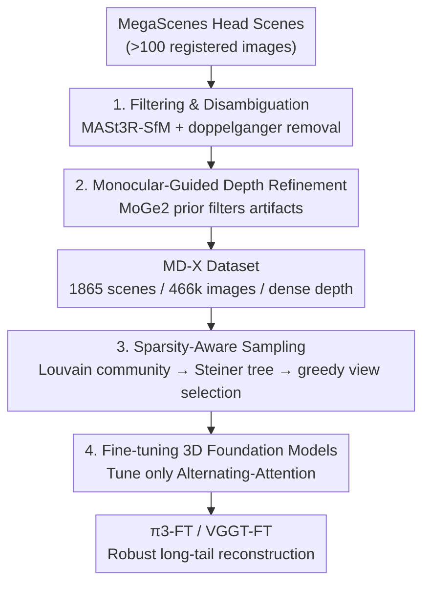

# Long-Tail Internet Photo Reconstruction

**Conference**: CVPR 2026  
**Paper**: [CVF Open Access](https://openaccess.thecvf.com/content/CVPR2026/html/Li_Long-Tail_Internet_Photo_Reconstruction_CVPR_2026_paper.html)  
**Code**: https://megadepth-x.github.io (Project page, including dataset/model/code)  
**Area**: 3D Vision  
**Keywords**: Internet photo reconstruction, long-tail distribution, feed-forward 3D foundation models, sparse views, data sampling

## TL;DR
Addressing the "long-tail" dilemma where the vast majority of internet landmarks only have sparse, noisy, and unevenly distributed photos, this work constructs MegaDepth-X, a clean dataset with dense depth representing a scale 8x that of MegaDepth. A sparsity-aware sampling strategy is proposed to sub-sample long-tail-like view distributions from dense "head" scenes. After fine-tuning feed-forward foundation models like π3 and VGGT, the reconstruction robustness in extremely sparse and symmetric/repetitive (doppelganger) scenes is substantially improved without compromising generalization on standard dense benchmarks.

## Background & Motivation

**Background**: Recovering 3D geometry from 2D images is a cornerstone of computer vision. The classical pipeline uses SfM (such as COLMAP) + MVS, which estimates camera poses and point clouds based on feature matching. Recently, the "feed-forward 3D reconstruction" paradigm has emerged: DUSt3R regresses pixel-aligned point maps from image pairs; MASt3R enhances this but still processes pairwise; VGGT, Fast3R, and FLARE employ large transformers to ingest hundreds of images simultaneously to predict camera parameters, depth, and point maps; $\pi^3$ further uses a permutation-equivariant architecture to eliminate reference-frame bias, predicting affine-invariant poses and scale-invariant local point maps. These models perform exceptionally well on small-scale, densely captured, and well-conditioned scenes.

**Limitations of Prior Work**: Internet photo collections exhibit an extreme long-tail distribution. A few famous landmarks (e.g., the Colosseum, Notre-Dame) are densely photographed from all angles and can be accurately reconstructed using standard SfM. However, the vast majority of landmarks globally only have a few sparse, noisy, and unevenly distributed photos online. The authors compute statistics using MegaScenes, revealing that while there are only 6,985 "head" scenes with $>50$ registered images, there are as many as 418,056 "long-tail" scenes with $<50$ registered images. In long-tail scenarios, COLMAP often fails completely due to a lack of correspondences across sparse, non-overlapping, and wide-baseline views (sometimes registering 0 images). While feed-forward models possess strong priors, they are almost exclusively trained on controlled, clean, dense, and uniformly sampled data, and fail to reconstruct consistent geometry when transferred to sparse and uneven internet photos.

**Key Challenge**: Learning to reconstruct in long-tail scenes requires 3D supervision for such scenes. However, long-tail scenes themselves cannot be reliably reconstructed to provide ground truth due to the lack of overlapping views—creating a "chicken-and-egg" dilemma. The common practice of mining pseudo-ground truth from long-tail in-the-wild data using off-the-shelf reconstructors (such as COLMAP/VGGT) fails in this context.

**Goal**: (1) Formalize and characterize the 3D long-tail problem of internet photos; (2) build a data foundation capable of providing reliable long-tail supervision; (3) make feed-forward foundation models robust to extremely sparse, wide-baseline, and symmetric/repetitive scenes without sacrificing performance on standard benchmarks.

**Key Insight**: The authors' key observation is that although ground truth cannot be directly obtained from sparse scenes, one can **simulate the long-tail by sub-sampling sparse subsets from well-reconstructed, dense head landmarks**, thereby directly inheriting ground-truth supervision from the complete reconstructions. This resembles the approach in autonomous driving of simulating rare events to augment training data.

**Core Idea**: In one sentence: "Construct a clean, dense head dataset (MD-X), then sub-sample training batches from it according to the view graph structure of real long-tail scenes, allowing the foundation model to inherit reliable supervision while observing sparse, weakly connected patterns missing from its training distribution."

## Method

### Overall Architecture
This work does not modify the model architecture but addresses long-tail reconstruction in two steps from the **data side**: The first step constructs a high-quality supervision source **MegaDepth-X (MD-X)**—selecting reliably reconstructed head scenes from MegaScenes, performing disambiguation, cleaning, and dense depth refinement to obtain ground truth with clean, dense depth for 1,865 scenes and 466k images. The second step is **sparsity-aware sampling**—sub-sampling "sparse, wide-baseline, weakly connected but locally reconstructable" training batches from the "dense, high-quality images" of MD-X based on the statistical properties of real long-tail view graphs. This introduces long-tail observation patterns to the model while retaining trustworthy supervision. Finally, these two components are used to fine-tune $\pi^3$ and VGGT (fine-tuning only the Alternating-Attention module while freezing the point cloud and camera decoders) to obtain $\pi^3$-FT and VGGT-FT.

The entire pipeline is a sequential process of "cleaning $\rightarrow$ depth refinement $\rightarrow$ long-tail sampling $\rightarrow$ fine-tuning," where long-tail sampling consists of a three-stage sub-process: "community detection $\rightarrow$ Steiner tree skeleton $\rightarrow$ greedy sampling," illustrated in the framework diagram below:

### Key Designs

**1. Filtering and Disambiguation: Eliminating head scenes that "look well-reconstructed but are actually incorrect"**

To inherit ground truth from head scenes, the prerequisite is that these reconstructions themselves are reliable. However, even "successful reconstructions" with $>100$ registered images in MegaScenes often contain two categories of hidden errors: First, dynamic/crowded content (prominent non-static objects like crowds, statues, airplanes) causes feature matching to lock onto moving objects, producing fragmented and geometrically inconsistent point clouds. Second, the doppelganger problem—images that are visually similar but geographically distant (e.g., opposite sides of a building) are incorrectly registered together. This work first uses the subset in MegaScenes with $>100$ registered images as the initial pool (2,474 candidate scenes) and manually removes scenes dominated by crowds or moving objects. Then, **MASt3R-SfM is used to replace the default COLMAP reconstruction** (constructing the graph based on MASt3R descriptors), combined with a **Doppelganger Classifier** to identify and prune suspicious pseudo-correspondence edges. Finally, the reconstruction results are manually verified against external references such as Google Maps and satellite imagery; any scene that does not match the bird's-eye view is discarded. This filtering step removes 609 scenes and serves as the foundation for all subsequent supervision credibility. The ablation study shows that the DIRTY variant (without filtering) yields point map accuracy even worse than the pre-trained model, confirming that "dirty supervision is harmful."

**2. Monocular-Guided Depth Refinement: Further refining on top of the classic MegaDepth recipe to remove residual depth artifacts**

Once reliable sparse reconstructions are obtained, dense depth must be generated for supervision. Standard MVS is run first, but geometric depth maps from in-the-wild data typically exhibit two types of artifacts: depth bleeding (background depth bleeding into the foreground) and noise/flicker around transient objects (people, vehicles). While this work initially applies the complete refinement strategy from MegaDepth (improved MVS propagation to conservatively retain minimum depth, stability filtering to remove flickering pixels, and semantic filtering to exclude transient categories), this is found to be insufficient: the improved MVS still experiences bleeding, and semantic filtering relying on hand-crafted category lists is sub-optimal. Therefore, an additional **monocular depth-guided filtering** step is introduced, utilizing the monocular depth $D_{mono}$ predicted by MoGe2 as an ordinal prior. First, the geometric depth $D_{geom}$ is aligned to the monocular depth by the median value of valid pixels: $D'_{geom}(p)=s\cdot D_{geom}(p)$, where $s=\mathrm{med}\{D_{mono}\}/\mathrm{med}\{D_{geom}\}$. Then, the normalized depth discrepancy is calculated as $\Delta(p)=\frac{|D'_{geom}(p)-D_{mono}(p)|}{D'_{geom}(p)}$, and pixels exceeding the threshold $\tau_{depth}$ are discarded. Additionally, the difference between the gradients of the two maps is computed as $\Delta(p_{grad})=\big|\frac{|\nabla D_{mono}|}{D_{mono}}-\frac{|\nabla D'_{geom}|}{D'_{geom}}\big|$ for edge-aware filtering; pixels exceeding $\tau_{grad}$ are also discarded. This approach suppresses bleeding artifacts and transient noise without requiring hand-crafted category lists.

**3. Sparsity-Aware Sampling: "Forging" long-tail view graph distributions from dense head scenes**

With clean supervision secured, the remaining issue is **supervision coverage**—foundation models have almost exclusively seen the "image-rich, redundant, visually strongly connected" distribution of head scenes, whereas real-world internet collections reside in the long-tail: sparse views, uneven distribution, and only weak connections. The authors first use SfM view graph statistics to characterize two properties of the long-tail: ① scarser connectivity (in low-registration-rate scenes, cameras with degree $\le 2$ account for 8%, compared to only 3% in the head); ② weaker connections (the average number of geometrically verified matches for connected image pairs is 294.8 vs. 395.3 in the head). Based on this, they propose that sampling must satisfy viewpoint diversity, sparsity, and local reconstructability, formalizing the task as "sampling $N$ views forming at most $N_{cc}$ connected components." The process consists of three stages: (a) **Graph Communities**: The scene is represented as a view graph $G=(V,E)$, with edge weights $w_{ij}$ representing the number of feature matches. Weak edges with $w_{ij}<50$ are pruned to obtain $G'$, and Louvain community detection is applied to identify viewpoint clusters $C_k$ (capturing different visual regions). (b) **Minimum Connected Subgraph**: A representative view $v_k$ is randomly selected from each community to serve as the terminal set $T=\{v_k\}$. An approximate **Steiner tree** is used to connect all communities, introducing only necessary intermediate nodes to form a compact subgraph $G_{sub}$, which ensures both global connectivity and sparsity. (c) **Greedy View Sampling**: The sampled set is iteratively expanded on $G_{sub}$. At each step, candidates are sorted lexicographically based on two criteria: "community novelty (prioritizing unseen communities)" + "spatial distance (prioritizing views further away to widen the baseline)," and top neighbors are selected, repeating this for a search depth $D$. $D$ controls sparsity: when $N=24, N_{cc}=1$, a larger $D=24$ relies entirely on greedy search for a more uniform distribution, while $D=12$ splits between greedy search and local filling from neighborhoods for a more concentrated distribution. The offline sampling pre-generates 24-node mini-batches, and DFS sub-sampling is applied during training to sample 2–24 images per batch, avoiding expensive graph loading during runtime.

**4. Decoder-Frozen Lightweight Fine-Tuning: Preserving pre-trained geometric fidelity while adapting attention to the long-tail**

Full fine-tuning can easily damage the geometric priors already learned by $\pi^3$ and VGGT. Hence, this work only fine-tunes the **Alternating-Attention module**, freezing the point cloud and camera decoders, and retains the original loss functions of $\pi^3$ and VGGT. Consequently, the model only adapts to the long-tail at the information aggregation level, while keeping the output heads for point maps and cameras untouched. This achieves robustness to the long-tail while keeping the performance regression on standard dense benchmarks to a minimum (RealEstate10K/CO3Dv2 performance remains virtually identical, with VGGT even showing slight improvements).

### Loss & Training
No new losses are introduced; the original training objectives of $\pi^3$ and VGGT are directly reused. The training data employs the MD-X cleaned set + MIXED sampling (mixing dense and "sparse" batches with $D\in[5,24]$ and $N_{cc}\in[1,4]$). Control variants include: DENSE ($D=5, N_{cc}=1$), SPARSE ($D=24, N_{cc}=4$), RANDOM (random sampling), and a DIRTY variant without the 3.1 filtering step to test robustness against label noise.

## Key Experimental Results

### Main Results
Camera pose and point maps are evaluated on the MD-X test set (127 held-out scenes, with 24 images sampled per scene), categorized into "easy" ($D=5,N_{cc}=1$) and "hard" ($D=24,N_{cc}=4$) difficulty levels. Camera poses are evaluated using RRA@5/RTA@5/AUC@5 (higher is better) and MRE/MTE (lower is better); point maps are evaluated using Acc/Comp (lower is better) and NC (higher is better).

| Difficulty | Method | RRA@5↑ | RTA@5↑ | AUC@5↑ | MRE↓ | Acc(Mean)↓ | NC(Mean)↑ |
|------|------|--------|--------|--------|------|-----------|-----------|
| easy | π3 | 88.97 | 68.79 | 45.84 | 4.12 | 0.055 | 0.712 |
| easy | **π3-FT** | **95.64** | **76.85** | **55.58** | **1.64** | **0.035** | **0.724** |
| easy | VGGT | 84.17 | 58.47 | 35.32 | 4.55 | 0.093 | 0.695 |
| easy | **VGGT-FT** | **92.41** | **71.12** | **48.78** | **2.70** | **0.050** | **0.719** |
| hard | π3 | 75.31 | 59.16 | 36.93 | 12.21 | 0.101 | 0.689 |
| hard | **π3-FT** | **86.40** | **71.00** | **47.93** | **5.72** | **0.068** | **0.713** |
| hard | VGGT | 70.98 | 52.98 | 29.10 | 13.20 | 0.149 | 0.675 |
| hard | **VGGT-FT** | **81.07** | **65.59** | **41.49** | **7.22** | **0.089** | **0.709** |

Fine-tuning brings significant and consistent improvements to both backbones, with **larger improvements observed on the more challenging (sparser) "hard" subset**: on the "hard" subset, π3-FT improves AUC@5 from 36.93 $\rightarrow$ 47.93 (+11.0), halves MRE from 12.21 $\rightarrow$ 5.72, and reduces point map Acc from 0.101 $\rightarrow$ 0.068.

### Generalization on Standard Benchmarks
To verify that "learning the long-tail does not harm performance on standard scenes," relative poses are evaluated on RealEstate10K and CO3Dv2:

| Dataset | Method | RRA@5↑ | RTA@5↑ | AUC@5↑ |
|--------|------|--------|--------|--------|
| RealEstate10K | π3 | 98.79 | 79.61 | 62.82 |
| RealEstate10K | π3-FT | 98.80 | 77.78 | 60.01 |
| CO3Dv2 | π3 | 93.24 | 84.47 | 57.12 |
| CO3Dv2 | π3-FT | 93.97 | 84.50 | 57.61 |
| CO3Dv2 | VGGT | 96.97 | 86.19 | 67.84 |
| CO3Dv2 | VGGT-FT | 97.11 | 86.27 | 67.81 |

After fine-tuning, both backbones maintain roughly on-par performance, with VGGT even showing slight improvements on CO3Dv2. This indicates that the robustness learned from sparse in-the-wild data does not sacrifice generalization to standard dense benchmarks. Point map benchmarks on DTU are largely preserved, though a slight decline is observed on ETH3D due to domain gap (which the authors attribute to a domain mismatch with internet imagery).

### Ablation Study
Data quality and sampling schemes are compared on MD-X (using π3 as the base):

| Difficulty | Configuration | RRA@5↑ | AUC@5↑ | MRE↓ | Acc(Mean)↓ | Description |
|------|------|--------|--------|------|-----------|------|
| hard | π3 (Pre-trained) | 75.31 | 36.93 | 12.21 | 0.101 | Baseline |
| hard | π3-FT (Cleaned+MIXED) | 86.40 | 47.93 | 5.72 | 0.068 | Full model, Best |
| hard | π3-DIRTY | 81.10 | 43.74 | 11.86 | 0.130 | Without filtering dirty data: point maps are worse than pre-trained |
| hard | π3-RANDOM | 85.93 | 47.17 | 6.53 | 0.071 | Random sampling: pose is acceptable, but point map improvement is limited |
| hard | π3-DENSE | 85.82 | 47.47 | 6.04 | 0.071 | Dense batch: good on easy scenes, weak on sparse scenes |
| hard | π3-SPARSE | 85.97 | 47.13 | 6.05 | 0.070 | Pure sparse: not the optimal trade-off when used alone |

### Key Findings
- **Data cleaning is more critical than sampling**: The DIRTY variant performs worse than the pre-trained $\pi^3$ on point map estimation in both easy/hard settings (hard Acc 0.130 vs. $\pi^3$'s 0.101), indicating that dirty supervision is directly harmful and clean supervision is a prerequisite for robust generalization.
- **Mixed sampling is optimal**: RANDOM sampling achieves decent poses but yields limited improvements in point maps (highlighting that training batches require sufficient co-visibility); DENSE sampling performs well on easy scenes but is weak on sparse scenes; pure SPARSE sampling exposes harder samples but is not the best trade-off on its own; MIXED sampling achieves the best overall performance across all difficulties.
- **Larger gains on harder cases**: Improvements across all metrics on the hard subset are larger than those on the easy subset, directly hitting the target "long-tail" objective—the model improves the most where it was previously weakest (sparse, weakly connected scenes).
- **Qualitative results on real-world long-tail**: On real long-tail scenes (e.g., Novo-Znamenka Manor with 66 images but only 13 registered, Saint Andrew's Church with 94 images where COLMAP registers 0), COLMAP fails entirely and the pre-trained $\pi^3$ produces low-confidence fragments, whereas the proposed model still restores coherent global geometry and resolves doppelganger ambiguities with higher confidence.

## Highlights & Insights
- **Bypassing the "chicken-and-egg" deadlock of missing long-tail ground truth via "sub-sampling the head"**: Since ground truth cannot be directly obtained from long-tail scenes, the authors "forge" long-tail view distributions from head scenes where ground truth is available. This translates the concept of "simulating rare events" from data augmentation to 3D reconstruction, elegantly converting an unsupervised challenge into a supervised one.
- **Redefining the long-tail as a "graph structure" rather than a "graph size" problem**: The authors use view-graph statistics (ratio of low-degree nodes, average matches) to prove that the essence of the long-tail is a sparse, weakly connected observation graph, rather than merely having fewer images. This characterization directly inspires the community + Steiner tree sampling design, serving as an exemplary transition from problem diagnosis to methodology.
- **A clever combination of Steiner Tree, Louvain Communities, and Greedy Sampling**: Louvain community detection ensures viewpoint diversity, the Steiner tree guarantees minimal connectivity, and greedy sampling balances "community novelty" and "wide spatial baseline." Each of the three addresses a specific sampling requirement (diversity, sparsity, local reconstructability), making it transferable to any task designed to sample controlled sparse subsets from dense graphs.
- **Freezing the decoder while fine-tuning only attention**: Restricting "long-tail adaptation" to the information aggregation layers serves as a lightweight fine-tuning paradigm that preserves pre-trained geometric priors and avoids catastrophic forgetting. This is a highly replicable design for fine-tuning other foundation models.

## Limitations & Future Work
- **Dependency on head data coverage**: The prerequisite for simulating the long-tail is that the head scenes must be sufficiently rich in viewpoint and appearance; if a certain long-tail structure has no similar samples in the head (e.g., extremely rare architectural forms), sub-sampling cannot generate the corresponding supervision.
- **Domain shift still exists**: The decline in point map accuracy on ETH3D indicates a domain mismatch with internet imagery, suggesting that fine-tuning on internet photos causes a slight drift in performance on controlled scanner-like datasets.
- **Heuristics for sampling hyperparameters**: Hyperparameters such as $N_{cc}$, search depth $D$, edge pruning threshold ($w_{ij}<50$), and depth difference thresholds $\tau_{depth}/\tau_{grad}$ require empirical tuning. While the paper provides configurations for easy/hard settings, a systematic sensitivity analysis is missing (some details are in the supplementary material; ⚠️ refer to the original paper for exact details).
- **Manual components in data cleaning**: Filtering dynamic scenes and cross-checking with satellite imagery both involve manual validation, posing a bottleneck for scaling up to even larger datasets.

## Related Work & Insights
- **vs. Classical SfM (COLMAP)**: COLMAP relies on feature correspondences to estimate camera poses, which fails when dealing with sparse, wide-baseline, or non-overlapping views (often registering 0 images in long-tail scenarios). In contrast, this work utilizes feed-forward models + long-tail supervision to directly regress geometry, enabling reconstruction even in scenes where COLMAP fails entirely.
- **vs. Feed-Forward Foundation Models (DUSt3R/VGGT/π3)**: While these models offer strong priors, their training distributions bias toward dense head scenes, causing them to fail on long-tail sparse data. Without modifying the architectures, this work fine-tunes them with MD-X data and sparsity-aware sampling, equipping them with the missing sparse, weakly connected observation patterns.
- **vs. MegaDepth / MegaScenes**: MegaDepth is clean but small, while MegaScenes is large but noisy and lacks depth maps. MD-X combines the best of both worlds—possessing a scale 8x that of MegaDepth, featuring clean and dense depth maps, and being manually verified specifically for fine-tuning 3D foundation models.
- **vs. Doppelganger Processing Work (Cai et al.)**: Prior works trained classifiers to prune false matches during the SfM phase to resolve symmetry ambiguities. This work directly integrates doppelganger classification into data cleaning, which also makes the fine-tuned model more robust against doppelganger scenes during inference.

## Rating
- New novelty: ⭐⭐⭐⭐⭐ Redefining the long-tail problem as a "graph structure" rather than "image quantity," and successfully bypassing the lack of ground truth via head sub-sampling is highly original in both problem formulation and solution.
- Experimental Thoroughness: ⭐⭐⭐⭐ Comprehensive evaluation covering two backbones × two difficulties, sampling/data ablations, and generalization on standard benchmarks, though systematic sensitivity analysis for hyperparameters is lacking (delegated to supplementary materials).
- Writing Quality: ⭐⭐⭐⭐⭐ Clear motivational derivation; the long-tail statistical characterization and the three-stage sampling pipeline are thoroughly explained.
- Value: ⭐⭐⭐⭐⭐ Directly addresses the next frontier of 3D foundation models, with dataset, model, and code all open-sourced, offering high value for real-world reconstruction applications.

<!-- RELATED:START -->

## Related Papers

- [\[CVPR 2026\] AnyLift: Scaling Motion Reconstruction from Internet Videos via 2D Diffusion](anylift_scaling_motion_reconstruction_from_internet_videos_via_2d_diffusion.md)
- [\[CVPR 2026\] Photo-Guided Tooth Segmentation on 3D Oral Scan Model](photo-guided_tooth_segmentation_on_3d_oral_scan_model.md)
- [\[CVPR 2026\] Long-SCOPE: Fully Sparse Long-Range Cooperative 3D Perception](long_scope_fully_sparse_long_range_cooperative_3d_perception.md)
- [\[ICLR 2026\] UP2You: Fast Reconstruction of Yourself from Unconstrained Photo Collections](../../ICLR2026/3d_vision/up2you_fast_reconstruction_of_yourself_from_unconstrained_photo_collections.md)
- [\[CVPR 2026\] tttLRM: Test-Time Training for Long Context and Autoregressive 3D Reconstruction](tttlrm_test-time_training_for_long_context_and_autoregressive_3d_reconstruction.md)

<!-- RELATED:END -->
