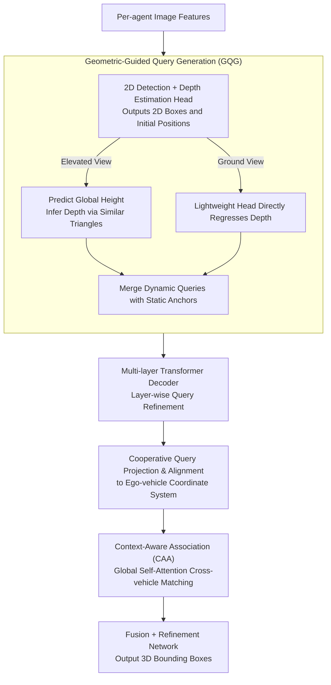

# Long-SCOPE: Fully Sparse Long-Range Cooperative 3D Perception

**Conference**: CVPR 2026  
**arXiv**: [2604.09206](https://arxiv.org/abs/2604.09206)  
**Code**: None  
**Area**: 3D Vision  
**Keywords**: Cooperative Perception, Sparse Architecture, Long-range 3D Detection, Query Association, V2X

## TL;DR

Long-SCOPE proposes a fully sparse long-range cooperative 3D perception framework. By utilizing geometric-guided query generation and context-aware association modules, it achieves SOTA performance in 100-150m long-range scenarios while maintaining efficient computational and communication costs.

## Background & Motivation

**Background**: Cooperative perception extends the perception range of autonomous driving and addresses occlusion issues via V2X communication. However, mainstream methods rely on dense BEV features, whose computational and communication costs grow quadratically with the perception range.

**Limitations of Prior Work**: (1) Dense BEV representations lead to exploding computational costs in long-range scenarios; (2) observation and alignment errors for distant targets increase significantly, making existing feature association mechanisms based on fixed distance thresholds fragile.

**Key Challenge**: Efficient sparse communication requires accurate query association, but long-range positional noise renders rigid threshold methods ineffective, leading to the erroneous filtering of correct cooperative queries.

**Goal**: Design a fully sparse architecture to simultaneously address computational efficiency and robust association in long-range scenarios.

**Key Insight**: Completely abandon BEV features, extract object queries directly from image features, and replace rule-based matching with a learnable attention mechanism.

**Core Idea**: Use geometric priors to dynamically generate high-quality 3D queries (addressing observation error) and use context-aware attention for robust query matching (addressing alignment error).

## Method

### Overall Architecture

Long-SCOPE aims to solve the problem where "extending the perception range to 100-150m makes cooperative perception computationally expensive and difficult to align identical targets seen by multiple vehicles." The approach completely abandons dense BEV features and operates entirely at the sparse level of "object queries." Each agent first extracts a set of object queries from its own image features—comprising static anchors covering the near field and GQG queries dynamically generated for long-range small targets—which are then refined layer-by-layer through a multi-layer Transformer decoder. Each agent projects and aligns its refined cooperative queries to the ego-vehicle coordinate system and passes them to the CAA module for cross-vehicle matching. Matched queries of the same target are fused and refined to output 3D detection boxes. Since only sparse queries are transmitted instead of the entire BEV map, communication volume grows linearly with the number of targets rather than quadratically with the perception range.

### Key Designs

**1. Geometric-Guided Query Generation (GQG): Dynamically generating reliable 3D queries for long-range small targets**

Fixed static anchors are sufficient for the near field, but long-range targets are small and sparse, leading to a low hit rate on anchors and initial missed detections. GQG runs a lightweight 2D detection and depth estimation head on shared image features to obtain a coarse 2D box and initial position for each target. This generates dynamic queries close to the actual targets, which are then fed into the decoder alongside static anchors.

The key innovation lies in depth estimation—direct depth regression is an ill-posed problem, as depth distribution at long ranges is extremely sparse and difficult to regress accurately. GQG therefore treats camera views in two categories, selecting the most stable estimation method for each:

- **Elevated View** (Roadside units, drones): Instead of regressing depth directly, it predicts the global height of the target $\hat{z}_{Q_{glb}}$. Since height distributions for the same class of targets are highly concentrated (e.g., vehicle roofs are at similar heights), this is a much more stable regression target. Once the height is obtained, the depth in the camera coordinate system is inferred using the geometric relationship of similar triangles from the camera projection:

$$\hat{z}_{Q_{cam}} = \frac{\hat{z}_{Q_{glb}} - z_{C_{glb}}}{(T_{cam2glb}[:3,:3] \cdot K_{cam}^{-1} \cdot P_{img})_z}$$

  Where $z_{C_{glb}}$ is the camera's global height, and $T_{cam2glb}$, $K_{cam}$, and $P_{img}$ are the camera-to-global extrinsic parameters, intrinsic parameters, and pixel coordinates, respectively. This step is valid provided the virtual ray height $z_{P_{virt}}$ in the denominator is significantly non-zero, which is satisfied by elevated downward views.
- **Ground View** (Vehicles): Cameras are nearly level with the horizon. For pixels near the horizon $z_{P_{virt}} \approx 0$, which causes the denominator to approach zero and the values to explode. Thus, the standard approach is used, where a lightweight depth head directly regresses depth.

Both paths eventually back-project the 2D boxes into 3D positions based on estimated depth and pair them with image features obtained via MaxPooling to initialize dynamic queries, significantly improving initial detection quality.

**2. Context-Aware Association (CAA): Matching identical targets seen by different vehicles despite high positional noise**

At long ranges, observation errors for each vehicle and alignment errors between vehicles are amplified. Fixed threshold methods—where queries are considered the same if their coordinates differ by less than 30m (or 15m)—fail, as correct cooperative queries may be filtered due to positional drift, leaving redundant detections. CAA delegatess matching to learnable attention: it concatenates queries from all $N$ agents for global self-attention, allowing the model to judge identical targets based on semantic content and spatial topology. It follows four design principles: injective matching (at most one query per agent per target), asymmetric visibility (allowing unique queries with no matches), spatial consistency (relying on relative topology of local neighborhoods rather than absolute coordinates to resist noise), and scalability (naturally supporting $N>2$). Compared to fixed thresholds or heuristics like the Hungarian algorithm, it stabilizes association through semantics and neighborhood structures when coordinates are unreliable.

### Loss & Training

End-to-end training is employed. The 2D detection and depth estimation heads in GQG use lightweight architectures to control overhead. The matching results from the CAA module generate supervision signals for cross-vehicle association.

## Key Experimental Results

### Main Results

| Dataset/Range | Metric | Long-SCOPE | Prev. SOTA | Gain |
|---------------|--------|------------|------------|------|
| V2X-Seq Long-range | AP | SOTA | - | Significant |
| Griffin-25m 100-150m | AP | SOTA | - | Breakthrough |
| Griffin-25m Overall | AP | SOTA | - | Efficiency + Accuracy |

### Ablation Study

| Configuration | Key Metric | Description |
|---------------|------------|-------------|
| W/o GQG | AP Decrease | Degradation in long-range small target detection |
| W/o CAA | AP Decrease | Redundant detections due to association failure |
| Fixed 30m Threshold | Low AP | Fragile association of baseline methods |
| Full Long-SCOPE | Optimal | Complementary synergy between both modules |

### Key Findings

- Improvements are most significant in extremely long-range scenarios (100-150m), proving the necessity of designs specialized for long distances.
- GQG's height prediction strategy is highly effective for elevated agents, while direct depth regression remains preferable for ground vehicles.
- The global attention association of the CAA module significantly outperforms heuristics like fixed distance thresholds and the Hungarian algorithm.

## Highlights & Insights

- **Advancement of Fully Sparse Architecture**: By completely abandoning BEV features, communication costs correlate linearly with the number of targets rather than quadratically with the perception range.
- **View-Specific Depth Estimation Strategy**: The design of inferring depth from height for elevated views and using direct regression for ground views fully exploits the geometric characteristics of different perspectives.
- **SfM-Inspired Multi-Agent Matching**: Leveraging a concatenation + global attention strategy similar to multi-view matching in SfM naturally scales to $N$ agents.

## Limitations & Future Work

- The computational complexity of global self-attention is proportional to the square of the total number of queries; while target counts are usually $<100$, this could become a bottleneck in extremely dense scenarios.
- Practical deployment issues such as communication latency and packet loss were not considered.
- Evaluated only on 3D object detection, without extension to other tasks like semantic segmentation.

## Related Work & Insights

- **vs SparseCoop**: Long-SCOPE replaces the most fragile query generation and association modules found in SparseCoop.
- **vs Far3D**: GQG draws inspiration from Far3D's 2D detection + depth estimation scheme but introduces a new height-based depth derivation.

## Rating

- **Novelty**: ⭐⭐⭐⭐ Targeted innovations in both GQG and CAA.
- **Experimental Thoroughness**: ⭐⭐⭐⭐ Validated on two datasets, V2X-Seq and Griffin.
- **Writing Quality**: ⭐⭐⭐⭐ Clear problem definition and explicit design principles.
- **Value**: ⭐⭐⭐⭐ Provides a practical solution for long-range deployment of cooperative perception.

<!-- RELATED:START -->

## Related Papers

- [\[CVPR 2026\] Can Natural Image Autoencoders Compactly Tokenize fMRI Volumes for Long-Range Dynamics Modeling?](can_natural_image_autoencoders_compactly_tokenize_fmri_volumes_for_long-range_dy.md)
- [\[CVPR 2026\] Long-Tail Internet Photo Reconstruction](long-tail_internet_photo_reconstruction.md)
- [\[CVPR 2026\] MoRel: Long-Range Flicker-Free 4D Motion Modeling via Anchor Relay-based Bidirectional Blending with Hierarchical Densification](morel_long-range_flicker-free_4d_motion.md)
- [\[ICLR 2026\] IncVGGT: Incremental VGGT for Memory-Bounded Long-Range 3D Reconstruction](../../ICLR2026/3d_vision/incvggt_incremental_vggt_for_memory-bounded_long-range_3d_reconstruction.md)
- [\[CVPR 2026\] LongStream: Long-Sequence Streaming Autoregressive Visual Geometry](longstream_long-sequence_streaming_autoregressive_visual_geometry.md)

<!-- RELATED:END -->
