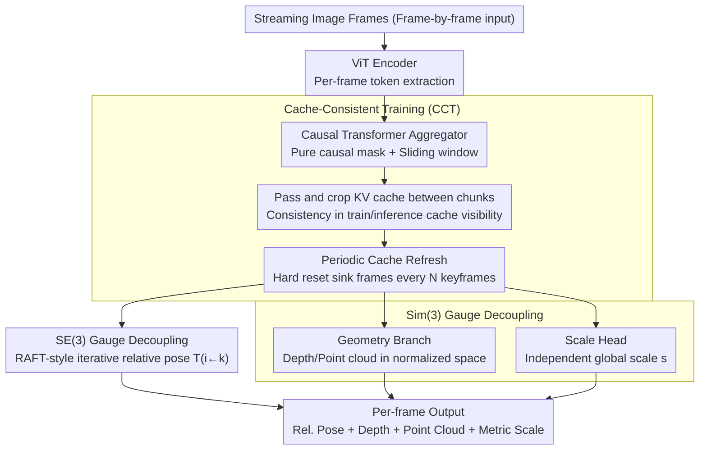

# LongStream: Long-Sequence Streaming Autoregressive Visual Geometry

**Conference**: CVPR 2026  
**arXiv**: [2602.13172](https://arxiv.org/abs/2602.13172)  
**Code**: [Project Page](https://3dagentworld.github.io/longstream/)  
**Area**: 3D Vision  
**Keywords**: Streaming 3D Reconstruction, Autoregressive Models, Pose Estimation, KV Cache, Long Sequence

## TL;DR

LongStream is proposed as a gauge-decoupled streaming visual geometry model. By utilizing keyframe-relative pose prediction, orthogonal scale learning, and cache-consistent training, it achieves stable metric-scale scene reconstruction for thousand-frame sequences in real-time (18 FPS).

## Background & Motivation

Long-sequence streaming 3D reconstruction remains a significant open challenge in visual geometry. Existing autoregressive streaming models (e.g., Stream3R, StreamVGGT) suffer from severe degradation when processing long sequences:

- **Key Challenge—gauge-coupled design**: Current models anchor poses to the first-frame coordinate system and regress absolute poses. This transforms long-sequence prediction into an increasingly difficult extrapolation problem—training models on short indices while expecting them to predict large indices during inference, creating a "train-short, test-long" domain gap.
- **Attention Decay**: As sequences lengthen, attention mechanisms become overly dependent on first-frame tokens (attention sinks), leading to keyframe jumping and accumulated pose errors.
- **Scale Drift**: The simultaneous learning of geometric shapes and metric scales leads to progressive Sim(3) scale drift.
- **KV Cache Pollution**: Long-term accumulated KV caches contain outdated or degraded information, further exacerbating geometric drift.

Existing streaming methods often collapse within tens of meters, while applications like autonomous driving require stable reconstruction over kilometers.

## Method

### Overall Architecture

LongStream is based on a ViT encoder + causal Transformer aggregator + task head architecture. It processes streaming image frames and predicts for each frame: keyframe-relative pose $\mathbf{T}_{i \leftarrow k}$, depth maps, point clouds, and global scale factors. The aggregator shares the same KV cache layout during both training and inference (ensured by Cache-Consistent Training). The pose head performs SE(3) decoupled prediction of relative poses, while geometry and scale branches perform Sim(3) decoupled independent predictions.

### Key Designs

1. **SE(3) Gauge Decoupling—Keyframe Relative Pose**: The model abandons fixed first-frame anchoring in favor of predicting the pose of each frame relative to the most recent keyframe:

$$\mathbf{T}_{i \leftarrow k} = \mathbf{T}_i \circ \mathbf{T}_k^{-1}$$

This formulation is invariant under any world coordinate system reparameterization $S \in SE(3)$. The core effect is transforming a long-range extrapolation problem (large index range) into a local estimation task of constant difficulty (bounded index interval $i - k$), while eliminating inherent bias toward the first frame. The pose head fuses current and keyframe features using RAFT-style iterative updates: $\mathbf{p}^{(t+1)} = \mathbf{p}^{(t)} + \Delta\mathbf{p}^{(t)}$.

2. **Sim(3) Gauge Decoupling—Orthogonal Scale Learning**: Utilizing scale-invariant (SI-Log) concepts, geometric learning and metric scale estimation are separated at both the architecture and objective levels:

    - **Geometry Branch**: Optimized in normalized space with loss $\mathcal{L}_{geom} = \|\tilde{X}_{pred} - \tilde{X}_{gt}\|_1$, where $\tilde{X} = X / \text{Norm}(X)$, ensuring $\partial\mathcal{L}/\partial s = 0$.
    - **Scale Head**: Independently predicts a global scale factor $s = \exp(\mathbf{w}^\top \mathbf{h}_{scale})$ and is trained only on metrically calibrated data.
    - Scale only affects translation, depth, and point clouds; rotation and field-of-view remain unaffected, achieving complete decoupling.

3. **Cache-Consistent Training (CCT)**: Addresses attention sink dependency and KV cache pollution:

    - Removes constant sink tokens during training, using a pure causal mask with a sliding window.
    - Explicitly passes and crops the KV cache between training chunks so that cache visibility during training matches inference exactly.
    - For ultra-long sequences, it introduces **Periodic Cache Refresh**: a hard reset of sink frames and the KV cache every $N$ keyframes (similar to state marginalization in SLAM). Since the model operates in keyframe-relative coordinates, the refresh does not break consistency.

### Loss & Training

A joint probability framework maximizes the posterior:

$$\mathcal{L} = \mathcal{L}_{geom} + \mathcal{L}_{depth} + \mathcal{L}_{pose} + \mathcal{L}_{scale}$$

- $\mathcal{L}_{pose}$: L1 loss on rotation (quaternions), translation (normalized space), and focal length offsets during iterative updates, with a decay weight $\gamma^{t-1}$.
- $\mathcal{L}_{geom}$: L1 loss on normalized point clouds (scale-invariant).
- $\mathcal{L}_{depth}$: Depth supervision.
- $\mathcal{L}_{scale}$: L1 loss in log-space for metric scale $\|\log\hat{s} - \log s_{gt}\|_1$ (used only for calibrated data).

## Key Experimental Results

### Main Results

| Dataset | Metric | LongStream | Prev. SOTA (Streaming) | Gain |
|--------|------|-----------|-----------------|------|
| KITTI (11 seq) | Avg. ATE↓ | **51.90** | 177.73 (TTT3R) | -70.8% |
| KITTI seq00 (3.7km) | ATE | **92.55** | 190.93 (TTT3R) | -51.5% |
| KITTI seq04 (0.4km) | ATE | **1.95** | 11.62 (TTT3R) | -83.2% |
| TUM-RGBD | ATE | Best | Stream3R/VGGT collapsed | — |
| Waymo | ATE | Best | Prev. methods drifted severely | — |

Note: 18 FPS real-time inference; memory and latency remain stable over long sequences (unlike VGGT which may result in OOM).

### Ablation Study

| Configuration | Key Metric | Description |
|------|---------|------|
| w/o CCT + Causal Inf. | Strong attention sink, low accuracy | Train-inference inconsistency leads to degradation |
| w/o CCT + Sliding Inf. (Keep sink) | Sink amplified, accuracy drops | Sliding window amplifies sink bias |
| w/ CCT + Causal Inf. | Sink strongly suppressed, best accuracy | CCT eliminates sink dependency |
| w/ CCT + Sliding Inf. | Sink also suppressed, high accuracy | CCT is effective across all inference modes |

### Key Findings

- While existing streaming methods collapse within dozens of meters, LongStream maintains stability over kilometer-scale sequences.
- Attention sinks are not useful features but rather byproducts of training-inference inconsistency; performance improves significantly once CCT eliminates them.
- Keyframe-relative poses transform extrapolation into interpolation, providing the theoretical foundation for long-sequence stability.
- Periodic cache refreshing is naturally compatible with keyframe-relative coordinate systems without requiring additional alignment.

## Highlights & Insights

- **Gauge Decoupling Philosophy**: Identifies two fundamental degrees of freedom (SE(3) coordinates and Sim(3) scale) responsible for long-sequence degradation and provides elegant solutions for both.
- **Reimagining Attention Sinks**: Demonstrates that sinks are symptoms of a train-inference gap rather than necessities for streaming Transformers. CCT directly resolves this gap.
- **Periodic Cache Refresh**: Adapts the concept of state marginalization from SLAM to work seamlessly with keyframe-relative coordinate systems.
- **High Practicality**: 18 FPS combined with kilometer-scale stability and metric scale makes it truly viable for autonomous driving and robotics deployment.

## Limitations & Future Work

- Keyframe selection strategies are not discussed in detail; fast motion or textureless scenes may require adaptive keyframes.
- The scale head's performance on uncalibrated data depends heavily on the training data distribution.
- The choice of $N$ for periodic cache refreshing may require scene-specific tuning.
- Advantages in small-scale indoor scenes (e.g., TUM-RGBD) are less pronounced than in outdoor environments.
- Handling of dynamic objects is not explicitly addressed and may require additional processing for scenes with heavy traffic.

## Related Work & Insights

- **VGGT/StreamVGGT**: Direct baselines for LongStream, proving that absolute pose regression inevitably fails on long sequences.
- **DUSt3R/MASt3R**: Offline reconstruction methods whose concepts LongStream extends to streaming scenarios.
- **CUT3R**: An RNN-based streaming approach; LongStream replaces RNNs with Transformers + KV cache for better long-term dependencies.
- The concept of keyframe-relative poses can be generalized to other vision tasks requiring long-sequence processing.
- The CCT principle of training-inference consistency is highly relevant for all streaming models utilizing KV caches.

## Rating

- **Novelty**: ⭐⭐⭐⭐⭐ Triple innovation (Gauge decoupling + CCT + Periodic refresh) with clear theoretical motivation.
- **Experimental Thoroughness**: ⭐⭐⭐⭐ Covers various indoor/outdoor datasets with thorough visualization and attention map analysis.
- **Writing Quality**: ⭐⭐⭐⭐⭐ Precise problem definitions, clear theoretical derivations, and informative figures.
- **Value**: ⭐⭐⭐⭐⭐ First to achieve kilometer-scale real-time streaming reconstruction, significant for autonomous driving/robotics.

<!-- RELATED:START -->

## Related Papers

- [\[CVPR 2026\] Fast Spatial Tracking with Visual Geometry Transformer](fast_spatial_tracking_with_visual_geometry_transformer.md)
- [\[CVPR 2026\] MERG3R: A Divide-and-Conquer Approach to Large-Scale Neural Visual Geometry](merg3r_a_divide-and-conquer_approach_to_large-scale_neural_visual_geometry.md)
- [\[CVPR 2026\] FlashVGGT: Efficient and Scalable Visual Geometry Transformers with Compressed Descriptor Attention](flashvggt_efficient_and_scalable_visual_geometry_transformers_with_compressed_descr.md)
- [\[CVPR 2026\] MVGGT: Multimodal Visual Geometry Grounded Transformer for Multiview 3D Referring Expression Segmentation](mvggt_multimodal_visual_geometry_grounded_transformer_for_multiview_3d_referring.md)
- [\[CVPR 2026\] AeroDGS: Physically Consistent Dynamic Gaussian Splatting for Single-Sequence Aerial 4D Reconstruction](aerodgs_physically_consistent_dynamic_gaussian_splatting_for_single-sequence_aer.md)

<!-- RELATED:END -->
