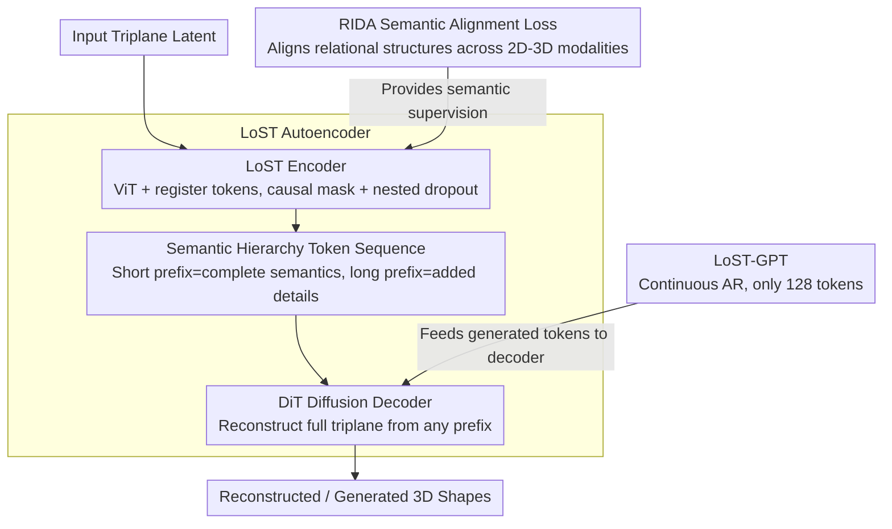

# LoST: Level of Semantics Tokenization for 3D Shapes

**Conference**: CVPR 2026  
**arXiv**: [2603.17995](https://arxiv.org/abs/2603.17995)  
**Code**: [Project Page](https://lost3d.github.io)  
**Area**: 3D Vision  
**Keywords**: 3D Generation, Shape Tokenization, Autoregressive Models, Semantic Hierarchy, Diffusion Decoding

## TL;DR

This work proposes Level-of-Semantics Tokenization (LoST), which sorts 3D shape tokens by semantic significance. This allows short prefixes to decode into complete and semantically plausible shapes. Combined with the RIDA semantic alignment loss and GPT-style autoregressive generation, the method significantly outperforms existing 3D AR approaches using only 128 tokens compared to tens of thousands.

## Background & Motivation

Tokenization is the foundation of autoregressive (AR) generative models, determining both generation quality and efficiency. The current state of 3D shape tokenization includes:

- **Flat Element Streams** (e.g., MeshGPT, Llama-Mesh): Directly serialize vertices/faces into token streams. The sequences are extremely long (thousands to tens of thousands), leading to high quadratic attention costs, and early prefixes cannot be decoded into meaningful shapes.
- **Geometric LoD Hierarchies** (e.g., OctGPT, VertexRegen): Coarse-to-fine spatial hierarchies based on octrees or progressive meshes. While derived from rendering and compression, they suffer from two systemic issues:
    - **Coarse Level Token Inflation**: Even with geometric simplification, early stages require many spatial tokens just to outline the basic structure.
    - **Unusable Early Decoding**: Aggressive geometric simplification causes coarse-level shapes to be geometrically and semantically dissimilar to the final result.

**Key Insight**: Geometric LoD is designed for rendering/compression, not for AR modeling. The ideal token sequence for an AR model should follow: Short Prefix = Complete + Semantically Plausible, Long Prefix = Detailed & Precise. This requires sorting by **semantic significance** rather than spatial detail.

## Method

### Overall Architecture

The system utilizes a three-stage training pipeline:
1. **RIDA Pre-training**: Trains a 3D semantic extractor to align the triplane latent space with the DINO semantic space.
2. **LoST Autoencoder**: A ViT encoder compresses the triplane into a hierarchy of semantic tokens with causal masking and nested dropout. A DiT diffusion decoder reconstructs the full triplane from any prefix.
3. **LoST-GPT**: A GPT-style Transformer performs autoregressive generation in the continuous token space.

### Key Designs

1. **LoST Encoder — Semantic Hierarchy Token Sequence**: Based on a ViT encoder processing a patchified triplane (768 tokens), it introduces up to 512 learnable **register tokens** $\mathcal{T}_R$ that extract information via attention. Key mechanisms include:
    - **Causal Masking**: Causal attention is used between register tokens to force hierarchical organization from front to back.
    - **Nested Dropout**: During training, prefixes of length $[1, 2, 4, 8, ..., k]$ are randomly kept and the rest discarded, forcing the model to prioritize critical information.
    - The type of hierarchy (semantic vs. geometric) is determined by the loss: geometric loss leads to frequency hierarchy, while semantic loss leads to semantic hierarchy.
    - Only register tokens (projected to 32D) are kept, creating an information bottleneck.

2. **RIDA — 3D Semantic Alignment Loss (Relational Inter-Distance Alignment)**: Unlike REPA in 2D which aligns DINO features directly, 3D shapes lack direct semantic extractors. RIDA aligns **relational structures** instead of raw features to bridge the modality gap:
    - A "student" Transformer $f_\theta$ maps triplanes to a semantic space.
    - **Global Relational Contrast** $\mathcal{L}_{global}$: Uses DINO feature similarity to mine positive/negative pairs for Multi-positive InfoNCE in the student space.
    - **Inter-instance Rank Distillation** $\mathcal{L}_{rank}$: Preserves the structure of continuous pairwise distances from the DINO space (inspired by RKD).
    - **Spatial Structure Distillation** $\mathcal{L}_{spatial}$: Aligns token-level affinity matrices.
    - Total loss: $\mathcal{L}_{RIDA} = 1.0 \cdot \mathcal{L}_{global} + 1.0 \cdot \mathcal{L}_{rank} + 0.5 \cdot \mathcal{L}_{spatial}$.

3. **LoST-GPT — Continuous Space Autoregressive Generation**: Tokens remain in continuous space (no quantization). It uses a LlamaGen architecture (depth 24, 16 heads, dim 1024) for next-token prediction. Small MLP diffusion heads model the conditional distribution at each position (following MAR), avoiding VQ information loss. Conditional generation uses OpenCLIP embeddings. High-quality generation is achieved with only 128 tokens.

### Loss & Training

- LoST Autoencoder: $\mathcal{L} = \mathcal{L}_{denoise} + 1.0 \cdot \mathcal{L}_{semantic}$, where $\mathcal{L}_{semantic} = 1 - \langle f_\theta(\hat{\mathbf{X}}_0), f_\theta(\mathbf{X}_0) \rangle$.
- DiT Decoder: depth 24, dim 1024, 16 heads, 2×2 patchification.
- Training Data: 300K shapes (Gemini 2.5 Pro prompts → Flux.1 images → Direct3D 3D generation).
- LoST trained for 250 epochs, RIDA for 100 epochs, on 8×A100 GPUs.

## Key Experimental Results

### Main Results

| Method | Token Count | CD(×10⁻²)↓ | FID↓ | DINO↑ |
|------|---------|------------|------|-------|
| OctGPT (Best Layer) | ~61962 | 0.533 | 100.78 | 0.619 |
| VertexRegen (Best Layer) | ~7530 | 0.034 | 86.10 | 0.791 |
| **Ours (64 tokens)** | 64 | 0.382 | 21.13 | 0.880 |
| **Ours (512 tokens)** | 512 | 0.234 | 13.59 | 0.921 |
| Ours (1 token) | 1 | 2.271 | 31.65 | 0.731 |

AR Generation:

| Method | Token Count | FID↓ | DINO↑ |
|------|---------|------|-------|
| OctGPT | ~50000 | 66.93 | — |
| ShapeLLM-Omni | 1024 | 48.70 | 0.680 |
| **LoST-GPT** | **128** | **34.25** | **0.758** |

### Ablation Study

| Configuration | Key Metrics | Description |
|------|---------|------|
| Geometry Loss Only (No RIDA) | High FID, Low DINO | Lacks semantic guidance; prefix decoding is semantically poor. |
| With RIDA Semantic Loss | Significant improvement in FID/DINO | Semantic alignment is key to LoS hierarchy. |
| 1-token Decoding | DINO 0.731, FID 31.65 | Already outperforms OctGPT's best layer (~62K tokens). |
| 4-token Decoding | DINO 0.765, FID 29.26 | Further improves semantic fidelity. |

### Key Findings

- LoST can decode a complete, recognizable shape (e.g., basic structure of a car or chair) using just 1 token, whereas LoD methods still yield unusable geometric primitives at thousands of tokens.
- AR generation with 128 tokens outperforms OctGPT (50,000 tokens), achieving a roughly 400x improvement in token efficiency.
- Semantic hierarchy (LoS) is significantly superior to geometric hierarchy (LoD) for AR modeling because semantic prefixes generate complete structures.
- RIDA successfully bridges the modality gap between 2D DINO features and 3D triplane latents by aligning relational topology rather than absolute values.

## Highlights & Insights

- **Deep Core Insight**: Shifting from rendering-based LoD to generation-based LoS changes the paradigm of 3D tokenization.
- **Clever RIDA Design**: Aligning relational structures instead of direct cross-modal regression (which often fails) provides a general strategy for cross-modal knowledge transfer.
- **Extreme Token Efficiency**: Achieving "1 token = 1 complete shape" and 400x compression over prior work.
- **Semantic Progression of Prefixes**: Decodes from "generic category" to "instance-specific details" (e.g., from a "generic mountain" to a "mountain with a face").
- Continuous tokens + diffusion loss avoid VQ information loss, serving as an effective alternative paradigm for AR generation.

## Limitations & Future Work

- Dependency on VAE triplane latent spaces; needs expansion to other representations like Gaussian Splats.
- Diffusion decoders increase inference cost compared to pure AR decoders.
- Artifacts may still appear at extremely low token counts (similar to 2D semantic tokenization).
- The AR generator currently uses a fixed length and lacks an adaptive EOS stop.
- Training data is synthetic; adaptation to real-world scans may be required.
- Conditional controls (e.g., part-level editing) remain unexplored.

## Related Work & Insights

- **FlexTok/Semanticist** (2D): Directly inspired the extension of semantic hierarchy tokenization to 3D.
- **RKD**: Relational Knowledge Distillation inspired RIDA's relational alignment strategy.
- **MAR**: Continuous space AR modeling inspired the diffusion loss design in LoST-GPT.
- **Direct3D**: Provided the foundation for the triplane latent space.
- The LoST philosophy can be extended to video tokenization (temporal semantic levels) or scene-level 3D tokenization.

## Rating

- **Novelty**: ⭐⭐⭐⭐⭐ Paradigm shift from LoD to LoS, RIDA alignment, and continuous AR.
- **Experimental Thoroughness**: ⭐⭐⭐⭐ Evaluated both reconstruction and AR generation against SOTAs.
- **Writing Quality**: ⭐⭐⭐⭐⭐ Clear structure and powerful visual comparisons.
- **Value**: ⭐⭐⭐⭐⭐ Redefines 3D tokenization with massive efficiency gains.

<!-- RELATED:START -->

## Related Papers

- [\[CVPR 2026\] Residual Primitive Fitting of 3D Shapes with SuperFrusta](residual_primitive_fitting_of_3d_shapes_with_superfrusta.md)
- [\[CVPR 2026\] UniTEX: Universal High Fidelity Generative Texturing for 3D Shapes](unitex_universal_high_fidelity_generative_texturing_for_3d_shapes.md)
- [\[CVPR 2026\] Fusion of Depth and Semantics for Probabilistic Floorplan Localization](fusion_of_depth_and_semantics_for_probabilistic_floorplan_localization.md)
- [\[ICCV 2025\] Can3Tok: Canonical 3D Tokenization and Latent Modeling of Scene-Level 3D Gaussians](../../ICCV2025/3d_vision/can3tok_canonical_3d_tokenization_and_latent_modeling_of_scene-level_3d_gaussian.md)
- [\[CVPR 2026\] ExtrinSplat: Decoupling Geometry and Semantics for Open-Vocabulary Understanding in 3D Gaussian Splatting](extrinsplat_decoupling_geometry_and_semantics_for_open-vocabulary_understanding_.md)

<!-- RELATED:END -->
