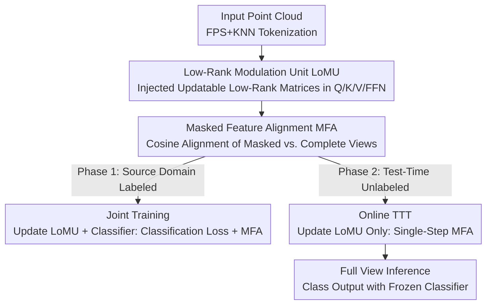

# Low-Rank Test-Time Training for Pre-Trained Point Cloud Models

**Conference**: CVPR 2026  
**Paper**: [CVF Open Access](https://openaccess.thecvf.com/content/CVPR2026/html/Ye_Low-Rank_Test-Time_Training_for_Pre-Trained_Point_Cloud_Models_CVPR_2026_paper.html)  
**Code**: Not released  
**Area**: 3D Vision / Test-Time Training / Point Cloud Robustness  
**Keywords**: Test-Time Training, Point Cloud Classification, LoRA, Masked Feature Alignment, Out-of-Distribution Robustness

## TL;DR
This paper proposes LoTT-PC, a lightweight test-time training framework for pre-trained point cloud models. By replacing full-parameter fine-tuning with LoRA-style Low-Rank Modulation Units and substituting reconstruction auxiliary heads with decoder-free "Masked Feature Alignment," it outperforms the SOTA by approximately 2.7% on average across three point cloud corruption benchmarks using single-step online updates.

## Background & Motivation

**Background**: Large-scale self-supervised pre-training (e.g., Point-BERT, Point-MAE) has become the mainstream backbone for 3D point cloud understanding. However, deploying these models in real-world scenarios often encounters unseen corruptions (sensor noise, occlusion, density variations), leading to significant performance degradation. Test-Time Training (TTT) is a representative paradigm for addressing such Out-of-Distribution (OOD) shifts—it fine-tunes the model on-the-fly using self-supervised auxiliary tasks during inference without relying on labels.

**Limitations of Prior Work**: Existing point cloud TTT methods (e.g., MATE using reconstruction heads, SMART-PC using skeleton prediction heads, TTT-KD using knowledge distillation) suffer from two common flaws. First is **adaptation inefficiency**: they generally update a vast number of parameters (encoder + decoder + auxiliary heads), resulting in high latency, memory consumption, and potential catastrophic forgetting of robust priors learned during pre-training. Second is **weak coupling with the main task**: auxiliary targets are attached to independent decoders or task heads, leading to misalignment at the feature level. Consequently, the model may be misled by auxiliary semantics (e.g., "reconstructing better") and deviate from discriminative features during test-time.

**Key Challenge**: The authors attribute the problem to an overlooked mechanism: the generalization ability of masked pre-training models essentially stems from a **structural invariance at the latent feature level**, where encoded representations remain consistent under masking perturbations. Since robustness originates from "feature invariance," using an auxiliary task attached after a decoder for pixel/geometric reconstruction to approximate it is indirect and introduces irrelevant optimization pressure.

**Goal**: To operate directly on masked invariance at the encoder feature level without modifying the pre-trained backbone or adding auxiliary decoders, achieving both parameter efficiency and strong coupling between the auxiliary target and the main classification task.

**Core Idea**: Replace "full-parameter fine-tuning + reconstruction auxiliary heads" with "LoRA Low-Rank Modulation + Decoder-Free Masked Feature Alignment," compressing test-time adaptation into updating a few low-rank matrices and optimizing a single feature cosine consistency loss.

## Method

### Overall Architecture
LoTT-PC uses a frozen Point-MAE (12-layer Transformer) as the encoder backbone. The workflow operates in two stages: first, **Joint Training** is performed on the labeled source domain, where the classifier and the injected Low-Rank Modulation Units (LoMU) learn strongly coupled, mask-invariant features under combined classification and Masked Feature Alignment (MFA) objectives. Then, **Online TTT** is applied to each unlabeled test sample, freezing the backbone and classifier while performing a single-step gradient update on the LoMU parameters using the MFA loss, followed by inference using the complete view. The two contributory components—LoMU for "how to update (parameter efficiency)" and MFA for "what signal to update with (feature invariance)"—are integrated through this two-stage pipeline.

### Key Designs

**1. Low-Rank Modulation Unit (LoMU): Restricting Test-Time Updates to a Structured Low-Rank Subspace**

This design targets the "adaptation inefficiency + catastrophic forgetting" pain points. LoMU adopts LoRA parametrization: for a source weight $W_0 \in \mathbb{R}^{d_1 \times d_2}$, two trainable low-rank matrices $A \in \mathbb{R}^{r \times d_2}$ and $B \in \mathbb{R}^{d_1 \times r}$ are introduced ($r \ll \min(d_1, d_2)$, implemented with $r=16, \alpha=64$), resulting in an update $\Delta W = BA$ such that $W = W_0 + BA$. These low-rank matrices are injected into the Q/K/V and FFN projections of all 12 Transformer blocks, while the pre-trained backbone remains frozen. During test-time, gradients are only applied to $\phi$ (LoMU parameters). Quantitative ablation shows that replacing LoMU with full-parameter fine-tuning causes the online adaptation gain to plummet from +2.1% to +0.3%—full updates on a single sample lead to overfitting, whereas low-rank constraints stabilize adaptation and preserve discriminative priors.

**2. Masked Feature Alignment (MFA): Decoder-Free Masked Invariance as an Auxiliary Target**

This design addresses the "weak coupling" issue. Assuming feature invariance under masking is key to generalization, the authors formulate it directly as a loss without reconstruction. For a point cloud $X$, a random masked view $X^m$ and a complete view $X^c$ are constructed. A shared encoder outputs CLS tokens $h^v_{cls}$ and non-CLS token sets $H^v$ for each view. Permutation-invariant readout is performed by element-wise max-pooling non-CLS tokens and concatenating them with the CLS token to obtain global features $f^v = h^v_{cls} \oplus \max_j h^v_j$. Finally, the cosine distance between the global features of the two views is minimized: $L_{align} = 1 - \frac{\langle f^c, f^m \rangle}{\lVert f^c \rVert_2 \lVert f^m \rVert_2}$. Since the alignment targets the same global feature $f$ used by the classifier, the auxiliary objective is naturally coupled with the main task, avoiding the misalignment of optimizing reconstruction at the expense of classification.

**3. Two-Stage Training: Strong Coupling on Source and Lightweight Adaptation at Test-Time**

LoMU and MFA rely on a protocol that separates "source alignment" and "online adaptation." The **Joint Training Phase** freezes the pre-trained encoder weights $\theta^0_E$ and optimizes only $\phi$ and $\theta_C$ with the objective $\min_{\phi, \theta_C} \mathbb{E}[L_{ce}(C(f^m; \theta_C), y) + \lambda L_{align}(f^c, f^m)]$ ($\lambda=1.0$). Classification is performed on masked views to force the model to learn discriminative and mask-invariant features. The **Online TTT Phase** freezes the backbone and classifier, using $L_{align}$ for a **single-step** AdamW update on $\phi$ for each test sample (accumulating updates across samples in online mode), followed by full-view inference. An asymmetric mask ratio is used: 0.9 during training (forcing global semantic learning) and 0.1 during TTT (providing sufficient geometric context as anchors for alignment).

### Loss & Training
- **Joint Training**: Classification cross-entropy $L_{ce}$ + Masked Feature Alignment $L_{align}$ with $\lambda=1.0$. AdamW optimizer, batch size 32, learning rate $5\times10^{-4}$, 300 epochs, mask ratio 0.9.
- **Online TTT**: $L_{align}$ only, batch size 1, single-step AdamW update, mask ratio 0.1, 1 masked view per sample ($B_m=1$).
- **Inference**: Frozen classifier outputs logits from $f^c$ (full view) using updated $\phi^\star$.

## Key Experimental Results

### Main Results
Average classification accuracy (%) across 15 corruption types and multiple severities on ModelNet40-C, ScanObjectNN-C, and ShapeNet-C.

| Method | Source | ModelNet40-C | ScanObjectNN-C | ShapeNet-C | Mean |
|------|------|------|------|------|------|
| Org-SO (Baseline) | ICCV 2023 | 53.9 | 45.7 | 57.6 | 52.4 |
| MATE-SO | ICCV 2023 | 57.6 | 45.6 | 59.3 | 54.2 |
| SMART-PC-SO | ICML 2025 | 61.7 | 38.7 | 64.5 | 55.0 |
| **LoTT-PC-SO (Ours, Source Only)** | Ours | **74.4** | **52.0** | 66.4 | **64.3** |
| MATE-Online | ICCV 2023 | 71.3 | 48.5 | **69.1** | 63.0 |
| SMART-PC-Online | ICML 2025 | 72.9 | 47.4 | 67.1 | 62.5 |
| **LoTT-PC-Online (Ours)** | Ours | **75.5** | **54.1** | 67.4 | **65.7** |

Notably, even **without test-time updates**, LoTT-PC-SO (64.3%) outperforms the full online versions of MATE and SMART-PC. After online adaptation, it achieves new SOTA on ModelNet40-C and ScanObjectNN-C, specifically outperforming MATE-Online by 5.6% on the challenging ScanObjectNN-C. While MATE-Online is slightly better on ShapeNet-C (69.1% vs 67.4%) due to its reconstruction objective fitting clean CAD geometry, LoTT-PC maintains the highest overall mean.

### Ablation Study
Decomposing components on ScanObjectNN-C (SO = Source Only, Online = Test-Time Training).

| Variant | SO | Online | Description |
|------|------|------|------|
| w/o MFA | 48.3 | – | Removing alignment drops SO by 3.7%; without self-supervision, TTT is impossible. |
| w/o LoMU (Full-param) | 50.7 | 51.0 | Online gain drops from +2.1% to +0.3%. |
| **LoTT-PC (Full)** | **52.0** | **54.1** | Components are complementary: MFA provides signal, LoMU ensures efficiency. |

### Key Findings
- **MFA is the foundation**: Removing it drops performance significantly and disables online adaptation.
- **Low-rank modulation is critical**: Full-parameter fine-tuning yields nearly zero online gain (+0.3%), confirming that low-rank subspaces are essential to prevent single-instance overfitting.
- **Larger augmentation batches can hurt**: Increasing masked views per sample from 1 to 8 dropped accuracy, likely because averaging gradients blurs the sharp signals needed to correct specific corruptions.
- **Asymmetric mask ratios matter**: 0.9 for training and 0.1 for TTT is optimal; TTT with 0.9 drops performance as the model loses geometric context.

## Highlights & Insights
- **Turning "robustness via masked invariance" into an optimizable loss**: MFA directly aligns the features consumed by the classifier, a "mechanism insight → implementation" loop.
- **LoRA as a regularizer, not just for efficiency**: In the extreme budget of one sample and one gradient step, low-rank updates generalize better than full updates.
- **Asymmetric Masking Recipe**: Using the same mechanism for different roles (semantic learning vs. anchor alignment) across stages is a valuable heuristic.
- **Efficiency Gains**: Using a single view and single step vs. MATE's 48 views proves that robustness does not necessitate heavy computation.

## Limitations & Future Work
- **Classification Only**: Whether MFA translates to dense prediction tasks like segmentation remains unexplored.
- **Backbone Dependency**: Relies on masked pre-training backbones; effectiveness on backbones like those from pure contrastive learning is unverified.
- **Long-term Stability**: The stability of online updates over long sequences with continuous shifts was not tested.
- **ShapeNet-C Gap**: Reconstruction targets still hold advantages on synthesized CAD geometry.

## Related Work & Insights
- **vs. MATE (ICCV 2023)**: MATE requires reconstruction decoders and high-rank updates; this work removes decoders, uses cosine alignment, and updates low-rank units for higher efficiency and stability.
- **vs. SMART-PC (ICML 2025)**: SMART-PC uses skeleton prediction; this work argues that feature invariance is more fundamental than explicit geometric reconstruction.
- **vs. 2D TTA (TENT/SHOT)**: Entropy-based methods perform poorly on point cloud corruptions; this work follows the TTT paradigm with 3D-specific LoRA + MFA.

## Rating
- Novelty: ⭐⭐⭐⭐ 
- Experimental Thoroughness: ⭐⭐⭐⭐ 
- Writing Quality: ⭐⭐⭐⭐ 
- Value: ⭐⭐⭐⭐

<!-- RELATED:START -->

## Related Papers

- [\[CVPR 2026\] 3D sans 3D Scans: Scalable Pre-training from Video-Generated Point Clouds](3d_sans_3d_scans_scalable_pre-training_from_video-generated_point_clouds.md)
- [\[CVPR 2026\] E-RayZer: Self-supervised 3D Reconstruction as Spatial Visual Pre-training](e-rayzer_self-supervised_3d_reconstruction_as_spatial_visual_pre-training.md)
- [\[CVPR 2026\] Deformation-based In-Context Learning for Point Cloud Understanding](deformation-based_in-context_learning_for_point_cloud_understanding.md)
- [\[CVPR 2026\] $L^{2}DGS$: Low-Light Dynamic Gaussian Splatting](l2dgs_low-light_dynamic_gaussian_splatting.md)
- [\[CVPR 2026\] Adapting Point Cloud Analysis via Multimodal Bayesian Distribution Learning](adapting_point_cloud_analysis_via_multimodal_bayesian_distribution_learning.md)

<!-- RELATED:END -->
