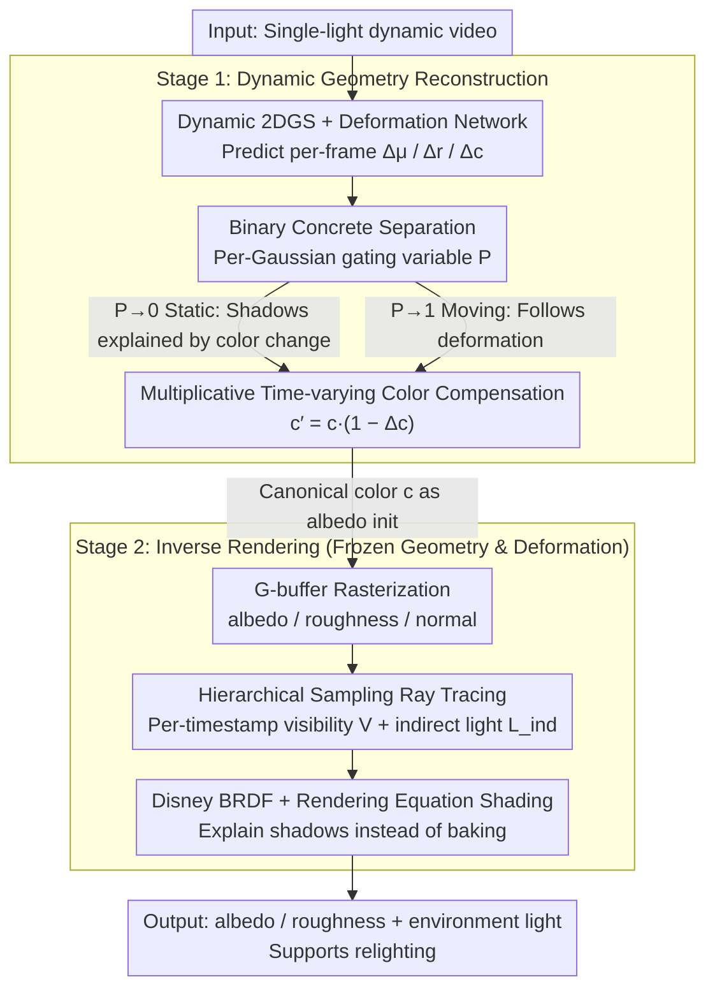

# LumiMotion: Improving Gaussian Relighting with Scene Dynamics

**Conference**: CVPR 2026  
**arXiv**: [2604.10994](https://arxiv.org/abs/2604.10994)  
**Code**: [https://joaxkal.github.io/LumiMotion/](https://joaxkal.github.io/LumiMotion/)  
**Area**: 3D Vision  
**Keywords**: Inverse Rendering, 2D Gaussian Splatting, Dynamic Scenes, Material Estimation, Relighting

## TL;DR
LumiMotion is the first Gaussian-based method to utilize scene dynamics (moving regions) as supervision signals to improve inverse rendering. By implementing motion-static separation and leveraging motion-revealed material changes, it achieves better decoupling of lighting and material, resulting in a 23% improvement in albedo LPIPS and a 15% improvement in relighting.

## Background & Motivation

**Background**: Inverse rendering aims to recover geometry, material, and lighting from images. Existing Gaussian Splatting methods (R3DG, IRGS, GI-GS) primarily target static scenes and tend to confuse shadows with material colors under strong direct lighting.

**Limitations of Prior Work**: In static scenes, it is difficult to distinguish whether an "area is dark because of shadows or because the material itself is dark" due to the lack of observations of the same surface under varying lighting conditions. Existing dynamic scene methods either focus solely on human avatars or require known lighting or multi-light training data.

**Key Challenge**: Accurate decoupling of material and lighting requires multi-lighting observations of the same surface, which are typically unavailable in real-world single-lighting conditions.

**Goal**: Utilize the motion of objects in the scene (such as shadow movement and lighting changes on moving objects) as natural multi-lighting supervision signals.

**Core Idea**: Motion reveals the appearance of the same surface under different lighting conditions, providing stronger constraints for material-lighting separation.

## Method

### Overall Architecture
The core challenge LumiMotion addresses is that, under single-lighting conditions, static inverse rendering fails to distinguish between a surface being dark due to shadows or intrinsically dark material. The proposed solution treats object motion as natural multi-lighting samples—when a shadow sweeps over a surface, that surface is observed under "different lighting." The pipeline consists of two stages: Stage 1 learns geometry on a dynamic 2D Gaussian Splatting (2DGS) representation, classifies Gaussians as static or moving, and fits the video using time-varying color compensation. Stage 2 freezes the geometry and deformation network to jointly optimize material properties (albedo, roughness) and environment lighting. It utilizes ray tracing to calculate visibility and indirect light, allowing the rendering equation to "explain away" shadows rather than baking them into the material. The transition point is that the canonical color learned in Stage 1 serves as the initial value for the albedo in Stage 2.

### Key Designs

**1. Binary Concrete Motion-Static Separation: Forcing shadows to be explained by "static surfaces + color changes" rather than Gaussian displacement**

Moving shadows can be fitted in two ways: either by translating or removing Gaussians over time, or by keeping Gaussians stationary and altering their color. While the former can reconstruct the video, it prevents stable albedo assignment in Stage 2. Thus, the authors force shadow regions into the latter path. Each Gaussian is assigned an auxiliary variable $P$, sampled via a Binary Concrete distribution (a continuous relaxation of Bernoulli for differentiability) to obtain $\tilde{P}\in[0,1]$. This gates the deformation network: Gaussians with $\tilde{P}\to 0$ are fixed as static, while those with $\tilde{P}\to 1$ are allowed to deform. Combined with a regularization term encouraging $P$ toward 0, the scene remains static by default, forcing shadows to be represented through color changes.

**2. Multiplicative Time-varying Color Compensation: Absorbing shadows through physical light modeling to yield albedo initialization**

Since shadows are explained by color variations, the compensation form is critical. LumiMotion employs a multiplicative rather than additive form: $c' = c\cdot(1-\Delta c)$, where $c$ is the time-invariant canonical color and $\Delta c$ is the per-frame attenuation. The multiplicative structure mirrors the rendering equation where light interacts with surface albedo. Since shadows are essentially the attenuation of incident light, using a factor $(1-\Delta c)$ between 0 and 1 is more physically natural than an additive offset. Consequently, after the lighting variations are absorbed by $\Delta c$, the remaining canonical color $c$ serves as a pseudo-albedo for Stage 2 optimization.

**3. Hierarchical Sampling Ray Tracing: Accurately calculating time-varying visibility in dynamic scenes**

Stage 2 must determine how much environmental and indirect light reaches a surface point. After freezing the Stage 1 geometry, albedo, roughness, and normals are rasterized into G-buffers. Hierarchical sampling is performed on the environment map to select incident directions for ray tracing, calculating visibility $V$ and indirect light $L_{\text{ind}}$. Explicit ray tracing is necessary because visibility changes frame-by-frame in dynamic scenes. This ensures the material optimization receives correct lighting information, fulfilling the premise that "motion acts as multi-lighting supervision."

### Loss & Training
The Stage 1 total loss includes reconstruction loss, normal consistency, depth distortion, foreground mask BCE, and motion-static separation regularization (encouraging $P$ toward 0) plus color change regularization (constraining $\Delta c$ magnitude). Stage 2 transitions to a physical rendering objective: L1 reconstruction loss under the rendering equation and albedo smoothness regularization to ensure spatial consistency and noise resistance.

## Key Experimental Results

### Main Results

| Scene/Metric | LumiMotion | IRGS (Second Best) | Gain |
|-----------|------------|-------------|------|
| Albedo LPIPS | Best | Second Best | -23% |
| Relighting LPIPS | Best | Second Best | -15% |
| Relighting PSNR | Best | Second Best | Significant |

### Ablation Study

| Configuration | Relighting PSNR | Description |
|------|----------------|------|
| Full (Dynamic) | Best | Utilizes dynamic information |
| Static baseline | Poor | Shadows baked into albedo |
| w/o Separation | Lower | Dynamic Gaussians interfere with albedo |

### Key Findings
- LumiMotion successfully removes shadows from albedo in dynamic scenes, whereas static methods bake shadows into the albedo.
- On paired static/dynamic versions of the same scene, dynamic inverse rendering consistently outperforms static results.
- Binary Concrete separation is crucial for accurate albedo estimation.

## Highlights & Insights
- **Motion as Supervision**: This observation is insightful—motion naturally provides samples of the same surface under different lighting, acting as "free" multi-illumination data.
- **Comparative Dataset Release**: A new synthetic benchmark containing static/dynamic paired versions is introduced to systematically evaluate the impact of dynamics on inverse rendering.

## Limitations & Future Work
- Assumes static environment lighting; not applicable to scenes with fluctuating light sources.
- Requires sufficient motion regions within the scene to provide supervision.
- Indirect lighting modeling remains simplified.

## Related Work & Insights
- **vs IRGS**: IRGS only processes static scenes and has limited shadow removal capabilities.
- **vs Relightable Neural Actor**: Limited to human avatars and requires known lighting conditions.

## Rating
- Novelty: ⭐⭐⭐⭐⭐ First to utilize scene dynamics to improve inverse rendering; profound observation.
- Experimental Thoroughness: ⭐⭐⭐⭐ Evaluated on synthetic and real data with static/dynamic comparisons.
- Writing Quality: ⭐⭐⭐⭐ Clear articulation of motivation.
- Value: ⭐⭐⭐⭐ Opens a new direction for dynamic inverse rendering.

<!-- RELATED:START -->

## Related Papers

- [\[CVPR 2026\] Faster-GS: Analyzing and Improving Gaussian Splatting Optimization](faster-gs_analyzing_and_improving_gaussian_splatting_optimization.md)
- [\[CVPR 2026\] BulletGen: Improving 4D Reconstruction with Bullet-Time Generation](bulletgen_improving_4d_reconstruction_with_bullet-time_generation.md)
- [\[CVPR 2026\] Improving Human Image Animation via Semantic Representation Alignment](improving_human_image_animation_via_semantic_representation_alignment.md)
- [\[CVPR 2026\] GaussFusion: Improving 3D Reconstruction in the Wild with A Geometry-Informed Video Generator](gaussfusion_improving_3d_reconstruction_in_the_wild_with_a_geometry-informed_vid.md)
- [\[CVPR 2026\] Learning a Particle Dynamics Model with Real-world Videos](learning_a_particle_dynamics_model_with_real-world_videos.md)

<!-- RELATED:END -->
