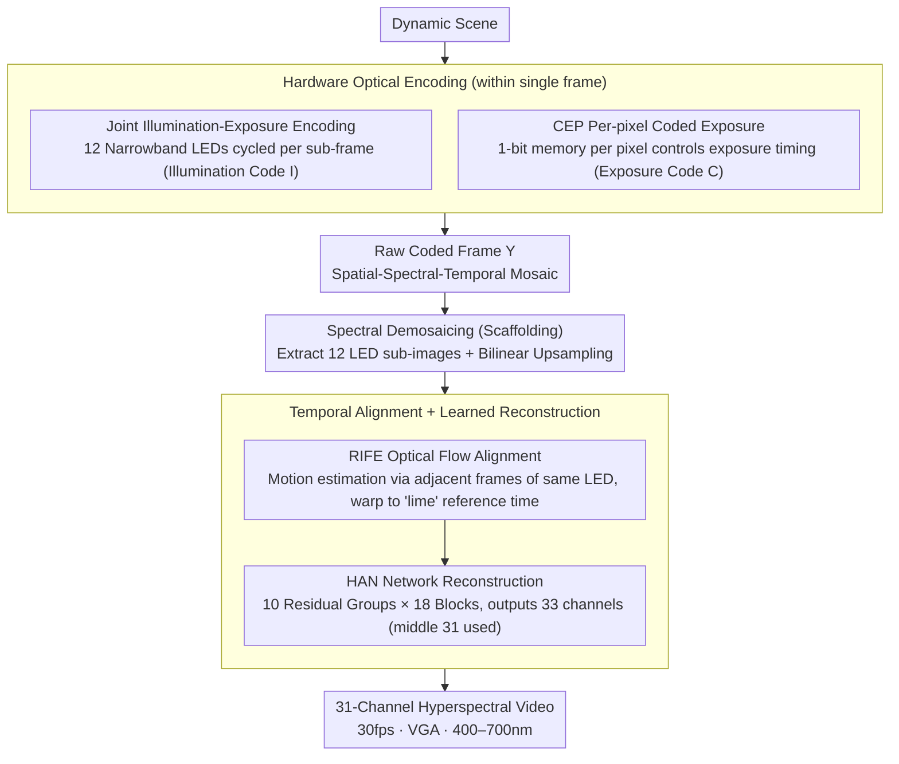

# Lumosaic: Hyperspectral Video via Active Illumination and Coded-Exposure Pixels

**Conference**: CVPR 2026  
**arXiv**: [2602.22140](https://arxiv.org/abs/2602.22140)  
**Code**: None  
**Area**: Computational Imaging / Hyperspectral Video  
**Keywords**: hyperspectral video, coded-exposure pixel, active illumination, motion-robust, spectral reconstruction

## TL;DR

The Lumosaic system is proposed for active hyperspectral video, synchronizing a 12-narrowband LED array with a Coded-Exposure Pixel (CEP) camera at microsecond precision. By jointly encoding spatial-temporal-spectral information across 158 sub-frames per frame, it achieves motion-robust reconstruction of 31-channel (400–700nm) hyperspectral video at 30fps VGA resolution, surpassing passive snapshot systems by over 10dB in PSNR.

## Background & Motivation

**Background**: Hyperspectral imaging (HSI) captures multi-band reflectance and is widely used in material classification, physiological monitoring, and spectral relighting. Traditional scanning HSI is spectrally accurate but slow, while snapshot HSI (CASSI, DOE, MSFA) enables single-frame acquisition at the cost of low light efficiency and severe motion artifacts. Active HSI utilizes programmable light sources to encode spectra in the temporal/spatial domains, enhancing photon utilization.

**Limitations of Prior Work**:

1. Passive snapshot systems disperse light into multiple spectral channels, resulting in significant light loss and ill-posed inversion that amplifies noise.
2. Existing active systems (e.g., LED time-division multiplexing, structured light projection) only exercise fine control along a single dimension, leading to inter-frame spectral misalignment in dynamic scenes.
3. Even if rolling shutters can multiplex spectra within a single frame, fast motion still induces rolling shutter distortion.

**Key Challenge**: Hyperspectral video must simultaneously satisfy spectral resolution, light efficiency, and temporal sampling; existing passive and active systems fail to balance all three.

**Goal**: Achieve compact, motion-robust, real-time hyperspectral video acquisition.

**Key Insight**: Couple the per-pixel high-speed modulation capability of CEP sensors with time-varying narrowband LED illumination to jointly encode 3D spatial-temporal-spectral information within a single frame.

**Core Idea**: Utilize per-pixel exposure control of the CEP camera and time-varying LED illumination to construct a dense spatial-spectral-temporal mosaic within each frame, with signal acquisition performed entirely on-silicon.

## Method

### Overall Architecture

Lumosaic aims to capture spatial, spectral, and temporal dimensions simultaneously within a standard color exposure interval to obtain motion-robust real-time hyperspectral video. The workflow is a "hardware optical encoding → software decoding reconstruction" pipeline. On the hardware side, 12 narrowband LEDs (20–30nm FWHM, Lumileds Luxeon C) serve as programmable active light sources, paired with a VGA CEP camera (640×480, 12,500 sub-frames/sec). An ESP32 microcontroller aligns the "illumination code" (which LED is active) and "exposure code" (which pixels are exposing) at microsecond precision. This weaves a spatial-spectral-temporal mosaic within a single frame. Each frame is divided into $S=158$ sub-frames (170µs each), totaling ~27ms integration plus ~6ms readout/sync to reach 30fps. On the software side, the system performs spectral demosaicing to extract 12 LED sub-images, followed by bilinear upsampling. RIFE optical flow aligns these sub-images to a single reference timestamp, which are finally fed into a HAN network to reconstruct 31-channel (400–700nm) hyperspectral video.

### Key Designs

**1. Joint Illumination-Exposure Encoding: Packing Space-Spectrum-Time into One Frame**

The fundamental flaw of passive snapshot systems is dispersing incident light and then filtering for narrow bands, which causes photon loss and ill-posed inversion. Lumosaic instead uses "who illuminates" and "who observes" codes to weave a dense mosaic: pixels are divided into $4\times4$ tiles ($T=16$), each assigned a unique exposure code $\mathbf{C}_{\text{tile}} \in \{0,1\}^{T \times S}$ and illumination code $\mathbf{I}_{\text{tile}} \in \{0,1\}^{T \times S \times L}$. Only one LED is lit per sub-frame, so adjacent pixels see different bands at different times, creating a spatial spectral-temporal mosaic. The forward imaging model is:

$$Y_p = \sum_{s=1}^{S} C_{p,s} \cdot \mathbf{a}_{p,s}^\top \mathbf{r}_p + \eta_p,\qquad \mathbf{a}_{p,s} = \mathcal{S} \odot \boldsymbol{\mathcal{I}}_{p,s}$$

where $\mathbf{r}_p$ is the reflectance spectrum, and the effective spectral sensitivity $\mathbf{a}_{p,s}$ is the Hadamard product of camera response $\mathcal{S}$ and LED spectrum $\boldsymbol{\mathcal{I}}_{p,s}$. Under active illumination, the full narrowband output of each LED contributes to the signal, yielding a much higher SNR than filtering.

**2. CEP Camera Per-pixel Coded Exposure: Independent Sampling Points**

Implementing the above code scheme relies on the CEP camera's ability to control exposure per pixel. Traditional cameras share exposure timing across all pixels. CEP embeds a 1-bit writable memory within each pixel to determine which of two charge buckets the photoelectrons flow into per sub-frame. At the end of the frame, two buckets are read out as complementary signals. With modulation rates exceeding 39kHz at VGA resolution, the $16\times158$ exposure table $\mathbf{C}_{\text{tile}}$ is physically written to the silicon, turning every pixel into an independently programmable spatial-spectral-temporal sampling point.

**3. Temporal Alignment + Learned Reconstruction: Bridging Snapshots to Video**

Since the 12 LED sub-images correspond to different intervals within a frame, scene motion introduces spectral-spatial aliasing. Lumosaic selects the "lime" LED sub-image as the temporal reference. RIFE estimates motion between adjacent frames of the same LED (chosen for photometric consistency) and warps all sub-images to the reference time. These aligned 12-channel sub-images are processed by a HAN network (10 residual groups, 18 residual blocks, 128 channels) to output 31 channels (400–700nm).

### Loss & Training

$\mathcal{L}_1$ loss, Adam optimizer (lr=1e-4), batch size 14 with 2-step gradient accumulation, 50,000 iterations, ~24h on RTX A6000. Data augmentation includes 0–15% Gaussian noise. Dataset: CAVE (32) + KAUST (409) + ARAD (949), resampled to 31 channels (400–700nm, 10nm interval) with an 80/10/10 split.

## Key Experimental Results

### Main Results

**Simulation Reconstruction Quality (Noiseless)**

| Method | Type | PSNR (dB)↑ | SSIM↑ | SAM↓ |
|------|------|-----------|-------|------|
| MST++ | Passive RGB→HSI | ~30 | ~0.92 | ~0.25 |
| QDO | Passive DOE Snapshot | ~32 | ~0.93 | ~0.22 |
| Lumosaic + SRNet | Active CEP | ~42 | ~0.98 | ~0.06 |
| Lumosaic + MCAN | Active CEP | ~43 | ~0.98 | ~0.05 |
| **Lumosaic + HAN** | **Active CEP** | **~44.0** | **~0.99** | **~0.04** |

### Ablation Study

**Noise Robustness (Lumosaic+HAN)**

| Noise Level σ | PSNR (dB) | Description |
|-----------|-----------|------|
| 0% | 44.0 | Best performance |
| 5% | ~38 | Far exceeds passive systems |
| 10% | ~35 | Maintains high fidelity |
| 20% | 32.0 | Still better than passive at 0% noise |

**Reconstruction Backbone Comparison**

| Backbone | PSNR↑ | Inference Speed | Description |
|----------|-------|---------|------|
| HAN | 44.0 dB | 4.7s/frame | Highest accuracy |
| MCAN | ~43 dB | 52ms/frame | Accuracy-speed trade-off |
| SRNet | ~42 dB | 27ms/frame | Near real-time |

### Key Findings

- Lumosaic significantly outperforms passive snapshot systems (>10dB PSNR gain), validating the fundamental advantage of active illumination and coded exposure.
- All three backbones outperform passive baselines, suggesting performance gains stem from the hardware encoding scheme rather than network complexity.
- ColorChecker experiments show reconstructed spectra highly consistent with Konica Minolta CS-2000 ground truth.
- Metamerism experiments demonstrate the ability to distinguish visually identical but spectrally different materials (e.g., authentic vs. printed copies).
- 30fps dynamic scenes (rotating globe, hand gestures, liquid diffusion) exhibit temporal coherence and spectral accuracy.

## Highlights & Insights

- Pioneering use of CEP sensors for hyperspectral video, with signal encoding performed entirely on-silicon, eliminating complex optical calibration.
- Elegant system co-design: Illumination codes, exposure codes, and reconstruction networks are tightly coupled.
- High information capacity: 158 sub-frames × 12 LEDs × 16 tiles achieve extreme encoding density within a single frame.
- RIFE alignment effectively addresses sub-frame motion inherent in active systems, which is the "missing link" for true hyperspectral video.

## Limitations & Future Work

- Reconstruction inference is slow (HAN at 4.7s/frame vs. 30fps acquisition); real-time deployment requires lighter backbones like SRNet.
- Only one CEP bucket (Bucket 1) is used; dual-bucket modeling could further enhance dynamic range and light efficiency.
- Active illumination limits application to controlled environments; unsuitable for outdoor/long-range scenes.
- Frame-by-frame processing does not yet exploit inter-frame temporal redundancy.
- Fixed encoding schemes; adaptive or randomized mosaics might offer further optimization.

## Related Work & Insights

- **vs. Passive Systems (CASSI, etc.)**: Active illumination fundamentally changes photon efficiency—full LED output contributes to the signal, whereas passive filters attenuate most photons.
- **vs. Verma et al.**: Both use time-varying LEDs, but Verma relies on rolling shutter row-level multiplexing, which suffers from motion distortion; Lumosaic’s per-pixel encoding is more flexible and robust.
- **vs. Yu et al. (Event Camera)**: Yu uses event cameras and rainbow scanning, but requires mechanical rotation, lacking the compactness and robustness of solid-state Lumosaic.
- **Insights**: The CEP + time-varying illumination paradigm could be extended to fluorescence imaging and Raman spectroscopy where active excitation and spectral resolution are required.

## Rating

- Novelty: ⭐⭐⭐⭐⭐ Unprecedented CEP + active illumination system, system-level innovation.
- Experimental Thoroughness: ⭐⭐⭐⭐ Simulation + real prototype + dynamic scenes, though lacks quantitative comparison with some SOTA systems in real-world scenes.
- Writing Quality: ⭐⭐⭐⭐⭐ Clear progression from forward model to system layers; logical hardware-software co-design.
- Value: ⭐⭐⭐⭐ High innovation, though application range is bounded by the need for active illumination.

<!-- RELATED:START -->

## Related Papers

- [\[CVPR 2026\] ZoomEarth: Active Perception for Ultra-High-Resolution Geospatial Vision-Language Tasks](zoomearth_active_perception_for_ultra-high-resolution_geospatial_vision-language.md)
- [\[CVPR 2026\] Exploring Spatiotemporal Feature Propagation for Video-Level Compressive Spectral Reconstruction](exploring_spatiotemporal_feature_propagation_for_video-level_compressive_spectra.md)
- [\[CVPR 2026\] No Labels, No Look-Ahead: Unsupervised Online Video Stabilization with Classical Priors](no_labels_no_look-ahead_unsupervised_online_video_stabilization_with_classical_p.md)
- [\[CVPR 2026\] HyperFM: An Efficient Hyperspectral Foundation Model with Spectral Grouping](hyperfm_an_efficient_hyperspectral_foundation_model_with_spectral_grouping.md)
- [\[CVPR 2026\] MetaSpectra+: A Compact Broadband Metasurface Camera for Snapshot Hyperspectral+ Imaging](metaspectra_a_compact_broadband_metasurface_camera_for_snapshot_hyperspectral_im.md)

<!-- RELATED:END -->
