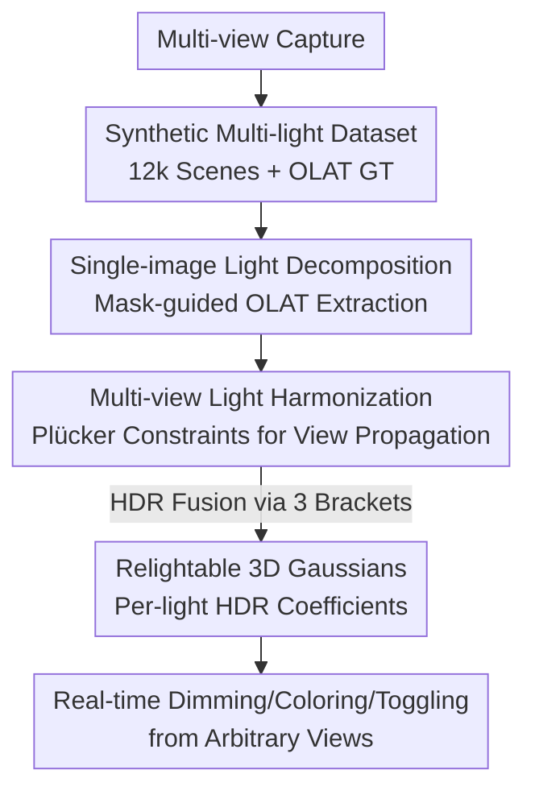

# LuxRemix: Lighting Decomposition and Remixing for Indoor Scenes

**Conference**: CVPR 2026  
**arXiv**: [2601.15283](https://arxiv.org/abs/2601.15283)  
**Code**: https://luxremix.github.io (Project page, including video/interactive demos)  
**Area**: 3D Vision / Inverse Rendering / Relighting  
**Keywords**: Indoor scene relighting, lighting decomposition, OLAT, multi-view consistency, 3D Gaussian Splatting

## TL;DR
LuxRemix utilizes a generative single-image lighting decomposition model to break down complex indoor illumination into "One-Light-At-a-Time" (OLAT) components. These results are consistently propagated across all viewpoints via multi-view lighting harmonization and encoded into a relightable 3D Gaussian Splatting representation, enabling users to independently toggle, recolor, or adjust the brightness of each light source in real-time from any perspective.

## Background & Motivation
**Background**: Lighting control in indoor scenes is a core requirement for photography, film, and virtual production. However, once captured, lighting is typically "baked" into the images and 3D reconstructions—single photos, NeRF, or 3DGS reconstructions fix the contribution of every lamp into the final appearance, making it nearly impossible to adjust individual lights post-capture.

**Limitations of Prior Work**: Existing relighting pipelines have significant drawbacks. Data-driven methods requires dense multi-light acquisition in controlled environments, which is impractical for real indoor scenes and generalizes poorly. Optimization-based inverse rendering decomposes scenes into geometry/material/lighting but is computationally expensive and often yields implausible results under dramatic lighting changes. Recent methods leveraging diffusion priors mainly target **objects**, **portraits**, or **simple scenes with distant uniform lighting**.

**Key Challenge**: The difficulty of indoor scenes lies in **spatially-varying near-field lighting**—multiple nearby sources (chandeliers, wall lamps, desk lamps) interact. Selectively switching one light requires understanding complex light transport, which far-field environment map assumptions cannot cover. Furthermore, existing single-image light editing methods (e.g., LightLab) fail to maintain 3D consistency across multiple views, leading to flickering when decomposing multi-view sequences frame-by-frame.

**Goal**: Starting from a standard multi-view capture, the objective is to decompose complex indoor lighting into **independently controllable single sources** while ensuring the decomposition is consistent across all views and supports real-time editing.

**Key Insight**: Modern diffusion models have encoded rich priors about indoor lighting from massive datasets, which can be leveraged for decomposition. Multi-view geometric constraints provide the consistency needed to propagate these results across views. By reframing lighting decomposition as a **multi-view harmonization problem** and integrating it into a fast differentiable 3D representation, fine-grained per-light control and real-time interaction can be achieved simultaneously.

**Core Idea**: A three-stage pipeline consisting of "Single-image Diffusion Decomposition (OLAT) + Multi-view Diffusion Harmonization + Relightable 3DGS" is employed to bridge the fine-grained control of single-image decomposition with the 3D consistency of multi-view methods.

## Method

### Overall Architecture
LuxRemix aims to output a 3D representation that allows real-time independent control of each light from any perspective given a multi-view indoor capture. The system is a sequential three-stage pipeline: first, a generative model decomposes lighting into OLAT components on **single images**; second, these results are **harmonized across views**; finally, they are encoded into **3D Gaussians** for real-time remixing. All three stages rely on a self-constructed large-scale synthetic dataset (12,000 indoor scenes with OLAT ground truth) to train the diffusion priors.

The mathematical convention for lighting decomposition expresses the input image as a linear superposition of ambient light and various OLAT components followed by tone mapping:

$$I_{\text{input}}=\text{tonemap}\Big(I_{\text{ambient}}+\sum_{i=1}^{N}\boldsymbol{c}_{i}\cdot I_{i}\Big)$$

where $I_i$ is the OLAT image when only the $i$-th light is on (in HDR linear space with undetermined scale), $\boldsymbol{c}_i$ is the RGB scale factor required to recover the original lighting, and $I_{\text{ambient}}$ is the "ambient light" contributed by remaining sources when a specific light is turned off. The pipeline focuses on estimating this set $\{I_{\text{ambient}}, I_i\}$ while maintaining view consistency.

### Key Designs

**1. Synthetic Multi-light Dataset: Generating OLAT Ground Truth via Procedural Rendering**

The prerequisite is having supervision signals for "each light turned on individually," which is impossible to capture in the real world. The authors used 12,000 procedurally generated indoor 3D models. Using Infinigen, up to six controllable lights (chandeliers, wall lamps, floor lamps, desk lamps, and ambient light) were placed per scene. Light colors were sampled from blackbody temperatures to cover various white lights, with an additional 10% HSV perturbation. Each scene was rendered in Blender Cycles with configurations like "Full On / Random On / Ambient Only / OLAT." For efficiency, rather than pre-rendering all perspective views, each scene was rendered into 4 equirectangular HDR panoramas, with **perspective views sampled online** during training. This covers diverse camera poses while avoiding massive pre-rendering overhead. Each light also generated three types of masks (emitting surface, entire fixture, convex hull) for conditional input.

**2. Single-image Light Decomposition (LuxRemix-SV): Mask-guided LoRA Fine-tuning for "One Light Only"**

The first stage performs decomposition on single images. The authors fine-tuned a pre-trained image editing DiT (FLUX) using LoRA to focus on two tasks: ① OLAT decomposition—using text prompts like "turn off all lights except the selected one" to generate views with only one source's contribution; ② Turning off lights—using "turn off only the selected light" to obtain $I_{\text{ambient}}$. To specify the light, light masks are patched, projected via a single-layer MLP to the FLUX VAE latent dimension, and **added channel-wise to the input image latent** (rather than being concatenated as tokens). Training includes light combination augmentation (dynamically stacking multiple OLATs) and uses high/medium/low brightness prompts (corresponding to target HDR OLAT at EV0/EV-2/EV-4) to learn light transport over a wider dynamic range.

**3. Multi-view Light Harmonization (LuxRemix-MV): Propagating Decomposition Consistently Across All Views**

Decomposing each frame independently causes flickering and 3D inconsistency. Since no prior work addressed propagating "lighting decomposition" across views, the authors formulated this as a multi-view diffusion harmonization problem. The input consists of multi-view images with **partial** lighting decomposition (only a few views are decomposed) plus corresponding Plücker ray embeddings. The output is a set of harmonized images for all views. Referencing CAT3D/SimVS, the original input views, sparse decomposed views, ray embeddings, and reference view masks are fed into a pre-trained multi-view diffusion U-Net for **full-parameter fine-tuning**. To produce HDR, harmonization is run for three exposure levels, then fused using the Debevec-Malik method.

**4. Relightable 3D Gaussians: Storing Per-light HDR Coefficients for Linear Remixing**

Finally, the consistent decomposition results are transformed into a real-time 3D representation. Based on standard 3DGS, each Gaussian is **augmented with per-light HDR RGB coefficients**, storing the contribution of each source (including ambient) to that Gaussian's appearance. During rendering, these contributions are linearly combined based on user-defined intensities/colors. Optimization occurs in two stages: first, a standard 3DGS is pre-trained on original views to establish geometry; then, geometry/appearance parameters are frozen, and per-Gaussian RGB coefficients (initialized from harmonization output) are optimized in linear HDR space to match the original input views when recombined.

### Loss & Training
The 3D phase uses two L1 losses: an L1 loss for supervising individual light images and an L1 composition loss to ensure the recombined result matches the original input views. The single-image stage uses LoRA for parameter-efficient fine-tuning, while the multi-view stage employs full-parameter fine-tuning of the U-Net.

## Key Experimental Results

Evaluation was conducted on 30 synthetic test scenes held out from the training set, using PSNR / SSIM / LPIPS after per-channel color rescaling against the ground truth. Real-world scenes used standard SfM for pose estimation, typically with 32–96 images.

### Main Results: Single-image Light Decomposition (Table 1, 30 Synthetic Scenes)

| Method | PSNR ↑ | SSIM ↑ | LPIPS ↓ |
|------|--------|--------|---------|
| ScribbleLight | 14.39 | 0.395 | 0.688 |
| Qwen-Image | 18.23 | 0.714 | 0.237 |
| FLUX token (variant) | 25.20 | 0.865 | 0.101 |
| SD U-Net (variant) | 27.13 | 0.857 | 0.099 |
| **LuxRemix-SV (Ours)** | **27.68** | **0.898** | **0.082** |

General image editing models (ScribbleLight, Qwen-Image) lack precise per-light control. The final model outperforms variants in all three metrics.

### Ablation Study: Multi-view Lighting Harmonization (Table 2, 30 Synthetic Scenes)

| Configuration | PSNR ↑ | SSIM ↑ | LPIPS ↓ | Note |
|------|--------|--------|---------|------|
| LuxRemix-SV | 25.14 | 0.807 | 0.149 | Per-view processing, no MV context |
| LuxRemix-MV-Edit | 26.37 | 0.794 | 0.136 | MV editing with masks |
| **LuxRemix-MV (Ours)** | **30.76** | **0.867** | **0.091** | Harmonization from sparse reference views |

### Key Findings
- **Multi-view Harmonization is the largest contributor**: Moving from independent LuxRemix-SV (PSNR 25.14) to multi-view context LuxRemix-MV (30.76) resulted in a 5.6 dB gain, validating the necessity of the "view propagation" module.
- **Single-image Architecture Matters**: The channel-wise mask token model (LuxRemix-SV, 27.68) outperformed the in-context 'FLUX token' variant (25.20) and the SD U-Net variant (27.13).
- **Advantage in Real-time Relighting**: NeRF-W and Splatfacto-W only support global relighting under multi-light capture; Instruct-NeRF2NeRF is too imprecise. LuxRemix is among the few capable of interactive per-light control from standard captures.

## Highlights & Insights
- The combination of **OLAT linear superposition + Diffusion Priors** cleverly bypasses the lack of real-world controlled data by using procedural rendering for OLAT supervision.
- Explicitly treating **"cross-view propagation of decomposition" as a new task** is the most significant contribution. It identifies the gap between single-image decomposition (inconsistent) and global relighting (uncontrollable) and fills it with multi-view diffusion.
- The design of **per-Gaussian per-light HDR coefficients** with linear remixing is highly transferable; any task requiring additive 3DGS editing (e.g., material layering) could adopt this two-stage frozen optimization strategy.
- **Online sampling from panoramas** is a practical engineering trick that reduces data generation costs significantly without sacrificing viewpoint diversity.

## Limitations & Future Work
- **Limitations**: The model is trained on static synthetic indoor scenes and may struggle with outdoor or dynamic environments. The light source diversity in training data leads to a bias toward "light cones" rather than very diffuse setups. It does not support far-field global illumination editing via HDRI.
- **Observations**: Quantitative evaluation is primarily on synthetic scenes; real-world scenes lack OLAT ground truth for benchmarking. The metrics are calculated after per-channel rescaling, meaning absolute intensity/color scale accuracy is not directly assessed.
- **Future Work**: Scaling the dataset to include diffuse sources and dynamic scenes; integrating HDRI for unified near-field and far-field editing; exploring weakly-supervised consistency losses to reduce the sim-to-real gap.

## Related Work & Insights
- **vs LightLab**: LightLab also uses diffusion fine-tuning for single-image per-light control but lacks 3D consistency; LuxRemix "lifts" this fine-grained control to 3D via harmonization.
- **vs Multi-view Relighting (Alzayer et al. / LightSwitch)**: These maintain 3D consistency but require controlled multi-light capture or only output global relighting; LuxRemix achieves per-light control from ordinary captures.
- **vs DiffusionRenderer / UniRelight**: These use G-buffers to decouple rendering or output images in one pass; LuxRemix avoids fragile geometry/material estimation by decomposing OLAT directly in the image domain using priors.
- **vs 3DGS Inverse Rendering (GS-IR series)**: Most require controlled capture or explicit BRDF decomposition; LuxRemix uses a simpler per-Gaussian coefficient approach, bypassing brittle inverse rendering optimizations.

## Rating
- Novelty: ⭐⭐⭐⭐⭐ First to bridge indoor multi-view lighting decomposition and remixing with an explicit propagation task.
- Experimental Thoroughness: ⭐⭐⭐⭐ Strong synthetic evaluation and ablations, though real-world quantitative benchmarks are inherently difficult.
- Writing Quality: ⭐⭐⭐⭐⭐ Clear three-stage motivation and well-structured methodology.
- Value: ⭐⭐⭐⭐⭐ Directly addresses the demand for real-time light editing in virtual production and immersive scenes.

<!-- RELATED:START -->

## Related Papers

- [\[CVPR 2026\] Dynamic-Static Decomposition for Novel View Synthesis of Dynamic Scenes with Spiking Neurons](dynamic-static_decomposition_for_novel_view_synthesis_of_dynamic_scenes_with_spi.md)
- [\[CVPR 2026\] SunFaded: Illumination-Aware Gaussian Splatting for Dark Scenes with Camera-Mounted Active Lighting](sunfaded_illumination-aware_gaussian_splatting_for_dark_scenes_with_camera-mount.md)
- [\[CVPR 2026\] UniLight: A Unified Representation for Lighting](unilight_a_unified_representation_for_lighting.md)
- [\[CVPR 2026\] OLATverse: A Large-scale Real-world Object Dataset with Precise Lighting Control](olatverse_a_large-scale_real-world_object_dataset_with_precise_lighting_control.md)
- [\[ICCV 2025\] InstaScene: Towards Complete 3D Instance Decomposition and Reconstruction from Cluttered Scenes](../../ICCV2025/3d_vision/instascene_towards_complete_3d_instance_decomposition_and_reconstruction_from_cl.md)

<!-- RELATED:END -->
