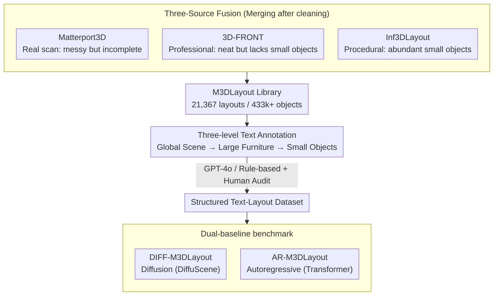

# M3DLayout: A Multi-Source Dataset of 3D Indoor Layouts and Structured Descriptions for 3D Generation

**Conference**: CVPR 2026  
**arXiv**: [2509.23728](https://arxiv.org/abs/2509.23728)  
**Code**: [GitHub](https://github.com/Graphic-Kiliani/M3DLayout-code)  
**Area**: 3D Vision  
**Keywords**: 3D indoor layout, dataset, text-driven scene generation, diffusion model, autoregressive model

## TL;DR

The authors constructed M3DLayout, a multi-source large-scale 3D indoor layout dataset (21,367 layouts, 433k+ object instances), integrating real scans, professional designs, and procedural generation. Complemented by structured text descriptions, it provides a high-quality foundation for text-driven 3D scene generation.

## Background & Motivation

In text-driven 3D scene generation, object layout serves as a crucial intermediate representation connecting linguistic instructions with geometric output. It providing structural blueprints and supporting semantic controllability and interactive editing. However, existing datasets face severe bottlenecks:

- **ScanNet, Matterport3D** (Real scans): High geometric noise, incomplete object coverage, and a lack of fine-grained annotations required for generation tasks.
- **3D-FRONT, Structured3D** (Professional design): Neat layout structures but limited object variety, with almost no small items (3D-FRONT contains only 0.2% small objects).
- **All existing datasets**: Lack scene-level text annotations (global descriptions + large furniture relationships + small object details), failing to support conditional or multimodal generation tasks.
- Scene feasibility issues (overlaps, displacements, semantic violations) are rarely validated, leading to significant noise in training data.

**Goal**: To create a large-scale, diverse 3D layout dataset with structured text annotations, covering both large furniture and small objects.

## Method

### Overall Architecture

The core objective is to address the lack of high-quality training data for text-driven 3D scene generation. The pipeline consists of three steps: collecting and cleaning 3D indoor layouts from three sources, providing hierarchical structured text descriptions for each layout, and establishing benchmarks using diffusion and autoregressive baselines.

### Key Designs

**1. Three-Source Fusion: Compensating weaknesses with Authenticity, Standardisation, and Diversity**

Single-source layout data typically suffers from specific deficiencies. M3DLayout merges three types to leverage their respective strengths. Matterport3D (1,684 scenes, 12.6 objects/scene, 39.4% small objects) provides the clutter of real spaces; 3D-FRONT (5,754 scenes, 6.9 objects/scene, 0.2% small objects) contributes structural regularity and semantic standards; Inf3DLayout (13,929 scenes, 26.8 objects/scene, 68.5% small objects) uses Infinigen to generate customized layouts for bedrooms, etc., significantly increasing the proportion of small items.

**2. Three-Level Text Annotation: Decomposing "Global-Large-Small" into Hierarchical Semantic Supervision**

To enable fine-grained control, M3DLayout provides three levels of text: global scene descriptions (room type, style, geometry, zones), large furniture descriptions (absolute positioning and relative relationships), and small object descriptions (placement on surfaces/shelves and distribution patterns). The annotation workflow utilizes GPT-4o for Matterport3D and Inf3DLayout, while rule-based templates are used for 3D-FRONT, followed by manual auditing.

> ⚠️ GPT-4o annotations may introduce hallucinations or inaccurate spatial descriptions; manual audit is based on sampling.

**3. Dual-Baseline Benchmark: Evaluating Diffusion and Autoregressive Routes**

The diffusion baseline, DIFF-M3DLayout, follows the DiffuScene architecture, parameterizing each object as $o_i = (c_i, x_i, y_i, z_i, w_i, h_i, d_i, \theta_i)$. The autoregressive baseline, AR-M3DLayout, uses a Transformer to predict objects sequentially:

$$p_\theta(x \mid c^{\text{text}}) = \prod_{i=1}^N p_\theta(o_i \mid o_{<i}, c^{\text{text}})$$

The goal is to provide a fair baseline for dataset usability rather than claiming architectural novelty.

### Loss & Training

- Diffusion Model: Scene loss $L_{\text{sce}}$ (noise prediction error) + IoU regularization $L_{\text{IoU}}$ (penalizing object intersections).
- Autoregressive Model: Negative log-likelihood loss.
- Both use BERT to encode text conditions, training for 30k epochs with the Adam optimizer.
- Diffusion learning rate: $2 \times 10^{-4}$; Autoregressive learning rate: $1 \times 10^{-4}$.
- Training set: 12,062 layouts; Validation set: 3,018 layouts.

## Key Experimental Results

### Main Results

| Method | FID↓ (3D-FRONT) | FID↓ (Matterport) | FID↓ (Inf3DLayout) | CLIP-Score↑ |
|------|------------------|-------------------|---------------------|-------------|
| DiffuScene | 29.47 | 98.03 | 102.12 | 0.1982 |
| InstructScene | 68.58 | 100.54 | 159.27 | 0.1944 |
| DIFF-M3DLayout (Ours) | 57.64 | **87.89** | **70.85** | 0.2001 |
| AR-M3DLayout (Ours) | 87.98 | 107.58 | **57.90** | **0.2026** |

Note: The higher FID on 3D-FRONT for the proposed methods is due to distribution mismatch, as generated scenes often contain >12 objects compared to 3D-FRONT's 5-12.

### Ablation Study

| Training Data | FID↓ (3D-FRONT) | FID↓ (Matterport) | FID↓ (Inf3DLayout) | Description |
|----------|------------------|-------------------|---------------------|------|
| 3D-FRONT only | 27.33 | 83.88 | 110.98 | Overfits simple layouts |
| Matterport3D only | - | - | - | Poor generalization |
| Inf3DLayout only | - | - | - | Poor generalization |
| Full M3DLayout | 57.64 | 87.89 | 70.85 | Optimal cross-source balance |

### Key Findings

- The Inf3DLayout subset is critical for generating richly detailed scenes: AR-M3DLayout improved FID by 44% on the Inf3DLayout reference set compared to InstructScene.
- CLIP-Score outperforms baselines, proving stronger text controllability.
- User study (42 participants, 15 scenes): Significant advantage in "Scene Richness."
- The model can finely control object density (from minimalist to rich) via text.

## Highlights & Insights

1. **Multi-source Complementarity**: Combining real scans (authenticity), professional design (regularity), and procedural generation (diversity) effectively addresses the data bottleneck.
2. The **three-level structured text annotation** (Global → Large Furniture → Small Objects) provides hierarchical semantic supervision for fine-grained control.
3. The **Inf3DLayout subset** fills a major gap in existing datasets regarding decorative and functional small objects (68.5% share).
4. Scale: 21k layouts and 433k objects make it the only dataset of this size providing structured text descriptions for 3D layouts.

## Limitations & Future Work

1. **Novelty**: Benchmark models are adapted from DiffuScene; no new architecture specifically for multi-source data was proposed.
2. FID is worse on the 3D-FRONT reference set because generated scenes are more complex than the reference targets.
3. Inf3DLayout depends on Infinigen's procedural rules, which may lead to unnatural arrangements.
4. Text annotations rely on GPT-4o, introducing potential hallucinations.
5. Future work could extend to outdoor scenes, multi-story buildings, and dynamic layout changes.

## Related Work & Insights

- **DiffuScene/InstructScene**: The former lacks small objects and text control, while the latter has inaccurate spatial modelling. M3DLayout compensates through data quality.
- **LayoutGPT/HoloDeck**: LLM planning methods exhibit imprecise spatial reasoning; they require large-scale, physically plausible layout data as a foundation.
- Insight: In 3D generation, data quality and diversity often yield greater gains than architectural innovation.

## Rating

- Novelty: ⭐⭐⭐ 
- Experimental Thoroughness: ⭐⭐⭐⭐ 
- Writing Quality: ⭐⭐⭐⭐ 
- Value: ⭐⭐⭐⭐ 

<!-- RELATED:START -->

## Related Papers

- [\[CVPR 2026\] MajutsuCity: Language-driven Aesthetic-adaptive City Generation with Controllable 3D Assets and Layouts](majutsucity_language-driven_aesthetic-adaptive_city_generation_with_controllable.md)
- [\[CVPR 2026\] 3DReflecNet: A Large-Scale Dataset for 3D Reconstruction of Reflective, Transparent, and Low-Texture Objects](3dreflecnet_a_large-scale_dataset_for_3d_reconstruction_of_reflective_transparen.md)
- [\[CVPR 2026\] CustomTex: High-fidelity Indoor Scene Texturing via Multi-Reference Customization](customtex_high-fidelity_indoor_scene_texturing_via_multi-reference_customization.md)
- [\[CVPR 2026\] Breaking the 3D Dataset Bottleneck: Fast Scalable Generation of Aligned 3D Assets from Scratch for Category 6D Pose Estimation and Robotic Grasping](breaking_the_3d_dataset_bottleneck_fast_scalable_generation_of_aligned_3d_assets.md)
- [\[CVPR 2026\] Glove2Hand: Synthesizing Natural Hand-Object Interaction from Multi-Modal Sensing Gloves](glove2hand_synthesizing_natural_hand-object_interaction_from_multi-modal_sensing.md)

<!-- RELATED:END -->
