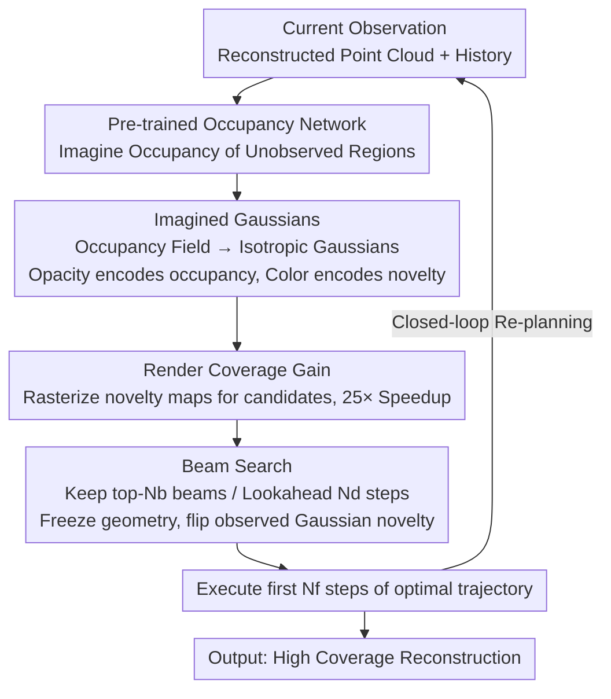

# MAGICIAN: Efficient Long-Term Planning with Imagined Gaussians for Active Mapping

**Conference**: CVPR 2026  
**arXiv**: [2603.22650](https://arxiv.org/abs/2603.22650)  
**Code**: [https://shiyao-li.github.io/magician/](https://shiyao-li.github.io/magician/)  
**Area**: 3D Vision  
**Keywords**: Active Mapping, Long-Term Planning, 3D Gaussian Splatting, Scene Reconstruction, View Selection

## TL;DR

The MAGICIAN framework is proposed, which utilizes a pre-trained occupancy network to generate "Imagined Gaussians" for efficient surface coverage gain estimation. Combined with beam search, it achieves long-term trajectory planning in active mapping, reaching SOTA status in both indoor and outdoor scenes with over a 10% increase in coverage.

## Background & Motivation

1.  **Background**: Active Mapping requires an agent to autonomously select optimal viewpoints to efficiently reconstruct unknown environments. Current mainstream methods use a greedy "Next Best View" (NBV) strategy, selecting the next pose based on information gain, Fisher information, or surface coverage gain.
2.  **Limitations of Prior Work**: Greedy NBV methods only locally optimize single-step gains, leading to inefficient exploration behaviors such as getting stuck in dead ends or oscillating back and forth. Although some methods attempt longer path planning (e.g., FisherRF selecting frontier targets, NextBestPath predicting path gain), they either still rely on frontier heuristics or depend on the quality of training data.
3.  **Key Challenge**: Long-term planning faces a "chicken and egg" problem—to plan an optimal trajectory, one needs an environmental map, but the map itself is exactly what is being constructed through planning. Simultaneously, the combinatorial explosion and computational cost of trajectory space make long-term planning extremely difficult.
4.  **Goal**: (1) Efficiently estimate surface coverage gain in unobserved regions; (2) Search for optimal long-term paths in a combinatorially explosive trajectory space; (3) Implement scalable closed-loop planning.
5.  **Key Insight**: Inspired by the human ability to quickly infer the structure of unfamiliar environments and plan exploration, the method "imagines" unseen regions through a pre-trained occupancy network.
6.  **Core Idea**: Convert occupancy predictions into a 3D Gaussian representation and utilize fast volume rendering to calculate coverage gains, making beam-search-based long-term planning feasible.

## Method

### Overall Architecture

The difficulty of active mapping lies in the gamble of every step: where to go next to complete the reconstruction of the unknown environment in the fewest steps. MAGICIAN decomposes this into a repetitive perception-planning-action loop. Upon reaching a position, it first uses a pre-trained occupancy model to "imagine" the probabilistic occupancy field of the current environment—not just the observed parts, but also occluded and unobserved regions. Next, it translates this occupancy field into a special set of 3D Gaussians, termed "Imagined Gaussians." Then, leveraging GPU volume rendering, it quickly calculates how much new surface (i.e., coverage gain) any candidate viewpoint can observe. With this inexpensive "scoring function," it runs a beam search to plan a long-term trajectory looking several steps ahead. Finally, it executes the first $N_f$ steps of the trajectory and returns to the first step to re-plan, forming a closed loop. The key to this process is transforming the abstract question of "is a future viewpoint worth visiting" into inexpensive rendering operations.

### Key Designs

**1. Imagined Gaussians: Turning Coverage Gain into Rendering**

Directly estimating how much new surface a candidate viewpoint can see traditionally requires repeated queries to occupancy and novelty neural networks over dense 3D sample points, followed by Monte Carlo integration. This takes 0.05s per viewpoint, making long-term planning over thousands of candidates computationally prohibitive. MAGICIAN’s breakthrough is noting a mathematical correspondence: the integral of surface coverage gain (occupancy × occlusion × novelty) and the volume rendering equation (density × transmittance × color) map to each other one-to-one. Thus, it places an isotropic Gaussian at each proxy point output by the occupancy network $\hat{\sigma}(\mathbf{x}\mid\mathbf{C}_t)$, using opacity to encode occupancy probability and the color channel to encode a binary novelty $\hat{\gamma}\in\{0,1\}$ (1 = unobserved, 0 = observed). Rendering a "novelty map" for any candidate pose and summing it yields the coverage gain. The computation collapses from dense neural queries to highly optimized Gaussian rasterization, reducing single viewpoint time to 0.002s (approx. 25x speedup). This acceleration makes the subsequent beam search feasible.

**2. Beam Search: Looking Multiple Steps Ahead in Explosive Trajectory Space**

Greedy NBV only selects the single step with the maximum immediate gain, which often leads agents into dead ends or cycles. MAGICIAN uses beam search to simultaneously maintain $N_b$ candidate trajectories (beams), allowing them to compete based on cumulative rewards. Each beam independently maintains its own "Imagined Gaussians" state because different trajectories observe different regions. During each expansion step, all reachable next poses for every beam are enumerated, their coverage gains are calculated, and only the top-$N_b$ results are retained for the next depth. A key technique is freezing the Gaussian geometric parameters during the search and only flipping the novelty of Gaussians observed by a specific pose from 1 to 0—ensuring that surfaces already seen are not recounted in future gain calculations without needing to rebuild the map. After a lookahead of $N_d$ steps, the trajectory with the maximum cumulative coverage gain $\sum_{i=1}^{N_d} G(\mathbf{c}_i)$ is selected. Greedy NBV is a degenerate case where $N_b=1, N_d=1$; by expanding the beam width and lookahead steps, coverage efficiency improves systematically (AUC +6.3%, Coverage +9.3%).

**3. Pre-trained Occupancy Network: Imaging Unseen Regions First**

To evaluate whether a viewpoint several steps ahead is worthwhile, one must have a prior guess regarding the geometry of unobserved regions—otherwise, lookahead is blind calculation. MAGICIAN uses a multi-layer Transformer occupancy network $\hat{\sigma}(\mathbf{x}\mid\mathbf{C}_t)$ as this "world model," taking query points, reconstructed point clouds, and historical poses as input to output occupancy probabilities in $[0,1]$. It is pre-trained on ShapeNet and fine-tuned on 3D scenes to encode strong structural priors (e.g., space likely exists behind a wall; the floor is usually below a table). The same network is also used to plan collision-free trajectories. A counter-intuitive discovery is that even skipping domain-specific fine-tuning and using the pre-trained model directly results in almost no performance drop, indicating the strong transferability of these structural priors.

### Mechanism: Convergence of a Single Beam Search Step

Suppose the beam width is $N_b=3$ and lookahead $N_d$ is deep. Currently, three candidate beams $\{B_1, B_2, B_3\}$ are retained, each with an independent "Imagined Gaussians" state. During expansion, assume each beam has 10 reachable next poses, generating $3 \times 10 = 30$ new candidates. A novelty map is rendered and summed for each, giving 30 coverage gain values. For example, $B_1$ turning left might see a long corridor (high gain), while $B_2$ faces a previously scanned corner (gain near 0). These 30 candidates are ranked by cumulative gain, and only the top-3 are kept for the next step, while the rest are pruned. Once a pose has "seen" certain Gaussians, their novelty is set to 0; thus, even if another beam passes the same corridor in the next step, it won't receive duplicate points. After $N_d$ steps, the trajectory with the highest cumulative gain among survivors is chosen, its first $N_f$ steps are executed, and re-planning occurs. Throughout the process, the map is never truly reconstructed; everything is deduced "in the mind" via frozen geometry and novelty flipping.

### Loss & Training

The occupancy network is pre-trained using standard occupancy prediction loss and then fine-tuned on 3D scenes. The exploration process itself involves no gradient updates—Imagined Gaussians are generated by forward inference, and novelty is flipped by rule, making it a training-free closed-loop planning approach.

## Key Experimental Results

### Main Results

| Dataset | Metric | MAGICIAN | MACARONS | FisherRF | SCONE |
|--------|------|----------|----------|----------|-------|
| Macarons++ | AUC↑ | **0.721** | 0.647 | 0.546 | 0.534 |
| Macarons++ | Final Coverage↑ | **0.919** | 0.819 | 0.786 | 0.670 |
| MP3D (Wheeled) | Comp. (%)↑ | **85.45** | - | - | - |
| MP3D (Wheeled) | Comp. (cm)↓ | **4.93** | - | - | - |
| MP3D (UAV) | Comp. (%)↑ | **96.83** | - | 90.18 (NARUTO) | - |
| MP3D (UAV) | Comp. (cm)↓ | **2.11** | - | 3.00 (NARUTO) | - |

**Reconstruction Quality** (Large-scale real scans):

| Method | SSIM↑ | PSNR↑ | LPIPS↓ | Acc. (%)↑ |
|------|-------|-------|--------|----------|
| FisherRF | 0.55 | 13.95 | 0.38 | 79.15 |
| MACARONS | 0.61 | 15.68 | 0.34 | 86.42 |
| MAGICIAN | **0.64** | **17.12** | **0.30** | **94.20** |

### Ablation Study

| Configuration | AUC↑ | Final Cov.↑ | Description |
|------|------|-------------|------|
| $N_b=1, N_d=1$ (Greedy) | ~0.66 | ~0.83 | Degenerates to NBV, still outperforms MACARONS |
| $N_b=10, N_d=10$ (Full) | 0.721 | 0.919 | +6.3% AUC, +9.3% Coverage |
| Pre-trained Occupancy | 0.652 | 0.888 | Good generalization |
| Fine-tuned Occupancy | 0.646 | 0.893 | Fine-tuning provides no significant gain |

### Key Findings

- **Even when degenerated to greedy NBV, the Imagined Gaussians rendering significantly outperforms MACARONS’ Monte Carlo method**: AUC +5.2%, Coverage +10.9%. The 25x speedup in gain estimation is critical.
- **The value of long-term planning becomes significant with more steps**: Increasing from 1-step to 10-step lookahead raises coverage from ~82% to ~92%, proving the necessity of long-term planning.
- **Re-planning frequency does not need to be extremely high**: Re-planning every 6 steps is sufficient to reach SOTA, indicating trajectory planning robustness.
- **Occupancy models exhibit strong domain transferability**: Models pre-trained only on outdoor data utilized in indoor scenes show almost no performance degradation.

## Highlights & Insights

- **The correspondence between coverage gain and volume rendering** is the most elegant insight: the mathematical form of the surface coverage gain integral is equivalent to the volume rendering equation. This allows the reuse of highly optimized Gaussian rendering pipelines to transform exploration planning into a "rendering problem."
- **Independent Gaussian states per beam** in the search are cleverly designed—different candidate trajectories have different observation histories, and logical novelty flipping maintains correct cumulative gain calculation while preserving parallelism.
- **The framework naturally extends to other exploration criteria**: By changing the semantics encoded in the "color channel" (e.g., uncertainty, reconstruction error), the same rendering framework remains applicable.

## Limitations & Future Work

- Requires a pre-trained occupancy network, which may need re-training or fine-tuning for entirely new domains (e.g., underwater, space).
- Beam search still incurs computational overhead; $N_b=10, N_d=10$ requires evaluating a large number of candidate viewpoints.
- The experiment assumes accurate poses are known and does not consider the impact of localization errors on planning.
- **Future Directions**: (1) Use lighter occupancy estimation (e.g., 2D feature projection to 3D) to reduce pre-training dependence; (2) Combine with LLM/VLM for semantic-guided active mapping; (3) Introduce uncertainty-aware re-planning strategies.

## Related Work & Insights

- **vs MACARONS**: MACARONS uses the same occupancy network but greedy NBV + Monte Carlo estimation. MAGICIAN improves coverage from 0.819 to 0.919 via Imagined Gaussians and beam search.
- **vs FisherRF**: FisherRF is based on frontier selection + Fisher information gain, but path planning is decoupled from gain calculation. MAGICIAN optimizes cumulative gain at the trajectory level.
- **vs ActiveGamer**: While ActiveGamer performs strongly on MP3D (95.32%), MAGICIAN reaches 96.83% without relying on traditional planners or navigation models.

## Rating

- Novelty: ⭐⭐⭐⭐⭐ The formal correspondence between coverage gain and volume rendering is elegant, achieving long-term planning in active mapping for the first time.
- Experimental Thoroughness: ⭐⭐⭐⭐⭐ Comprehensive experiments across multiple benchmarks, action spaces, reconstruction metrics, and ablations.
- Writing Quality: ⭐⭐⭐⭐⭐ Clear mathematical derivations and logical design flow with rich illustrations.
- Value: ⭐⭐⭐⭐⭐ Successfully addresses the long-standing long-term planning problem in active mapping with high utility.

<!-- RELATED:START -->

## Related Papers

- [\[CVPR 2026\] Generative Diffusion Priors for 3D Mapping of the Dark Universe](generative_diffusion_priors_for_3d_mapping_of_the_dark_universe.md)
- [\[CVPR 2026\] GS-ASM: 2DGS-Supervised Active Stereo Matching](gs-asm_2dgs-supervised_active_stereo_matching.md)
- [\[CVPR 2026\] LongStream: Long-Sequence Streaming Autoregressive Visual Geometry](longstream_long-sequence_streaming_autoregressive_visual_geometry.md)
- [\[CVPR 2026\] EventHub: Data Factory for Generalizable Event-Based Stereo Networks without Active Sensors](eventhub_data_factory_for_generalizable_event-based_stereo_networks_without_acti.md)
- [\[CVPR 2026\] CrowdGaussian: Reconstructing High-Fidelity 3D Gaussians for Human Crowd from a Single Image](crowdgaussian_reconstructing_high-fidelity_3d_gaussians_for_human_crowd_from_a_s.md)

<!-- RELATED:END -->
