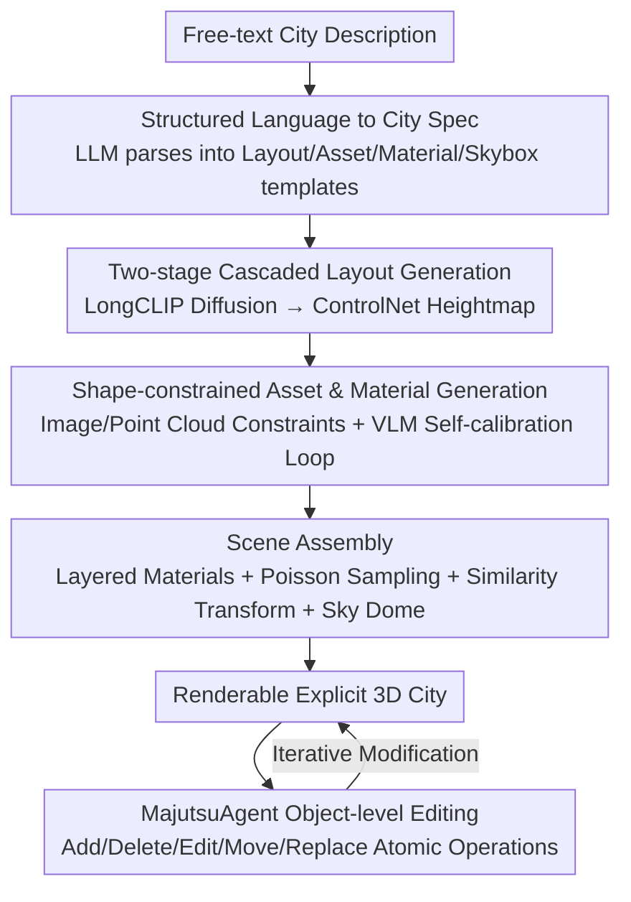

# MajutsuCity: Language-driven Aesthetic-adaptive City Generation with Controllable 3D Assets and Layouts

**Conference**: CVPR 2026  
**Paper**: [CVF Open Access](https://openaccess.thecvf.com/content/CVPR2026/html/Huang_MajutsuCity_Language-driven_Aesthetic-adaptive_City_Generation_with_Controllable_3D_Assets_and_CVPR_2026_paper.html)  
**Code**: Project Page https://longhz140516.github.io/MajutsuCity/  
**Area**: 3D Vision  
**Keywords**: 3D City Generation, Language-driven, Controllable Layout, Explicit Mesh, Interactive Editing

## TL;DR
MajutsuCity utilizes a four-stage pipeline—"Text → Scene Design → Layout/Heightmap → Assets & Materials → Scene Assembly"—to transform natural language directly into explicit 3D cities with structural consistency, adjustable styles, and object-level editability. It introduces the MajutsuDataset, the MajutsuAgent editing agent, and a set of VLM evaluation metrics (AQS/RDR), achieving an 83.7% reduction in layout FID compared to CityDreamer and a 20.1% reduction compared to CityCraft.

## Background & Motivation
**Background**: City-scale 3D generation follows two main paradigms. One is LLM-driven procedural generation (e.g., SceneCraft, 3D-GPT), which is highly expressive but limited to small-scale simple scenes, failing to support macro-geometric rationality at the city level. The other is layout-guided methods (e.g., InfiniCity, CityDreamer, GaussianCity), which use 2D semantic priors to generate city-scale scenes but rely on implicit representations or neural rendering, leading to multi-view inconsistencies and difficulties in integrating with downstream simulation pipelines.

**Limitations of Prior Work**: To ensure structural reliability, recent works have shifted toward explicit meshes by retrieving and placing buildings from predefined asset libraries. However, this restricts generation diversity to the coverage and style of the asset library—essentially functioning as "Retrieve-and-Place" rather than true generation. This creates a dilemma: text-driven generation offers creative flexibility but lacks object-level editability, while explicit structural representations offer editability but lack stylistic diversity.

**Key Challenge**: Existing methods cannot simultaneously satisfy stylistic diversity, fine-grained controllability, and object-level editability because they typically force a choice between "textual flexibility" and "explicit structural editability."

**Goal**: To extract both the macro-geometric logic (e.g., "a bustling downtown with skyscrapers") and fine-grained aesthetic intent (e.g., "pink lighting at sunset") encoded in natural language and apply them to an explicit 3D city that is structurally consistent, object-editable, and style-adaptive.

**Key Insight**: The authors observe that natural language itself simultaneously carries information about "how to arrange" and "what things should look like." By designing a structured "Language → City Specification" parsing pipeline, these two layers can be separately injected into layout generation and asset synthesis.

**Core Idea**: Representing the city as a combination of "controllable layouts + controllable assets + controllable materials," using a four-stage pipeline to translate text into an explicit 3D city step-by-step, and adding a language-driven editing agent to extend controllability from "initial generation" to "continuous modification."

## Method

### Overall Architecture
MajutsuCity receives a free-text city description and outputs a renderable, object-editable explicit 3D city. It decomposes the task into four serial stages: **Scene Design** uses an LLM to parse vague text into structured design specifications (standardized templates for layout, assets, materials, and skyboxes); **Layout Generation** employs a two-stage cascaded diffusion to transform the specifications into a semantic layout map $I_{layout}$ and a building heightmap $I_{height}$; **Assets & Materials Generation** synthesizes shape-constrained 3D assets for each building instance bottom-up and fine-tunes seamless PBR materials and skyboxes; **Scene Generation** assembles assets, ground layers, vegetation, streetlights, and sky domes into a complete scene. Beyond initial generation, **MajutsuAgent** utilizes GPT-5 to decompose natural language editing commands into five atomic operations, enabling human-in-the-loop object-level modifications. The system is supported by the MajutsuDataset and a VLM evaluation protocol (AQS/RDR).

### Key Designs

**1. Structured Language → City Spec: Parsing Vague Text into Executable Blueprints**

Free-text city descriptions are inherently ambiguous, lacking quantitative and relational constraints, making them difficult to control in generative models. MajutsuCity uses an LLM for intent understanding and structural decomposition: it reasons the potential planning intent from the user prompt and decomposes it into a multi-dimensional city design template covering Layout, Assets, Materials, and Skymap. Each dimension is parameterized via standardized templates (e.g., land use, spatial distribution, architectural style, facade materials). This step converts a sentence into a "semantic blueprint," guiding subsequent spatial layout generation and 3D asset synthesis—a prerequisite for precise control and a key differentiator from "single-prompt-to-image" methods.

**2. Two-stage Cascaded Layout Generation: Semantic Layout First, Height Injection via ControlNet**

To obtain both semantic and geometric outputs from high-level text, a two-stage cascaded diffusion is designed. The first stage uses a diffusion model $\epsilon^{(1)}_\theta$ to synthesize a semantic layout map $I_{layout}$ from fine-grained long text $C_{layout}$. Since $C_{layout}$ often exceeds the token limit of standard CLIP encoders, the authors replace the text encoder $\tau_\theta$ with LongCLIP to obtain rich, uncompressed semantic features $e_c=\tau_\theta(C_{layout})$, enabling precise control over complex layouts. The second stage treats the generated $I_{layout}$ as a strong spatial prior $C_s$ and feeds it into a ControlNet-based architecture $\epsilon^{(2)}_\theta$, using zero-convolution layers to inject pixel-level control signals for synthesizing the heightmap $I_{height}$, ensuring strict spatial consistency with the building regions in $I_{layout}$. Both stages are trained using the standard latent diffusion objective:

$$L = \mathbb{E}_{z_0,c,\epsilon\sim\mathcal{N}(0,1),t}\left[\|\epsilon-\epsilon_\theta(z_t,t,c)\|_2^2\right].$$

This decoupled design allows high-level semantic intent and low-level spatial constraints to follow separate paths while being forcibly aligned, proving more stable than direct geometry generation.

**3. Shape-constrained Asset & Material Generation: Locking Geometry with Image/Point Cloud Constraints + VLM Self-calibration Loop**

Existing city generation often suffers from weak coupling between semantic representation and geometric controllability, leading to poor object-level editability. The authors adopt a bottom-up asset-level generation: given the layout and heightmap, instance-level building units are extracted, and a 3D asset is generated for each instance according to the Asset Design specification. To ensure alignment with the layout, two complementary shape-constraint strategies are introduced—**Image Constraint**: inspired by Qwen-Image-Edit, the coarse geometry extruded from building masks is rendered as an isometric view $I_{iso}$ to serve as a geometric prior, combined with the "Assets Design" prompt $p_{AD}$ to provide style semantics without destroying original proportions; a VLM self-calibration mechanism then quantitatively evaluates the shape consistency between the refined result $I_{ref}$ and the prior $I_{iso}$. If the deviation exceeds a threshold, a "review-and-regenerate" loop is triggered. **Point Cloud Constraint** (optional): Point clouds $P_c$ are sampled from the coarse geometry and fed into a multi-condition 3D generation framework alongside $I_{ref}$ to strictly adhere to the footprint. For materials, since continuous surfaces like roads and grass require seamless tiling to avoid periodic artifacts, the authors fine-tuned Qwen-Image on the MajutsuDataset-Material and MajutsuDataset-Skybox to output tileable material maps and panoramic sky domes.

**4. MajutsuAgent: Extending Language Controllability to Object-level Editing**

Traditional scene generation pipelines cannot be modified once generated. An object-level representation naturally provides a fine-grained interactive interface. MajutsuAgent abstracts high-level natural language interactions into five standardized atomic operations: **Add** (instantiate and insert new assets), **Delete** (remove specific assets), **Edit** (modify visual/structural attributes), **Move** (rigid body transformations), and **Replace** (swap materials on specific surfaces). It uses GPT-5 to decompose user commands into interpretable sequences, translating intent into scene modifications.

### Loss & Training
Layout generation uses Stable Diffusion v2.1 as a baseline with the CLIP encoder replaced by LongCLIP. In the heightmap synthesis stage, the ControlNet encoder and U-Net are trained jointly to ensure spatial alignment. Both networks are trained at 512×512 resolution using AdamW with an initial learning rate of $1\times10^{-5}$ for 100 epochs on 4 A100 GPUs with a global batch size of 128. During inference, both stages use a CFG scale $\omega=9.0$ and DDIM sampling with $T=50$ steps.

## Key Experimental Results

### Main Results
Layout generation follows the protocol of CityDreamer/CityCraft, evaluated using FID/KID/IS:

| Method | FID(↓) | KID(↓) | IS(↑) |
|------|--------|--------|-------|
| InfiniteGAN | 180.4 | 0.215 | 2.58 |
| CityDreamer | 139.6 | 0.164 | 1.96 |
| CityCraft | 28.4 | 0.016 | 3.11 |
| **Ours** | **22.7** | **0.013** | **3.14** |

FID decreased by 83.7% relative to CityDreamer and 20.1% relative to CityCraft, indicating that fine-grained spatial text produces layouts closer to real distributions with clearer structures.

For city scene generation, a VLM evaluation framework was introduced, scoring across four dimensions: SVC (Structural and View Consistency), SRC (Scene Richness and Complexity), MTF (Material and Texture Fidelity), and LA (Lighting and Atmosphere). **AQS** (Absolute Quantitative Scoring) uses GPT-5 to score multi-view renderings from 1–10. **RDR** (Relative Dimensional Ranking) performs pairwise comparisons aggregated via the TrueSkill system.

| Protocol | Metric | CityDreamer | GaussianCity | UrbanWorld | CityCraft | Ours (GPT) |
|------|---------|-------------|--------------|------------|-----------|-----------|
| AQS | SVC↑ | 4.20 | 6.73 | 6.17 | 6.00 | **8.56** |
| AQS | SRC↑ | 6.90 | 7.17 | 5.40 | 6.11 | **8.33** |
| AQS | MTF↑ | 2.70 | 2.83 | 2.14 | 4.22 | **7.00** |
| AQS | LA↑ | 3.10 | 3.33 | 2.80 | 5.00 | **6.67** |

Ours ranked first in all eight dimensions (AQS×4 + RDR×4) across both GPT and human ratings.

### Ablation Study
Ablation of the layout generation module:

| Spatial Text | LongCLIP | FID(↓) | KID(↓) | IS(↑) | Note |
|:---:|:---:|---|---|---|------|
| ✗ | ✗ | 35.7 | 0.025 | 3.08 | Short prompt, baseline |
| ✗ | ✓ | 28.0 | 0.023 | 3.07 | Removing spatial text |
| ✓ | ✓ | **22.7** | **0.013** | **3.14** | Full model |

### Key Findings
- Fine-grained spatial text makes the largest contribution: removing it increases FID from 22.7 to 35.7.
- Material and lighting (MTF/LA) are common weaknesses in previous methods. Ours significantly improves MTF to 7.0 and LA to 6.67 via fine-tuned PBR materials.
- Style Adaptation: The model maintains strong intra-style consistency while capturing signature characteristics of Minecraft, Dutch, Cyberpunk, and Ghibli styles.

## Highlights & Insights
- **Explicit Mesh + Bottom-up Generation** solves the diversity bottleneck of retrieve-and-place methods. By using shape constraints and VLM self-calibration for individual building assets, it retains editability while regaining generative diversity.
- **VLM Self-calibration "Review-and-Regenerate" Loop**: Incorporating a VLM to quantitatively compare refined results against geometric priors adds an unsupervised geometric quality control layer.
- **AQS + RDR Dual Protocols** provide a reproducible evaluation for 3D city generation where no "gold standard" exists. RDR effectively mitigates the bias of absolute scoring.
- The extension of controllability from "generation" to "editing" via MajutsuAgent highlights that half the value of a practical generative system lies in its post-generation editing capabilities.

## Limitations & Future Work
- ⚠️ The paper does not provide end-to-end time consumption, asset count limits, or memory usage data, making the actual scalability difficult to judge.
- While the asset library is synthesized from five 3D systems, it remains constrained by predefined styles. Generalization to extreme architectural styles outside the training distribution is not fully verified.
- Evaluation heavily relies on GPT-5 as both an evaluator and intent decomposer, creating dependency on a single closed-source model.
- Support for complex physical effects like water reflections and dynamic lighting remains limited.

## Related Work & Insights
- **vs. CityDreamer / GaussianCity**: These use implicit/neural rendering for layout guidance. MajutsuCity uses explicit meshes and shape-constrained generation, offering better structural consistency and downstream compatibility.
- **vs. CityCraft**: CityCraft relies on a fixed asset library, resulting in monotonous styles. MajutsuCity synthesizes assets for each instance, providing significantly stronger diversity.
- **vs. SceneCraft / 3D-GPT**: These LLM-driven procedural methods are limited to small scales. MajutsuCity restricts LLM use to specification parsing and handles macro-geometry via diffusion/ControlNet, supporting larger scales.

## Rating
- **Novelty**: ⭐⭐⭐⭐ Combines explicit mesh editability with generative diversity in a holistic four-stage pipeline.
- **Experimental Thoroughness**: ⭐⭐⭐⭐ Comprehensive evaluation using FID/KID and new VLM protocols; however, lacks system cost and large-scale generalization data.
- **Writing Quality**: ⭐⭐⭐⭐ Clear description of the stages and well-structured tables.
- **Value**: ⭐⭐⭐⭐ The dataset, framework, and evaluation protocols offer solid infrastructure value to the 3D city generation community.

<!-- RELATED:START -->

## Related Papers

- [\[CVPR 2026\] Breaking the 3D Dataset Bottleneck: Fast Scalable Generation of Aligned 3D Assets from Scratch for Category 6D Pose Estimation and Robotic Grasping](breaking_the_3d_dataset_bottleneck_fast_scalable_generation_of_aligned_3d_assets.md)
- [\[CVPR 2026\] DepthFocus: Controllable Depth Estimation for See-Through Scenes](depthfocus_controllable_depth_estimation_for_see-through_scenes.md)
- [\[CVPR 2026\] EcoSplat: Efficiency-controllable Feed-forward 3D Gaussian Splatting from Multi-view Images](ecosplat_efficiency-controllable_feed-forward_3d_gaussian_splatting_from_multi-v.md)
- [\[CVPR 2026\] Elastic3D: Controllable Stereo Video Conversion with Guided Latent Decoding](elastic3d_controllable_stereo_video_conversion_with_guided_latent_decoding.md)
- [\[CVPR 2026\] Adaptive 3D Perception for Small Aerial Targets Under Sparse Sampling via Reinforcement Learning](adaptive_3d_perception_for_small_aerial_targets_under_sparse_sampling_via_reinfo.md)

<!-- RELATED:END -->
