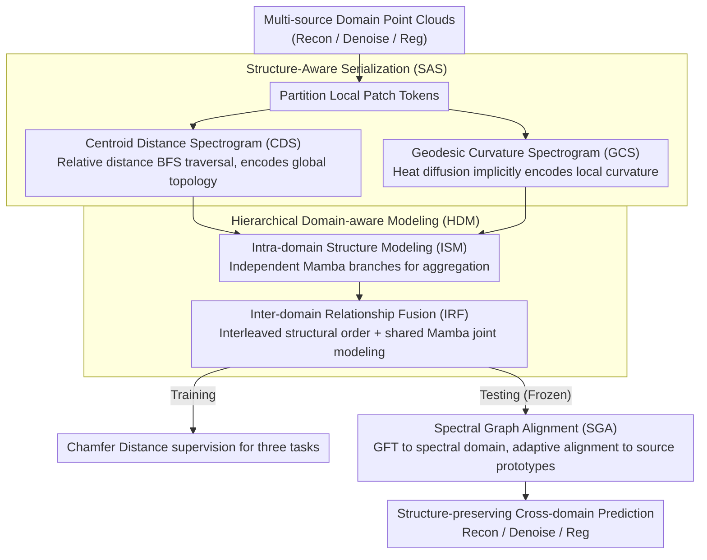

# Mamba Learns in Context: Structure-Aware Domain Generalization for Multi-Task Point Cloud Understanding

**Conference**: CVPR 2026  
**arXiv**: [2603.20739](https://arxiv.org/abs/2603.20739)  
**Code**: [https://github.com/Jinec98/SADG](https://github.com/Jinec98/SADG)  
**Area**: 3D Vision  
**Keywords**: Point cloud understanding, Domain generalization, Mamba, In-context learning, Structure-aware serialization

## TL;DR

Ours proposes the SADG framework, which introduces Mamba into in-context learning for multi-task point cloud domain generalization for the first time. Through structure-aware serialization (Centroid Distance Spectrogram + Geodesic Curvature Spectrogram), hierarchical domain-aware modeling, and spectral graph alignment, it comprehensively outperforms SOTA in reconstruction, denoising, and registration tasks.

## Background & Motivation

1. **Background**: Transformer and Mamba architectures have made progress in point cloud representation learning but are typically designed for single tasks or single domains. DG-PIC is the first work to explore multi-task domain generalization using Transformer for In-Context Learning (ICL), but it suffers from quadratic complexity and a lack of sequential order.
2. **Limitations of Prior Work**: Directly applying Mamba to multi-task domain generalization faces severe challenges—existing Mamba methods rely on coordinate-driven serialization (e.g., axis scanning, Hilbert curves), which is highly sensitive to viewpoint changes and missing regions. This destroys the hierarchical structure of point clouds, leading to unstable state propagation and "structure drift."
3. **Key Challenge**: Reconstruction, denoising, and registration tasks all rely on maintaining the structural hierarchy of point clouds (global topology and local geometric continuity). However, coordinate serialization distorts neighborhood relationships and intrinsic topology under domain shifts (noise, occlusion, pose changes), making Mamba's recursive modeling fragile.
4. **Goal**: (1) Design transform-invariant structure-aware serialization; (2) Stabilize Mamba's sequence modeling in cross-domain scenarios; (3) Achieve parameter-free test-time domain adaptation.
5. **Key Insight**: The core observation is that reconstruction, denoising, and registration share the need to "preserve structural hierarchy." Therefore, designing serialization based on intrinsic geometry can serve multiple tasks simultaneously.
6. **Core Idea**: Serialize unordered point cloud tokens into structure-consistent sequences through intrinsic geometric spectra (topology + curvature), empowering Mamba with structure-aware domain generalization capabilities.

## Method

### Overall Architecture

SADG addresses the problem of cross-domain generalization for the same model across three point cloud tasks: reconstruction, denoising, and registration. Its key judgment is that these tasks all rely on the structural hierarchy (global topology plus local geometric continuity). Therefore, by arranging unordered point cloud tokens into a "structure-consistent" sequence, linear-complexity Mamba can serve multiple tasks simultaneously. The pipeline is divided into training and testing phases. During training, multi-source domain point clouds are partitioned into local patch tokens, which are serialized into ordered sequences using two intrinsic geometric spectra—CDS for global topology and GCS for local curvature. The serialized tokens enter Hierarchical Domain-aware Modeling (HDM), performing intra-domain structure aggregation followed by inter-domain relationship fusion. During testing, Spectral Graph Alignment (SGA) aligns target domain features toward source domain prototypes in the spectral domain. This process freezes all parameters and completes structure-preserving feature migration without weight updates.

### Key Designs

**1. Centroid Distance Spectrogram (CDS): Global topology serialization via relative distance for rotation/viewpoint invariance**

This addresses the pain point where coordinate-driven serialization (axis scanning, Hilbert curves) is sensitive to viewpoints and rotation, causing structure drift upon transformation. CDS does not sort by absolute coordinates but first calculates the global centroid $c = \frac{1}{N}\sum u_i$ and builds an affinity graph between tokens $w_{CDS}(i,j) = \exp(-\|u_i - u_j\|^2 / \sigma^2)$. It performs a BFS traversal starting from the token closest to the centroid, prioritized by the highest affinity neighbor at each step. The key insight of "why BFS instead of simple distance sorting" is that direct sorting causes tokens far apart in space to be adjacent in the sequence, creating jumps in Mamba's state propagation; BFS expands outward from the centroid, ensuring adjacent tokens in the sequence are also spatially continuous. Since the process relies only on relative distances, it remains consistent under translation and rotation, stabilizing global topology encoding.

**2. Geodesic Curvature Spectrogram (GCS): Implicit curvature encoding via heat diffusion to avoid fragile explicit estimation**

While CDS captures global topology, local surface curvature continuity must also be maintained. Explicitly calculating curvature relies on normals and dense sampling, which is unstable under domain gaps like noise or incomplete data. GCS takes an implicit route: first, it calculates geodesic distances on the KNN adjacency graph of tokens to characterize manifold connectivity; then, it runs heat diffusion on the Laplace-Beltrami operator—heat dissipates quickly in high-curvature regions and stays longer in flat regions. It concatenates the diagonal elements of multi-scale heat kernels into a curvature descriptor for each token:

$$h_i = [K_{\tau_1}(i,i),\ K_{\tau_2}(i,i),\ \ldots,\ K_{\tau_S}(i,i)]$$

Serialization then follows the affinity between these descriptors. Curvature information "emerges" from the diffusion process without explicit normal estimation, making it naturally more robust to noise and domain migration.

**3. Hierarchical Domain-aware Modeling (HDM): Intra-domain then inter-domain to avoid Mamba state interruption at boundaries**

Transformer-based ICL can simply concatenate prompt and query domain tokens for attention interaction, but Mamba is a sequence-sensitive recursive model—concatenating tokens from two domains interrupts state propagation at the boundary. HDM bypasses this using a two-stage cascade. Intra-domain Structure Modeling (ISM) first processes serialized features using independent Mamba branches:

$$Z^p = \mathrm{Mamba}^p(X_{seq}^p), \qquad Z^q = \mathrm{Mamba}^q(X_{seq}^q)$$

This allows structural patterns to aggregate stably within each domain. Inter-domain Relationship Fusion (IRF) then interleaves the domain features according to structural order:

$$Z^{pq} = [z_{\pi(1)}^p,\ z_{\pi(1)}^q,\ z_{\pi(2)}^p,\ z_{\pi(2)}^q,\ \ldots]$$

These are fed into a shared Mamba for joint modeling. The advantage of interleaving is that structurally corresponding prompt-query tokens are placed adjacently in the sequence, allowing Mamba's recursive propagation to implicitly exchange features, effectively replacing explicit attention matching with sequence order.

**4. Spectral Graph Alignment (SGA): Parameter-free test-time structure-preserving domain adaptation**

At test time, parameters are frozen, but the gap between target and source domains must be bridged without destroying established structural consistency. SGA treats target domain serialized features as graph signals on the CDS/GCS graphs, projecting them to the spectral domain using a Graph Fourier Transform (GFT), then performing adaptive alignment toward source prototypes:

$$\hat{X}_{*,i}^t \leftarrow \alpha_i \hat{X}_{*,i}^t + (1-\alpha_i)\big(\hat{P}_*^s - \hat{X}_{*,i}^t\big)$$

The alignment intensity $\alpha_i$ is adaptively adjusted by the cosine similarity between target features and source prototypes. Since alignment occurs on the intrinsic frequency bases of the structural graph, the migration maintains topological and geometric consistency rather than forcefully moving features in raw coordinate space.

### Loss & Training

Following the DG-PIC framework, it uses the AdamW optimizer with a learning rate of $1 \times 10^{-4}$, cosine decay, batch size 96, and 300 training epochs. Chamfer Distance is used as the unified loss for all three tasks (reconstruction, denoising, registration). Bidirectional sequences (forward + backward) × two spectra (CDS + GCS) = 4-way sequence concatenation to expand Mamba's receptive field.

## Key Experimental Results

### Main Results

| Method | Setting | ModelNet Rec. | ShapeNet Den. | ScanNet Reg. | ScanObjectNN Rec. | MP3DObject Rec. |
|------|------|---------------|---------------|--------------|-------------------|-----------------|
| DG-PIC | ICL+DG | 6.84 | 9.81 | 5.10 | 4.52 | 5.91 |
| Vanilla Mamba ICL | ICL+DG | 7.69 | 10.19 | 5.56 | 6.93 | 8.28 |
| **SADG (Ours)** | ICL+DG | **5.99** | **9.34** | **3.63** | **4.29** | **3.55** |

*Chamfer Distance ×10⁻³, lower is better. SADG comprehensively outperforms DG-PIC across all 15 task configurations in 5 domains.*

### Ablation Study

| Configuration | Key Impact | Description |
|------|---------|------|
| w/o CDS (GCS only) | CD Increase | Loss of global topological information |
| w/o GCS (CDS only) | CD Increase | Loss of local curvature continuity |
| Naive coordinate sorting instead of CDS/GCS | Significant CD Increase | Sensitive to rotation/viewpoint, causing structure drift |
| w/o HDM (Direct concat) | CD Increase | State propagation interrupted at domain boundaries |
| w/o SGA | CD Increase | Decreased test-time domain migration capability |
| Vanilla Mamba ICL | CD 8.28 vs 3.55 | No structure awareness, leading to significant performance degradation |

### Key Findings

- **Structure drift is the core bottleneck for multi-task domain generalization**: Vanilla Mamba ICL is significantly worse than DG-PIC (Transformer) (8.28 vs 5.91 on MP3DObject), highlighting Mamba's fragility with coordinate serialization. Ours' structure-aware serialization effectively solves this.
- **CDS and GCS are complementary**: CDS primarily improves global reconstruction quality (topology), while GCS improves local denoising (geometric continuity). The combination yields the best results.
- **Most significant gains on MP3DObject**: Reduced from DG-PIC's 5.91 to 3.55 (40% improvement), demonstrating the value of structure awareness in real-world scans (more noise, severe occlusion).
- **SGA is effective yet gentle**: Adaptive adjustment of alignment intensity avoids over-correcting irregular regions.

## Highlights & Insights

- **Implicit curvature encoding via heat diffusion** is ingenious: it bypasses the dependency of traditional explicit estimation on normals and sampling density, capturing curvature via eigenvalue decomposition and multi-scale kernels. This is naturally robust to noise and incompleteness.
- **Interleaved sequence design** exploits Mamba's recursive propagation: features at adjacent positions interact naturally through state propagation. Interleaving places structurally corresponding prompt-query tokens close together, achieving implicit structural matching.
- **Spectral domain alignment** concepts can be transferred to other structured data domain adaptation tasks (e.g., molecular graphs, social networks) by defining appropriate graph structures.

## Limitations & Future Work

- Spectral decomposition (eigenvalue calculation) may become a bottleneck on large-scale point clouds; computational efficiency for very large token counts $N$ was not discussed.
- The MP3DObject dataset contains only 7 categories, offering limited category diversity.
- Only three tasks were supported; generalization to classification or segmentation remains unverified.
- **Future Directions**: (1) Explore approximate spectral methods (e.g., Chebyshev polynomial approximation) for acceleration; (2) Extend structure-aware serialization to large-scale outdoor scenes (e.g., LiDAR); (3) Integrate structure awareness during the pre-training phase of foundational models (e.g., Point-MAE).

## Related Work & Insights

- **vs DG-PIC**: DG-PIC uses Transformer ICL with quadratic complexity and no sequential order. SADG uses Mamba with linear complexity and structure-aware serialization, superior in both performance and efficiency.
- **vs PointMamba**: PointMamba is a single-task Mamba model relying on coordinate serialization. SADG introduces intrinsic geometric spectral serialization, solving structure drift in domain generalization.
- **vs PointDGMamba**: Focused on domain generalization but only for classification. SADG is the first to combine Mamba and ICL for multi-task domain generalization.

## Rating

- Novelty: ⭐⭐⭐⭐⭐ First to introduce Mamba into ICL multi-task point cloud DG; three technical modules (SAS/HDM/SGA) show clear innovation.
- Experimental Thoroughness: ⭐⭐⭐⭐⭐ Comprehensive evaluation across 5 domains × 3 tasks, introduction of MP3DObject, thorough ablation.
- Writing Quality: ⭐⭐⭐⭐ Rigorous mathematical derivation, though high symbol density; some derivations could be more intuitive.
- Value: ⭐⭐⭐⭐ Provides significant methodological contributions for Mamba applications on structured 3D data.

<!-- RELATED:START -->

## Related Papers

- [\[CVPR 2026\] Deformation-based In-Context Learning for Point Cloud Understanding](deformation-based_in-context_learning_for_point_cloud_understanding.md)
- [\[CVPR 2026\] 3D-Aware Multi-Task Learning with Cross-View Correlations for Dense Scene Understanding](3d-aware_multi-task_learning_with_cross-view_correlations_for_dense_scene_unders.md)
- [\[CVPR 2026\] MHopReg: Efficient Hierarchical Multi-Hop Graph Search for Point Cloud Registration](mhopreg_efficient_hierarchical_multi-hop_graph_search_for_point_cloud_registrati.md)
- [\[CVPR 2026\] Geometric-Aware Hypergraph Reasoning for Novel Class Discovery in Point Cloud Segmentation](geometric-aware_hypergraph_reasoning_for_novel_class_discovery_in_point_cloud_se.md)
- [\[CVPR 2026\] Ghosts in the Point Clouds: De-glaring LiDAR in the Transient Domain](ghosts_in_the_point_clouds_de-glaring_lidar_in_the_transient_domain.md)

<!-- RELATED:END -->
