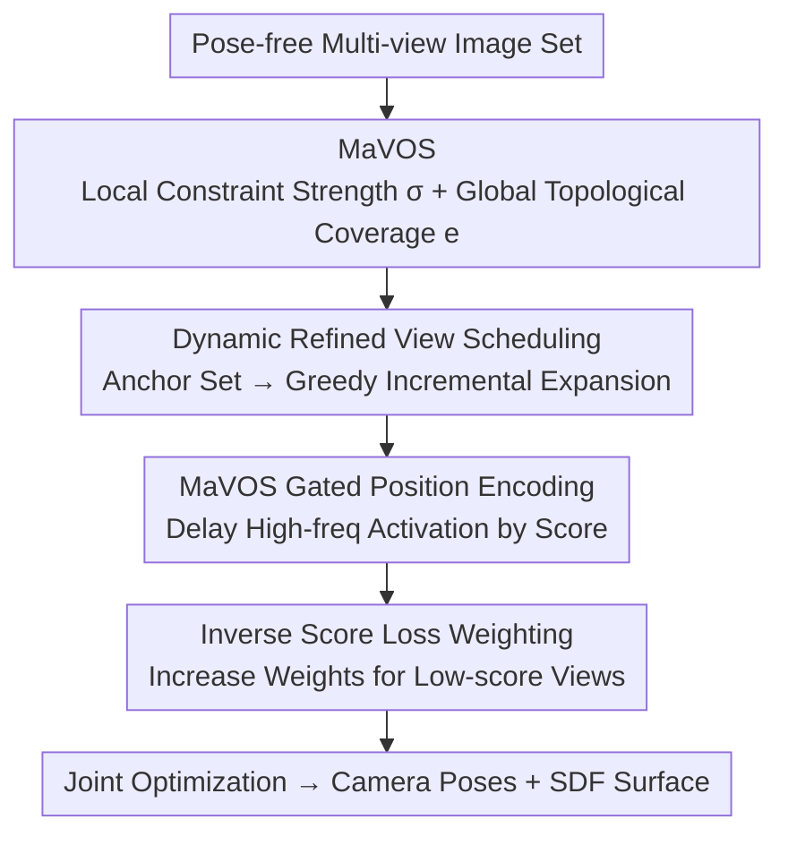

# ManifoldNeuS: Manifold-aware View Optimizability for Pose-Free Neural Surface Reconstruction

**Conference**: CVPR 2026  
**Paper**: [CVF Open Access](https://openaccess.thecvf.com/content/CVPR2026/html/Liu_ManifoldNeuS_Manifold-aware_View_Optimizability_for_Pose-Free_Neural_Surface_Reconstruction_CVPR_2026_paper.html)  
**Code**: None (Link not disclosed in paper)  
**Area**: 3D Vision / Neural Surface Reconstruction / Pose-Free Joint Optimization  
**Keywords**: Pose-free Reconstruction, NeuS, View Optimizability, Manifold Embedding, SDF

## TL;DR
ManifoldNeuS identifies that "treating all views uniformly" in pose-free neural surface reconstruction leads to "easy-view bias" (where easily optimized views dominate gradients while critical but difficult views are marginalized). It proposes MaVOS, a score jointly measuring "immediate fitness + long-term coverage gain" on the view manifold. This score drives a tripartite system—dynamic view scheduling, gated positional encoding, and inverse-score loss weighting—reducing pose errors on DTU from hundreds of degrees (COLMAP-free baseline) to the $0.6^\circ$ level, with reconstruction quality approaching NeuS trained with COLMAP ground truth poses.

## Background & Motivation
**Background**: Most multi-view 3D reconstruction methods (NeRF / 3DGS / Neural Implicit SDFs) assume accurate camera poses, typically estimated via SfM pipelines like COLMAP. When pose noise is high or poses are unavailable, it is necessary to **jointly optimize camera poses and scene geometry** from pose-free images. Among implicit representations, SDF methods like NeuS are preferred for their high surface fidelity.

**Limitations of Prior Work**: Directly transplanting BARF-style pose joint optimization into the NeuS framework results in catastrophic failure. SDFs require highly consistent multi-view constraints to converge to the correct zero-level set; even minor pose errors are amplified into severe geometric distortions (pose drift, fragmentation). A deeper issue is that existing joint optimization works (PoRF, SC-NeuS, NoPose-NeuS, ParaSurRe, etc.) **treat all views uniformly**.

**Key Challenge**: The authors name this overlooked phenomenon **easy-view bias**, which has two facets: ① Local gradient dominance—"easy views" with high overlap and rich textures generate excessive gradients early on, prematurely locking their poses and dominating geometric updates, which starves texture-weak regions. ② Global coverage neglect—optimization favors immediate photometric accuracy at the expense of long-term geometric integrity. Views covering unobserved regions, crucial for topological connectivity, are marginalized, leading to pose drift and fragmented reconstructions.

**Goal**: To break the easy-view bias, one must explicitly model "how much each view is worth / how easy it is to optimize" and inject this signal into the optimization process.

**Key Insight**: The authors argue that a view's optimizability is determined by two factors: **immediate fitness** (how quickly it can accelerate convergence and refine existing geometry) and **long-term coverage gain** (how much topological coverage it can expand to help recover unknown geometry). The key insight is that evaluating coverage gain requires modeling the **topological relationships** between views; Euclidean distance is insufficient, and measurements must be performed on the manifold.

**Core Idea**: Propose the Manifold-aware View Optimizability Score (MaVOS), quantifying immediate fitness as local constraint strength and long-term coverage gain as global topological coverage on the view-graph embedding manifold. This score simultaneously schedules views, gates positional encoding frequencies, and weights losses, converting "view-wise optimizability" into "global optimization stability."

## Method

### Overall Architecture
Given a set of pose-free images, the goal is to recovery camera poses and SDF surface geometry simultaneously. The method is built on the NeuS SDF + volume rendering framework (SDF field $F_g$ provides signed distance and geometric features; color field $F_c$ provides color; positional encoding uses BARF’s coarse-to-fine frequency activation). On top of this, the **MaVOS** score (local constraint strength $\sigma$ + global topological coverage $e$) is calculated for each view. This score serves as a control signal at three levels: the **sampling layer** uses dynamic refined view scheduling to decide the optimization order; the **feature representation layer** uses MaVOS-gated positional encoding to control high-frequency activation; and the **optimization layer** uses inverse-score loss weighting to redistribute gradients. These components synergistically suppress the "overconfidence" of easy views and elevate the contribution of difficult but critical views.

### Key Designs

**1. MaVOS: Jointly Measuring Fitness and Coverage Gain on the View Manifold**

To address easy-view bias, the authors require a score reflecting both "optimization ease" and "optimization value." **Immediate fitness** is characterized by local constraint strength: based on multi-view geometric consistency, views with stronger feature correspondences have stronger constraints and faster convergence. A co-visibility matrix $W\in\mathbb{R}^{N\times N}$ is first constructed ($W_{ij}$ is the number of feature correspondences between views $i$ and $j$, using pure co-visibility without RANSAC verification at this stage). The local constraint strength is the normalized co-visibility $\sigma_i = \sum_j W_{ij} / \sum_{i,j} W_{ij}$. However, $\sigma$ only considers pairwise correspondences and ignores scene geometry, failing to distinguish between "globally redundant views" and "topologically critical views."

**Long-term coverage gain** is thus measured on the manifold. The authors perform spectral embedding on the co-visibility graph: using the degree matrix $D$ ($D_{ii}=\sum_j W_{ij}$), they construct the symmetric normalized Laplacian $L_{sym} = I - D^{-1/2} W D^{-1/2}$ and solve $L_{sym} u_k = \lambda_k u_k$. Taking the $2$nd to $d{+}1$-th smallest eigenvectors yields the embedding $E=[u_2,\dots,u_{d+1}]$ (discarding the trivial constant mode $u_1$). The topological coverage of view $i$ is its normalized minimum distance to other views in the manifold space $e_i = \min_{v_j\in\mathcal{V}} \|E_i - E_j\|_2$. A larger $e_i$ indicates that the view resides in an unexplored manifold region, providing critical coverage. The final unified score is:

$$S_i = \alpha\cdot\sigma_i + (1-\alpha)\cdot e_i,$$

where $\alpha\in[0,1]$ balances the terms (experimentally set to 0.65). Views with high $S_i$ either have strong constraints, provide new topological coverage, or both. This "dual-aware" scoring provides principled guidance for reconstruction.

**2. Dynamic Refined View Scheduling: Stable Anchor Core → Greedy Incremental Expansion**

To counter "local gradient dominance," scheduling first establishes a stable geometric core using reliable views before gradually expanding. An anchor set $A$ is first formed from the top-$K$ views based on MaVOS ($K$ is determined by local constraint strength $\sigma_i$; high $\sigma$ ensures enough pairwise matches to stabilize initial poses and geometry, covering ~30% of views in experiments). Subsequent rounds of incremental expansion use a greedy strategy to select $M$ views from the candidate pool $R$ that maximize the refinement score:

$$S_{r_j} = \alpha\cdot\sigma_A(j) + (1-\alpha)\cdot e_A(j),$$

where $\sigma_A(j)=\frac{1}{|A|}\sum_{v_i\in A} W_{ij}$ is the average co-visibility between the candidate and current anchors, and $e_A(j)$ is the manifold geodesic distance to the nearest anchor. Each selected $v^*_j$ is merged into the anchor set for dynamic updating—this "select-and-update" process ensures uniform coverage and connectivity. Furthermore, poses for subsequent views are no longer initialized with identity matrices but **inherit the pose of the anchor with the closest MaVOS value**, leveraging pose continuity to reduce oscillation and accelerate convergence.

**3. MaVOS Gated Position Encoding: Adaptive High-Frequency Delay based on Optimizability**

Addressing the long-standing issue where high-frequency positional encoding (PE) interferes with low-frequency pose updates in SDF joint optimization, BARF uses a global progress parameter for uniform progressive frequency release. This, however, ignores inter-view differences. The authors instead gate frequencies view-wise based on MaVOS. They first define a BARF-style base frequency activation threshold $\beta_0 = [(p-p_a)/(p_b-p_a)]\cdot L$ (where progress $p$ increases lineary from $0$ to $L$ within $[p_a, p_b]$), then add a MaVOS-driven view-wise offset:

$$\Delta\beta_i = \lambda\cdot\widetilde{S}_i\cdot\eta_f\cdot\eta_t,\quad \widetilde{S}_i = S_i - \bar{S},\ \eta_f^{(l)}=l/L,\ \eta_t = p^{\gamma_t},$$

using the relative score $\widetilde{S}_i$ (subtracting the current round mean $\bar{S}$) for robustness against distribution shifts. $\eta_f$ concentrates the delay on high-frequency components to preserve early low-frequency geometric priors; $\eta_t$ increases with training to account for early pose instability. The final $\beta_f = \beta_0 + \Delta\beta$ is substituted back into BARF’s frequency weights $\varphi_l$. The effect is: **High-score (easy to optimize) views have their high-frequency activation delayed**, preventing them from overfitting details prematurely and biasing early pose estimates.

**4. Inverse Score Loss Weighting: Rebalancing Gradients for Low-score Views**

While scheduling and gated PE alleviate bias at the sampling and feature levels, they do not directly solve gradient imbalance caused by uniform loss weighting. The authors use inverse-score weighting at the optimization layer—the contribution of each view to the total loss is weighted by $w_i = 1 - S_i$, meaning low MaVOS (difficult/critical) views receive higher weights. The total loss is:

$$\mathcal{L} = \sum_{i=1}^N w_i\,(\lambda_c\mathcal{L}_c + \lambda_e\mathcal{L}_e + \lambda_m\mathcal{L}_m + \lambda_d\mathcal{L}_d + \lambda_n\mathcal{L}_n),$$

including photometric loss $\mathcal{L}_c$, Eikonal regularization $\mathcal{L}_e$, mask loss $\mathcal{L}_m$, depth loss $\mathcal{L}_d$, and normal loss $\mathcal{L}_n$ (depth/normal supervision from MonoSDF / OMNI-DATA). This directly prevents error propagation from easy views to difficult views at the gradient level, enhancing robustness.

### Loss & Training
Experiments used 9 challenging scenes from DTU, each with 49 or 64 images. Two independent Adam optimizers handle poses and scene representation respectively: poses are trained for 50K steps per round, with 256 rays per step and 128 points per ray. After pose freezing, the representation is trained for 200K steps. Loss weights are 1.0 during initial anchor estimation and reduced to 0.1 (except color loss) in other rounds. $\alpha=0.65$; $K$ covers 30% of views. Frequency intervals are $[0.3, 0.7]$ for poses and $[0.1, 0.5]$ for geometry refinement. Training performed on a single RTX 5090.

## Key Experimental Results

### Main Results
Pose estimation (DTU, Rotation error $\Delta R$ / Absolute Translation error $\Delta T$, lower is better; "--" denotes failure; Avg. is the mean across 9 scenes):

| Method | $\Delta R \downarrow$ (Avg.) | $\Delta T \downarrow$ (Avg.) | Description |
|------|------|------|------|
| NeuS-BARF | 118.475 | 4.383 | BARF applied directly to NeuS; divergent failure |
| HT-3DGS | 101.320 | 4.224 | 3DGS pose-free joint optimization |
| SG-NeRF | 4.505 | 0.235 | Initialized from perturbed GT poses |
| VGGT | 2.300 | 0.106 | Data-driven Transformer; failed on 3 scenes |
| **Ours** | **0.602** | **0.022** | Identity initialization; leads in all scenes |

> Note: While SG-NeRF benefits from initialization near GT poses, Ours starts from identity poses and reaches lower errors. VGGT fails on multi-scale scenes (e.g., Scan83).

Reconstruction quality (Chamfer distance, lower is better; NeuS-BARF/HT-3DGS omitted due to poor results):

| Method | Avg. Chamfer $\downarrow$ | Remarks |
|------|------|------|
| SG-NeRF | 0.590 | Noise pose initialization |
| VGGT | 0.409 | Point cloud representation; 3 scenes missing |
| **Ours** | **0.404** | Superior/comparable to SOTA |
| NeuS (COLMAP GT) | 0.368 | Upper bound reference |

Ours approaches NeuS trained with COLMAP ground truth despite not using known poses, recovering finer geometry on thin structures (Scan 37/65) and reflective surfaces (Scan 63/69/97).

### Ablation Study
Ablation on Scan 24 ($\Delta R$ / $\Delta T$, lower is better):

| Configuration | $\Delta R \downarrow$ | $\Delta T \downarrow$ | Description |
|------|------|------|------|
| BARF (Baseline) | 168.05 | 2.71 | Uniform optimization; easy-view bias causes drift |
| + View Scheduling | 36.02 | 1.78 | Anchors provide early reliable constraints |
| Full (w/o Manifolds) | 4.07 | 0.14 | MaVOS without manifold coverage term |
| Full (w/o Dyn. Refinement) | 1.38 | 0.06 | Disabling subsequent dynamic reordering |
| **Full (Complete)** | **0.80** | **0.02** | All components synergistic |

### Key Findings
- **View scheduling provides the most significant jump**: Adding MaVOS scheduling to BARF drops $\Delta R$ from $168.05^\circ$ to $36.02^\circ$, proving that "stabilizing early constraints with anchors" is the most critical trigger for suppressing easy-view bias.
- **Manifold coverage is indispensable**: Removing the manifold term from MaVOS increases $\Delta R$ from $0.80$ to $4.07$ (a ~5× difference), proving that local co-visibility alone misses critical views.
- **Dynamic refinement adds precision**: Disabling it increases $\Delta R$ to $1.38$; continuous reordering maintains coverage uniformity and connectivity.
- **SDF is more pose-sensitive than NVS**: The failure of NeuS-BARF confirms that SDFs require highly consistent multi-view constraints and are extremely sensitive to initial pose errors.

## Highlights & Insights
- **Defined and quantified a neglected phenomenon**: Refining the preference for easy views into "easy-view bias" and splitting it into local gradient dominance and global coverage neglect is a highly insightful problem definition.
- **Measuring "topologic criticality" via spectral embedding**: Using spectral embedding on the view-graph and manifold distance to find views that "bridge disconnected geometric components" is a clever application of graph signal processing that Euclidean metrics cannot replicate.
- **Unified score across three optimization levels**: MaVOS simultaneously drives sampling (scheduling), features (gated PE), and optimization (loss weighting). The design is unified and complementary, making it transferable to other joint optimization tasks requiring "view/sample importance."

## Limitations & Future Work
- Validated only on 9 DTU scenes; does not cover large-scale, outdoor, or unbounded scenes. The robustness of manifold embedding to degraded co-visibility graphs in extremely sparse view cases is not fully discussed.
- Relies on MonoSDF / OMNI-DATA for depth and normal supervision; errors in monocular priors may propagate into the reconstruction.
- Assumes known camera intrinsics and only estimates extrinsics; not directly applicable to scenes with unknown intrinsics.
- The cost of spectral embedding + multi-round greedy scheduling + long two-stage training (50K×rounds + 200K geometry) is significant; efficiency was not systematically reported.

## Related Work & Insights
- **vs BARF / NeuS-BARF**: BARF uses a global progress parameter for uniform frequency release and treats views uniformly. Ours gates frequency view-wise via MaVOS and breaks bias through scheduling/weighting, rescuing divergent NeuS-BARF to SOTA levels.
- **vs SG-NeRF**: SG-NeRF requires initialization from noise-perturbed poses near-GT. Ours starts from identity matrices and achieves lower errors, achieving true "pose-free" reconstruction.
- **vs VGGT (Data-driven Transformer)**: VGGT relies on large-scale pose-supervised feedforward regression. Its point cloud representation is less suited for smooth SDF surfaces, and it fails on certain scenes. Ours requires no pose supervision and yields more complete surfaces.
- **vs PoRF / SC-NeuS / NoPose-NeuS / ParaSurRe**: These methods still train uniformly without distinguishing view-wise optimizability; Ours explicitly quantifies and utilizes these differences via MaVOS.

## Rating
- Novelty: ⭐⭐⭐⭐⭐ The definition of easy-view bias + the manifold-aware optimizability score are genuinely new perspectives; the topological criticality metric is particularly clever.
- Experimental Thoroughness: ⭐⭐⭐⭐ Solid dual-metric evaluation (pose + reconstruction) and clear ablation; however, limited to 9 DTU scenes and lacks large-scale/efficiency reports.
- Writing Quality: ⭐⭐⭐⭐ Motivation is logically progressive, with clear mapping between formulas and components, though some notation is dense.
- Value: ⭐⭐⭐⭐ A substantial advancement for pose-free SDF reconstruction with a transferable "view optimizability" framework.

<!-- RELATED:START -->

## Related Papers

- [\[CVPR 2026\] Cov2Pose: Leveraging Spatial Covariance for Direct Manifold-aware 6-DoF Object Pose Estimation](cov2pose_leveraging_spatial_covariance_for_direct_manifold-aware_6-dof_object_po.md)
- [\[CVPR 2026\] AeroGS: Scale-Aware Gaussian Splatting for Pose-Free Dynamic UAV Scene Reconstruction](aerogs_scale-aware_gaussian_splatting_for_pose-free_dynamic_uav_scene_reconstruc.md)
- [\[CVPR 2026\] E2EGS: Event-to-Edge Gaussian Splatting for Pose-Free 3D Reconstruction](e2egs_event-to-edge_gaussian_splatting_for_pose-free_3d_reconstruction.md)
- [\[CVPR 2026\] MimiCAT: Mimic with Correspondence-Aware Cascade-Transformer for Category-Free 3D Pose Transfer](mimicat_mimic_with_correspondence-aware_cascade-transformer_for_category-free_3d.md)
- [\[CVPR 2026\] FreeScale: Scaling 3D Scenes via Certainty-Aware Free-View Generation](freescale_scaling_3d_scenes.md)

<!-- RELATED:END -->
