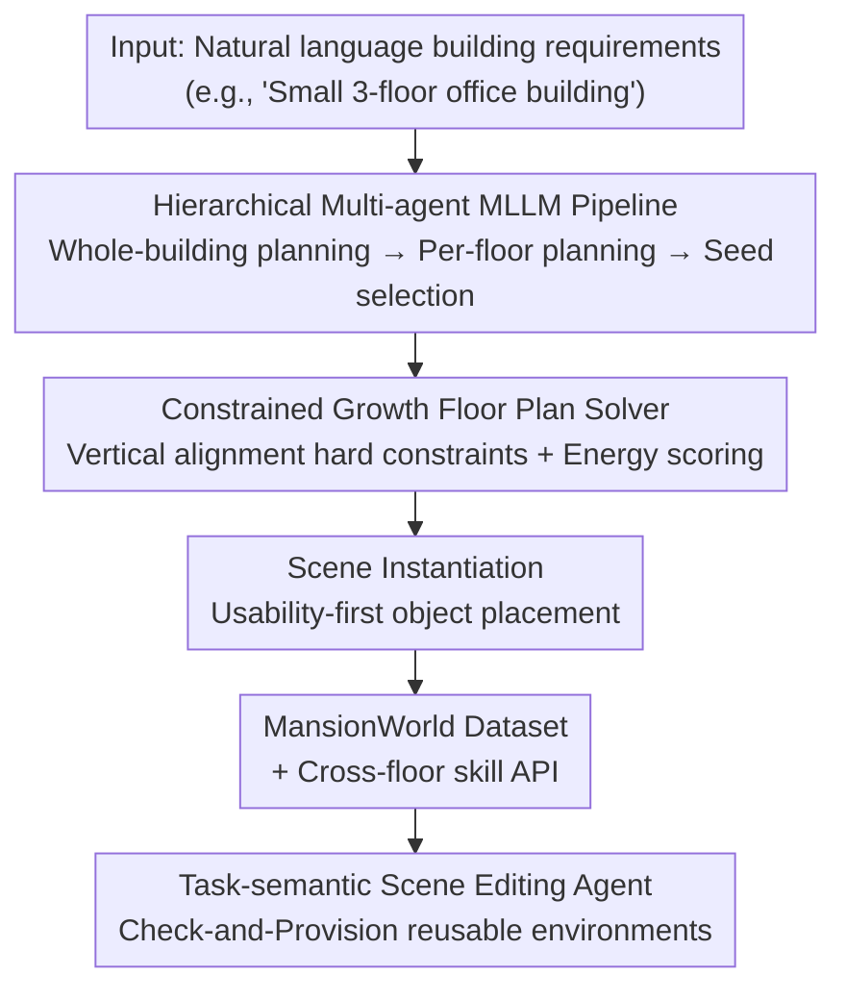

# MANSION: Multi-floor Language-to-3D Scene Generation for Long-horizon Tasks

**Conference**: CVPR 2026  
**Paper**: [CVF Open Access](https://openaccess.thecvf.com/content/CVPR2026/html/Che_MANSION_Multi-floor_lANguage-to-3D_Scene_generatIOn_for_loNg-horizon_tasks_CVPR_2026_paper.html)  
**Code**: Project Homepage (Mansion Webpage; refer to the original paper for the specific repository link)  
**Area**: 3D Vision  
**Keywords**: Language-driven scene generation, Multi-floor buildings, Embodied AI, Floor plan generation, Multi-agent

## TL;DR
MANSION utilizes a "hierarchical multi-agent MLLM + geometrically constrained growth solver" to transform a single natural language instruction into a complete multi-floor building directly executable in simulators. By treating vertical alignment as a hard constraint, the authors release the MansionWorld dataset containing 1000+ buildings and cross-floor task editing agents specifically designed to stress-test the long-horizon cross-floor planning capabilities of embodied agents.

## Background & Motivation

**Background**: For embodied intelligence to autonomously complete long-horizon tasks in the real world (e.g., deliveries in office buildings, hospital transport, housework), these tasks are naturally "building-scale + cross-floor," requiring long-range spatial planning and memory beyond basic navigation and manipulation. However, existing embodied benchmarks are mostly limited to single-floor indoor or apartment scales.

**Limitations of Prior Work**: Available scene resources are severely insufficient. Real-world scans have high fidelity but are expensive to collect and hard to edit/transform. Synthetic environments (procedural or LLM-driven) mostly generate single-floor room or apartment-level layouts, **rarely modeling vertical structures, inter-floor passages, or transfer facilities like elevators and stairs explicitly**. Floor plan generation methods are also almost exclusively single-floor, failing to align the outer contours of adjacent floors or ensure consistent positions for vertical cores (stair/elevator shafts) across layers. Furthermore, results are often static vector images lacking executable semantics for simulation.

**Key Challenge**: There are two root causes for why single-floor generators cannot scale to multi-floor buildings: first, a lack of **vertical consistency** (the inability to align contours and vertical cores across floors); second, their data-driven nature locks them into "closed-world" residential datasets, preventing generalization to out-of-distribution building types (hospitals, schools, malls).

**Goal**: To create a language-driven framework capable of generating entire multi-floor buildings where results are directly applicable to long-horizon cross-floor task evaluation.

**Key Insight**: Rather than having the MLLM directly regress complete room polygons (which current MLLMs struggle with), the framework decomposes high-level semantics into intermediate representations that MLLMs excel at (functional zoning, bubble maps, point-and-click seeds), and then hands these to a verifiable geometric solver for constrained searching.

**Core Idea**: Elevate "vertical alignment" to a first-class hard constraint and use a decoupled architecture of "MLLM for semantics + geometric solver for geometry" to achieve true open-world, training-free generation of entire buildings.

## Method

### Overall Architecture
MANSION is a hierarchical multi-agent framework that translates natural language building requirements into interactive 3D scenes. The critical bridge is "floor plan generation"—formulated by the authors as a verifiable constrained search problem followed by scene instantiation. Built atop this is the MansionWorld ecosystem: a dataset of 1000+ buildings, cross-floor skill APIs, and a task-semantic scene editing agent that transforms static buildings into reusable task playgrounds.

Formally, individual floor contours are orthogonal polygons $P_f$, $V$ is the set of vertical structures (stairs, elevators, shafts), and $Q_{f,v}\subseteq P_f$ is the footprint of vertical core $v$ on floor $f$. Rooms are planned only within the free area $\Omega_f = P_f \setminus \bigcup_{v\in V} Q_{f,v}$. Floor plan synthesis is framed as a verifiable search over candidates: $L^\star = \arg\max_{L\in C} \mathrm{Score}(L; w)$ subject to topological consistency $\mathrm{Topo}(L,G)=\text{true}$, where $G=(R,E)$ is a bubble map (nodes are rooms, edges are adjacency/connectivity), $C$ is a discrete candidate set generated via sampling and constrained growth, and $\mathrm{Score}$ is an energy function for scoring feasible candidates.

### Key Designs

**1. Hierarchical Multi-agent MLLM Pipeline: Decoupling Semantics and Geometry**  
To address the issue of MLLMs failing to accurately regress room polygons, MANSION uses a multi-MLLM subsystem orchestrated by LangGraph to decompose semantics. A building-level planning node defines cross-floor functional zoning, target area distributions, and global style preferences based on user descriptions and contours, ensuring semantic and visual consistency. These global constraints are passed to floor planning nodes, which generate bubble maps $G_f=(R_f, E_f)$ for each $\Omega_f$, specifying room sets, target areas $a_r$, and adjacency relations. Before geometric solving, each $\Omega_f$ is rasterized into a 2D grid and handed to a "Cutter MLLM" node, which provides initial growth seeds $c_r\in\Omega_f$ as spatial guidance. A **hierarchical cutting strategy** is employed to avoid combinatorial explosion: the Cutter MLLM selects one valid sub-room at a time from the topological front, starting from transit hubs, and provides local seeds. This delegates semantic understanding and spatial selection to the LLM, while the geometric solver handles the math. Experiments confirm that overall layout quality improves as LLM capabilities increase (e.g., Gemini-2.5-Pro vs. Moonshot).

**2. Constrained Growth Floor Plan Solver: Vertical Alignment as a Provable Hard Constraint**  
This is the core distinction from single-floor methods. The solver takes seeds and target areas as priors and uses a **one-cut solver** (a topology-aware variant of Lopes-style constrained growth) for local partitioning within the parent region. It generates candidate partitions, filters those violating realized topological relations, ranks the rest via an interpretable energy function, and accepts the highest-scoring one, iterating along the topological front. Since rooms only grow in $\Omega_f = P_f\setminus\bigcup_v Q_{f,v}$, the footprints of vertical cores $Q_{f,v}$ are reserved and aligned across floors, ensuring the building's stair/elevator shafts are naturally continuous and have provable reachability. This contrasts with approaches like ChatHouseDiffusion that regress layouts via diffusion/LLMs—which are topologically "flat" and cannot scale cross-floor. Ablations show that replacing iterative cutting with "one-shot seed coordinate output" significantly drops micro-IoU; while MLLM area priors are stable, one-shot position prediction is error-prone. Iterative cutting reduces complexity and improves spatial localization.

**3. Scene Instantiation: Moving from "Quantity-first" to "Usability and Quality-first"**  
After constrained growth generates floor partitions, they are instantiated into interactive AI2-THOR scenes. Instantiation uses a two-level progressive plan: a building-level "Chief Architect" node sets global visual styles (material palettes, color schemes) for cross-floor consistency. Subsequently, per-floor planning nodes attach a "room card" (material preferences, layout type, fine-grained functional needs) to each room node. Downstream nodes for material assignment, door placement, and object placement implement these cards under satisfied topological constraints. Object placement follows the "LLM + Rules" paradigm of HOLODECK but shifts the philosophy to usability: **hard reachability** is treated as a non-negotiable constraint (retaining only objects the robot can navigate to with sufficient clearance); **anchor grouping** is introduced (anchor objects have global spatial tags like $edge/middle$, while other members are solved within the anchor's local coordinate system) to prevent clustering in large rooms; and structured relationship primitives ($matrix$, $paired$) support grid arrays and symmetric co-locations for classrooms or libraries. Finally, a priority-aware placement order + quality-prioritized pruning is used (placing structural objects first and discarding candidates violating reachability or quality thresholds).

**4. Task-semantic Scene Editing Agent: Reusing One Building for Countless Tasks**  
A static multi-floor building must support diverse embodied tasks. Generating a new environment for every task is inefficient and hard-codes task requirements into the design. MANSION proposes an editing agent driven by an MLLM controller that understands high-level language instructions and modifies scenes via controlled tool calls. Rather than editing raw scene data directly, it uses a set of expressive AI2-THOR tool APIs (query scene structure, fetch assets, manipulate objects/containers). For complex cross-floor commands (e.g., "Start from the lobby, get snacks from the 2F table, get drinks from the 2F fridge, and bring them to the 1F sofa"), the agent decomposes the task into prerequisites and initiates a "Check-and-Provision" workflow: path connectivity check → object availability check → object provisioning and scene editing. This "think-verify-act" loop transforms unexecutable tasks into executable ones, and these edits can be persisted to create task variants, turning the building dataset into a task-semantic playground.

### Loss & Training
MANSION does not perform end-to-end training; the core is a "training-free" generation pipeline. MLLM components call off-the-shelf models (e.g., Moonshot, Gemini-2.5-Pro), and the constrained growth solver uses an interpretable energy function $\mathrm{Score}(L;w)$ for ranking. This architecture enables open-world scalability without requiring new data or retraining.

## Key Experimental Results

### Main Results
Floor plan generation is evaluated on the T2D dataset using pixel-level micro-IoU and macro-IoU. In the MA (manual annotation) setting, ground-truth room centroids are used as seeds and ground-truth areas as input to isolate the solver's performance from the LLM.

| Dataset | Method | Micro-IoU | Macro-IoU |
| :--- | :--- | :--- | :--- |
| T2D | CHD (MA) | 82.81 | 79.04 |
| T2D | Ours (MA) | 81.67 | **80.66** |
| T2D | CHD (gemini-2.5-pro) | 76.34 | 72.24 |
| T2D | Ours (gemini-2.5-pro) | 69.98 | 66.40 |
| ResPlan-1K | CHD (MA) | 33.49 | 25.39 |
| ResPlan-1K | Ours (MA) | **76.74** | **76.64** |
| ResPlan-1K | Ours (gemini-2.5-pro) | 63.56 | 61.65 |

On the residential-styled T2D, Ours-MA performs comparably to CHD-MA, proving the solver fits complex residential layouts. When end-to-end, weak LLMs (Moonshot) lag behind CHD, but strong LLMs (Gemini-2.5-Pro) narrow the gap, confirming that better LLM selection leads to better priors. On ResPlan-1K, which has more rooms and structural complexity (nearly 50% of floors exceed 8 rooms, the training limit for CHD), CHD's zero-shot generalization collapses (micro-IoU 33.49), while MANSION maintains 76.74, demonstrating robustness.

### Ablation Study
Object placement comparison (selected room types; #Rch is reachability %, higher is better; #CN is number of collisions, lower is better):

| Room | Method | #Obj↑ | #CN↓ | #Rch↑ | Layout↑ |
| :--- | :--- | :--- | :--- | :--- | :--- |
| Bedroom | Holodeck | 17.5 | 0.0 | 88.7 | 39.2 |
| Bedroom | Ours | 22.6 | 0.0 | **100.0** | **52.9** |
| Classroom | Holodeck | 64.4 | 0.0 | 80.0 | 5.9 |
| Classroom | Ours | 57.3 | 0.0 | **100.0** | **80.4** |

MANSION achieves 100% reachability and zero collisions across all room types, with significant advantages in layout quality and realism for non-residential environments (classrooms, libraries, offices) according to a 52-person user study.

### Key Findings
- **Iterative cutting is the lifeblood of the geometric solver**: Replacing it with one-shot seed coordinate output significantly drops micro-IoU. While LLM area priors are stable, one-shot point selection errors are high; hierarchical cutting reduces task complexity.
- **Performance scales with base LLMs**: Since semantic understanding and spatial seeding are outsourced to the LLM, the geometric solver only handles math. Stronger LLMs lead directly to more accurate layouts.
- **Dataset Generalization**: CHD excels on T2D but fails on ResPlan-1K due to training data limitations (nearly duplicate samples in RPLAN). MANSION’s training-free nature ensures stable generalization.
- **Classrooms and perceived diversity**: User studies suggest MANSION has slightly lower object diversity in classrooms. Authors explain that regular arrays of identical desks/chairs improve structural regularity and reachability but reduce perceived "messiness" or diversity.

## Highlights & Insights
- **Vertical alignment as a hard constraint** is the most critical "Aha!" moment: Single-floor methods can stack floors, but they don't guarantee that stair/elevator shafts align. MANSION uses $\Omega_f = P_f\setminus\bigcup_v Q_{f,v}$ to reserve and align vertical cores, ensuring provable cross-floor reachability.
- **The "MLLM for semantics, Solver for geometry" decoupling** is highly transferable: For any task where "LLMs are good at high-level semantics but bad at precise geometry," this paradigm of "LLM providing intermediate representation (bubble map + seeds) → verifiable solver searching under constraints" is effective.
- **Separating "Generation" and "Editing/Reuse"** is cost-effective: Using a Check-and-Provision agent for task-oriented minimal editing on stable pre-generated buildings, rather than re-generating entire buildings, turns the dataset into a reusable playground.
- Object placement priority shifts from "Quantity-first" to "Usability-first," treating reachability as non-negotiable, which directly serves the executability of embodied tasks rather than just visual aesthetics.

## Limitations & Future Work
- Object placement currently uses a **one-pass solver** without the reflection-based iterative optimization found in SceneWeaver. The authors position this as a baseline for future refinement.
- End-to-end quality heavily depends on the base LLM's spatial seeding ability; weak LLMs (e.g., Moonshot) significantly underperform compared to CHD, indicating a dependency on strong closed-source models.
- Floor plan evaluation uses a "polygon-to-raster mask" pipeline rather than the T2D official interface. While the authors claim discretization error is negligible, it introduces finite resolution differences compared to the original definition (⚠️ subject to caveats in the original text).
- Perception of diversity is lower in high-density regular array scenes (e.g., classrooms), suggesting a trade-off between regularity and diversity.

## Related Work & Insights
- **vs. ChatHouseDiffusion (CHD)**: CHD uses diffusion to regress layouts directly. It is strong on residential T2D but limited by its training distribution (≤8 rooms). It collapses on ResPlan-1K. MANSION is training-free, scales better, and natively supports cross-floor/open-vocabulary rooms.
- **vs. Holodeck / LayoutGPT**: These are LLM-driven single-floor synthesis methods. MANSION adapts the object placement from Holodeck but focuses on usability and scales to entire multi-floor buildings with vertical modeling.
- **vs. ProcTHOR and other procedural generation**: Procedural methods are scalable but semantically weak. MANSION uses language drive + task-semantic editing agents to balance scalability with semantic control.

## Rating
- Novelty: ⭐⭐⭐⭐⭐ First language-driven framework for entire multi-floor buildings, treating vertical alignment as a hard constraint.
- Experimental Thoroughness: ⭐⭐⭐⭐ Evaluated across floor plans, object placement, and embodied algorithms, including cross-dataset generalization and user studies.
- Writing Quality: ⭐⭐⭐⭐ Clear formalization and strong links between motivation and design.
- Value: ⭐⭐⭐⭐⭐ MansionWorld (1000+ buildings, 10,000+ rooms) + cross-floor APIs + editing agents provide a rare executable testbed for long-horizon cross-floor research.

<!-- RELATED:START -->

## Related Papers

- [\[CVPR 2026\] PerpetualWonder: Long-horizon Action-conditioned 4D Scene Generation](perpetualwonder_long-horizon_action-conditioned_4d_scene_generation.md)
- [\[CVPR 2026\] SAGE: Scalable Agentic 3D Scene Generation for Embodied AI](sage_scalable_agentic_3d_scene_generation_for_embodied_ai.md)
- [\[CVPR 2026\] Fast SceneScript: Fast and Accurate Language-Based 3D Scene Understanding via Multi-Token Prediction](fast_scenescript_fast_and_accurate_language-based_3d_scene_understanding_via_mul.md)
- [\[CVPR 2026\] Long-SCOPE: Fully Sparse Long-Range Cooperative 3D Perception](long_scope_fully_sparse_long_range_cooperative_3d_perception.md)
- [\[CVPR 2026\] WonderZoom: Multi-Scale 3D World Generation](wonderzoom_multi-scale_3d_world_generation.md)

<!-- RELATED:END -->
