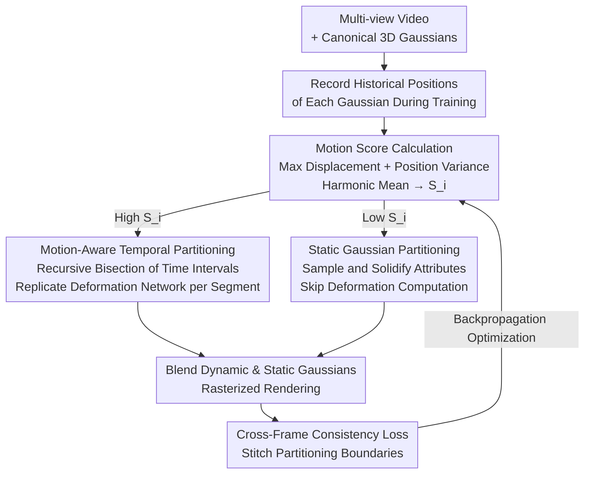

# MAPo: Motion-Aware Partitioning of Deformable 3D Gaussian Splatting for High-Fidelity Dynamic Scene Reconstruction

**Conference**: CVPR 2026  
**Paper**: [CVF Open Access](https://openaccess.thecvf.com/content/CVPR2026/html/Jiao_MAPo_Motion-Aware_Partitioning_of_Deformable_3D_Gaussian_Splatting_for_High-Fidelity_CVPR_2026_paper.html)  
**Code**: None  
**Area**: 3D Vision  
**Keywords**: Dynamic Scene Reconstruction, Deformable 3D Gaussian Splatting, Motion Score, Temporal Partitioning, Cross-Frame Consistency

## TL;DR
MAPo computes a "motion score" for each 3D Gaussian. Based on this, it **recursively bisects** highly dynamic Gaussians along the temporal axis, replicating an independent deformation network for each segment to fit segment-specific motion. Low-dynamic Gaussians are directly solidified into static ones to save computation, and a cross-frame consistency loss is used to stitch partitioning boundaries. On N3DV, MAPo improves PSNR from E-D3DGS's 30.79 to 31.33 with essentially comparable computational overhead.

## Background & Motivation
**Background**: For dynamic 3D scene reconstruction from multi-view videos, the mainstream pipeline is "deformable 3D Gaussian Splatting," which maintains a set of **canonical 3D Gaussians** and learns a globally shared **deformation field** to map these Gaussians over time $t$ to their current states (position, rotation, scale, opacity, etc.). D3DGS, 4DGaussians, and E-D3DGS all belong to this category, becoming mainstream due to compact representation and real-time rendering.

**Limitations of Prior Work**: These methods suffer from blurriness and loss of motion details in areas with **complex or violent motion** (such as fast-waving hands or subtle facial expressions) (Fig. 1 in the paper). The root cause is the "single unified model": a set of canonical Gaussians + a global deformation network must simultaneously fit **all conflicting motion patterns** across the entire time period, forcing convergence to a compromised solution that serves as a "middle ground" for all moments. This leads to a **temporal averaging** effect where the rendered results visually approximate the average across all moments (Fig. 2), smoothing out sharp transitions and details that deviate from this average.

**Key Challenge**: The trade-off between representation capability and computational/engineering costs. To avoid temporal averaging, one approach (like SWinGS) segments the sequence into independent windows and trains a separate model for each. However, its partitioning is **coarse window-level**, relies on 2D optical flow priors, and requires tedious pre- and post-processing. On the other hand, Gaussians in static regions **still repeatedly participate in deformation network computations**, which is highly redundant.

**Goal**: ① Perform **fine-grained, 3D motion-driven, end-to-end** temporal partitioning in highly dynamic regions to eliminate temporal averaging; ② Identify static Gaussians to eliminate redundant deformation computations; ③ Eliminate boundary rendering jumps caused by partitioning.

**Key Insight**: Rather than forcing a single network to fit all motion, it is better to **adaptively allocate modeling capacity based on motion intensity**. The more violently a Gaussian moves, the more dedicated "network + Gaussian replica" sets are assigned to it for fine-grained fitting in segmented intervals; those with low motion are solidified. The key prerequisite is a metric capable of quantifying the "motion intensity of each Gaussian."

**Core Idea**: Compute a **motion score** for each 3D Gaussian based on its historical trajectory. Use this score to **recursively bisect** highly dynamic Gaussians temporally (replicating the deformation network for each segment) and solidify low-dynamic Gaussians into static ones, finally stitching boundaries with a cross-frame consistency loss.

## Method

### Overall Architecture
MAPo is built on the **dual-deformation paradigm** of E-D3DGS: each Gaussian has a learnable embedding $z_g$, and each moment $t$ has a pair of temporal embeddings (coarse $z_{t_c}$ for low-frequency motion, fine $z_{t_f}$ for high-frequency detail). The deformation is predicted by a coarse deformation network $\mathcal{F}$ and a fine deformation network $\mathcal{F}_\theta$:

$$(\Delta\mu, \Delta q, \Delta s, \Delta\alpha, \Delta sh) = \mathcal{F}(z_g, z_{t_c}) + \mathcal{F}_\theta(z_g, z_{t_f})$$

On top of this, the overall pipeline of MAPo is: **record historical positions of each Gaussian during training → compute motion scores → recursively bisect high-score Gaussians temporally and replicate the deformation networks, while solidifying low-score Gaussians into static ones → blend dynamic and static Gaussians for rendering → apply cross-frame consistency loss near partition boundaries**. This is not a simple loss tweak, but a multi-module collaborative framework that "adaptively allocates modeling capacity to motion," hence the framework diagram.

### Key Designs

**1. Motion Score: Quantifying Motion Intensity for Each Gaussian via Historical Trajectories**

Temporal partitioning requires knowing "which Gaussians should be partitioned and which should be solidified," which demands a reliable per-Gaussian motion intensity metric. The authors record $m$ historical positions $\{\mu_{ij}\}_{j=1}^m$ ($m=300$) for each Gaussian $G_i$ during training, pointing out that **relying solely on maximum displacement is insufficient**: objects with high-speed but short-term motion have large maximum displacement but small variance; objects with continuous small-amplitude oscillations have small maximum displacement but large variance. Both are "complex, hard-to-fit motions." Thus, they use both metrics: maximum displacement $r_i$ (calculated as the diagonal of the axis-aligned bounding box of historical positions to efficiently compute peak motion magnitude) and position variance $v_i$ (dispersion around the mean position $\bar\mu_i$):

$$r_i = \big\| \max_j \mu_{ij} - \min_j \mu_{ij} \big\|, \quad v_i = \sum_{j=1}^m \frac{\|\mu_{ij} - \bar\mu_i\|^2}{m}$$

Both metrics are first mapped to $[0,1]$ via **percentile normalization** ($\tilde r_i = \sum_{k=1}^{100} \frac{\mathbf{1}(r_i \ge q_r(k))}{100}$, and similarly for $\tilde v_i$, where $q_r(k)$ is the $k$-th percentile of $\{r_i\}$), and then fused using the **harmonic mean** to obtain the final motion score:

$$S_i = \frac{2}{\frac{1}{\tilde r_i + \varepsilon} + \frac{1}{\tilde v_i + \varepsilon}}, \quad \varepsilon = 10^{-6}$$

The harmonic mean is used instead of the arithmetic mean because it **requires both inputs to be high to output a high score**—only Gaussians with "both large displacement and large variance" are identified as having truly violent and complex motion. This avoids false positives from a single dimension, which is why adding variance (1.2 +Var) yields further gains in the ablation study.

**2. Motion-Aware Recursive Temporal Partitioning: Replicating Dedicated Networks for Violent Motion**

This is the core design to eliminate temporal averaging. The challenge is that a single Gaussian + single deformation network cannot fit long-term complex motion. MAPo's approach is to **recursively bisect along the temporal axis**: each Gaussian maintains two attributes—partitioning level $l$ (initially 0) and time interval range $[t_{\text{start}}, t_{\text{end}}]$ (initially $[0,T]$, left-closed right-open). Let $G_{[t_{\text{start}},t_{\text{end}}]}$ be the set of Gaussians active during this interval, and $F_{[t_{\text{start}},t_{\text{end}}]}$ be the network responsible for deforming them. When the motion score of a Gaussian at level $l$ within its interval exceeds the level threshold $\tau_l$, it is bisected at the midpoint $t_{\text{mid}} = (t_{\text{start}} + t_{\text{end}})/2$: the original Gaussian retains the first half $[t_{\text{start}}, t_{\text{mid}}]$ and promotes to level $l{+}1$, while **a replica with identical attributes is created** to handle the second half $[t_{\text{mid}}, t_{\text{end}}]$. Simultaneously, the deformation network $F_{[t_{\text{start}},t_{\text{end}}]}$ is duplicated into $F_{[t_{\text{start}},t_{\text{mid}}]}$ and $F_{[t_{\text{mid}},t_{\text{end}}]}$ to independently fit the spatial-temporal deformation of each sub-interval. This process is **recursively applied** within each new sub-interval (capped at level 3 in the main experiments).

As a result, violent motion that was previously compromised under a single network is now handled by **multiple sets of networks + Gaussian replicas operating in different time intervals**. Each set only needs to fit shorter, more consistent motion, preserving details and mitigating temporal averaging. The fundamental difference from window-level partitioning like SWinGS is that MAPo is **fine-grained per-Gaussian**, **directly 3D motion-driven** (without relying on 2D optical flow), and **end-to-end integrated into a single training session** without pre- or post-processing. In the ablation study, it significantly outperforms the naive baseline of uniformly segmenting the video into three parts and training an E-D3DGS on each (Baseline seg).

**3. Static Gaussian Partitioning: Solidifying Low-Dynamic Gaussians to Save Computation**

This targets the redundancy where Gaussians in static regions still repeatedly calculate deformation network outputs. Gaussians with motion scores below a predefined threshold $\tau_{\text{static}}$ are classified as static: their attributes are **initialized and fixed once** using the output of the deformation network at a **randomly sampled time**, and they **bypass the deformation network computation** during later rendering, though the attributes themselves can still be optimized. This removes "non-moving elements" from expensive step-by-step deformation calculations, directly reducing training time, storage, and boosting rendering speed. The ablation study (2.0 +Static) shows that adding this reduces storage from 67MB to 48MB and boosts FPS from 54.56 to 92.59, with almost no drop in PSNR/SSIM—indicating that assuming "motion" in static regions is redundant, and solidification does not sacrifice quality.

**4. Cross-Frame Consistency Loss: Stitching Partitioning Boundaries**

While temporal partitioning is effective, the fact that adjacent intervals are handled by different networks/Gaussians introduces temporal visual jumps at the **partitioning boundaries** (confirmed by the degradation of the temporal optical flow metric tOF at boundaries in the paper). The loss $\mathcal{L}_{\text{cross}}$ consists of two terms. The first term $\mathcal{L}_{\text{current}}$ constrains the **two renderings of the same frame from the same viewpoint across adjacent boundaries to be consistent**:

$$\mathcal{L}_{\text{current}} = \big\| I_t(G_t, V) - I_t(G_{t'}, V) \big\|_1$$

where $t'$ is the time in the nearest adjacent interval, and $G_t$ includes static Gaussians and active dynamic Gaussians at time $t$. However, the authors found that **using only $\mathcal{L}_{\text{current}}$ causes issues**: since it only forces adjacent segments to be self-consistent without external references, continuous optimization causes both segments to converge to a "consistent but over-smoothed" blurred state. To address this, they introduce the second term $\mathcal{L}_{\text{gt}}$, which **directly aligns the adjacent segment's rendering to the current frame's ground truth**, injecting spatial-temporal context and forcing it to learn sharp details:

$$\mathcal{L}_{\text{gt}} = \big\| I_t(G_{t'}, V) - I^{\text{GT}} \big\|_1$$

The total loss is $\mathcal{L}_{\text{cross}} = 0.5 \cdot \mathcal{L}_{\text{current}} + \mathcal{L}_{\text{gt}}$, and it is **only applied to training views within 5 frames of any partitioning boundary**. It eliminates visual jumps while leveraging context from adjacent frames to enhance fidelity—adding $\mathcal{L}_{\text{current}}$ reduces boundary tOF from 0.081 to 0.074, and adding $\mathcal{L}_{\text{gt}}$ further reduces it to 0.072 while bringing PSNR back to 26.72, showing its dual-action effect of stitching and preserving quality.

### Loss & Training
The overall training pipeline builds on the original reconstruction loss of E-D3DGS, with $\mathcal{L}_{\text{cross}}$ added. Key hyperparameters: historical position records $m=300$, maximum partitioning level of 3 (the ablation study shows quality gains plateau after level 3 while cost continues to grow). The dynamic partitioning threshold $\tau_l$ is set per level, and the static threshold $\tau_{\text{static}}$ is configured separately (complete configurations are in the appendix). Experiments were conducted on an NVIDIA RTX A6000.

## Key Experimental Results

### Main Results
Datasets: N3DV (20 cameras, 30FPS, downsampled to 1352×1014) and Meet Room (13 cameras, 1280×720, 30FPS). All 3DGS baselines use the same point cloud initialization for fairness.

| Dataset | Metric | MAPo (Ours) | E-D3DGS | Gain |
|--------|------|------|----------|------|
| N3DV | PSNR↑ | **31.33** | 30.79 | +0.54 |
| N3DV | SSIM↑ | **0.944** | 0.934 | +0.010 |
| N3DV | LPIPS↓ | **0.044** | 0.051 | -0.007 |
| N3DV | Storage↓ | 65 MB | 73 MB | More efficient |
| N3DV | Training Time↓ | 1h52m | 2h41m | Faster |
| N3DV | FPS↑ | 75.64 | 37.51 | ~2× |
| Meet Room | PSNR↑ | **26.72** | 26.24 | +0.48 |
| Meet Room | SSIM↑ | **0.903** | 0.896 | +0.007 |
| Meet Room | LPIPS↓ | **0.066** | 0.081 | -0.015 |

MAPo achieves SOTA performance across both datasets in terms of quality, while training time, storage, and FPS are better than or comparable to E-D3DGS, avoiding the "exploding cost" typically caused by partitioning.

### Ablation Study (Meet Room, cumulative additions)

| Configuration | PSNR↑ | LPIPS↓ | Storage↓ | FPS↑ | Boundary tOF↓ | Description |
|------|------|--------|-------|------|-----------|------|
| Baseline (E-D3DGS) | 26.24 | 0.081 | 28MB | 90.26 | 0.074 | Single unified model |
| Baseline (seg) | 26.31 | 0.073 | 89MB | 85.20 | 0.185 | Naive uniform segmentation (3 parts), violent boundary jumps |
| 1.1 +Max Displacement | 26.52 | 0.070 | 65MB | 55.21 | 0.084 | Partitioning using only $r_i$ for motion score |
| 1.2 +Variance | 26.63 | 0.067 | 67MB | 54.56 | 0.082 | Adding $v_i$, more accurate scoring |
| 2.0 +Static Partitioning | 26.60 | 0.066 | 48MB | 92.59 | 0.081 | Quality preserved, storage and speed vastly improved |
| 3.1 +$\mathcal{L}_{\text{current}}$ | 26.49 | 0.071 | 48MB | 92.88 | 0.074 | Improved boundary consistency but slight quality drop (over-smoothing) |
| 3.2 +$\mathcal{L}_{\text{gt}}$ (Full) | **26.72** | 0.066 | 49MB | 92.21 | 0.072 | Ground-truth anchored, win-win for quality and consistency |

### Key Findings
- **"Dual-metric" scoring is effective**: Using only maximum displacement (1.1) already outperforms the naive window segment baseline. Adding variance (1.2) further boosts PSNR by 0.11, validating that the harmonic mean of both metrics more accurately identifies complex motion.
- **Static partitioning offers "free" efficiency gains**: From 1.2 to 2.0, storage drops from 67MB to 48MB, and FPS boosts from 54.56 to 92.59, while PSNR remains virtually unchanged — demonstrating that solidifying static regions does not sacrifice rendering quality.
- **$\mathcal{L}_{\text{current}}$ alone causes over-smoothing**: In 3.1, boundary tOF is reduced, but PSNR drops to 26.49; it must be paired with $\mathcal{L}_{\text{gt}}$ to anchor against ground truth (3.2) to restore PSNR back to 26.72. This is an honest and important observation in the paper.
- **Partitioning levels yield diminishing returns**: Quality increases monotonically from level 0 to 4, but gains taper off after level 3 while costs continue to rise. Since level 4 storage is only twice that of level 0, the cost of recursive bisection is highly controllable, and level 3 is chosen for optimal trade-off.
- **Fine-grained vs. Window-level**: MAPo (per-Gaussian, 3D motion-driven) significantly outperforms Baseline (seg) (window-level uniform partitioning), which suffers from severe boundary jumps (boundary tOF of 0.185 vs MAPo's 0.072), proving that coarse partitioning introduces severe temporal inconsistency.

## Highlights & Insights
- **"Allocating modeling capacity based on motion intensity" is intuitive and effective**: The motion score links "how much network capacity to allocate" with "how violently this local region moves." Recursive bisection allows capacity to grow adaptively, which is more elegant than one-size-fits-all window partitioning.
- **Clever use of the harmonic mean**: To enforce the semantics of "high only when both are high," the harmonic mean is a natural fit, avoiding false positives from a single dimension compared to weighted sums. This trick is readily transferable to other multi-condition scoring scenarios.
- **$\mathcal{L}_{\text{current}}$ leads to over-smoothing and requires ground truth anchoring**: This is a counter-intuitive but valuable observation — pure self-consistency constraints can drag adjacent segments into a blurry mess. Any consistency loss designed to align multiple branches should be wary of this "consistent but collapsed" failure mode.
- **The concept of decoupling static/dynamic representation for efficiency** can be migrated to other dynamic tasks (e.g., NeRF, 4D Gaussian), with the core principle being "do not pass non-moving parts through the deformation network repeatedly."

## Limitations & Future Work
- **Dependency on historical trajectory tracking**: The motion score requires accumulating $m=300$ historical positions during training, which is unfriendly to online/streaming reconstruction (reconstructing while capturing), and the choice of $m$ affects score stability.
- **Manual thresholds and levels**: Level thresholds $\tau_l$, static threshold $\tau_{\text{static}}$, and max levels are hyperparameters. Their robustness across different scenes and potential for automation is not fully discussed.
- **Network replication leads to size growth**: Recursively bisecting high-dynamic regions replicates Gaussians and deformation networks. Although the paper argues the cost is controllable (level 4 storage is ~2× level 0), the number of parameters could swell on highly active, long sequences.
- **Strong dependency on E-D3DGS**: The method is tightly coupled with the dual-deformation paradigm, and its efficacy on other deformation backbones has not been verified.
- **Future directions**: Adapting the motion score calculation into an online incremental update format to support streaming reconstruction; employing learnable/adaptive thresholds to replace manual tuning.

## Related Work & Insights
- **vs E-D3DGS**: E-D3DGS is the foundation of this work (dual-deformation + per-Gaussian/temporal embedding), but it remains a single unified model suffering from temporal averaging. MAPo introduces motion-aware partitioning on top of it, splitting the single model into multiple interval-specific networks, resulting in superior quality and efficiency.
- **vs SWinGS (Window Partitioning)**: SWinGS slices sequential frames into sliding windows to train independent models, relying on 2D optical flow guidance and requiring tedious pre- and post-processing. MAPo is **fine-grained per-Gaussian, 3D motion-driven, and end-to-end**, avoiding boundaries jumps originating from coarse window splits (Baseline-seg boundary tOF 0.185 vs MAPo 0.072) and complex pipelines.
- **vs Swift4D (Static-Dynamic Separation)**: Swift4D uses 2D RGB to separate static and dynamic regions, constructing deformation only for dynamic Gaussians. MAPo's static classification comes from **3D motion via the motion score**, which is more direct, and static partitioning is a by-product of its architecture; its main contribution lies in recursive temporal partitioning for highly dynamic regions.
- **vs 4D Gaussian / Curve-based Methods**: 4D Gaussian-based methods (e.g., decomposing 4D into 3DG + 1D marginal Gaussians) provide direct spatial-temporal representations but suffer from high computational costs. Curve-based methods model attribute evolution with parametric curves, but drift under complex motion and require heavy storage. MAPo evades these expenses through a compact deformation field + static solidification.

## Rating
- Novelty: ⭐⭐⭐⭐ The combination of "motion-score-driven per-Gaussian recursive temporal partitioning + replicated deformation networks" is novel and well-motivated. While individual components have roots in prior work, they are integrated seamlessly.
- Experimental Thoroughness: ⭐⭐⭐⭐ SOTA results on two datasets, comprehensive ablation studies, and analysis of partitioning levels and boundary consistency (tOF). However, evaluation on only two real-world datasets lacks coverage of longer sequences or online scenarios.
- Writing Quality: ⭐⭐⭐⭐ Motivations (temporal averaging) are clearly articulated, and the honest observation regarding the over-smoothing of $\mathcal{L}_{\text{current}}$ is a notable positive.
- Value: ⭐⭐⭐⭐ Provides a practical solution that balances quality and efficiency in the active field of dynamic Gaussian splatting; its core concepts (motion-based capacity allocation, harmonic mean scoring) are highly transferable.

<!-- RELATED:START -->

## Related Papers

- [\[CVPR 2026\] FastEventDGS: Deformable Gaussian Splatting for Fast Dynamic Scenes from a Single Event Camera](fasteventdgs_deformable_gaussian_splatting_for_fast_dynamic_scenes_from_a_single.md)
- [\[CVPR 2026\] Catalyst4D: High-Fidelity 3D-to-4D Scene Editing via Dynamic Propagation](catalyst4d_highfidelity_3dto4d_scene_editing_via_d.md)
- [\[CVPR 2026\] 3D Gaussian Splatting with Self-Constrained Priors for High Fidelity Surface Reconstruction](3d_gaussian_splatting_with_self-constrained_priors_for_high_fidelity_surface_rec.md)
- [\[CVPR 2026\] AeroGS: Scale-Aware Gaussian Splatting for Pose-Free Dynamic UAV Scene Reconstruction](aerogs_scale-aware_gaussian_splatting_for_pose-free_dynamic_uav_scene_reconstruc.md)
- [\[CVPR 2026\] SpeeDe3DGS: Speedy Deformable 3D Gaussian Splatting with Temporal Pruning and Motion Grouping](speede3dgs_speedy_deformable_3d_gaussian_splatting_with_temporal_pruning_and_mot.md)

<!-- RELATED:END -->
