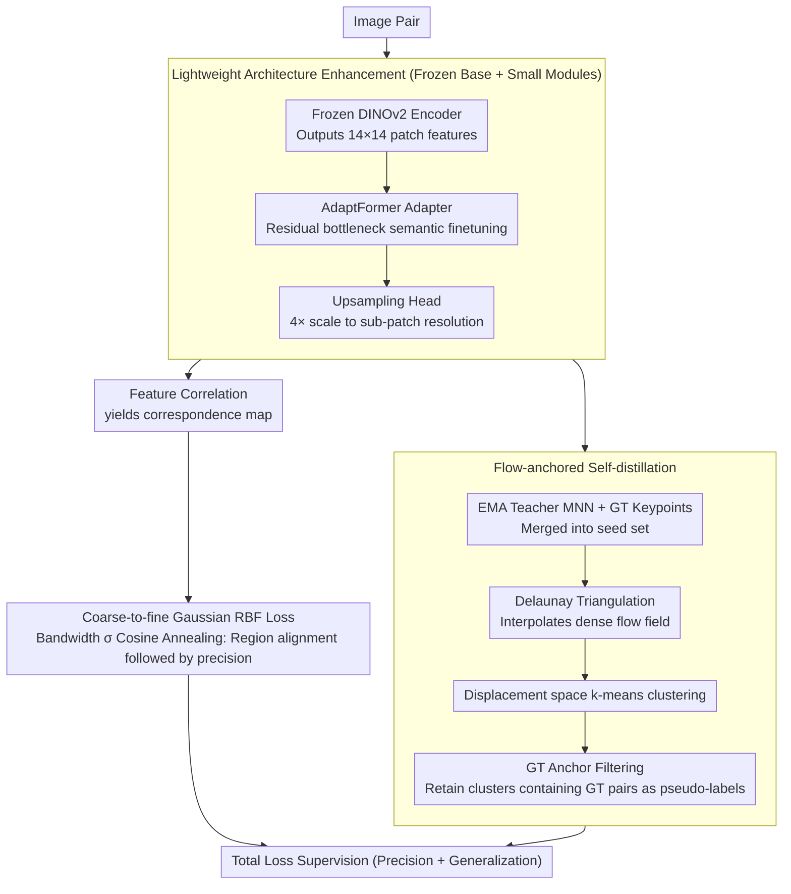

# MARCO: Navigating the Unseen Space of Semantic Correspondence

**Conference**: CVPR 2026 Oral  
**arXiv**: [2604.18267](https://arxiv.org/abs/2604.18267)  
**Code**: [https://visinf.github.io/MARCO](https://visinf.github.io/MARCO)  
**Area**: 3D Vision  
**Keywords**: Semantic Correspondence, DINOv2, Self-distillation, Coarse-to-fine, Generalizability

## TL;DR

MARCO is proposed, a semantic correspondence model based on a single DINOv2 backbone. It progressively improves spatial precision through a coarse-to-fine Gaussian RBF loss and expands sparse keypoint supervision into dense pseudo-correspondence labels using a self-distillation framework. MARCO achieves SOTA performance on standard benchmarks and unseen keypoints/categories while being $3\times$ smaller and $10\times$ faster than dual-encoder methods.

## Background & Motivation

**Background**: Semantic correspondence aims to establish pixel-level matches between semantically equivalent regions. Recent mainstream methods adopt dual-encoder architectures—combining DINOv2 (for robust semantic alignment) and Stable Diffusion (for rich spatial details), such as Geo-SC and SD+DINO. These methods perform well on benchmarks but have nearly 1 billion parameters.

**Limitations of Prior Work**: (1) Dual-encoder schemes are computationally intensive, requiring feature extraction from two encoders; (2) More critically, models trained on sparse keypoints generalize poorly to unseen keypoints and unseen categories during testing, as query points in practical applications rarely overlap with points annotated during training. This exposes a gap between benchmark performance and real-world usability.

**Key Challenge**: Sparse keypoint supervision causes the model to overfit near annotated positions. While finetuned DINOv2 improves accuracy around annotated keypoints, the original part-consistency across the entire object surface is destroyed (representation collapses toward keypoints).

**Goal**: (1) Improve accuracy on standard benchmarks, especially at fine-grained localization thresholds; (2) Substantially enhance generalizability to unseen keypoints and categories; (3) Maintain the efficiency advantage of a single backbone.

**Key Insight**: Although frozen DINOv2 encoders have limited spatial consistency, their feature spaces already contain sparse but reliable correspondence clues. These clues can be utilized during training to automatically discover and propagate dense correspondence, extending supervision from a few keypoints to the entire object surface.

**Core Idea**: Utilize a "coarse-to-fine" supervision target to improve spatial precision, combined with "self-distillation + flow-anchoring" to expand sparse keypoints into dense pseudo-labels covering the object surface. This ensures features remain smooth across the entire object rather than contracting only around keypoints.

## Method

### Overall Architecture

MARCO aims to achieve more accurate semantic correspondence and better robustness to unseen keypoints/categories without introducing a second encoder. It uses a **frozen DINOv2 encoder** as the semantic base and adds two lightweight components: a bottleneck adapter (AdaptFormer, parameter overhead <5%) inserted into high-level Transformer blocks, and a compact upsampling head that scales patch-level features by $4\times$. When an image is input, DINOv2 outputs $14\times14$ patch features, the adapter finetunes the semantics, and the upsampling head restores spatial resolution. Correlation between features of image pairs yields the correspondence probability map.

The effectiveness is driven by two complementary training objectives. One is the **coarse-to-fine supervision loss**, responsible for tightening localization from region-level to sub-patch-level. The other is the **flow-anchored self-distillation loss**, which automatically expands the sparse keypoints available during training into dense pseudo-correspondences covering the entire object.

### Key Designs

**1. Coarse-to-fine Gaussian RBF Loss: From Regional Alignment to Precise Localization**

Supervising directly with a very narrow Gaussian kernel leads to high accuracy only at a few high-confidence points while overall accuracy suffers; using a very wide kernel only achieves coarse alignment. MARCO's approach is to dynamically shrink the "width" of the supervision target during training. The predicted probability map matches a Gaussian RBF kernel centered on the GT keypoint, where the kernel bandwidth $\sigma$ follows a cosine annealing schedule:

$$\sigma(t) = \sigma_{min} + \tfrac{1}{2}(\sigma_{max} - \sigma_{min})\,(1 + \cos(\pi t/T))$$

In early training, $\sigma$ is large/wide, requiring predictions only to fall within the region near the GT to establish stable region-level alignment. As $t$ increases and $\sigma$ narrows, the loss penalizes even pixel-level deviations, forcing the model toward sub-patch-level precision. This compresses "coarse-to-fine" multi-stage training into a single annealing curve, preventing early collapse while ensuring tight final localization—a direct reason for its superiority at the strict PCK@0.01 threshold.

**2. Flow-anchored Self-distillation: Anchoring Sparse Supervision to Generate Dense Pseudo-labels**

Sparse keypoint supervision poses a risk: finetuning improves areas near keypoints but destroys DINOv2's original part-consistency across the object surface, causing representations to collapse around annotated points and fail on unseen ones. To address this, supervision must cover the entire surface. However, direct dense matching using DINOv2 features introduces errors due to symmetry and occlusion. MARCO's solution ensures discovered dense correspondences are consistent with known GT keypoint flows via four steps: first, mutual nearest neighbor (MNN) matches $\mathcal{P}_{MNN}$ are extracted from EMA teacher features and merged with GT keypoints into a seed set; Delaunay triangulation is performed on the source points of seeds to create piecewise affine transformations, interpolating a dense flow field $\mathbf{D}(\mathbf{u})$; k-means clustering is performed in displacement space (with $k$ determined by BIC) to group regions with consistent motion; finally, **only clusters containing GT keypoints are retained** as reliable pseudo-labels. GT keypoints act as "anchors"—a cluster's flow is accepted only if it aligns with a GT pair, ensuring pseudo-labels are both dense and clean.

**3. Lightweight Architecture Enhancement: Frozen Base with Adapters and Upsampling**

To capture details without massive parameter overhead, MARCO freezes the entire backbone and trains only two small modules. AdaptFormer inserts bottleneck adapters (projection matrices $\mathbf{W}_{down} \in \mathbb{R}^{D \times d}$, $d \ll D$) into high-level Transformer blocks in a residual manner, finetuning semantics with minimal parameters. The upsampling head uses a sequence of $2\times$ transposed convolutions, GELU, and $3\times3$ depthwise convolutions to achieve $4\times$ magnification, lifting $14\times14$ patch features to sub-patch resolution for sufficient spatial granularity. Freezing the base preserves DINOv2's generalizability and avoids the risk of overfitting to annotated points—complementing the loss functions where the loss defines "where to learn" and the architecture ensures "not to break the base."

### Loss & Training

The total loss is $\mathcal{L} = \mathcal{L}_{sup} + \mathcal{L}_{self}$. The supervision loss $\mathcal{L}_{sup}$ uses cross-entropy with the aforementioned Gaussian RBF annealing. The self-distillation loss $\mathcal{L}_{self}$ performs L2 regression on dense pseudo-labels (more robust to noisy pseudo-labels than CE). The teacher network is an EMA of the student, ensuring stable pseudo-label generation.

## Key Experimental Results

### Main Results

| Dataset | Threshold | MARCO | Geo-SC (Prev. SOTA) | Gain |
|--------|------|-------|----------------|------|
| SPair-71k | PCK@0.10 | **Ours** | 2nd Best | +4.0 |
| SPair-71k | PCK@0.01 | **Ours** | 2nd Best | **+8.9** |
| AP-10K (Intra) | PCK@0.10 | **Ours** | 2nd Best | +2.9 |
| PF-PASCAL | PCK@0.10 | **Ours** | 2nd Best | Gain |

### Generalizability Results

| Setting | MARCO | Jamais Vu (Prev. Best) | Gain |
|------|-------|-------------------|------|
| SPair-U (Unseen Keypoints) | **Ours** | 2nd Best | **+5.1** |
| MP-100 (Unseen Categories) | **Ours** | 2nd Best | **+5.6** |

### Ablation Study

| Configuration | SPair PCK@0.10 | SPair-U | Description |
|------|---------------|---------|------|
| Full MARCO | Best | Best | Complete method |
| w/o Coarse-to-fine | Drop | Drop | Degraded localization |
| w/o Self-distillation | Drop | Significant Drop | Severe generalizability decay |
| w/o Upsampling head | Drop | - | Limited sub-patch precision |

### Key Findings

- MARCO's advantage at the fine-grained PCK@0.01 threshold (+8.9) is significantly larger than at PCK@0.10 (+4.0), proving the coarse-to-fine strategy's impact on precise localization.
- Self-distillation is critical for generalizability—without it, the finetuned DINOv2 can perform worse than the frozen model on unseen keypoints.
- The single-backbone approach outperforms dual-encoder schemes while being $3\times$ smaller and $10\times$ faster, suggesting that training strategy is more vital than architectural "scale."

## Highlights & Insights

- The flow-anchored self-distillation is cleverly designed: mining sparse reliable matches $\rightarrow$ Delaunay dense interpolation $\rightarrow$ displacement clustering + GT anchor filtering. Each step serves a clear purpose and integrates seamlessly.
- The observation that "sparse supervision leads to representation collapse" is insightful—finetuning makes keypoints better but objects as a whole worse. Self-distillation effectively remediates this.
- The introduction of a new generalizability benchmark (unseen keypoint/category tests based on MP-100) provides a more rigorous evaluation standard for the field.

## Limitations & Future Work

- Self-distillation depends on pre-existing sparse reliable correspondences in the DINOv2 feature space; if the pretrained representation lacks this structure for certain categories, the method may be limited.
- Delaunay triangulation cannot generate pseudo-labels outside the convex hull of seed points.
- While not relying on 3D priors is an advantage, it limits the ability to handle severe object deformations.
- Future work: Integrate temporal consistency from video to provide more dense correspondence signals.

## Related Work & Insights

- **vs Geo-SC/Dual-encoder methods**: MARCO outperforms them with a single backbone, proving that refined training strategies can overcome the "disadvantage" of architectural simplicity.
- **vs Jamais Vu**: Both focus on unseen keypoint generalization, but Jamais Vu relies on 3D templates and is limited by training categories. MARCO's self-distillation does not depend on category priors or 3D information.

## Rating

- Novelty: ⭐⭐⭐⭐⭐ Flow-anchored self-distillation is a highly original training paradigm.
- Experimental Thoroughness: ⭐⭐⭐⭐⭐ Detailed ablations across standard and generalization benchmarks.
- Writing Quality: ⭐⭐⭐⭐⭐ Insightful analysis and elegant methodology derivation.
- Value: ⭐⭐⭐⭐⭐ Significant progress in both precision and generalizability while maintaining efficiency.

<!-- RELATED:START -->

## Related Papers

- [\[CVPR 2026\] Registration-Free Learnable Multi-View Capture of Faces in Dense Semantic Correspondence](registration-free_learnable_multi-view_capture_of_faces_in_dense_semantic_corres.md)
- [\[ICCV 2025\] Do It Yourself: Learning Semantic Correspondence from Pseudo-Labels](../../ICCV2025/3d_vision/do_it_yourself_learning_semantic_correspondence_from_pseudo-labels.md)
- [\[CVPR 2026\] SGSoft: Learning Fused Semantic-Geometric Features for 3D Shape Correspondence via Template-Guided Soft Signals](sgsoft_learning_fused_semantic-geometric_features_for_3d_shape_correspondence_vi.md)
- [\[CVPR 2025\] SemAlign3D: Semantic Correspondence Between RGB-Images Through Aligning 3D Object-Class Representations](../../CVPR2025/3d_vision/semalign3d_semantic_correspondence_between_rgb-images_through_aligning_3d_object.md)
- [\[CVPR 2026\] Best Segmentation Buddies for Image-Shape Correspondence](best_segmentation_buddies_for_image-shape_correspondence.md)

<!-- RELATED:END -->
