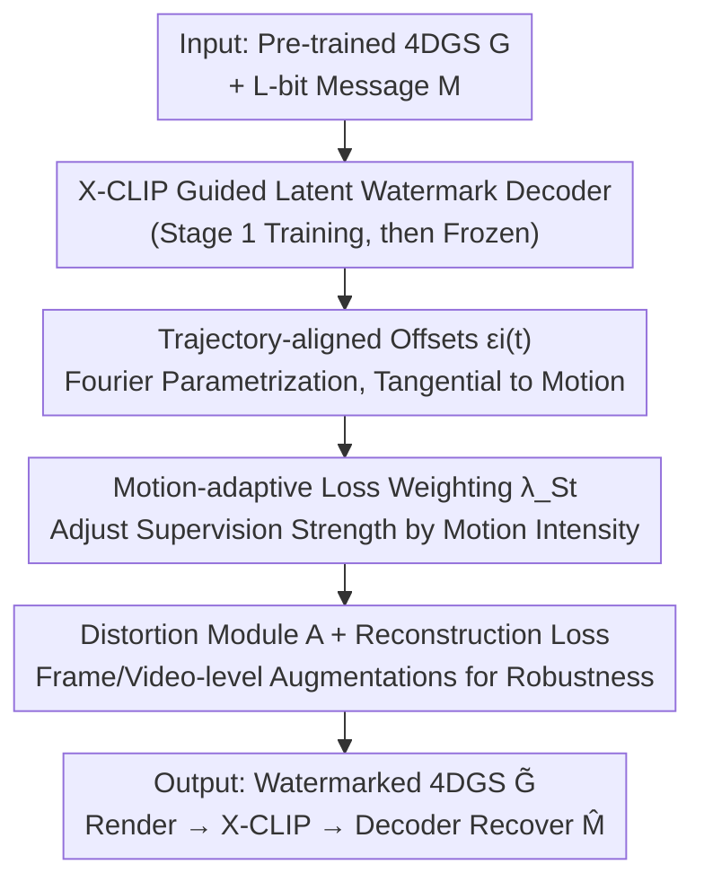

# Mark4D: Temporally-Consistent Watermarking for 4D Gaussian Splatting

**Conference**: CVPR 2026  
**Paper**: [CVF Open Access](https://openaccess.thecvf.com/content/CVPR2026/html/Lee_Mark4D_Temporally-Consistent_Watermarking_for_4D_Gaussian_Splatting_CVPR_2026_paper.html)  
**Code**: TBC  
**Area**: 3D Vision  
**Keywords**: 4D Gaussian Splatting, Digital Watermarking, Temporal Consistency, Latent Space Decoding, Motion Adaptation

## TL;DR
Mark4D is the first watermarking method specifically designed for dynamic 4D Gaussian Splatting (4DGS). Utilizing a trio of "X-CLIP video-text latent space decoder + offsets along Gaussian motion trajectories + motion-adaptive loss weighting," it embeds invisible, distortion-resistant, and temporally consistent watermarks into dynamic scenes. It significantly outperforms baselines that directly adapt 3DGS watermarking to 4D in both visual fidelity and bit accuracy.

## Background & Motivation

**Background**: 4DGS extends 3D Gaussian Splatting into the time dimension. By modeling non-rigid motion with learnable deformation fields, it has become the mainstream representation for real-time photorealistic rendering of dynamic scenes (e.g., digital humans, dynamic content generation, surgical scene reconstruction). As 4DGS becomes a foundational representation for synthetic dynamic assets, verifying authenticity and ownership through robust, invisible watermarking becomes a critical requirement.

**Limitations of Prior Work**: Existing 3DGS watermarking methods directly fine-tune Gaussian parameters—either all parameters or a small subset. Porting them directly to 4D is unstable: fine-tuning all parameters leads to geometric **temporal inconsistency** (Gaussians drift over time, causing jittery watermark perturbations); fine-tuning only a subset provides **insufficient capacity** to embed enough watermark information.

**Key Challenge**: Motion (the displacement of Gaussians between adjacent frames) in dynamic 4DGS varies drastically over time. In synthetic datasets (D-NeRF), motion is relatively controlled, while in real-world scenes (DyNeRF), the motion distribution is wide, ranging from fast movements to nearly static intervals. **Applying uniform watermark supervision across all frames is sub-optimal**: over-supervision in static intervals leads to overfitting and unnecessary visual degradation, while severe deformations in high-dynamic intervals weaken the encoded watermark signal. Furthermore, pixel-domain decoders tend to distort local image details during optimization.

**Goal**: Design a watermarking method for dynamic 4DGS that simultaneously satisfies robustness, invisibility, and temporal consistency.

**Key Insight**: Rather than operating in the pixel domain and on static parameters, one should: (1) shift decoding to a video-text latent space decoupled from pixels; (2) allow watermark perturbations to evolve smoothly along Gaussian motion trajectories; and (3) adaptively allocate supervision strength based on motion intensity.

**Core Idea**: By combining "latent space decoding + trajectory-aligned offsets + motion-adaptive weighting," the watermark is embedded such that it remains hidden while following the underlying motion.

## Method

### Overall Architecture
Given a pre-trained 4DGS model $G$, the goal is to embed an $L$-bit message $M \in \{0, 1\}^L$ into its spatio-temporal representation. The resulting watermarked model $\tilde G$ should be visually indistinguishable from the original while allowing reliable recovery of $M$ from rendered videos or images. The watermarked model only applies offsets to positions and Spherical Harmonic (SH) coefficients: $\tilde G(t) = \{x_i(t) + \varepsilon_i(t), h_i(t) + \delta_i(t), \alpha_i(t), \Sigma_i(t)\}$, leaving opacity $\alpha$ and covariance $\Sigma$ unchanged (modifying them directly distorts geometry and creates obvious artifacts). The training process consists of two stages: first training a latent space watermark decoder, and then freezing it to optimize the offsets for embedding the watermark into the 4DGS.

### Key Designs

**1. X-CLIP Guided Latent Watermark Decoder: Decoding in Video-Text Latent Space**

To address the issue of pixel-domain decoders distorting local details, Mark4D trains the decoder in a latent feature space decoupled from pixel supervision. Inspired by GuardSplat's use of CLIP-guided image-text latent decoding for static 3D, this method extends to the **X-CLIP video-text latent space**, enabling stable embedding in dynamic 4D scenes and reliable decoding from rendered videos. Specifically, binary messages are represented as text tokens manageable by X-CLIP: a bit-to-token mapping $\Phi(\cdot, \cdot)$ is defined, assigning two distinct vocabulary tokens (for 0 and 1) to each bit position. This mapping is randomly initialized once at the start of training and fixed. The token sequence is $W = \{w_{start}\} \cup (\bigcup_{i=1}^L \Phi(m_i, i)) \cup \{w_{end}\}$. In Stage 1, $W$ is processed by a frozen X-CLIP text encoder $\mathcal{E}_W$ to obtain text embeddings, and a trainable MLP decoder $\mathcal{D}_M$ reconstructs the message: $\hat M = \mathcal{D}_M(\mathcal{E}_W(W))$, optimized using binary cross-entropy $\mathcal{L}_{msg}$. In Stage 2, $\mathcal{D}_M$ is frozen, and the rendered sequence is encoded by a frozen X-CLIP video encoder $\mathcal{E}_V$ to be decoded into the target message: $\hat M = \mathcal{D}_M(\mathcal{E}_V(\hat I_{S_t}))$. Latent space decoding makes the watermark insensitive to pixel-level distortions and compression artifacts, leading to significantly superior robustness.

**2. Trajectory-aligned Offsets: Aligning Position Perturbations with Gaussian Motion**

In 4DGS, each Gaussian moves smoothly along a deformation field over time. This natural trajectory can be exploited for embedding watermarks without destroying geometry. However, **arbitrary position offsets disturb the natural motion trajectory**, causing severe shifts and temporal instability. Mark4D constrains the direction of $\varepsilon_i(t)$ to the local motion tangent of the Gaussian trajectory: finite differences of positions in adjacent frames approximate the tangent $d_i(t) = \frac{x_i(t+\Delta t)-x_i(t-\Delta t)}{\|x_i(t+\Delta t)-x_i(t-\Delta t)\|_2}$. A trajectory alignment loss $\mathcal{L}_{align}$ minimizes the cosine distance between $\varepsilon_i(\tau)$ and $d_i(\tau)$, encouraging consistent evolution along the motion path and preventing temporal or geometric discontinuities. Furthermore, instead of inefficiently optimizing offsets frame-by-frame, the authors parameterize $\varepsilon_i(t)$ using a Fourier series: $\varepsilon_i(t) = \sum_{k=1}^K (a_{i,k}\sin(2\pi kt) + b_{i,k}\cos(2\pi kt))$, where $a_{i,k}, b_{i,k} \in \mathbb{R}^3$ are learnable and $K$ is the number of frequency components (set to 3). This ensures smooth continuity along the trajectory while compressing the parameter space.

**3. Motion-adaptive Loss Weighting: Allocating Supervision Strength by Motion Intensity**

To resolve the sub-optimality of uniform supervision in dynamic 4DGS, Mark4D adjusts the watermark supervision based on the motion intensity of each temporal window. The aggregate motion within a window $S_t$ is quantified as $\Delta_{S_t} = \frac{1}{N_G T}\sum_{\tau\in S_t}\sum_i \|x_i(\tau+\Delta t)-x_i(\tau)\|_2$. This value is normalized over the entire duration to obtain a motion coefficient $\beta_{S_t} = \frac{\Delta_{S_t}-\Delta_{min}}{\Delta_{max}-\Delta_{min}} \in [0, 1]$. Finally, the message loss weight for that window is linearly interpolated: $\lambda_{S_t} = (1-\beta_{S_t})\lambda_{min} + \beta_{S_t}\lambda_{max}$ (where $\lambda_{min}=0.5, \lambda_{max}=1$). Consequently, windows with high motion receive stronger supervision to ensure robust embedding, while static intervals receive lower weights to preserve high visual fidelity—directly addressing static overfitting and signal weakening in high-dynamic regions.

### Loss & Training
To resist real-world distortions, a differentiable distortion module $A$ is applied to the rendered sequence before decoding: $\hat M = \mathcal{D}_M(\mathcal{E}_V(A(\hat I_{S_t})))$. Module $A$ includes frame-level distortions (cropping, scaling, rotation, Gaussian noise, JPEG compression, brightness jitter) and video-level distortions (H.264 compression, random frame shuffling), applied randomly during training. Fidelity is maintained via the reconstruction loss $\mathcal{L}_{recon} = \frac1T\sum_{\tau\in S_t}(L_1(\hat I_\tau, I_\tau) + L_{lpips}(\hat I_\tau, I_\tau))$. The total objective is $\mathcal{L}_{total} = \lambda_{S_t}\mathcal{L}_{msg} + \lambda_{recon}\mathcal{L}_{recon} + \lambda_{align}\mathcal{L}_{align}$, with $\lambda_{recon} = \lambda_{align} = 1$. The X-CLIP decoder is a 3-layer MLP (ViT-B-32, 512-dim latent space). 4DGS is fine-tuned for 4000 steps, with learning rates of $1.6 \times 10^{-4}$ for Fourier coefficients of $\varepsilon_i(t)$ and $1 \times 10^{-3}$ for $\delta_i(t)$.

## Key Experimental Results

Evaluations were conducted on D-NeRF (8 synthetic scenes) and DyNeRF (6 real-world multi-view scenes) across three dimensions: capacity (bit accuracy for $L \in \{32, 48, 64\}$), invisibility (PSNR/SSIM/LPIPS), and robustness (bit accuracy under various distortions).

### Main Results

Main results (Averaged over D-NeRF and DyNeRF, selected baselines):

| Config | Method | Bit Acc(%)↑ | PSNR↑ | SSIM↑ | LPIPS↓ |
|------|------|-------------|-------|-------|--------|
| 32 bits | GuardSplat | 88.33 | 38.69 | 0.9934 | 0.0082 |
| 32 bits | 3D-GSW | 90.46 | 31.98 | 0.9651 | 0.0321 |
| 32 bits | **Ours** | **96.34** | **42.32** | **0.9960** | **0.0018** |
| 64 bits | 3D-GSW | 83.36 | 30.87 | 0.9504 | 0.0512 |
| 64 bits | VideoSeal | 77.98 | 36.16 | 0.9810 | 0.0211 |
| 64 bits | **Ours** | **92.71** | **41.27** | **0.9954** | **0.0022** |

At 64 bits, Mark4D exceeds 3D-GSW and VideoSeal in bit accuracy by 9.35 and 14.79 percentage points, and in PSNR by 10.40 and 5.11 dB, respectively. Furthermore, when $L$ increases from 32 to 64, this method's accuracy only drops by 3.63 points, compared to drops of 7.10 and 10.23 points for 3D-GSW and VideoSeal, demonstrating stability at high capacities.

Robustness ($L=32$, Bit Acc% under distortions, selected):

| Method | None | Noise(σ=0.1) | Rotation | Crop(40%) | JPEG | H.264 | Drop 20% Gaussian |
|------|------|--------------|----------|-----------|------|-------|-------------|
| GuardSplat | 88.33 | 86.29 | 83.46 | 85.57 | 82.98 | – | 81.54 |
| 3D-GSW | 90.46 | 81.54 | 80.46 | 83.21 | 81.59 | – | 79.77 |
| **Ours** | **96.34** | **95.10** | **91.83** | **92.80** | **91.50** | **90.28** | **90.28** |

Mark4D maintains bit accuracy above 90% across all distortions, with a maximum drop of only 6.06 points. In contrast, 3D-GSW reaches 90% without distortion but drops sharply by 10.69 points under distortion. Robustness stems primarily from latent space decoding, which renders the watermark insensitive to pixel-level noise and compression.

### Ablation Study

Ablation of offset types and loss terms (Average D-NeRF/DyNeRF, $L=48$):

| $\varepsilon_i(t)$ | $\delta_i(t)$ | $\mathcal{L}_{align}$ | $\lambda_{S_t}$ | Bit Acc(%)↑ | PSNR↑ |
|:---:|:---:|:---:|:---:|------|------|
| ✓ | × | × | × | 79.55 | 30.96 |
| × | ✓ | × | × | 88.37 | 37.82 |
| ✓ | ✓ | × | × | 91.27 | 33.94 |
| ✓ | ✓ | ✓ | × | 92.94 | 39.88 |
| ✓ | ✓ | ✓ | ✓ | **95.02** | **41.45** |

### Key Findings
- **Using only position offsets $\varepsilon_i(t)$ yields the worst results** (79.55% Bit Acc / 30.96 PSNR) as spatial geometry is directly perturbed. Using only SH offsets $\delta_i(t)$ provides better fidelity but limited capacity. Combining both increases accuracy but drops PSNR (unconstrained position updates amplify geometric distortion); adding $\mathcal{L}_{align}$ improves both fidelity and accuracy by maintaining trajectory consistency.
- **Motion-adaptive weighting $\lambda_{S_t}$ provides larger gains on more complex datasets**: Improvements are significantly higher on DyNeRF (wider, irregular motion distribution) than on D-NeRF, confirming its effectiveness for realistic 4D scenes with varying motion.
- **Latent space decoding is the root of robustness**: Moving decoding away from the pixel domain naturally resists compression and noise.
- Qualitatively, 3D-GSW fails to reconstruct fine geometry and exhibits jitter, while VideoSeal leaves visible artifacts and loses high-frequency details. Mark4D produces the smallest residuals and maintains temporal coherence.

## Highlights & Insights
- **"Embedding along motion trajectories" is the most clever design**: Gaussian drift in dynamic scenes is usually seen as an enemy of watermarking. This paper turns the trajectory into a natural carrier, using tangential constraints and Fourier parametrization to make perturbations follow motion smoothly—preserving geometry while hiding the signal. This "turning noise into signal" approach is transferable to any dynamic representation with deformation fields.
- **Robustness through Latent Space**: Shifting decoding from the pixel domain to the X-CLIP video-text latent space provides inherent robustness against JPEG/H.264 compression and frame shuffling, while naturally supporting video-level (multi-frame) decoding.
- **Motion-adaptive weighting** formalizes the intuition of "how much supervision is needed for different temporal windows." By linearly interpolating weights based on motion intensity, it treats static overfitting and dynamic signal weakening with a simple implementation.
- This work provides the first systematic definition of the 4DGS watermarking problem (modifying position and SH while reserving $\alpha/\Sigma$ for geometric integrity), establishing a baseline for protecting dynamic assets.

## Limitations & Future Work
- Evaluation is limited to the D-NeRF and DyNeRF datasets; generalization to larger and more complex real-world dynamic scenes needs further validation.
- When compared fairly with frame-level baselines, the paper uses a protocol of "replicating the first frame into a static video clip," which is an approximation for alignment purposes (refer to original text for details).
- The method depends on the pre-trained X-CLIP video-text encoder; watermark performance is tied to the quality of this latent space. Performance when switching encoders or across large domain gaps is not fully explored.
- Sensitivity analyses for hyperparameters like the Fourier frequency $K=3$ and motion weight bounds are relegated to the appendix.

## Related Work & Insights
- **vs. 3DGS Watermarking (GaussianMarker / 3D-GSW / GuardSplat)**: These methods fine-tune Gaussian parameters. Ported to 4D, they either cause temporal inconsistency (if all are tuned) or lack capacity (if few are tuned). Mark4D is designed specifically for 4D, using trajectory-aligned offsets to protect geometry and latent decoding for robustness, leading in both accuracy and fidelity. The latent decoding approach extends GuardSplat's image-text idea to the video-text domain.
- **vs. Video Watermarking (RivaGAN / VideoSeal)**: Applying video decoders to 4DGS renders facilitates video-level decoding but results in lower fidelity and robustness compared to the proposed method. VideoSeal leaves visible artifacts and loses high-frequency details.
- **vs. 2D/NeRF Watermarking (HiDDeN / StegaStamp / NeRF Watermarking)**: This paper follows the paradigm of "jointly optimizing embedding and decoding for robustness," but is the first to apply it to the unexplored asset form of dynamic 4DGS, filling a gap in dynamic asset protection.

## Rating
- Novelty: ⭐⭐⭐⭐⭐ First 4DGS watermarking method; converts dynamic motion from a hurdle into a carrier; complementary and targeted designs.
- Experimental Thoroughness: ⭐⭐⭐⭐ Comprehensive evaluation of capacity/invisibility/robustness + various distortions + ablation study, though data is limited to two datasets.
- Writing Quality: ⭐⭐⭐⭐⭐ Clear problem formalization; design components correspond directly to identified pain points; complete formulas and diagrams.
- Value: ⭐⭐⭐⭐ Establishes the first robust baseline for copyright protection of dynamic 4D assets with clear application scenarios (digital humans, dynamic content, medical reconstruction).

<!-- RELATED:START -->

## Related Papers

- [\[CVPR 2026\] SparseCam4D: Spatio-Temporally Consistent 4D Reconstruction from Sparse Cameras](sparsecam4d_spatio-temporally_consistent_4d_reconstruction_from_sparse_cameras.md)
- [\[CVPR 2026\] Robust3DGSW: Toward Robust Watermarking for Quantization-Aware 3D Gaussian Splatting](robust3dgsw_toward_robust_watermarking_for_quantization-aware_3d_gaussian_splatt.md)
- [\[CVPR 2026\] 4C4D: 4 Camera 4D Gaussian Splatting](4c4d_4_camera_4d_gaussian_splatting.md)
- [\[CVPR 2026\] DetAny4D: Detect Anything 4D Temporally in a Streaming RGB Video](detany4d_detect_anything_4d_temporally_in_a_streaming_rgb_video.md)
- [\[CVPR 2026\] GP-4DGS: Probabilistic 4D Gaussian Splatting from Monocular Video via Variational Gaussian Processes](gp-4dgs_probabilistic_4d_gaussian_splatting_from_monocular_video_via_variational.md)

<!-- RELATED:END -->
