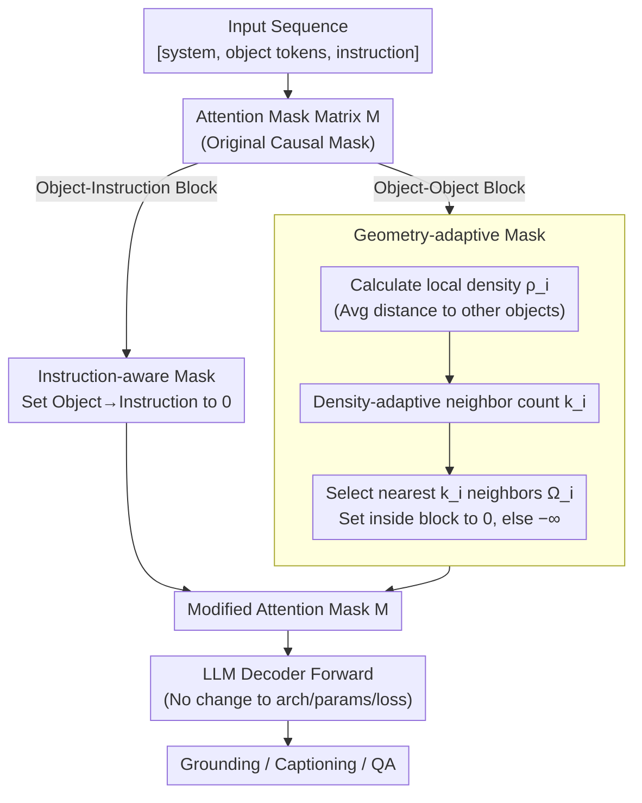

# Masking Matters: Unlocking the Spatial Reasoning Capabilities of LLMs for 3D Scene-Language Understanding

**Conference**: CVPR 2026  
**arXiv**: [2512.02487](https://arxiv.org/abs/2512.02487)  
**Code**: [https://github.com/Jyerim/3D-SLIM](https://github.com/Jyerim/3D-SLIM)  
**Area**: 3D Vision / Scene Understanding  
**Keywords**: 3D Scene Understanding, Attention Mask, Spatial Reasoning, LLM Decoder, Object-Centric Representation

## TL;DR
This work identifies two fundamental conflicts (order bias and instruction isolation) between causal masks in LLM decoders and 3D scene understanding. It proposes the 3D-SLIM masking strategy (Geometry-adaptive Mask + Instruction-aware Mask) to replace the causal mask, achieving significant improvements across multiple 3D scene-language tasks without architectural modifications or additional parameters.

## Background & Motivation

1. **Background**: 3D scene-language understanding aims to jointly interpret 3D environments and natural language, serving as a foundation for robotic navigation and embodied agents. Recent Object-Centric 3D LLM frameworks (e.g., Chat-Scene) decompose 3D scenes into sets of object proposals, representing each object with identifier tokens and instance-level 3D/2D features for reasoning via LLMs.
2. **Limitations of Prior Work**: Progress has primarily focused on the input representation level (how to encode 3D scenes), while decoder architectures remain largely unexplored. Current methods directly inherit the causal mask of language models, which presents two fundamental conflicts.
3. **Key Challenge**: (a) **Order Bias**: The causal mask imposes sequential dependencies on tokens, yet objects in a 3D scene are inherently order-independent (organized by spatial relationships rather than input order). Forced sequential constraints cause models to learn spurious order correlations. (b) **Instruction Isolation**: The causal mask prevents object tokens from attending to instruction tokens located later in the sequence (due to the [system, objects, instruction] order), forcing the model to process the entire 3D scene before integrating user instructions, leading to inefficient reasoning paths.
4. **Goal**: (1) How to eliminate spurious sequential dependencies between objects? (2) How to make objects perceive instruction context during encoding? (3) Can this be solved through simple mask modifications rather than architectural redesign?
5. **Key Insight**: Approach the problem from the overlooked perspective of attention masks. Humans group objects by spatial proximity and focus on relevant areas based on linguistic instructions—encoding these two cognitive principles into attention masks.
6. **Core Idea**: Replace causal constraints between objects with a geometry-adaptive mask (modeling local relationships based on spatial density rather than token order) and use an instruction-aware mask to allow objects to directly attend to instruction tokens.

## Method

### Overall Architecture
This paper addresses the issue where object-centric 3D LLMs directly adopt the causal mask of language models, which is inherently incompatible with 3D scenes—treating unordered spatial objects as ordered token sequences and isolating objects from subsequent instructions. 3D-SLIM modifies only the attention mask without changing the architecture or adding parameters. While the input sequence remains [system tokens, object tokens, instruction tokens], the attention matrix $M$ is modified in two key blocks: the object-object block is replaced with a Geometry-adaptive Mask (Geo Mask), and the object-instruction block is replaced with an Instruction-aware Mask (Inst Mask).

### Key Designs

**1. Geometry-adaptive Mask (Geo Mask): Enabling spatial proximity-based attention**

The sequential dependency imposed by causal masks (where preceding objects cannot see subsequent ones) is pure noise for 3D scenes. However, simply removing it (Full Mask/Global Attention) may lead to performance drops because it treats all objects equally without providing structural signals. Geo Mask uses the actual spatial distribution of objects to determine attention. It first calculates the local density $\rho_i$ for each object $i$—higher density correlates with a smaller average distance to other objects:

$$\rho_i = \sqrt{3} - \frac{1}{N-1}\sum_{j \neq i} d_{ij}$$

Normalizing $\rho_i$ via min-max yields $\tilde{\rho}_i \in [0,1]$, which adaptively determines the number of neighbors each object can attend to:

$$k_i = \mathrm{round}\big((k_{max} - k_{min}) \cdot \tilde{\rho}_i + k_{min}\big)$$

The neighbor set $\Omega_i$ consists of the $k_i$ nearest objects. In the mask, entries for $j \in \Omega_i$ (including $j=i$) are set to 0, while others are set to $-\infty$. This accounts for uneven object density in 3D scenes, effectively constructing a geometry-aware scene graph within the attention layer without learning.

**2. Instruction-aware Mask (Inst Mask): Feeding instructions to objects during encoding**

Under a causal mask, object tokens precede instruction tokens and cannot perceive the user's query, forcing a "blind" encoding of the scene. Inst Mask modifies the mask matrix by setting all "Object $\to$ Instruction" entries to 0: $M_{ij}=0$ for $i \in \mathcal{O}$ (objects) and $j \in \mathcal{I}$ (instructions). This allows linguistic cues like "next to the table" to guide object representations during the encoding phase.

### Loss & Training
- pure mask modification; no new parameters/modules are introduced. Inherits the single cross-entropy loss from Chat-Scene covering grounding, captioning, and QA: $\mathcal{L} = -\sum_{l=1}^{m} \log P\big(Y_l \mid Y_{[1,\dots,l-1]}, X\big)$.
- LoRA fine-tuning with AdamW optimizer (weight decay 0.02).
- Chat-Scene: batch size 32, lr 5e-6; 3DGraphLLM: batch size 8, lr 2e-5.
- Geo Mask hyperparameters: $k_{min}=2, k_{max}=10$.
- NMS IoU threshold 0.9.

## Key Experimental Results

### Main Results
Integrating 3D-SLIM into the Chat-Scene (Vicuna-7B) framework:

| Task | Chat-Scene | Chat-Scene + 3D-SLIM | Gain |
|------|-----------|---------------------|------|
| ScanRefer Acc@0.25 | 55.5 | 59.6 | +4.1 |
| ScanRefer Acc@0.5 | 50.2 | 54.1 | +3.9 |
| Multi3DRef F1@0.25 | 57.1 | 63.7 | +6.6 |
| Multi3DRef F1@0.5 | 52.4 | 58.7 | +6.3 |
| Scan2Cap C@0.5 | 77.1 | 84.2 | +7.1 |
| ScanQA CIDEr | 87.7 | 94.0 | +6.3 |
| SQA3D EM | 54.6 | 55.5 | +0.9 |

### Ablation Study
Comparison of decoder mask strategies (Chat-Scene + Vicuna-7B):

| Strategy | ScanRefer@0.25 | Multi3DRef F1@0.25 | Scan2Cap C@0.5 | ScanQA C |
|------|---------------|-------------------|---------------|---------|
| Causal Mask (baseline) | 55.3 | 59.6 | 78.1 | 88.3 |
| Full Mask | 56.2 | 61.2 | 78.4 | 90.9 |
| Diagonal Mask (No interaction) | 56.4 | 60.5 | 78.6 | 92.9 |
| Fixed-N Mask (k=5) | 57.5 | 61.6 | 81.9 | 91.6 |
| **Geo Mask (Ours)** | **58.6** | **62.0** | **82.4** | **94.2** |

Component Ablation (Chat-Scene):

| Geo Mask | Inst Mask | ScanRefer@0.25 | Multi3DRef F1@0.25 | Scan2Cap C@0.5 |
|----------|----------|---------------|-------------------|---------------|
| ✗ | ✗ | 55.3 | 59.6 | 78.1 |
| ✓ | ✗ | 58.6 | 62.0 | 82.4 |
| ✗ | ✓ | 57.6 | 62.0 | 81.1 |
| ✓ | ✓ | 59.6 | 63.7 | 84.2 |

### Key Findings
- **Full Mask $\approx$ Diagonal Mask**: Simply removing the causal constraint performs similarly to prohibiting object interaction altogether, suggesting that expanded attention scope is useless without meaningful structural guidance.
- **Geo Mask > Fixed-N Mask**: Adaptive neighbor counts based on density outperform fixed neighbor counts due to non-uniform object distribution in 3D scenes.
- **Complementary Masks**: Geo Mask primarily improves spatial reasoning (grounding), while Inst Mask improves task understanding (captioning/QA).
- **Cross-LLM Generality**: Consistent gains observed across Vicuna-7B, Llama3-8B, Qwen2-7B, and Qwen3-8B.
- **Attention Visualization**: 3D-SLIM precisely attends to spatial relationships described in instructions (e.g., "next to the table beneath the tv"), whereas the baseline focuses only on isolated nouns.

## Highlights & Insights
- **Minimalist yet Effective**: Achieves a 3-7 point improvement across multiple tasks by modifying only the attention mask—no architectural changes, extra parameters, or additional losses.
- **Observation on Full vs. Diagonal Mask**: Reveals that the key to inter-object attention is the meaning of the structural guidance, not just the visibility.
- **Density-Adaptive Local Attention**: Implicitly constructs a dynamic geometric scene graph at the attention level that is entirely training-free.

## Limitations & Future Work
- Only validated on object-centric frameworks; not yet extended to point-based or video-based representations.
- Improvements on certain QA tasks (SQA3D) are modest (+0.9), likely because these tasks rely more on linguistic reasoning than spatial structure.
- $k_{min}$ and $k_{max}$ are manually set; learned adaptation could be explored.
- Inst Mask uses a binary switch; fine-grained weights based on instruction-object relevance could be introduced.

## Related Work & Insights
- **vs. Chat-Scene**: 3D-SLIM improves ScanRefer Acc@0.25 from 55.5 to 59.6 and Scan2Cap C@0.5 from 77.1 to 84.2 by only modifying the mask, highlighting the importance of decoder design.
- **vs. 3DGraphLLM**: While 3DGraphLLM explicitly models semantic relationships at the input level, 3D-SLIM implicitly models spatial relationships at the decoder level. Their combination yields further improvements.
- **vs. GPT4Scene-HDM**: Video-based models often excel at QA due to large-scale image-QA pre-training; as a decoder strategy, 3D-SLIM could complement stronger MLLM backbones.

## Rating
- Novelty: ⭐⭐⭐⭐⭐ Addresses fundamental conflicts through an overlooked perspective.
- Experimental Thoroughness: ⭐⭐⭐⭐⭐ Comprehensive benchmarks, multiple LLMs, and detailed ablations.
- Writing Quality: ⭐⭐⭐⭐⭐ Clear logical flow from observation to hypothesis to validation.

<!-- RELATED:START -->

## Related Papers

- [\[CVPR 2026\] I-Scene: 3D Instance Models are Implicit Generalizable Spatial Learners](i-scene_3d_instance_models_are_implicit_generalizable_spatial_learners.md)
- [\[CVPR 2026\] Learning Spatial-Temporal Consistency for 3D Semantic Scene Completion](learning_spatial-temporal_consistency_for_3d_semantic_scene_completion.md)
- [\[CVPR 2026\] FunFact: Building Probabilistic Functional 3D Scene Graphs via Factor-Graph Reasoning](funfact_building_probabilistic_functional_3d_scene_graphs_via_factor-graph_reaso.md)
- [\[CVPR 2026\] Consistent Instance Field for Dynamic Scene Understanding](consistent_instance_field_for_dynamic_scene_understanding.md)
- [\[CVPR 2026\] Curvature-Aware Captioning: Leveraging Geodesic Attention for 3D Scene Understanding](curvature-aware_captioning_leveraging_geodesic_attention_for_3d_scene_understand.md)

<!-- RELATED:END -->
