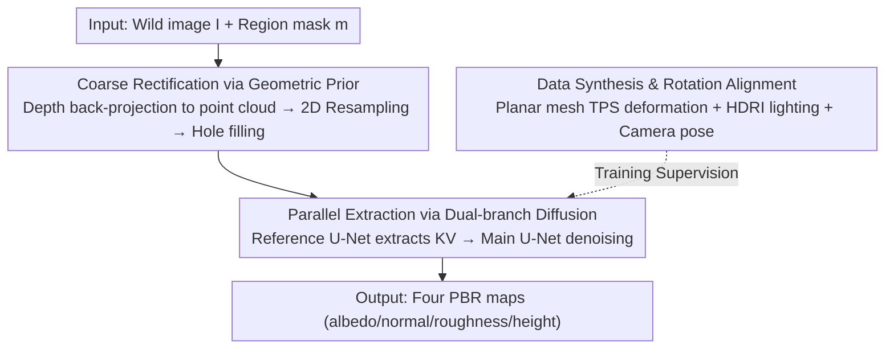

# MatE: Material Extraction from Single-Image via Geometric Prior

**Conference**: CVPR 2026  
**Paper**: [CVF Open Access](https://openaccess.thecvf.com/content/CVPR2026/html/Zhang_MatE_Material_Extraction_from_Single-Image_via_Geometric_Prior_CVPR_2026_paper.html)  
**Code**: https://tiptoehigherz.github.io/Material-Extraction/ (Project Page)  
**Area**: 3D Vision / PBR Materials / Inverse Rendering / Diffusion Models  
**Keywords**: PBR Material Extraction, Geometric Prior Rectification, Dual-branch Diffusion, Data Synthesis, Single-image Inverse Rendering

## TL;DR
MatE employs a coarse-to-fine framework with "coarse rectification via depth geometric prior + refinement via dual-branch diffusion" to extract four tileable PBR material maps (albedo / normal / roughness / height) in parallel from a specified region in a single real-world image. This approach overcomes the limitations of existing methods, such as viewpoint overfitting in LoRA-based methods and sequential error accumulation in video DiT-based methods.

## Background & Motivation
**Background**: High-fidelity PBR (Physically Based Rendering) materials are the cornerstone of modern graphics pipelines. However, acquiring these materials typically requires professional equipment and manual artistry, posing a high barrier to entry. Inferring material properties from a "wild" RGB image is an attractive but highly ill-posed problem, as image appearance is a complex entanglement of intrinsic material properties, geometry, and unknown environmental lighting, inherently leading to decomposition ambiguities.

**Limitations of Prior Work**: Since the rise of generative models, several single-image PBR extraction methods have emerged, but they exhibit structural flaws. Material Palette (Lopes et al.) uses DreamBooth + LoRA fine-tuning to learn regional texture semantics, but this instance-level adaptation "bakes" perspective distortion from the viewpoint directly into the recovered materials. MaterialPicker (Ma et al.) adapts a video DiT by treating the input image as the first frame and different material properties as subsequent frames. However, material properties are inherently **static** and do not evolve over time; imposing a temporal structure is a flawed premise that leads to **sequential dependency**, where small estimation errors in early attributes are amplified across frames, causing progressive degradation in material fidelity.

**Key Challenge**: The mapping from image to material must bridge three gaps: geometrically correcting perspective distortion, domain-shifting from image space to normalized material space, and preserving high-frequency spatial details. Training an end-to-end mapping to implicitly handle highly non-linear perspective distortion is extremely difficult.

**Goal**: Starting from a single wild image and a user-provided mask, reliably recover a full set of material maps while maintaining invariance to unknown lighting and perspective.

**Key Insight**: Rather than forcing a network to implicitly digest perspective distortion, the problem is **explicitly decomposed into two coarse-to-fine steps using a geometric prior**. A depth map is first used to coarsely rectify distortion, allowing the diffusion model to focus solely on residual distortion and cross-domain mapping.

**Core Idea**: Coarse rectification via geometric prior combined with parallel refinement via dual-branch diffusion, supported by a data synthesis pipeline that creates precise "view-material" pairs to bridge the synthetic-to-real domain gap.

## Method

### Overall Architecture
MatE takes an image $I$ and a target region mask $m$ (from user input or models like SAM) and outputs four PBR maps $\{\hat A,\hat N,\hat R,\hat H\}$ (albedo / normal / roughness / height). The pipeline is coarse-to-fine: a pre-trained depth model estimates depth, back-projects the image into a 3D point cloud, and resamples it back to 2D to obtain a **coarsely rectified** texture (resolving most perspective distortions). This is then fed into a dual-branch diffusion network where a Reference U-Net extracts conditional KV features from the masked input, and a Main U-Net performs denoising to parallelly predict the concatenated material latents. Training data is provided by a Blender-based synthesis pipeline, using camera pose alignment to ensure consistency between conditional images and canonical materials.

### Key Designs

**1. Coarse Rectification via Geometric Prior: Explicitly Decomposing Perspective Distortion**

Inverting perspective distortion end-to-end is difficult, so the authors introduce a geometric prior to downgrade it to a coarse-to-fine problem. Depth is obtained from the input image using a pre-trained depth estimation model $\mathcal{D}$. The image and mask are back-projected into a 3D point cloud and resampled into a 2D map. Back-projection follows the formula $u_c=\mathcal{N}\big((u_d-c_x)\tfrac{\mathcal{D}(u_d,v_d)+d_{\text{shift}}}{f_x}\big)s_x$ (similarly for $v_c$), where $(f_x,f_y),(c_x,c_y)$ are camera intrinsics, $\mathcal{N}$ normalizes the orthographic projection to $[0,1]$, and $s_x,s_y$ rescale to pixel coordinates. Since pre-trained depth is normalized $[0,1]$, values near 0 would cause the projection to collapse; a hyperparameter $d_{\text{shift}}$ ensures a minimum projection distance to avoid this singularity.

Back-projection is essentially splatting from a dense source grid to a sparse irregular point set. Rasterizing this to a target grid results in overlaps and **holes** (especially in regions of texture magnification or disocclusion). The authors use post-processing interpolation to fill hole pixels with the mean of valid pixels in a $k\times k$ neighborhood (Eq. 8), forming a dense representation for subsequent steps. This "coarse" rectification leaves complex non-linear distortions for the diffusion model to refine.

**2. Parallel Extraction via Dual-branch Diffusion: KV Injection for One-shot Prediction**

To address the sequential error accumulation in MaterialPicker, MatE predicts all material maps **in parallel**. The four maps are compressed into latents via a pre-trained VAE encoder $\mathcal{E}$ and concatenated along the channel dimension: $z_0=\mathcal{C}(z^a,z^n,z^r,z^h)\in\mathbb{R}^{b\times16\times h\times w}$. The denoising network $\epsilon_\theta$ predicts noise on the noisy latent $\tilde z_t=\sqrt{\bar\alpha_t}z_0+\sqrt{1-\bar\alpha_t}\epsilon$, conditioned on $z_c=\mathcal{E}(I\odot m)$. The diffusion loss is optimized as $\mathcal{L}_{\text{diff}}=\mathbb{E}_{\epsilon,t}\big[\|\epsilon-\epsilon_\theta(\tilde z_t;z_c,t)\|^2\big]$.

The network is a dual-branch U-Net: the Reference U-Net processes the masked input latent to extract conditional KV features, while the Main U-Net denoises the material latents guided by these injected KVs. The KV injection is formulated as $\text{Attn}(Q^*,K^R,V^R)=\text{Softmax}\big(\tfrac{Q^*(K^R)^T}{\sqrt d}\big)V^R$, where $Q^*$ is from the Main U-Net and $K^R,V^R$ are from the reference branch. Since the output dimension is independent of the KV sequence length, this is a **resolution-independent** mechanism. Multi-scale feature alignment is performed across U-Net levels, enabling the generation of materials at arbitrary resolutions from any reference resolution. Unlike the sequential MaterialPicker where an error in one attribute propagates, MatE's parallel architecture isolates modular errors (as shown in Fig. 7).

**3. Rotation Alignment Synthesis: Bridging Domain Gaps with Precise Pairing**

Ground truth $\{I, M\}$ pairs are unavailable in the real world, so the model is trained on large-scale synthetic data. The authors use Blender to approximate the image formation process without using complex 3D models like Objaverse (which introduce unphysical scale variations and structural breaks from UV discontinuities). Instead, they use **planar meshes** with Thin Plate Spline (TPS) deformations to introduce realistic surface geometry changes before mapping high-fidelity material UVs. Camera positions are sampled on a fixed-radius sphere, scenes are rendered with diverse Polyhaven HDRI lighting, and camera poses are recorded.

The critical "rotation alignment" involves applying a corresponding rotation to the canonical PBR material maps during training based on the recorded camera pose. The rotation angle $\alpha=\text{atan2}(y,x)$ is derived from the camera view vector $v=(x,y,z)$. This ensures training data is "view-dependent," so the model **does not need** to learn an unrealistic strong prior for "canonical material orientation." This synthetic strategy simplifies the inverse mapping and significantly improves the model's ability to bridge the synthetic-to-real gap. Materials are sourced from a PBR dataset with 5,879 instances.

### Loss & Training
The core training objective is the diffusion denoising loss $\mathcal{L}_{\text{diff}}$ (Eq. 6), supervised by rotation-aligned material ground truth on synthetic data. The VAE encoder is frozen, while both Reference and Main U-Net branches are trainable. The coarse rectification stage is training-free (pure geometric operations + interpolation), serving as a plug-and-play pre-processing step.

## Key Experimental Results

### Main Results
Evaluations were conducted on a synthetic set (717 Blender-rendered pairs) and a real-world set (226 pairs with manual masks). Metrics used were LPIPS↓, SSIM↑, and CLIP-Score↑ (averaging across attributes, as MSE/PSNR are sensitive to translation).

| Dataset | Attribute | Metric | Material Palette | MaterialPicker* | MatE (Ours) |
|--------|------|------|------------------|-----------------|------------|
| Real-World | Albedo | LPIPS↓ | 0.701 | 0.554 | **0.445** |
| Real-World | Normal | LPIPS↓ | 0.661 | 0.552 | **0.395** |
| Real-World | Roughness | LPIPS↓ | 0.581 | 0.455 | **0.342** |
| Real-World | Height | LPIPS↓ | — (missing) | 0.542 | **0.489** |
| Synthetic | Albedo | LPIPS↓ | 0.529 | 0.507 | **0.423** |
| Synthetic | Roughness | LPIPS↓ | 0.486 | 0.460 | **0.345** |

MatE leads significantly in perceptual and semantic metrics (LPIPS, CLIP-Score) while remaining competitive in SSIM. Material Palette does not predict height. `*` denotes the authors' re-implementation of the MaterialPicker framework.

### Ablation Study

| Configuration | LPIPS↓ | SSIM↑ | CLIP↑ | Description |
|------|--------|-------|-------|------|
| Ours w/o Rotation & w/o Rectification | 0.464 | 0.360 | 0.706 | Baseline |
| Ours + Rectification | 0.428 | 0.396 | 0.712 | Only Geometric prior |
| Ours + Rotation Alignment | 0.435 | 0.391 | 0.698 | Only data alignment |
| **Ours Full** | **0.418** | 0.377 | **0.723** | Complete model |

Conditioning mechanism ablation: CLIP injection yielded LPIPS 0.674 (lacks spatial detail), Concat 0.529, ControlNet 0.447, and **Ours (KV injection) 0.418**. The KV mechanism is optimal as it handles significant spatial misalignment between conditional and target maps, where Concat/ControlNet style induction fails.

### Key Findings
- **Rotation alignment and perspective rectification are complementary**: Adding either improves performance, while the full model achieves the lowest LPIPS.
- **Coarse rectification is plug-and-play**: When applied as a pre-processor to Material Palette, it substantially improves baseline performance and mitigates distortion, proving its utility as a general module.
- **Validation of Parallel vs. Sequential**: Feeding ground truth normals to MaterialPicker during sampling restored its roughness prediction accuracy. This proves that its degradation stems from imposed sequential dependencies rather than weak individual modules, highlighting the robustness of MatE's parallel architecture.

## Highlights & Insights
- **Degrading "learning inverse mapping" to "coarse rectification + diffusion residuals"** is the most ingenious aspect of this work. Using a training-free geometric back-projection to eliminate the most difficult non-linear perspective distortions allows the diffusion model to focus on domain translation and detail synthesis.
- **Diagnostic experimental design** (injecting GT normals to test roughness recovery) cleanly isolates "sequential dependency" as the root cause of prior work's failure rather than general model weakness.
- **Implicitly handling viewpoint via data**: Instead of forcing the network to learn a strong canonical prior (which is often unavailable), MatE incorporates viewpoint dependency into the training data, making the task more tractable—a data-side solution applicable to other inverse rendering tasks.

## Limitations & Future Work
- Authors acknowledge three limitations: ① For non-stationary textures with strong regular internal structures, coarse rectification might break structural integrity; ② Coarse rectification may be insufficient for highly complex geometry; ③ Performance fails on extreme specular/mirror surfaces.
- The method depends on the quality of pre-trained depth; inaccuracies in textureless or reflective regions will introduce errors into the rectification. Synthetic data using planar meshes + TPS may have limited coverage for real curved or layered materials.
- Future work: Transforming coarse rectification from a single back-projection into a differentiable, iterative process jointly optimized with diffusion; and introducing explicit specular modeling branches.

## Related Work & Insights
- **vs. Material Palette [Lopes et al.]**: They use DreamBooth+LoRA to learn texture concepts, but the LoRA adaptation bakes viewpoint distortion into the material, and their two-stage cascade leads to error accumulation. MatE uses geometric priors to de-distort and performs single-stage parallel extraction.
- **vs. MaterialPicker [Ma et al.]**: They adapt video DiT to generate attributes sequentially, imposing incorrect temporal dependencies. MatE predicts in parallel, isolating modular errors.
- **vs. Texture Rectification (Hao et al.)**: While both handle distorted textures, MatE explicitly incorporates depth geometric priors for full PBR material extraction rather than just texture completion.

## Rating
- Novelty: ⭐⭐⭐⭐
- Experimental Thoroughness: ⭐⭐⭐⭐
- Writing Quality: ⭐⭐⭐⭐
- Value: ⭐⭐⭐⭐

<!-- RELATED:START -->

## Related Papers

- [\[CVPR 2026\] Intrinsic Image Fusion for Multi-View 3D Material Reconstruction](intrinsic_image_fusion_for_multi-view_3d_material_reconstruction.md)
- [\[CVPR 2026\] Image-Guided Geometric Stylization of 3D Meshes](image-guided_geometric_stylization_of_3d_meshes.md)
- [\[ECCV 2024\] ZeST: Zero-Shot Material Transfer from a Single Image](../../ECCV2024/3d_vision/zest_zero-shot_material_transfer_from_a_single_image.md)
- [\[CVPR 2026\] Material Magic Wand: Material-Aware Grouping of 3D Parts in Untextured Meshes](material_magic_wand_material-aware_grouping_of_3d_parts_in_untextured_meshes.md)
- [\[CVPR 2026\] Human Interaction-Aware 3D Reconstruction from a Single Image](human_interaction-aware_3d_reconstruction_from_a_single_image.md)

<!-- RELATED:END -->
