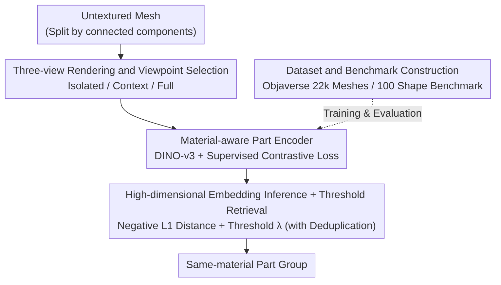

# Material Magic Wand: Material-Aware Grouping of 3D Parts in Untextured Meshes

**Conference**: CVPR 2026  
**Paper**: [CVF Open Access](https://openaccess.thecvf.com/content/CVPR2026/html/Jain_Material_Magic_Wand_Material-Aware_Grouping_of_3D_Parts_in_Untextured_CVPR_2026_paper.html)  
**Code**: Project Page https://umangi-jain.github.io/material-magic-wand (Code not explicitly open-sourced ⚠️)  
**Area**: 3D Vision  
**Keywords**: Material-aware grouping, 3D part retrieval, Contrastive learning, Untextured meshes, Interactive modeling

## TL;DR
Addressing the challenge where "repetitive but geometrically distinct components should share the same material" in untextured meshes, this work proposes Material Magic Wand. By utilizing a part encoder that learns material-aware embeddings, each 3D part is encoded into a vector. Clicking a single part allows for automatic selection of all parts with the same material via nearest neighbor retrieval. On a self-constructed benchmark of 100 shapes and 241 queries, it outperforms the strongest baseline by 8.6% in retrieval AUC and 16.6% in grouping F1.

## Background & Motivation
**Background**: Assigning materials to meshes is a routine and high-frequency operation in 3D modeling. A mesh created by an artist can typically be decomposed into many fine-grained parts based on "connected components." Many shapes contain numerous repetitive structural components—scales of a pine cone, windows of buildings or vehicles—which are similar in morphology but vary in scale and orientation, and usually share the same material.

**Limitations of Prior Work**: In current mainstream modeling tools, these repetitive components must be **manually selected one by one to assign materials**. The more repetitive parts and the more complex the mesh, the more tedious and time-consuming this task becomes. Existing research addresses related but fundamentally different problems: 3D part segmentation decomposes geometry into semantic parts (this paper assumes parts are already segmented); shape retrieval compares "global shapes" across a database rather than components within a single shape; symmetry detection relies on rigid/near-isometric correspondences and fails to capture "repetitive but significantly deformed" structures; material segmentation relies on textures/maps as cues, and approaches like fine-tuning SAM are limited by resolution for small parts.

**Key Challenge**: On one hand, "repetitive parts of the same material exhibit large geometric differences," rendering pure geometric descriptors (like histogram statistics) vulnerable to deformations. On the other hand, powerful image embeddings like DINO or SigLIP, while robust, **do not understand materials**—they cluster by visual appearance, grouping similar-looking but material-unrelated parts, or missing structurally related parts (e.g., casters). No off-the-shelf method or benchmark exists for "grouping pre-segmented parts based on material consistency."

**Goal**: Given an untextured mesh segmented into fine-grained parts and a query part, retrieve all parts within the shape likely to have the same material. The objective is to create an interactive tool similar to the Photoshop Magic Wand—click a part and adjust a threshold to control selection tightness.

**Key Insight**: Convert the "grouping" problem into "nearest neighbor retrieval in an embedding space." If each part can be embedded into a space that **encodes material similarity**, such that parts of the same material are close and different materials are distant, grouping simplifies to "retrieving embeddings closest to the query."

**Core Idea**: Train a material-aware part encoder using supervised contrastive loss to pull parts of the same material together and push those of different materials apart. During inference, retrieval is performed based on embedding distance and a threshold to obtain material-consistent part groups.

## Method

### Overall Architecture
The method solves the problem: "given a query part, retrieve all parts of the same material from the same mesh." The approach first renders each part into three different contextual images (isolated part / part-with-context / full object). These are fed into a part encoder initialized with DINO-v3 to obtain material-aware embeddings. The embedding space is shaped using supervised contrastive loss during training. During inference, nearest neighbor retrieval is performed on the query, with threshold $\lambda$ controlling the selection, directly producing the part group. The pipeline follows a sequential structure:

### Key Designs

**1. Three-view Rendering and Viewpoint Selection: Allowing 2D visual backbones to see local geometry and global context simultaneously**

Material judgment requires looking at both the local geometry of the part and its role in the whole (the materials of a "leaf" and a "stem" are often different, and may be indistinguishable in isolation). This work renders three images for each part $p_i$: an isolated part view $I^{part}_i$ (only the highlighted part is shown), a part-with-context view $I^{ctx}_i$ (full mesh shown but only the part is highlighted, camera distance adjusted such that the part occupies ~25% of the frame), and a full object view $I^{full}_i$ (full mesh rendered with the part highlighted). The viewpoint for $I^{ctx}_i$ is not random: 16 candidate camera positions are sampled on a hemisphere around the part, and the one with the **maximum visible area** is selected (following perceptual preferences for maximizing visible surface). If all candidates are heavily occluded, the camera is moved closer toward the part. $I^{part}_i$ reuses the $I^{ctx}_i$ viewpoint but zooms in; $I^{full}_i$ places the camera at the object center pointing toward the part's centroid. Since the target is untextured meshes, all materials and textures are removed before rendering. This setup allows the backbone to extract material cues from pure geometry and context without relying on color/maps.

**2. Material-aware Part Encoder + Supervised Contrastive Loss: Direct material encoding into the geometric structure of the embedding space**

Each of the three images passes through a foundation visual backbone $E$ (DINO-v3 small initialization, fine-tuning only the last three transformer blocks). Features are concatenated into an 1152-dimensional vector $x_i$, which then passes through a two-layer ReLU MLP projection head $f$ to obtain a 128-dimensional, $\ell_2$-normalized contrastive embedding $z_i = f(x_i)/\lVert f(x_i)\rVert_2$. The training objective is Supervised Contrastive Loss: for part $p_i$, define its positive set $P_i=\{j\mid j\neq i, y_j=y_i\}$ (other parts with the same material ID in the same mesh) and the contrastive set $A_i=\{j\mid j\neq i\}$ (all parts except itself), optimizing:

$$L = \mathbb{E}_S\,\mathbb{E}_i\,\mathbb{E}_{j\in P_i}\left[-\log\frac{\exp(z_i\cdot z_j/\tau)}{\sum_{a\in A_i}\exp(z_i\cdot z_a/\tau)}\right],$$

where $\tau$ is the temperature. This explicitly gathers embeddings of same-material parts and pushes away different ones. compared to "using off-the-shelf DINO/SigLIP for retrieval," the key difference is that the supervision signal is the **material label** rather than visual appearance, ensuring the space clusters by material rather than aesthetics.

**3. High-dimensional Embedding Inference + Threshold Retrieval: Adjustable grouping using uncompressed features and negative L1 distance**

An interesting finding is that inference **does not** use the compressed 128-dimensional $z_i$, but instead uses the concatenated 1152-dimensional $x_i$, which consistently performs better (see ablation). Similarity between two parts is defined as the negative $\ell_1$ distance of the embeddings $s(p_i,p_j)=-\lVert x_i-x_j\rVert_1$. Given query $p_i$, select $\{p_j\mid s(p_i,p_j)\le\lambda\}$. A larger $\lambda$ yields more selections (looser grouping), while a smaller $\lambda$ is stricter. This corresponds to the "Tolerance" in a Magic Wand tool. Additionally, **part deduplication** is introduced: meshes often contain identical repetitive parts modified only by rigid transformations. Histogram matching groups these, and one representative part per group is used to compute embeddings, saving computation and stabilizing results.

**4. Dataset and Benchmark Construction: Supervised from Objaverse, refined by human experts**

The task requires large-scale 3D data where each part has a material ID shared across multiple parts. Material3D/DreamMat only label materials at the **surface level** rather than the part level. This work selects 22,000 meshes with material assignments from Objaverse (~1.9 million parts). Since Objaverse lacks fine-grained segmentation, vertex merging followed by connected component extraction is used to obtain parts. Each part takes the majority material label on its faces as its ID. Due to extreme imbalance (e.g., 99% of materials used once), intra-mesh and inter-mesh data rebalancing strategies are applied. For evaluation, 100 meshes are **manually refined** in Blender to eliminate ambiguous Objaverse material assignments, resulting in a benchmark of 241 queries with clean ground-truth retrieval sets.

### Loss & Training
In practice, all parts in a training batch except $p_i$ are included in $A_i$ to stabilize training. An OpenGL renderer generates training data at 512×512 resolution. Adam optimizer, learning rate $1\times10^{-5}$, batch size 256, trained for 20,000 steps. Larger backbones showed only marginal gains.

## Key Experimental Results

### Main Results
Benchmark: 100 shapes / 241 queries, covering a wide span (median parts per mesh: 265, range 16–40,086; median group size: 20, range 2–32,267). Metrics are macro-averaged. **AUC PR** = Area Under the Precision-Recall Curve; **R-Prec** = Precision when retrieving the same number of items as the ground truth size; **F1** is calculated given the optimal threshold $\lambda$ for each method on a small validation set.

| Method | AUC PR | R-Prec | mAP | R@20 | F1 |
|------|--------|--------|-----|------|-----|
| Histogram Matching (Pure Geometry) | 26.85 | 25.45 | 30.71 | 15.97 | 23.84 |
| SigLIP-v2 | 62.83 | 56.02 | 60.58 | 40.72 | 39.44 |
| PartField (3D part segmentation emb.) | 75.30 | 67.74 | 70.52 | 47.92 | 56.57 |
| DINO-v3 small (Strongest Baseline) | 81.14 | 78.32 | 83.49 | 56.63 | 59.36 |
| **Ours** | **89.74** | **88.33** | **91.70** | **62.79** | **75.94** |

Compared to the strongest baseline DINO-v3 small, retrieval AUC increases by +8.6% and grouping F1 by +16.6%. Pure geometric Histogram Matching drops sharply as recall increases, showing that shape descriptors are fragile and only effective for near-duplicate parts. PartField is weaker because its training objective (hierarchical part segmentation) is not aligned with learning material-consistent embeddings.

### Ablation Study

| Configuration | AUC | R-Prec | mAP | R@20 | Description |
|------|-----|--------|-----|------|------|
| Full model | ~89.7 | ~88.3 | ~91.7 | ~62.8 | Complete model |
| w/o isolated part | 86.90 | 84.97 | 88.53 | 61.11 | Remove isolated view |
| w/o part-with-context | 87.30 | 85.37 | 88.91 | 61.09 | Remove context view |
| w/o full-object | 88.89 | 87.72 | 90.75 | 62.36 | Remove full view |
| Only isolated part | 86.18 | 81.88 | 85.88 | 59.87 | Isolated view only |
| Init from DINO-v2 L | 86.51 | 84.58 | 88.61 | 61.13 | Larger backbone init |
| Random init | 78.54 | 74.52 | 79.62 | 56.25 | No pre-trained backbone |
| Finetune last 5 blocks | 89.52 | 88.22 | 91.35 | 62.52 | Fine-tune more blocks |
| Retrieval with $z$ | 87.45 | 87.58 | 90.90 | 62.34 | Retrieval with 128D $z$ |
| w/o data rebalancing | 78.41 | 76.22 | — | — | No data rebalancing |

### Key Findings
- All three views are essential: Removing any view leads to a performance drop, with the isolated view being the most critical (AUC 89.7→86.9), followed by context/full views. "Only isolated part" drops further to 86.18, proving the value of global context in material judgment.
- **Pre-training and data rebalancing are the two pillars**: Random initialization causes AUC to plummet to 78.54, while removing data rebalancing similarly results in a drop to 78.41. These factors are more influential than backbone scale (switching to the larger DINO-v2 L slightly dropped performance to 86.51).
- Using the uncompressed 1152-dimensional $x$ for inference outperforms the 128-dimensional $z$ (89.7 vs 87.45), suggesting the projection head discards some material information useful for retrieval.

## Highlights & Insights
- Reformulating "grouping by material" as "nearest neighbor retrieval in embedding space" simplifies complex grouping into retrieval with an adjustable threshold, naturally supporting Photoshop-style hierarchical interaction.
- Leveraging pure geometry + contextual renderings with supervised contrastive loss learns "material awareness," bypassing the lack of color cues in untextured meshes. This demonstrates that material information is implicitly encoded in structure and context.
- The data paradigm of "automatically extracting part-level material supervision from Objaverse + manual purification for clean evaluation" is transferable to other part-level 3D tasks lacking annotations (e.g., style or functional grouping).

## Limitations & Future Work
- Strong dependency on valid initial part segmentation (connected components). If the mesh is too fragmented or coarse, grouping quality suffers—this paper does not solve the initial decomposition.
- Supervision originates from Objaverse material IDs, which contain significant noise requiring extensive rebalancing and manual cleaning. Materials can be ambiguous (artists might intentionally assign different materials to similar parts). The evaluation set (100 shapes) is relatively small.
- Future directions: Jointly learning part segmentation and material grouping; introducing finer material properties (roughness/metalness) instead of discrete IDs; expanding to larger-scale real-world asset libraries.

## Related Work & Insights
- **vs. 3D Part Segmentation (e.g., PartField)**: These methods segment geometry into semantic parts. This work assumes parts are pre-segmented and performs higher-level "material-aware grouping." Direct retrieval using PartField embeddings is significantly inferior due to misaligned training objectives.
- **vs. Shape Retrieval (global descriptor)**: These compare "global shapes" across libraries. This work compares part-level semantic similarity **within a single shape**, targeting a different scale.
- **vs. Material Segmentation (fine-tuned SAM + multi-view)**: These rely on textures/maps and are limited by view resolution/small parts. This work targets untextured meshes using part-level rendering and contrastive learning to circumvent these constraints.

## Rating
- Novelty: ⭐⭐⭐⭐⭐ First to propose "part-level material-aware grouping for untextured meshes" with a matching dataset/benchmark.
- Experimental Thoroughness: ⭐⭐⭐⭐ Solid benchmarks, multiple baselines, and detailed ablations, though the evaluation set scale is modest.
- Writing Quality: ⭐⭐⭐⭐ Clear motivation, intuitive Magic Wand analogy, well-defined formulas and rendering details.
- Value: ⭐⭐⭐⭐ Directly addresses a high-frequency bottleneck in modeling workflows with clear tool potential.

<!-- RELATED:START -->

## Related Papers

- [\[CVPR 2026\] MatSpray: Fusing 2D Material World Knowledge on 3D Geometry](matspray_fusing_2d_material_world_knowledge_on_3d_geometry.md)
- [\[CVPR 2026\] Intrinsic Image Fusion for Multi-View 3D Material Reconstruction](intrinsic_image_fusion_for_multi-view_3d_material_reconstruction.md)
- [\[CVPR 2026\] MatE: Material Extraction from Single-Image via Geometric Prior](mate_material_extraction_from_single-image_via_geometric_prior.md)
- [\[CVPR 2026\] H²A²: Homogeneity-Aware and Heterogeneity-Aware Feature Perception for Unified Indoor 3D Object Detection](h2a2_homogeneity-aware_and_heterogeneity-aware_feature_perception_for_unified_in.md)
- [\[CVPR 2026\] HAD: Hallucination-Aware Diffusion Priors for 3D Reconstruction](had_hallucination-aware_diffusion_priors_for_3d_reconstruction.md)

<!-- RELATED:END -->
