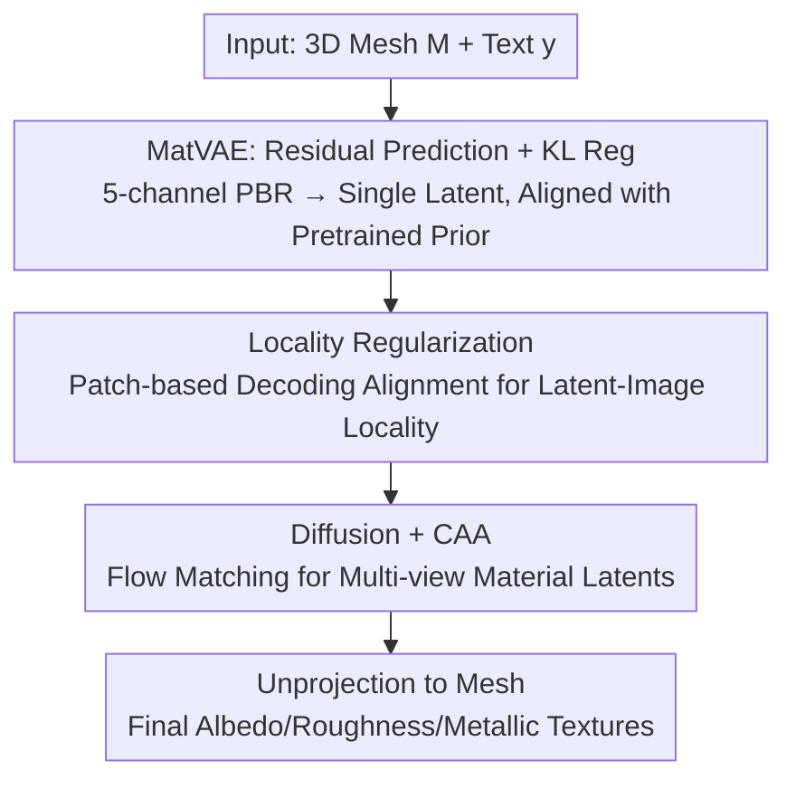

# MatLat: Material Latent Space for PBR Texture Generation

**Conference**: CVPR 2026  
**Paper**: [CVF Open Access](https://openaccess.thecvf.com/content/CVPR2026/html/Yeo_MatLat_Material_Latent_Space_for_PBR_Texture_Generation_CVPR_2026_paper.html)  
**Code**: https://matlat-proj.github.io (Project Page)  
**Area**: 3D Vision / PBR Texture Generation / Multi-view Diffusion / Latent Space Adaptation  
**Keywords**: PBR Texture Generation, Material Latent Space, VAE Fine-tuning, Correspondence-Aware Attention, Locality Regularization

## TL;DR
MatLat learns a "Material Latent Space" (MatVAE) by fine-tuning a pretrained VAE to accommodate five channels (albedo/roughness/metallic) while **minimizing deviation from the original latent distribution**. Combined with "Correspondence-Aware Attention + Locality Regularization" to ensure multi-view consistency, it generates high-quality, relightable PBR textures for given 3D meshes.

## Background & Motivation
**Background**: Production-grade 3D assets require PBR textures (albedo, roughness, metallic) to achieve physically accurate relighting under arbitrary illumination. The current state-of-the-art PBR texture generation paradigm involves using pretrained 2D diffusion models to generate multi-view material maps, which are then unprojected onto the mesh surface.

**Limitations of Prior Work**: This paradigm faces two critical challenges. ① **Non-trivial utilization of pretrained priors**: PBR textures include roughness/metallic channels beyond standard RGB. Directly feeding these into an RGB-trained encoder causes a **significant domain gap**. Prevailing methods (e.g., Frozen VAE in MaterialMVP) freeze the encoder and zero-pad extra channels, resulting in $z_{rm}$ (roughness/metallic latents) being Out-Of-Distribution (OOD), which hinders subsequent diffusion fine-tuning. Moreover, encoding albedo and roughness/metallic separately doubles inference costs. ② **Difficulty in ensuring multi-view consistency**: Inconsistencies between views lead to blurring and artifacts when unprojecting to overlapping regions on the mesh.

**Key Challenge**: The goal is to leverage strong pretrained diffusion priors while integrating additional material channels into the latent space without breaking said priors, all while maintaining pixel-space consistency across views. Frozen VAE fails to "preserve priors" (due to OOD latents), while Correspondence-Aware Attention (CAA) alone is insufficient for consistency unless the latent-to-image mapping maintains spatial locality.

**Goal**: Given a mesh $M$ and text prompt $y$, generate five-channel material maps across $N$ views to produce high-quality PBR textures.

**Key Insight**: Instead of freezing the encoder, **fine-tune** the pretrained VAE to absorb new channels while applying regularization to anchor it near the original latent distribution. Furthermore, recognize that "CAA only takes effect in pixel space if latent-image spatial locality is maintained," and explicitly introduce a locality regularization.

**Core Idea**: Learn a "Material Latent Space" (MatLat) using a VAE (MatVAE) fine-tuned with residual prediction and KL regularization, then propagate multi-view consistency from latent space to pixel space via CAA and locality regularization.

## Method

### Overall Architecture
MatLat is a two-stage pipeline. In the first stage, **MatVAE** is trained: PBR material maps (albedo $a$, roughness $r$, metallic $m$) are encoded into a **single** latent code aligned with the pretrained distribution. This is achieved via residual prediction (reusing the pretrained encoder for albedo as a base and adding a learnable residual encoder for rough/metal) and KL regularization. A locality regularization is added during fine-tuning to ensure latent-image spatial alignment. In the second stage, a **diffusion model** is trained: multi-view material latents are generated in the adapted MatVAE space using flow matching. CAA modules are inserted into attention blocks to share cross-view features via geometric correspondences. Finally, the generated maps are unprojected onto the mesh.

### Key Designs

**1. MatVAE with Residual Prediction + KL Regularization: Embedding 5 Channels without Breaking Priors**

To address the OOD latents and doubled inference costs of Frozen VAE (which zero-pads rough/metal), MatVAE employs a single latent with residual injection. Since albedo is semantically similar to RGB, the frozen pretrained encoder $\mathcal{E}_{pre}$ encodes albedo to get a base distribution $q(z_{base}|a)=\mathcal{N}(\mu_{base},\sigma_{base}^2)$. A learnable residual encoder $\mathcal{E}_{res}$ predicts residual parameters $(\mu_{res},\sigma_{res})=\mathcal{E}_{res}(x)$ to adjust the base: $z\sim\mathcal{N}\big(\mu_{base}+\mu_{res},\ \sigma_{base}^2\odot\sigma_{res}^2\big)$. The final convolutional layer of $\mathcal{E}_{res}$ is **zero-initialized**, ensuring the pretrained distribution is perfectly reproduced at the start of training before gradually adapting to new modalities.

To prevent representation drift, KL regularization constrains the "learned distribution" to remain near the "pretrained distribution": $\mathcal{L}_{reg}=\lambda_{reg}\cdot\text{KL}\big(q(z|x)\,\|\,q(z_{base}|a)\big)$. Compared to LayerDiffuse (mean prediction only with identity loss $\mathcal{L}_{id}$) and Orchid (direct prediction without zero-initialization), MatVAE balances initialization stability and distributional alignment.

**2. Correspondence-Aware Attention (CAA): Cross-view Feature Sharing via Geometry**

Standard multi-view attention allows tokens to attend to all views indiscriminately, lacking geometric priors and leading to slow convergence. CAA **restricts attention to geometrically corresponding tokens**: for pixel $u$ in view $c_i$, unprojection yields surface point $p_i^{(u)}=\Pi_i^{-1}(u)$, which is then projected to other visible views $c_j$ as $\phi_{i\to j}(u)=\Pi_j(p_i^{(u)})$. Attention is computed only over this correspondence set $\mathcal{C}(u)$: $\text{softmax}\big(Q_u K_{\mathcal{C}(u)}^T/\sqrt d\big)V_{\mathcal{C}(u)}$.

**3. Locality Regularization: Prerequisite for CAA Efficacy**

CAA performs feature exchange in latent space, but the goal is pixel-space consistency. This requires a spatial locality between latent tokens and image pixels. While pretrained encoders satisfy this, fine-tuning MatVAE might break it, causing CAA to pass information between geometrically unrelated tokens.

A locality regularization is introduced during MatVAE fine-tuning to enforce patch-level reconstruction alignment: $\mathcal{L}_{local}=\lambda_{local}\cdot d\big(\mathcal{T}(x),\ \mathcal{D}(\mathcal{T}(\mathcal{E}(x)))\big)$, where $\mathcal{T}$ is a random crop operator. This ensures each pixel is primarily reconstructed from its spatially aligned latent token. The final MatVAE loss is $\mathcal{L}_{\text{MatVAE}}=\mathcal{L}_{local}+\mathcal{L}_{KL}+\mathcal{L}_{disc}+\mathcal{L}_{reg}$.

### Loss & Training
The diffusion stage fine-tunes a flow matching (velocity) model $u_\theta$ on multi-view PBR latents. Following Conditional Flow Matching (CFM), the path between data latent $Z$ and Gaussian noise $\epsilon$ is $Z_t=(1-t)Z+t\epsilon$. The objective is: $\mathcal{L}_{\text{MatLat}}=\mathbb{E}_{t,Z,\epsilon}\|u_\theta(Z_t,t,y)-u_t\|^2$, where $u_t=\epsilon-Z$. The backbone is Stable Diffusion 3.5-Medium, trained on 40,723 PBR assets from Objaverse-XL with 26 fixed views per mesh.

## Key Experimental Results

The custom metric **c-PSNR** measures multi-view **consistency** by calculating the PSNR between each pixel $u$ and its corresponding point set $\mathcal{C}(u)$. Albedo and shaded images are evaluated using FID (CLIP space), KID, and CLIP similarity; roughness/metallic are evaluated via RMSE.

### Main Results

| Method | Type | Shaded FID↓ | Albedo FID↓ | Rough. RMSE↓ | Metal. RMSE↓ | Time↓ |
|------|------|-------------|-------------|--------------|--------------|-------|
| TexGaussian | From Scratch | 6.025 | 12.119 | 0.145 | 0.243 | 73s |
| DreamMat | SDS | 5.422 | 9.621 | 0.167 | 0.165 | 2400s |
| FlashTex | SDS | 7.119 | 12.320 | 0.143 | 0.186 | 285s |
| MaterialAnything | Multi-view | 6.582 | 12.691 | 0.233 | 0.200 | 500s |
| MaterialMVP | Multi-view | 6.309 | 9.630 | 0.175 | 0.133 | 35s |
| **MatLat (Ours)** | Multi-view | **3.083** | **4.599** | 0.158 | 0.134 | **34s** |

MatLat significantly outperforms baselines in shaded/albedo FID (~50% improvement over the second best) and achieves the highest CLIP alignment. Inference at 34s is significantly faster than SDS methods.

### Ablation Study

| Configuration | Shaded FID↓ | Albedo FID↓ | Rough. RMSE↓ | c-PSNR↑ | Time↓ |
|------|-------------|-------------|--------------|---------|-------|
| Frozen VAE [MaterialMVP] | 3.419 | 4.926 | 0.193 | 19.869 | 111s |
| Res. Pred. + $\mathcal{L}_{reg}$ (Ours) | **3.083** | **4.599** | 0.158 | 21.934 | 34s |
| Res. Pred. + $\mathcal{L}_{id}$ [LayerDiffuse] | 3.210 | 4.871 | 0.165 | 20.977 | 34s |
| Direct Pred. + $\mathcal{L}_{reg}$ [Orchid] | 3.192 | 4.768 | 0.161 | 21.468 | 34s |
| w/o $\mathcal{L}_{local}$ | 3.419 | 5.873 | 0.154 | 19.437 | 34s |
| w/o CAA | 3.110 | 4.732 | 0.155 | **18.687** | 38s |

### Key Findings
- **Quantification of Frozen VAE OOD Issues**: It performs worse across all FID and RMSE metrics compared to MatLat, proving that zero-padding causes OOD latents. MatLat is also **~3x faster** (34s vs 111s) due to the single-latent architecture.
- **Superior Encoder Fine-tuning**: MatLat's "Residual + KL" approach outperforms LayerDiffuse and Orchid, emphasizing the necessity of both zero-initialized stability and distribution alignment.
- **Synergy of CAA and Locality Reg**: Removing $\mathcal{L}_{local}$ while keeping CAA degrades performance as cross-view information is passed between unrelated regions. Removing CAA results in the lowest c-PSNR (18.687). The full model achieves the highest c-PSNR (21.934).

## Highlights & Insights
- **Dual Prior Preservation**: Prior preservation is split into two complementary mechanisms: zero-initialization for start-point stability and KL regularization for training-point drift prevention.
- **Identifying the "Hidden Premise" of CAA**: The authors explicitly identify and fix the requirement for latent-image locality to make CAA effective in pixel space.
- **Transferability**: The strategy of "fine-tuning VAE to absorb new modalities with locality regularization" is applicable beyond PBR to any task requiring additional channels (depth, normal, alpha).

## Limitations & Future Work
- Experimental settings across baselines are not strictly unified due to varying training schemes and datasets.
- Diversity is limited by the ~40k PBR assets in Objaverse-XL; certain material properties (anisotropy, subsurface scattering) are not well-covered.
- Current output lacks normal and height maps.

## Related Work & Insights
- **vs. MaterialMVP**: MVP uses frozen encoders and zero-padding which leads to OOD latents; MatLat fine-tunes for a single, aligned latent code.
- **vs. LayerDiffuse**: LayerDiffuse uses deterministic encoding with identity loss; MatLat performs distribution-level alignment with KL.
- **vs. Orchid**: Orchid uses direct prediction; MatLat uses residual prediction with zero-initialization for more stable optimization.

## Rating
- Novelty: ⭐⭐⭐⭐ 
- Experimental Thoroughness: ⭐⭐⭐⭐ 
- Writing Quality: ⭐⭐⭐⭐⭐ 
- Value: ⭐⭐⭐⭐ 

<!-- RELATED:START -->

## Related Papers

- [\[CVPR 2026\] NaTex: Seamless Texture Generation as Latent Color Diffusion](natex_seamless_texture_generation_as_latent_color_diffusion.md)
- [\[CVPR 2026\] TEXTRIX: Latent Attribute Grid for Native Texture Generation and Beyond](textrix_latent_attribute_grid_for_native_texture_generation_and_beyond.md)
- [\[ICLR 2026\] LumiTex: Towards High-Fidelity PBR Texture Generation with Illumination Context](../../ICLR2026/3d_vision/lumitex_towards_high-fidelity_pbr_texture_generation_with_illumination_context.md)
- [\[CVPR 2026\] 3D-LATTE: Latent Space 3D Editing from Textual Instructions](3d-latte_latent_space_3d_editing_from_textual_instructions.md)
- [\[CVPR 2026\] NI-Tex: Non-isometric Image-based Garment Texture Generation](ni-tex_non-isometric_image-based_garment_texture_generation.md)

<!-- RELATED:END -->
