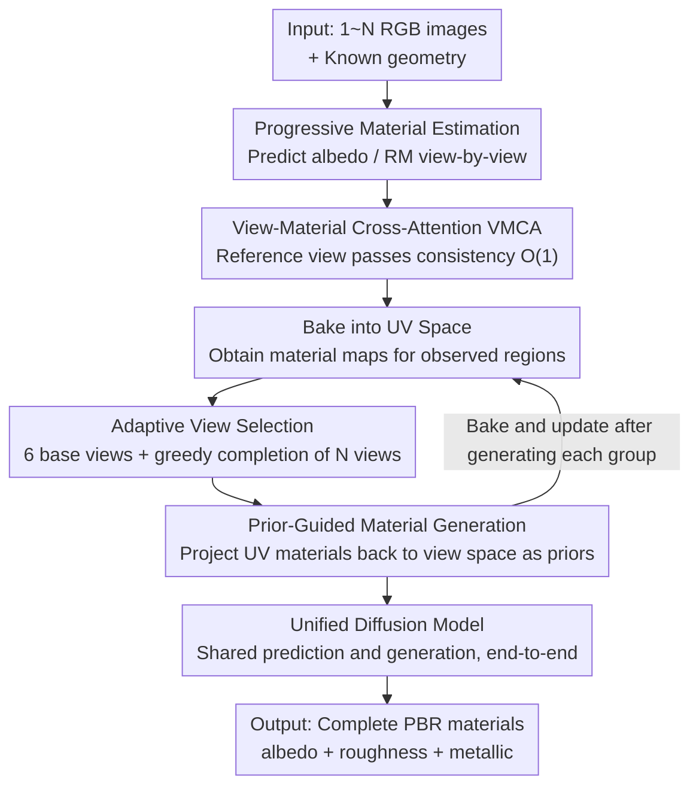

# MatMart: Material Reconstruction of 3D Objects via Diffusion

**Conference**: CVPR 2026  
**Paper**: [CVF Open Access](https://openaccess.thecvf.com/content/CVPR2026/html/Wu_MatMart_Material_Reconstruction_of_3D_Objects_via_Diffusion_CVPR_2026_paper.html)  
**Code**: None  
**Area**: 3D Vision  
**Keywords**: Material Reconstruction, PBR Materials, Diffusion Models, Inverse Rendering, Multi-view Consistency

## TL;DR
MatMart unifies "accurate PBR material prediction from input images" and "material generation for unobserved regions" into a single, end-to-end framework using a single diffusion model. Combined with progressive inference and View-Material Cross-Attention (VMCA), it achieves high-fidelity, scalable material reconstruction for any number of inputs at arbitrary resolutions.

## Background & Motivation
**Background**: Recovering PBR materials (albedo, roughness, metallic) of 3D objects from RGB images is a long-standing challenge in vision and graphics. Traditional approaches rely on differentiable rendering for per-object optimization, which requires capturing a large number of images, and is inefficient and unstable. Recently, methods have shifted towards directly predicting or generating material maps using diffusion models, offering new perspectives for inverse material decomposition.

**Limitations of Prior Work**: The authors point out three specific drawbacks in current diffusion-based frameworks. First, high-fidelity reconstruction requires both accurate material estimation and faithful preservation of details from input images; however, meaningful textures like text and logos are hard to reproduce using existing generative models. Second, practical applicability requires handling varying numbers of high-resolution inputs, but existing methods are often constrained by network designs and GPU memory—to maintain multi-view consistency, they often concatenate all views to perform cross-view attention, resulting in an $O(N^2)$ space complexity that becomes intractable with many views or high resolutions. Third, many approaches rely on auxiliary pre-trained models or chain multiple models together, which increases training/deployment complexity and reduces stability due to domain gaps between models.

**Key Challenge**: It is difficult to simultaneously satisfy fidelity (preserving input details), scalability (arbitrary views and high resolution), and stability (minimal dependence on external models); existing solutions often compromise one for another—either sacrificing scalability by concatenating all views for consistency, or sacrificing stability with multi-model pipelines.

**Goal**: Construct a high-fidelity, scalable, and stable material reconstruction framework that unifies material prediction and generation.

**Key Insight**: The authors observe that observed views should "predict materials as accurately as possible to preserve details," whereas unobserved/occluded regions require "generative completion." Since the outputs of both prediction and generation are PBR materials, they are inherently isomorphic and can share a single model. Furthermore, instead of feeding all views into the network at once, a progressive inference scheme can be adopted where consistency information is passed through a single reference view, reducing the complexity to a constant.

**Core Idea**: By using a two-stage pipeline of "prediction followed by generation" combined with progressive inference and VMCA, material prediction and generation are unified into a single diffusion model with end-to-end optimization, achieving both accuracy and stability under arbitrary input scales.

## Method

### Overall Architecture
MatMart aims to "reconstruct the complete PBR materials of a 3D object given one to multiple RGB images and the known geometry." It splits the task into two stages: in the **first stage**, it performs progressive material prediction (incorporating VMCA to ensure cross-view consistency) on all input images, baking the predicted results into the UV space. In the **second stage**, for the missing/unobserved regions on the UV map, it adaptively selects views for generation, projects the baked materials back into the view space as "material priors," and generates and completes the materials in the view space using the same diffusion model. The completed materials are baked and updated in groups iteratively until sufficient UV coverage is achieved. Both prediction and generation in these two stages are run on the same diffusion model, which is optimized jointly end-to-end.

### Key Designs

**1. Two-Stage Reconstruction: Precise Prediction to Keep Details, Followed by Prior-Guided Completion for Unobserved Regions**

To address the limitation that high fidelity requires both accurate estimation and detail preservation, purely generative methods (such as TEXGen, which generates directly in the UV space) often produce blurriness and artifacts (e.g., generating red ropes on a blue bag into a different color) due to weak semantics in the UV space. MatMart's approach separates "observed" and "unobserved" regions: the first stage performs material **prediction** only on the real input images to maximize the retention of texture details of the input, baking them into the UV space. The second stage then performs **generation** only on the hole regions of the UV map. Crucially, this generation occurs in the view space, which has richer semantics than the UV space, and projects the materials baked in the first stage back to the current view to serve as a "material prior" fed into the network. This ensures that the generation is tightly constrained by the known materials rather than being hallucinated from scratch, resulting in more consistent multi-view outputs. Ablation studies show that removing the first-stage baking and relying solely on generation (W/o stage1 baking) drops the albedo SSIM from 0.945 to 0.917 and degrades the render FID from 26.20 to 42.40, demonstrating that "prediction for foundation + generation for completion" is significantly superior to pure generation.

**2. View-Material Cross-Attention (VMCA): Reducing Cross-View Consistency Complexity from $O(N^2)$ to $O(1)$**

This is the core of scalability. To ensure multi-view consistency, traditional methods concatenate all views for cross-view attention, leading to an $O(N^2)$ complexity that runs out of memory when input view counts or resolutions are high. MatMart adapts this to **progressive inference**: processing only a few views per step, which would normally break information exchange between views. To restore consistency, an additional "reference view" (i.e., the prediction from the previous step) is introduced in each step. Hence, each inference takes two types of inputs: the target view (to be estimated) and the reference view (containing known material information). VMCA performs cross-attention on these two in the latent space:

$$\mathbf{Z} = \left(\operatorname{Softmax}\!\left(\frac{\mathbf{Q}_\mathrm{Tgt}\cdot \mathbf{K}_\mathrm{Tgt+Ref}^T}{\sqrt{d}}\right)\cdot \mathbf{V}_\mathrm{Tgt+Ref}\right) \oplus \mathbf{V}_\mathrm{Ref}$$

where the Query comes only from the target view, Key/Value are concatenated from target and reference views, and $\oplus$ denotes concatenation along the sequence dimension. The key design is that the reference view **should not be backward-contaminated by the target view**, so it does not participate in the Query but is directly outputted as $\mathbf{V}_\mathrm{Ref}$ in its original form. Since the number of target and reference views is fixed in each step and is independent of the total number of inputs $N$, VMCA maintains a space complexity of $O(1)$, enabling the model to handle arbitrarily many inputs and higher resolutions under limited GPU memory. In experiments, as the number of inputs increases from 1 to 20, the peak GPU memory remains stable at 24.03 GB.

**3. Adaptive View Selection + Grouped Generation with Alternating Baking: Covering Maximum Regions with Minimal Views and Always Using the Latest Priors**

To fill the holes in the UV map, the second stage must first determine "which views to generate from". MatMart first fixes 6 base views distributed along the coordinate axes (which carry the most information) and then greedily selects $N$ additional views: it uniformly samples 300 candidate views on a sphere and, in each step, selects the view that increases the UV texel coverage the most, until the coverage reaches the target $\rho=0.95$ or the number of views reaches $N=10$. After selection, the views are sorted based on their generation masks—views with fewer pixels to generate are processed first, allowing early generations to be guided by more sufficient priors. During generation, **alternating baking** is performed: once a group of views' materials is generated, it is immediately projected back to UV to update the maps. The update formula is:

$$\mathbf{T} \leftarrow \frac{\mathbf{T}'\cdot \mathbf{W}' + \mathbf{T}\cdot \mathbf{W}}{\mathbf{W}'+\mathbf{W}}, \quad \mathbf{W}'=\mathbf{S}'^{\lambda}, \quad \mathbf{W}\leftarrow \mathbf{W}'+\mathbf{W}$$

where $\mathbf{S}'$ is the cosine similarity between the surface normal and the inverse camera direction (used to weight down material contributions at grazing angles) and $\lambda=6$ controls its influence. This ensures that the next group always receives the latest "just updated" material priors. For efficiency, generation is processed in groups (experimentally set to group size 3), using the first-stage materials as reference views combined with VMCA to enhance inter-group consistency. Ablations show that removing material priors (W/o mat. priors) causes conflicts between generations from different views, leading to chaotic baked UVs and degrading render FID from 26.20 to 34.93.

**4. Unified Single Diffusion Model Architecture: Shared Weights for Prediction and Generation, Optimized End-to-End**

Many methods chain multiple models or pre-trained models (e.g., Material Anything uses a pre-trained diffusion model to generate RGB and then predicts materials), causing domain gaps and instability. MatMart leverages the shared characteristic that "both stages output PBR materials and utilize VMCA" to integrate prediction and generation into **the same** Stable Diffusion-based model. To align the input tensor shapes of both tasks, missing inputs are filled with zeros in the feature space—this zero-padding also acts as a task indicator, enabling the model to distinguish between "prediction" and "generation" tasks. Each attention block contains three types of attention: cross-component attention for exchanging information between albedo and roughness/metallic (RM), VMCA for consistency enhancement, and cross-attention using text prompts to control the output material type (albedo or roughness & metallic). During training, prediction and generation tasks are optimized alternately using the v-prediction target. By avoiding external pre-trained models, database/domain gaps and the resulting instabilities are eliminated at their source.

## Loss & Training
Training is conducted on 16 NVIDIA H20 GPUs, alternating optimization between prediction and generation tasks. Each iteration uses 2 target views + 1 reference view (where the reference view is set to ground-truth materials during training). In the generation task, depth-based warping is used to obtain material priors and generation masks for speed. Since the first view in progressive estimation has no reference view, "no-reference-view" prediction training is additionally incorporated. The model is trained on the IDArb dataset (containing ABO, G-Objaverse, Arb-Objaverse). It is first trained at $256\times256$ for 20K steps (batch size 16), and then at $512\times512$ for 50K steps (batch size 4), using the AdamW optimizer with a learning rate of $1\times10^{-4}$ and the v-prediction objective. Inference can be run on a single V100, leveraging Stable Diffusion's inherent high-resolution capability to directly output results at $1024^2$, taking about 9–23 minutes per object (depending on the number of selected views $N$).

## Key Experimental Results

### Main Results
The test set consists of a subset of 100 objects from Objaverse, each rendered under random environments at 9 views. The single-view setting uses 1 input image, and the multi-view setting uses 3 input images, with the rest used for evaluation. Metrics: scale-invariant PSNR/SSIM for albedo, MSE for roughness/metallic, and FID/LPIPS for rendered images.

| Setting | Method | Albedo SSIM↑ | Albedo PSNR↑ | Metallic MSE↓ | Roughness MSE↓ | Render FID↓ | Render LPIPS↓ |
|------|------|------|------|------|------|------|------|
| Single-view | Material Anything | 0.879 | 25.97 | 0.036 | 0.014 | 54.16 | 0.111 |
| Single-view | MaterialMVP | 0.901 | 27.57 | 0.026 | 0.013 | 38.27 | 0.089 |
| Single-view | **Ours (1024²)** | **0.931** | **29.89** | **0.017** | **0.007** | **31.49** | **0.066** |
| Multi-view | Material Anything | 0.897 | 27.19 | 0.038 | 0.013 | 47.27 | 0.099 |
| Multi-view | MaterialMVP | 0.902 | 27.61 | 0.026 | 0.013 | 38.00 | 0.088 |
| Multi-view | **Ours (1024²)** | **0.945** | **32.10** | **0.015** | **0.008** | **26.20** | **0.052** |

MatMart outperforms other methods in almost all metrics under both single-view and multi-view settings. The improvement is more pronounced in the multi-view setting (fully exploiting multi-view information), and increasing the resolution from 512 to 1024 further substantially improves each metric, validating the value of high-resolution inference for alignment. It also outperforms MaterialMVP and Material Anything on the real-world dataset StanfordORB (where the latter two often show artifacts on high speculation and cross-view seams).

### Ablation Study
Under the multi-view setting:

| Configuration | Albedo SSIM↑ | Albedo PSNR↑ | Render FID↓ | Render LPIPS↓ | Note |
|------|------|------|------|------|------|
| Ours (full) | **0.945** | **32.10** | **26.20** | **0.052** | Full Model |
| W/o VMCA | 0.941 | 31.78 | 28.58 | 0.055 | Remove View-Material Cross-Attention |
| W/o mat. priors | 0.929 | 29.85 | 34.93 | 0.071 | Generation without material priors |
| W/o stage1 baking | 0.917 | 28.14 | 42.40 | 0.091 | Skip stage 1 baking, purely generative |

### Key Findings
- **First-stage baking contributes the most**: Removing it degrades the FID metric the most (from 26.20 to 42.40), confirming that "prediction for foundation" is crucial for fidelity compared to "pure generation."
- **Material priors rank second**: Without them, cross-view generations become inconsistent, leading to chaotic UV baking and a degraded render FID of 34.93.
- **VMCA primarily guarantees consistency**: Removing it causes a minor drop in quantity metrics (FID 28.58), but qualitatively, objects like a barrel display severe cross-view inconsistencies in albedo/roughness.
- **Empirical proof of scalability**: As input views scale from 1 to 20, the FID drops from 37.39 to 27.71 and plateaus after 10 views (additional views mainly help highly self-occluded objects), while the peak GPU memory remains constant at 24.03 GB, showcasing scalability to any input sizes.

## Highlights & Insights
- **Unifying "Prediction + Generation" in a Single Diffusion Model**: Leveraging the isomorphic nature of PBR material output in both stages, the paper consolidates tasks that typically require a chain of multiple models into a single model trained end-to-end. Using zero-padding as a task indicator to differentiate between prediction and generation—this paradigm of "using a unified representation to support multi-tasking" is highly transferable.
- **VMCA Reduces Consistency Constraint Complexities from $O(N^2)$ to $O(1)$**: The core trick of keeping the reference view as Key/Value and never as Query prevents back-contamination of the reference view by target views, passing consistency while keeping reference features untouched. Any generation tasks needing progressive/streaming processing while maintaining multi-step consistency (e.g., video or long-sequence texture generation) can benefit from this approach.
- **Alternating Baking for "Always-Up-to-Date Priors"**: Updating the UV map immediately after generating each group ensures the next group utilizes the newest material priors, avoiding conflicts caused by generating all views at once. This is a very practical engineering paradigm for progressive completion.

## Limitations & Future Work
- The authors acknowledge that material decomposition inherently has ambiguities, which might lead to scaled colors in predicted albedos.
- Heavily self-occluded objects require more views to complete; under single or sparse views, the unobserved regions still heavily rely on the generation quality.
- *Our observation*: The inference takes 9–23 minutes per object, which is still relatively slow compared to pure feedforward prediction. The evaluation only uses 100 Objaverse objects + StanfordORB, which is a small scale, and coverage of extreme materials (transparency, anisotropy, subsurface scattering) is not fully validated.
- *Improvement ideas*: Explicit scale/lighting decoupling constraints can be introduced to alleviate albedo color scaling; or geometry completion priors can be combined for heavily self-occluded areas to reduce the number of required generation views.

## Related Work & Insights
- **vs Material Anything**: It uses a pre-trained diffusion model to generate RGB for selected views first, then predicts materials. MatMart reverses this by predicting materials of the input images first and then generating. Generating PBR materials is simpler than generating RGB images (since it does not require modeling reflections or illumination changes) and avoids relying on pre-trained models, preventing domain gaps between RGB generation and material prediction training data which typically downgrade prediction accuracy.
- **vs MaterialMVP**: It generates conditionally from fixed views, achieving visually pleasing results but failing to preserve input details (e.g., losing the logo on a blue bag). MatMart retains input texture details firmly via first-stage prediction and baking.
- **vs TEXGen**: It generates textures directly in the UV space, but the weak semantics of UV maps and limited resolution of generated UV maps often lead to blurriness and artifacts. MatMart generates in the view space with richer semantics before baking back to UV.
- **vs NvDiffRec (Inverse Rendering)**: It adopts per-object optimization, which struggles to decouple materials from lighting under sparse views and renders noisy results under new lighting. MatMart is a data-driven feedforward diffusion framework that delivers stable results even under sparse or single views.

## Rating
- Novelty: ⭐⭐⭐⭐ The combination of the two-stage unified pipeline and the $O(1)$ consistency constraint of VMCA is solid and clever representation engineering. Although the individual components are moderately novel, the engineering integration is highly cohesive.
- Experimental Thoroughness: ⭐⭐⭐⭐ Covers single/multi-view + real-world data + complete ablations + view count/GPU memory scalability, though the test set scale remains limited.
- Writing Quality: ⭐⭐⭐⭐ Clear logical flow in motivation-methodology-experiments, with comprehensive framework diagrams and mathematical formulations.
- Value: ⭐⭐⭐⭐ High fidelity + scalability to arbitrary views + single-model deployment, making it highly practical for 3D asset material creation.

<!-- RELATED:START -->

## Related Papers

- [\[CVPR 2026\] ICTPolarReal: A Polarized Reflection and Material Dataset of Real World Objects](ictpolarreal_a_polarized_reflection_and_material_dataset_of_real_world_objects.md)
- [\[CVPR 2026\] Intrinsic Image Fusion for Multi-View 3D Material Reconstruction](intrinsic_image_fusion_for_multi-view_3d_material_reconstruction.md)
- [\[CVPR 2026\] MatSpray: Fusing 2D Material World Knowledge on 3D Geometry](matspray_fusing_2d_material_world_knowledge_on_3d_geometry.md)
- [\[CVPR 2026\] Material Magic Wand: Material-Aware Grouping of 3D Parts in Untextured Meshes](material_magic_wand_material-aware_grouping_of_3d_parts_in_untextured_meshes.md)
- [\[CVPR 2026\] DuoMo: Dual Motion Diffusion for World-Space Human Reconstruction](duomo_dual_motion_diffusion_for_world-space_human_reconstruction.md)

<!-- RELATED:END -->
