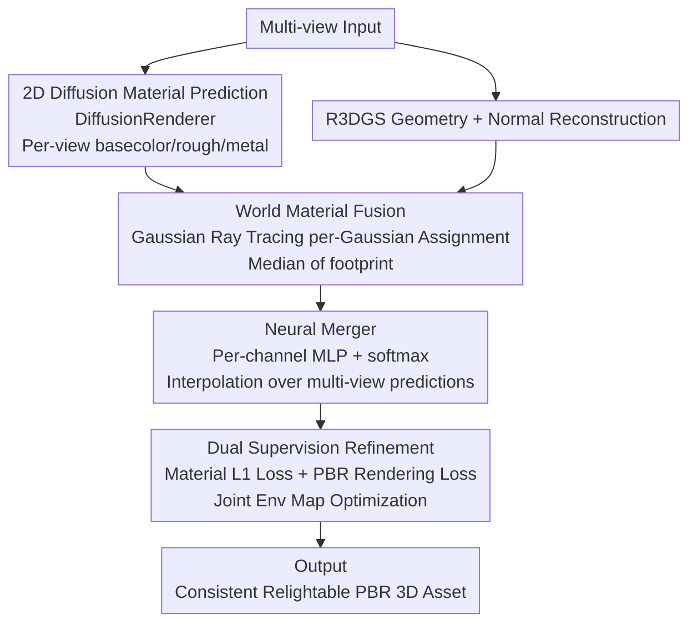

# MatSpray: Fusing 2D Material World Knowledge on 3D Geometry

**Conference**: CVPR 2026  
**Paper**: [CVF Open Access](https://openaccess.thecvf.com/content/CVPR2026/html/Langsteiner_MatSpray_Fusing_2D_Material_World_Knowledge_on_3D_Geometry_CVPR_2026_paper.html)  
**Code**: Project Page https://matspray.jdihlmann.com/  
**Area**: 3D Vision / Inverse Rendering / 3D Gaussian Splatting / Relighting  
**Keywords**: PBR Materials, Gaussian Ray Tracing, Multi-view Consistency, Neural Merger, Relighting

## TL;DR
MatSpray "sprays" PBR maps (basecolor/roughness/metallic) estimated per view by arbitrary 2D diffusion material predictors onto 3D Gaussian geometry via Gaussian ray tracing. It then uses a softmax neural merger for cross-view fusion combined with PBR rendering loss supervision, yielding de-lighted, multi-view consistent, and relightable 3D material assets with a reconstruction speed approximately 3.5× faster than IRGS.

## Background & Motivation

**Background**: Reconstructing editable and relightable photorealistic scenes from multi-view snapshots is a core requirement in vision and graphics. Modern neural 3D reconstruction (NeRF / Gaussian Splatting) produces high-quality geometry and appearance but often entangles lighting and appearance, resulting in textures/coefficients that are not "physically plausible" for relighting.

**Limitations of Prior Work**: The authors identify weaknesses in two existing approaches. ① Classical inverse rendering requires strong assumptions about lighting and exposure, making it fragile when materials vary spatially. ② Recent **2D material predictors** (diffusion priors) learn rich material priors from large-scale data and provide decent PBR maps from images, but they **work only in 2D**—they lack cross-view consistency and are not attached to any 3D representation. Transferring these 2D material maps to reconstructed 3D geometry remains a challenge.

**Key Challenge**: 2D diffusion material priors ("world material knowledge") are powerful but **calculated per-view and inconsistent with each other**. Directly projecting them to 3D results in blurred, grayish materials with residual baked lighting due to these inconsistencies. A mechanism is needed to preserve 2D priors while fusing them into a single, multi-view consistent 3D representation.

**Key Insight**: Instead of training expensive 3D PBR models, it is more effective to use 2D predictions as "raw materials." The key is **how to cleanly lift 2D to 3D and eliminate view conflicts**—using Gaussian ray tracing for efficient per-Gaussian assignment and a lightweight network to "interpolate between predicted values" (rather than generating new ones freely) to suppress inconsistency.

**Core Idea**: A plug-and-play framework that fuses replaceable 2D diffusion PBR priors with 3D Gaussian material optimization; a softmax neural merger performs weighted interpolation among multi-view predictions to suppress baked lighting and stabilize joint environment map optimization.

## Method

### Overall Architecture
MatSpray recovers consistent 3D PBR materials from multiple views through the following workflow: first, **any** 2D diffusion material predictor (DiffusionRenderer is used in practice) estimates basecolor/roughness/metallic maps for each view; simultaneously, Relightable 3D Gaussian Splatting (R3DGS) reconstructs geometry and normals. Next, **Gaussian ray tracing** "lifts" the 2D materials from each view to every Gaussian, obtaining a set of cross-view material estimates for each Gaussian. A **Neural Merger** (a small MLP with softmax for each material channel) fuses these conflicting estimates into a single consistent value. Finally, the system is iteratively refined under deferred shading using two supervision losses—material map L1 loss (alignment with 2D predictions) and PBR photometric rendering loss (alignment with multi-view ground truth)—while jointly optimizing a learnable environment map.

### Key Designs

**1. World Material Fusion: Lifting 2D PBR to 3D Gaussians via Gaussian Ray Tracing**

To address the issue that "2D material priors are not attached to 3D and direct projection is unreliable," the authors use Gaussian ray tracing to assign 2D materials from each view to corresponding Gaussians. Following Mai et al.'s approach of determining the contribution of each Gaussian/ellipsoid to a ray based on density, and adopting Moenne-Loccoz et al.'s formulation to make Gaussian Splatting opacity $\alpha$ directly usable for ray tracing: for a Gaussian with mean $\boldsymbol\mu$ and covariance $\boldsymbol\Sigma$, the maximum response point along a ray $(\mathbf{o},\mathbf{d})$ is $\tau_{\max}=\frac{(\boldsymbol\mu-\mathbf{o})^\top\boldsymbol\Sigma^{-1}\mathbf{d}}{\mathbf{d}^\top\boldsymbol\Sigma^{-1}\mathbf{d}}$, corresponding to the opacity $\alpha_{\max}=\alpha\cdot\exp(-\tfrac12\lambda(\mathbf{x}_{\max}-\boldsymbol\mu)^\top\boldsymbol\Sigma^{-1}(\mathbf{x}_{\max}-\boldsymbol\mu))$. Each Gaussian collects pixel materials within its projected footprint; to suppress outliers and color shifts from overlapping footprints, the **median** $\mathbf{m}_{g,v_i}=\mathrm{median}_{p\in\mathrm{fp}_{g,v_i}}(\mathbf{m}_p)$ is taken for each view. Gaussians not hit by any view are pruned. The elegance of this pipeline lies in its **plug-and-play** nature for 2D predictors (DiffusionRenderer was chosen as it achieved ~30% higher PSNR than Marigold or RGB↔X), avoiding dependency on expensive large-scale 3D PBR training data.

**2. Neural Merger: Softmax Interpolation Between Multi-view Predictions**

After lifting, each Gaussian $g$ has an array of cross-view material values (e.g., $\text{basecolor}_g=\{b_{g,1},\dots,b_{g,n}\}$), but these values conflict due to the per-batch drift of the 2D predictor. The core idea of the Neural Merger is to **only interpolate between existing predicted values rather than allowing the network to generate new colors**, preserving the world knowledge of the diffusion prior while enforcing consistency. For each Gaussian, the input consists of the material values $\mathbf{m}_{g,v}$ and the position-encoded $\mathbf{p}_g$. A lightweight MLP $f_\theta$ outputs unnormalized weights $[h_{g,1},\dots,h_{g,V}]$, which are normalized via softmax $w_{g,v}=\frac{\exp(h_{g,v})}{\sum_{v'}\exp(h_{g,v'})}$. The final material is the weighted sum $\mathbf{m}_g=\sum_v w_{g,v}\mathbf{m}_{g,v}$. The softmax is crucial: without it, the merger converges faster than the environment map optimization, producing materials that are numerically close to GT but unrealistic. Softmax encourages "collapsing" to a few input parameters, automatically excluding predictions that deviate from the GT, thus ensuring physical plausibility while allowing stable environment map convergence. The authors use **independent mergers for each material channel** to better decouple material properties.

**3. Dual Supervision Refinement: Material L1 + Deferred PBR Rendering Loss**

The per-Gaussian materials produced by the merger are rasterized into material maps and refined through two complementary supervisions. First is material supervision: the rendered material map is aligned with 2D diffusion predictions via $\mathcal{L}_{\text{Image}}=\|\mathbf{M}_{\text{render}}-\mathbf{M}_{\text{2D}}\|_1$, which **only acts on the merger** to preserve 2D priors and suppress baked lighting. Second is rendering supervision: a PBR image is rendered using deferred shading and image-based lighting, then aligned with multi-view ground truth (using mask maps to suppress floaters), $\mathcal{L}_{\text{3DGS}}=\lambda L_1(\mathbf{I}_{\text{PBR}},\mathbf{I}_{\text{GT}})+(1-\lambda)L_{\text{SSIM}}(\mathbf{I}_{\text{PBR}},\mathbf{I}_{\text{GT}})$ (typically $\lambda=0.8$). This supervises both the merger and the environment map estimation. This dual loss setup ensures the final rendering is faithful to the input views while correctly de-lighting the basecolor and maintaining cross-view consistency for roughness/metallic maps.

### Loss & Training
The geometry phase involves 30,000 iterations of 3D Gaussian optimization, followed by 10,000 iterations of material refinement. The Neural Merger uses independent MLPs for each channel (basecolor/roughness/metallic), consisting of 3 hidden layers with 128 neurons each + ReLU, with the final layer outputting per-view weights via softmax. For highly reflective objects, the authors use DiffusionRenderer's normals as RGB targets to train Gaussian geometry, guiding the geometry (as high-specular surfaces otherwise tend to create holes). All experiments were conducted on a single RTX 4090.

## Key Experimental Results

Evaluations were performed on synthesis and real-world data from the Navi series, comparing "Ext. R3DGS" (modified to support metallic materials) and IRGS. Metrics include **PSNR / SSIM / LPIPS** for material estimation (relative to predicted and GT maps) and relighting (relative to GT renders under new lighting).

### Main Results

17 synthetic objects (ARIA Dataset, with GT material maps):

| Task | Metric | **MatSpray** (Ours) | Ext. R3DGS | IRGS |
|------|------|--------------|------------|------|
| Relighting | PSNR↑ | **27.282** | 25.483 | 24.409 |
| Relighting | LPIPS↓ | **0.080** | 0.094 | 0.166 |
| BaseColor | PSNR↑ | **21.341** | 18.360 | 19.204 |
| Roughness | PSNR↑ | 15.331 | 14.473 | **16.182** |
| Metallic | PSNR↑ | ∞*/27.202 | 10.073 | N/A |

> *For non-metallic objects, the model correctly optimizes metallic values to 0. When all are 0, PSNR is infinity; these cases are excluded from practical statistics. IRGS cannot predict metallic maps.

Cross-dataset generalization (PSNR, vs. LightSwitch and Neural Gaffer):

| Method | ARIA | Stanford Orb | NeRF Syn. |
|------|------|--------------|-----------|
| LightSwitch | 16.3 | 23.4 | 17.7 |
| Neural Gaffer | 23.8 | 28.0 | 22.0 |
| Ext. R3DGS | 25.4 | 29.4 | 22.7 |
| IRGS | 24.4 | 30.2 | 23.5 |
| **MatSpray** | **27.3** | **31.2** | **25.4** |

### Ablation Study

| Configuration | PSNR↑ | SSIM↑ | LPIPS↓ | Description |
|------|-------|-------|--------|------|
| Full (with Neural Merger) | **29.164** | **0.9105** | **0.0626** | Complete model |
| Supervised (2D only) | 24.809 | 0.889 | 0.0792 | Worse than simple projection average |
| Proj. Average (Projection Mean) | 25.555 | 0.866 | 0.122 | Baseline initialization |

### Key Findings
- **Neural Merger is the primary performance driver**: The full model significantly outperforms variants across all metrics by compressing per-view drifts from DiffusionRenderer into a consistent representation.
- **2D-only supervision is sub-optimal**: The "Supervised" variant (without geometry/photometric optimization) performs worse than simple projection averaging, indicating that optimizing Gaussians to capture view-dependent effects is necessary.
- **Strength in Metallic/Specular surfaces**: The method correctly predicts metallic maps and optimizes non-metallic surfaces to zero, whereas IRGS cannot produce metallic maps and Ext. R3DGS results in over-bright/rough surfaces. While IRGS has slightly higher PSNR in Roughness, MatSpray achieves better SSIM/LPIPS.
- **Efficiency**: Approximately 3.5× reduction in per-scene optimization time compared to IRGS.

## Highlights & Insights
- **Plug-and-play**: The 2D material predictor is modular. The method is not tied to a specific diffusion model and automatically benefits from advancements in upstream 2D models.
- **"Interpolate, don't generate" philosophy**: The softmax merger forces weighting between existing predictions and excludes outliers, which is the key trick for preserving priors while stabilizing environment map optimization. This is transferable to other noisy multi-source fusion scenarios.
- **Independent per-channel mergers**: Decoupling basecolor, roughness, and metallic processing prevents cross-channel contamination.

## Limitations & Future Work
- Material quality is **highly dependent on the performance of the chosen 2D diffusion model**, though PBR-to-image loss can partially correct minor deviations.
- The method struggles when the underlying R3DGS produces inconsistent geometry or normals; very small or flat Gaussians are sometimes missed during ray tracing.
- Future directions include more robust geometric priors, remedies for missed Gaussians, and continuous upgrades alongside stronger 2D material models.

## Related Work & Insights
- **vs R3DGS / IRGS**: Both optimize material and geometry per scene. MatSpray instead lifts 2D diffusion estimates to 3D via ray tracing, leveraging diffusion priors for faster and more consistent reconstruction, including metallic maps which IRGS lacks.
- **vs DiffusionRenderer (2D Predictor)**: This is used as a replaceable upstream input. The Neural Merger fixes its per-view inconsistency—a problem even video-based material models struggle to solve.
- **vs LightSwitch / Neural Gaffer**: These methods perform relighting without explicit material production. MatSpray produces explicit relightable PBR assets and achieves higher PSNR across datasets.

## Rating
- Novelty: ⭐⭐⭐⭐ High. The combination of Gaussian ray tracing and softmax interpolation for lifting 2D priors is innovative.
- Experimental Thoroughness: ⭐⭐⭐⭐ Three datasets, multiple baselines, and key ablations, though some metrics cover only subsets.
- Writing Quality: ⭐⭐⭐⭐ Clean flow and solid motivation.
- Value: ⭐⭐⭐⭐ High practical value for content production pipelines by obtaining relightable assets without 3D PBR training.

<!-- RELATED:START -->

## Related Papers

- [\[CVPR 2026\] Unlocking 3D Affordance Segmentation with 2D Semantic Knowledge](unlocking_3d_affordance_segmentation_with_2d_semantic_knowledge.md)
- [\[CVPR 2026\] MatMart: Material Reconstruction of 3D Objects via Diffusion](matmart_material_reconstruction_of_3d_objects_via_diffusion.md)
- [\[CVPR 2026\] ICTPolarReal: A Polarized Reflection and Material Dataset of Real World Objects](ictpolarreal_a_polarized_reflection_and_material_dataset_of_real_world_objects.md)
- [\[CVPR 2026\] Beyond Geometry: Artistic Disparity Synthesis for Immersive 2D-to-3D](beyond_geometry_artistic_disparity_synthesis_for_immersive_2d-to-3d.md)
- [\[CVPR 2026\] Material Magic Wand: Material-Aware Grouping of 3D Parts in Untextured Meshes](material_magic_wand_material-aware_grouping_of_3d_parts_in_untextured_meshes.md)

<!-- RELATED:END -->
