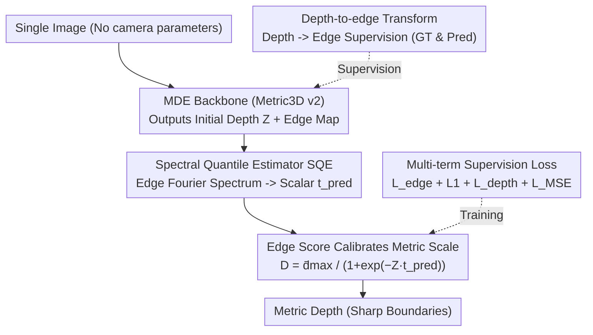

# MD2E: Modeling Depth-to-Edge Cues for Monocular Metric Depth Estimation

**Conference**: CVPR 2026  
**Paper**: [CVF Open Access](https://openaccess.thecvf.com/content/CVPR2026/html/Ning_MD2E_Modeling_Depth-to-Edge_Cues_for_Monocular_Metric_Depth_Estimation_CVPR_2026_paper.html)  
**Code**: Project Page https://2j472no.github.io/MD2E/ (Open source status unclear ⚠️)  
**Area**: 3D Vision  
**Keywords**: Monocular metric depth, Camera-intrinsic-free, Edge spectral cues, Frequency domain calibration, Zero-shot generalization

## TL;DR
Addressing the "unrecoverable scale in monocular metric depth when camera intrinsics are unavailable during both training and inference," this paper observes that while RGB remains nearly invariant when focal length and scene depth change couplingly, the **spectral statistics of edges shift systematically**. The authors propose the Spectral Quantile Estimator (SQE) to extract a scalar score as a scale proxy from the Fourier spectrum of predicted edge maps to calibrate depth. MD2E achieves SOTA in Monocular Metric Depth Estimation (MMDE) across 6 unseen benchmarks under zero-shot and fine-tuning settings (e.g., A.Rel decreased by 53.0% and RMS by 41.9% on iBIMS-1).

## Background & Motivation
**Background**: Monocular Depth Estimation (MDE) is fundamental for autonomous driving, AR, and SLAM. MiDaS utilized scale-and-shift invariant loss with heterogeneous data for strong zero-shot relative depth, followed by DPT and Depth Anything which pushed backbones and data scales further. However, relative depth only provides ordinal information and remains invariant under arbitrary monotonic transformations. The **undefined absolute scale** fails to meet the requirements of tasks needing metric values, such as 3D detection, digital twin reconstruction, and robotic grasping.

**Limitations of Prior Work**: Existing routes for recovering absolute scale rely heavily on camera intrinsics—Metric3D / Metric3D v2 use canonical camera normalization and intrinsic rescaling, but assume calibrated intrinsics during both training and inference. To remove this dependency, UniDepth / UniDepthV2 learn dense camera representations, and Depth Pro embeds a focal length prediction module; however, these either require camera labels for supervision or treat camera representation as an additional learning burden.

**Key Challenge**: When focal length and scene depth **change together**, the appearance of the same object in an RGB image remains almost unchanged (see Figure 1 in the paper: a chair is indistinguishable in RGB at $focal=20mm/depth=2m$ versus $focal=8.5mm/depth=1m$). Consequently, networks cannot extract scale from RGB—the fundamental difficulty of intrinsic-free MMDE. However, the authors observed an overlooked signal: **edge maps change systematically**, with edge thickness and spectral energy distribution across spatial frequencies shifting as a function of the focal-depth coupling.

**Goal**: Estimate metric depth from a single image without using any camera parameters during training or inference, while maintaining sharp boundaries.

**Key Insight**: Since scale information is hidden in the spectrum of edges rather than RGB appearance, one can explicitly model "depth-to-edge" cues and extract a scale-sensitive scalar from the edge spectrum to calibrate depth.

**Core Idea**: Transform dense depth labels into edge supervision to predict edge maps, then use the Spectral Quantile Estimator (SQE) to calculate a score $t_{pred}$ from the edge spectrum as a scale proxy for depth calibration. Simultaneously, edge prediction is used to regularize depth boundaries.

## Method

### Overall Architecture
MD2E uses Metric3D v2 as the MDE backbone but replaces its joint depth-normal optimization module with two convolutional prediction heads outputting an initial depth field $Z$ and an edge map $\mathcal{E}_{pred}$. The workflow: the input image passes through the MDE model to obtain edges and initial depth; dense depth labels undergo a "depth-to-edge" transformation to provide edge supervision; the predicted edge map is fed into the SQE to obtain the scale score $t_{pred}$, which calibrates the initial depth to the metric scale; meanwhile, the predicted edges constrain depth boundaries for sharpness. This is a multi-branch serial structure where "edges act as the intermediary and the spectrum acts as the scale ruler":

### Key Designs

**1. Depth-to-edge Transform: Generating clean edge supervision from depth labels to avoid high-frequency texture noise**

Using RGB edges directly as supervision introduces high-frequency texture noise, and depth labels in real datasets often have missing or discontinuous edges. This paper derives edges from **depth maps**: depth is first converted to inverse depth (emphasizing geometry discontinuities and being more consistent on planes), then symmetric finite differences are aggregated along horizontal, vertical, and $\pm45^\circ$ diagonal directions to obtain directional saliency $S(x)=\sum_{u\in\mathcal{K}}\lvert\gamma_u D^{-1}(x)\rvert$ (where $\gamma_u D^{-1}(x)=D^{-1}(x+u)-D^{-1}(x-u)$). A local softmax is applied in each $3\times3$ neighborhood to yield probabilistic contrast $P_x(y)$. Finally, edge intensity is calculated as "center weight minus neighborhood minimum" $E(x)=P_x(x)-\min_{y\in\mathcal{N}(x)}P_x(y)$, resulting in spatially adaptive high-contrast boundaries. GT depth is binarized using a global 0.9 quantile threshold; predicted depth uses a lightweight $1\times1$ convolution head aligned with binary labels, decoupled from the depth regression head to avoid affecting metric accuracy. This supervision is clean and avoids defects in GT depth boundaries.

**2. Spectral Quantile Estimator (SQE): Compressing "how focal/scene changes edges" into a differentiable scalar scale proxy**

This is the core contribution. Focal length changes cause the same structure to project onto different pixel spans, shifting edge thickness and energy distribution across spatial frequencies. Scene types (dense indoor edges vs. outdoor planes) also redistribute edge energy across radial frequencies. SQE summarizes these effects with a scalar: it first calculates the power spectrum $\Phi(f)=\lvert\mathcal{F}\{(w\odot\mathcal{E})-\mathrm{mean}(w\odot\mathcal{E})\}(f)\rvert^2$ with a learnable window $w$ (convex combination of a flat and a separable Hann window). A smooth radial high-pass filter $\Phi_h(f)=\Phi(f)\,(1-\exp(-(r(f)/r_0)^2))$ with a learnable cutoff $r_0$ suppresses low-frequency bias. High-pass spectra are aggregated into $K$ radial bins $R_k$ using Gaussian soft assignment, normalized and accumulated to get $C_k=\sum_{j\le k}p_j$. At a learnable quantile $p$, the quantile position $f_p$ is softly selected based on proximity to $C_k$ (controlled by $\lambda$). Finally, $f_p$ is converted via a smooth lower-bounded inverse scale into a dimensionless score $t$, sensitive to high-frequency concentration and stable at small $f_p$. Intuitively: **thinner/sharper edges (high-frequency concentration, larger $f_p$) $\rightarrow$ smaller $t$; wider/lower-frequency edges $\rightarrow$ larger $t$**, providing a compact scale signal varying with focal length and scene layout.

**3. Edge Score Calibrating Metric Scale: Using $t_{pred}$ as sigmoid temperature to stretch relative depth to absolute depth**

Once $t_{pred}=\mathrm{SQE}(\mathcal{E}_{pred})$ is obtained, it directly modulates depth logits before metricization:

$$D_{pred}=\frac{\bar d_{\max}}{1+\exp(-\,Z\,t_{pred})},$$

where $\bar d_{\max}$ is a fixed maximum depth constant and $Z$ is the initial depth field. $t_{pred}$ acts as the "temperature/gain" of the sigmoid; higher values stretch the output toward larger scales, explicitly injecting "scale cues read from edge spectra" into metric depth. Correlation analysis verified $t_{pred}$'s physical meaning: fitting $\hat t_{pred}=-1.895(f_x/W)^{0.1}+0.013(d_{\max})^{0.5}+10.372$ yielded a Pearson correlation $P\approx0.698$, indicating $t_{pred}$ is jointly determined by normalized focal length $f_x/W$ and maximum scene depth $d_{\max}$—encoding both camera settings and scene scale.

**4. Multi-term Supervision Loss: Edge supervision + Score alignment + Metric depth + Edge sharpening**

Four collaborative losses: (1) $\mathcal{L}_{edge}$ uses class-balanced cross-entropy to handle foreground/background edge imbalance. (2) $\mathcal{L}_1=\lvert t_{pred}-t_{GT}\rvert$ enforces consistency between predicted and GT edge SQE scores. (3) $\mathcal{L}_{depth}$ is a scale-invariant logarithmic loss with a variance term. (4) $\mathcal{L}_{MSE}=\sum_o(\mathcal{E}_{pred}(o)-\mathcal{E}_D(o))^2$ ensures consistency between predicted edges and edges derived from predicted depth to counteract GT sparsity. Total loss: $\mathcal{L}=0.1\mathcal{L}_{edge}+\mathcal{L}_1+100\,\mathcal{L}_{depth}+\mathcal{L}_{MSE}$.

### Loss & Training
Backbone: Metric3D v2 pre-trained ViT-L with re-initialized DPT decoder. AdamW, batch size 16, base learning rate $1\times10^{-4}$ with encoder multiplier 0.01, polynomial decay over $10^6$ iterations. Training pool from Metric3D v2 sub-datasets (DDAD, Cityscapes, etc.) capped at 4M pairs; edge supervision used only Virtual KITTI and Hypersim (dense/reliable depth). Trained on 8×A100 for ~4 days.

## Key Experimental Results

### Main Results (Zero-shot, 6 unseen benchmarks)
Metrics: **A.Rel** (Absolute Relative Error, lower is better); **RMS** (Root Mean Square Error, lower is better). MD2E compared fairly with Metric3D v2 without camera parameters or normal supervision.

| Benchmark | Metric | MD2E | Metric3D v2 | UniDepthV2 | Depth Pro |
|------|------|------|-------------|------------|-----------|
| iBIMS-1 (Indoor) | A.Rel↓ / RMS↓ | **0.087 / 0.344** | 0.185 / 0.592 | 0.090 / 0.373 | 0.162 / 0.588 |
| NYUv2 (Indoor) | A.Rel↓ / RMS↓ | **0.057 / 0.212** | 0.063 / 0.251 | 0.076 / 0.269 | 0.111 / 0.378 |
| ETH3D (Outdoor) | A.Rel↓ / RMS↓ | 0.277 / **1.512** | 0.357 / 2.980 | 0.256 / 1.617 | 0.403 / 3.699 |
| KITTI (Outdoor) | A.Rel↓ / RMS↓ | **0.050 / 1.801** | 0.052 / 2.511 | 0.103 / 2.765 | 0.257 / 4.368 |
| DIODE Outdoor | A.Rel↓ / RMS↓ | **0.209 / 3.728** | 0.221 / 3.897 | 1.231 / 15.928 | 0.576 / 10.930 |

Compared to Metric3D v2: iBIMS-1 A.Rel decreased by 53.0% and RMS by 41.9%; ETH3D / KITTI RMS decreased by 49.3% / 28.3%. In comparison to UniDepthV2 which learns camera representations, the gap is significant outdoors (DIODE Outdoor A.Rel 0.209 vs 1.231). In-domain fine-tuning (NYUv2/KITTI) also shows leadership: compared to single-dataset SOTA IEBins, NYUv2 / KITTI A.Rel dropped by 49.4% / 30.0%.

### Ablation Study (1M samples / $10^5$ iterations, mean of 6 benchmarks)

| Variant | δ1↑ | A.Rel↓ | RMS↓ | Description |
|------|-----|--------|------|------|
| MD2E (Full) | 0.604 | 0.233 | 2.873 | Full Model |
| w/o SQE | 0.251 | 0.527 | 5.734 | Remove scale calibration -> Generalization collapses |
| w/o $\mathcal{L}_{edge}$ & $\mathcal{L}_{MSE}$ | 0.325 | 0.478 | 5.023 | Remove edge supervision |
| w/o $\mathcal{L}_1$ | 0.572 | 0.261 | 3.028 | No SQE score alignment |
| w/o $\mathcal{L}_{MSE}$ | 0.599 | 0.240 | 2.892 | No edge sharpening |

### Key Findings
- **SQE is the bottleneck**: Removing SQE (depth calibration) collapses zero-shot generalization; δ1 drops from 0.604 to 0.251 (-58%), while A.Rel and RMS surge. Without the scale proxy, intrinsic-free MMDE loses its scale anchor.
- **Edge supervision is nearly as vital**: Removing $\mathcal{L}_{edge}$ and $\mathcal{L}_{MSE}$ drops δ1 to 0.325, as SQE receives noisy features and fails to estimate spectral quantiles.
- $\mathcal{L}_1$ provides stable small gains, while $\mathcal{L}_{MSE}$ primarily affects boundary sharpness rather than overall metric accuracy.

## Highlights & Insights
- **"RGB is invariant but edge spectrum changes" is the most profound observation**: While others look for scale in RGB or camera parameters, the author finds a scale signal sensitive to both focal length and scene depth in the ignored edge frequency domain, bypassing intrinsic dependency.
- Implementing scale calibration as a **differentiable, learnable parameterized** SQE (window, cutoff, bin, quantile are all learnable) rather than manual rules, allowing for end-to-end training and clear physical interpretability ($P \approx 0.698$).
- Using "edges derived from depth" instead of "edges from RGB" for supervision avoids texture noise and boundary label missingness—a data cleaning strategy transferable to any dense prediction task requiring boundary supervision.

## Limitations & Future Work
- SQE assumes edge spectra reflect scale; in scenes with sparse edges, heavy blur, or strong texture interference, the quantile score may be unreliable. Robustness boundaries are not fully explored.
- Edge supervision relies on Virtual KITTI and Hypersim; adaptation to real sparse depth (e.g., LiDAR) relies only on indirect $\mathcal{L}_{MSE}$, leaving reliability on poor annotations questionable ⚠️.
- Performance when training from scratch without the Metric3D v2 pre-trained backbone is unknown. Future directions: extending SQE to temporal consistency in videos or fusing with lightweight camera representations.

## Related Work & Insights
- **vs. Metric3D / Metric3D v2**: They require intrinsics for normalization/rescaling; Ours requires no camera parameters, using edge spectral scores as a proxy, and outperforms them on most benchmarks.
- **vs. UniDepthV2**: It learns dense camera representations; Ours uses "edge spectrum" as a more direct scale cue, showing significant advantages in large outdoor scenes.
- **vs. Depth Pro**: It predicts focal length with camera supervision; Ours requires no camera labels. Depth Pro's patch-based inference limits global interaction, impacting metric accuracy compared to our global inference.
- **vs. Existing edge-guided MDE**: Previous works use RGB edges primarily for sharpening; this work is the first to use **depth-derived edges + spectral analysis** as a scale cue for zero-shot MMDE.

## Rating
- Novelty: ⭐⭐⭐⭐⭐ First use of edge spectrum as a scale proxy for intrinsic-free MMDE; unique observation and clever SQE design.
- Experimental Thoroughness: ⭐⭐⭐⭐ 6 zero-shot benchmarks + in-domain + ablation + correlation analysis is comprehensive, though lacks validation on poor annotation/video scenarios.
- Writing Quality: ⭐⭐⭐⭐ Clear motivation and derivations; Figure 1 is intuitive. SQE formulas are dense and require careful reading.
- Value: ⭐⭐⭐⭐⭐ High practical value for uncalibrated scenarios like SLAM/robotics by removing intrinsic dependency.

<!-- RELATED:START -->

## Related Papers

- [\[CVPR 2026\] UniDAC: Universal Metric Depth Estimation for Any Camera](unidac_universal_metric_depth_estimation_for_any_camera.md)
- [\[CVPR 2026\] Radar-Guided Polynomial Fitting for Metric Depth Estimation](radar-guided_polynomial_fitting_for_metric_depth_estimation.md)
- [\[CVPR 2026\] The Midas Touch for Metric Depth](the_midas_touch_for_metric_depth.md)
- [\[CVPR 2026\] Depth Hypothesis Guided Iterative Refinement for Event-Image Monocular Depth Estimation](depth_hypothesis_guided_iterative_refinement_for_event-image_monocular_depth_est.md)
- [\[CVPR 2026\] Seeing Depth Through Frequency and Motion: A Progressive Training Paradigm for Monocular Depth Estimation](seeing_depth_through_frequency_and_motion_a_progressive_training_paradigm_for_mo.md)

<!-- RELATED:END -->
## Related Papers

- [\[CVPR 2026\] UniDAC: Universal Metric Depth Estimation for Any Camera](unidac_universal_metric_depth_estimation_for_any_camera.md)
- [\[CVPR 2026\] Radar-Guided Polynomial Fitting for Metric Depth Estimation](radar-guided_polynomial_fitting_for_metric_depth_estimation.md)
- [\[CVPR 2026\] The Midas Touch for Metric Depth](the_midas_touch_for_metric_depth.md)
- [\[CVPR 2026\] Depth Hypothesis Guided Iterative Refinement for Event-Image Monocular Depth Estimation](depth_hypothesis_guided_iterative_refinement_for_event-image_monocular_depth_est.md)
- [\[CVPR 2026\] Seeing Depth Through Frequency and Motion: A Progressive Training Paradigm for Monocular Depth Estimation](seeing_depth_through_frequency_and_motion_a_progressive_training_paradigm_for_mo.md)

<!-- RELATED:END -->
