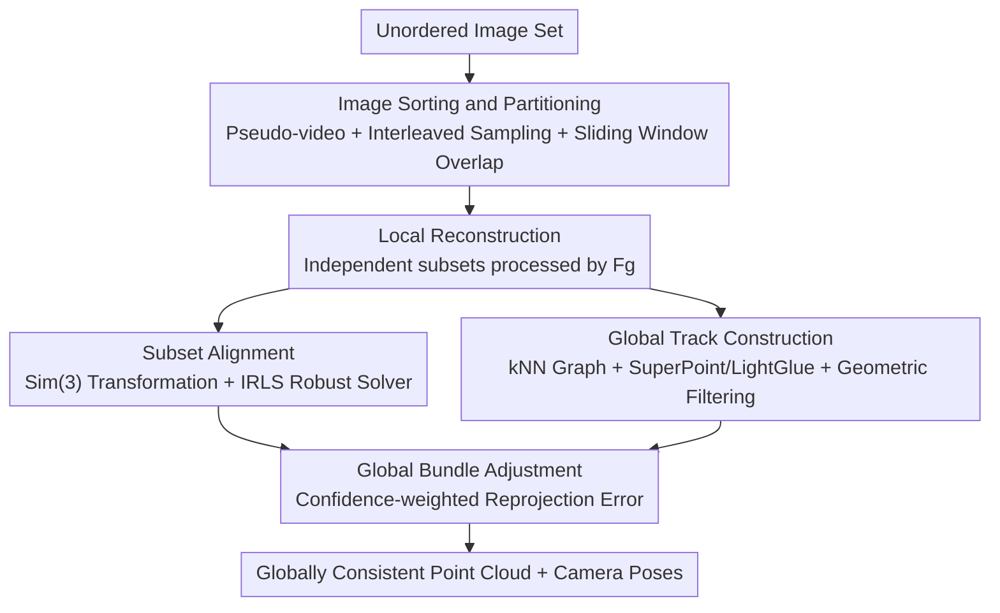

# MERG3R: A Divide-and-Conquer Approach to Large-Scale Neural Visual Geometry

**Conference**: CVPR 2026  
**Paper**: [CVF Open Access](https://openaccess.thecvf.com/content/CVPR2026/html/Cheng_MERG3R_A_Divide-and-Conquer_Approach_to_Large-Scale_Neural_Visual_Geometry_CVPR_2026_paper.html)  
**Code**: TBD  
**Area**: 3D Vision  
**Keywords**: Neural Visual Geometry, Large-scale Reconstruction, Divide-and-Conquer, Global Bundle Adjustment, Memory Scalability

## TL;DR
MERG3R is a **training-free** divide-and-conquer framework that sorts thousands of unordered images, partitions them into overlapping subsets for reconstruction using geometric foundation models such as VGGT or π³, and finally merges them into a globally consistent point cloud through global alignment and confidence-weighted bundle adjustment. This enables feed-forward reconstruction models, originally limited by VRAM, to handle image sets far exceeding their native capacity.

## Background & Motivation

**Background**: Feed-forward neural visual geometry models, represented by DUSt3R, MASt3R, VGGT, π³, and MapAnything, can directly predict camera poses and dense point clouds from a set of 2D images in an end-to-end manner. Their accuracy has surpassed traditional SfM + MVS pipelines, becoming a new mainstream approach.

**Limitations of Prior Work**: These models are mostly "monolithic Transformers" that must process all input images at once to perform global attention. The number of visual tokens grows linearly with the number of images, while the computation and memory of self-attention expand **quadratically**. Consequently, a few hundred images can exhaust VRAM, making city-scale modeling with thousands of images impossible.

**Key Challenge**: Existing improvements often force a choice between "memory scalability" and "geometric accuracy." One category (VGGT-Long, FastVGGT, Fast3R) reduces computational cost via tiling or token merging but disrupts long-range geometric reasoning, leading to significant degradation in pose/depth under wide viewpoint changes; moreover, FastVGGT/Fast3R still encode all images simultaneously, failing to truly overcome memory limits. Another category (CUT3R, TTT3R) achieves scalability through independent per-image prediction and multi-view fusion, but lacks global geometric representation, causing accuracy to drop rapidly as the number of images increases.

**Goal**: To develop a divide-and-conquer pipeline robust for **large-scale, unordered** image sets that breaks memory bottlenecks without sacrificing global geometric consistency.

**Key Insight**: The authors return to the "divide-and-conquer" strategy used by classical SfM for decades—partitioning by visual similarity and then merging via global alignment—and adapt it for neural geometric models. By keeping the models frozen and focusing on external image orchestration and geometric optimization, the framework is plug-and-play for any pre-trained geometric foundation model.

**Core Idea**: Convert unordered images into a **pseudo-video and split them into overlapping subsets** for block-wise reconstruction, then use **global bundle adjustment** to stitch these local reconstructions into a globally consistent model—trading VRAM scalability for the logic of "how to split and how to merge."

## Method

### Overall Architecture
MERG3R does not train any networks. The pipeline revolves around a geometric foundation model $F_g$ (which takes a set of images and outputs camera parameters $G$, depth/point maps $D$, and confidence $C$) and consists of four steps: ① Arrange unordered images into a "pseudo-video" and split them into overlapping subsets; ② Process each subset independently through $F_g$ to obtain local reconstructions; ③ Align adjacent subsets to a common reference frame and establish sparse multi-view tracks across subsets; ④ Perform a global bundle adjustment on these confidence-weighted tracks to jointly optimize all camera poses and 3D points. The key benefit: processing $N$ images with a monolithic model requires $O(N^2)$ attention, which is reduced to $O(KT^2)=O(N^2/K)$ after splitting into $K$ subsets of size $T$, reducing peak memory and allowing multi-GPU parallelism.

### Key Designs

**1. Two-step Image Orchestration: Pseudo-video Sorting + Interleaved Sampling**

If unordered images are split randomly, subsets may either have nearly identical viewpoints (unreliable local reconstruction) or no overlap between adjacent subsets (leading to stitching failure). The authors first compute a DINO visual similarity matrix $M\in\mathbb{R}^{N\times N}$ for all images. Treating this as a weighted complete graph, they solve for a **Hamiltonian path** that maximizes the sum of similarities between adjacent frames, resulting in a pseudo-temporal sequence $P^*=\arg\max_P\sum_{k=1}^{N-1}M_{p_k,p_{k+1}}$. Then, **interleaved sampling** is applied: the $i$-th element is taken as $\tilde P_i = P^*\{(i \bmod K)\cdot K + \lfloor i/K\rfloor\}$, ensuring each subset samples frames cyclically from the entire sequence to avoid subsets containing only highly redundant viewpoints. Finally, sliding windows of length $T$ and stride $T-O$ are used on $\tilde P$ to create subsets, guaranteeing $O$ frames of overlap for alignment constraints.

**2. Subset Alignment: Confidence-weighted Sim(3) Robust Transformation**

Independently reconstructed subsets exist in their own coordinate systems, and point maps in overlapping regions may not be identical. The authors adapt the weighted similarity transformation estimation: for adjacent subsets $S_k, S_{k+1}$, they identify corresponding 3D points $\{(p_k^i, p_{k+1}^i)\}$ and their confidence scores, filtering low-confidence points using a percentile threshold $\tau_{conf}$. They then solve for a $\mathrm{Sim}(3)$ transformation $T$ to minimize a robust Huber objective $T^*_{k,k+1}=\arg\min_{T}\sum_i \rho(\lVert p_k^i - T p_{k+1}^i\rVert_2)$ using **Iteratively Reweighted Least Squares (IRLS)**. The weight for each iteration is $w_i^{(t)} = c_i\,\rho'(r_i^{(t)})/r_i^{(t)}$, combining confidence $c_i$ and residual $r_i$, where points with large residuals are gradually downweighted. 

**3. Scalable Track Construction: Sparse kNN Matching + Geometric Consistency Filtering**

Global BA requires reliable correspondences across views, but naive brute-force matching has quadratic complexity. For each subset, the authors build a sparse kNN graph using the similarity matrix $M$. They extract SuperPoint features and match with LightGlue only for the retained edges $(i,j)$, keeping the number of matches **linear** $O(kN)$ relative to the number of images. To handle outliers from LightGlue, geometric consistency filtering is applied: matching points are back-projected into 3D using depth maps and re-projected onto the paired view; those exceeding a re-projection error $\tau_{reproj}$ are discarded. Remaining correspondences are merged into multi-view tracks $T_l$ using Union-Find.

**4. Efficient Global Bundle Adjustment: Confidence-weighted Reprojection Error**

Alignment only provides a rigid initialization. To refine global consistency, the authors perform global BA via gradient descent on the merged tracks, jointly optimizing camera parameters $R, t, K$ and 3D points $P$: $L_{BA}=\sum_{(T_l,x_l,C_l)\in T} C_l \sum_{y_{l,i}\in T_l}\lVert y_{l,i}-\pi_i(x_l)\rVert_2^{\lambda}$, where $\pi_i$ is the projection of the 3D point onto the $i$-th image, $\lambda=0.5$, and the track confidence $C_l$ serves as the weight. Unlike MASt3R-SfM, which optimizes over **image pairs**, MERG3R optimizes over tracks across all views, achieving better scalability and consistency for large datasets.

### Loss & Training
This method is **training-free**, introducing no learnable parameters. The pre-trained weights of the geometric foundation model $F_g$ (VGGT*/FastVGGT/π³) remain frozen. The "losses" in the pipeline are purely inference-time optimization objectives: the Huber objective for subset alignment (Eq. 3–5) and the confidence-weighted reprojection error for global BA (Eq. 8–9).

## Key Experimental Results

Evaluations were conducted on 7-Scenes, Tanks & Temples (T&T), Cambridge Landmarks, and NRGBD datasets using **full resolution and all images** on a single 64GB AMD MI210. MERG3R was compared against baselines such as VGGT*, π³, FastVGGT, VGGT-Long, MASt3R-SfM, CUT3R, and TTT3R (VGGT* refers to a VRAM-optimized VGGT).

### Main Results
Camera Pose on 7-Scenes (Large-scale unordered images):

| Method | 500 imgs RTA@30↑ | 500 imgs AUC@30↑ | 1000 imgs RTA@30↑ | 1000 imgs AUC@30↑ |
|------|------|------|------|------|
| VGGT* | 96.87 | 81.13 | OOM | OOM |
| π³ | 97.74 | 83.89 | OOM | OOM |
| FastVGGT | 96.75 | 80.59 | OOM | OOM |
| VGGT-Long | 97.24 | 79.51 | 95.54 | 75.11 |
| CUT3R | 40.16 | 38.82 | 30.50 | 14.11 |
| TTT3R | 86.55 | 57.44 | 53.69 | 30.95 |
| **Ours + π³** | 97.74 | 82.97 | **97.69** | **83.63** |

Key Finding: VGGT*/π³/FastVGGT suffer from **OOM** at 1000 images, while MERG3R using the same base models maintains stability and accuracy even as scale increases, fulfilling the "more images are better" promise.

Pose comparison on T&T / Cambridge Landmarks (Lower is better):

| Method | T&T ATE↓ | T&T RRE↓ | T&T RTE↓ | Cambridge ATE↓ |
|------|------|------|------|------|
| π³ | 0.090 | 0.229 | 0.025 | 1.630 |
| VGGT-Long | 0.585 | 0.768 | 0.057 | 0.970 |
| MASt3R-SfM | 0.202 | 0.521 | 0.024 | 7.695 |
| **Ours + π³** | **0.077** | **0.178** | **0.013** | 1.022 |

### Ablation Study
| Configuration | Observation | Description |
|------|------|------|
| Ground Truth Video Order vs Pseudo-video | ATE diff ≤ 0.001 | Pseudo-video generated from unordered images is as effective as real sequential video |
| Memory vs Image Count | Near constant | MERG3R memory remains stable while base models grow linearly/quadratically |
| Ours + 3 base models | Consistent improvement | The framework is plug-and-play for VGGT*/FastVGGT/π³, with π³ performing best |

### Key Findings
- **Partitioning Strategy is Critical**: The image clustering method directly affects local reconstruction and global alignment quality. Pseudo-video sorting + interleaved sampling ensures viewpoint diversity and subset overlap.
- **Constant Memory + Parallelism**: The divide-and-conquer approach reduces $O(N^2)$ to $O(N^2/K)$, making memory usage independent of total input size and allowing parallel subset processing.
- **Scalable Accuracy**: Unlike models whose performance collapses with more images, MERG3R maintains geometric consistency through its global bundle adjustment.

## Highlights & Insights
- **Training-free and Model-agnostic**: By focusing on external orchestration without touching network weights, any feed-forward geometric model can gain scalability.
- **Pseudo-video Intuition**: Using Hamiltonian paths to "serialize" unordered images into a pseudo-video allows the reuse of alignment techniques meant for ordered data, while interleaved sampling avoids the "local redundancy" trap.
- **Transferable Paradigm**: The "Unordered → Pseudo-ordered → Overlapping block partitioning" workflow can be applied to other memory-constrained feed-forward tasks like large-scale point cloud registration.

## Limitations & Future Work
- The pipeline involves multiple steps with several hyperparameter thresholds ($\tau_{conf}$, $\tau_{reproj}$, window size $T$, etc.); adaptive strategies for these parameters are currently missing.
- Final accuracy is still bounded by the underlying geometric foundation model.
- Reliability of cross-view matching depends on SuperPoint/LightGlue, which may struggle in textureless or highly repetitive environments.

## Related Work & Insights
- **vs VGGT / π³ (Monolithic Transformers)**: These provide high accuracy but are limited by $O(N^2)$ VRAM. MERG3R treats them as plug-and-play local reconstructors.
- **vs VGGT-Long / FastVGGT (Efficiency-focused)**: These reduce costs via token merging but often require ordered inputs or sacrifice quality. MERG3R handles unordered sets with constant memory.
- **vs CUT3R / TTT3R (Independent Views)**: These are scalable but lack global geometric coherence, leading to accuracy loss at scale; MERG3R corrects this via global BA.

## Rating
- Novelty: ⭐⭐⭐⭐
- Experimental Thoroughness: ⭐⭐⭐⭐⭐
- Writing Quality: ⭐⭐⭐⭐
- Value: ⭐⭐⭐⭐⭐

<!-- RELATED:START -->

## Related Papers

- [\[CVPR 2026\] CoLoR: The Devil is in Scene Coordinate Regression for Large-Scale Visual Localization](color_the_devil_is_in_scene_coordinate_regression_for_large-scale_visual_localiz.md)
- [\[CVPR 2026\] Fast Spatial Tracking with Visual Geometry Transformer](fast_spatial_tracking_with_visual_geometry_transformer.md)
- [\[CVPR 2026\] Ego-1K: A Large-Scale Multiview Video Dataset for Egocentric Vision](ego-1k_--_a_large-scale_multiview_video_dataset_for_egocentric_vision.md)
- [\[CVPR 2026\] LongStream: Long-Sequence Streaming Autoregressive Visual Geometry](longstream_long-sequence_streaming_autoregressive_visual_geometry.md)
- [\[CVPR 2026\] OLATverse: A Large-scale Real-world Object Dataset with Precise Lighting Control](olatverse_a_large-scale_real-world_object_dataset_with_precise_lighting_control.md)

<!-- RELATED:END -->
