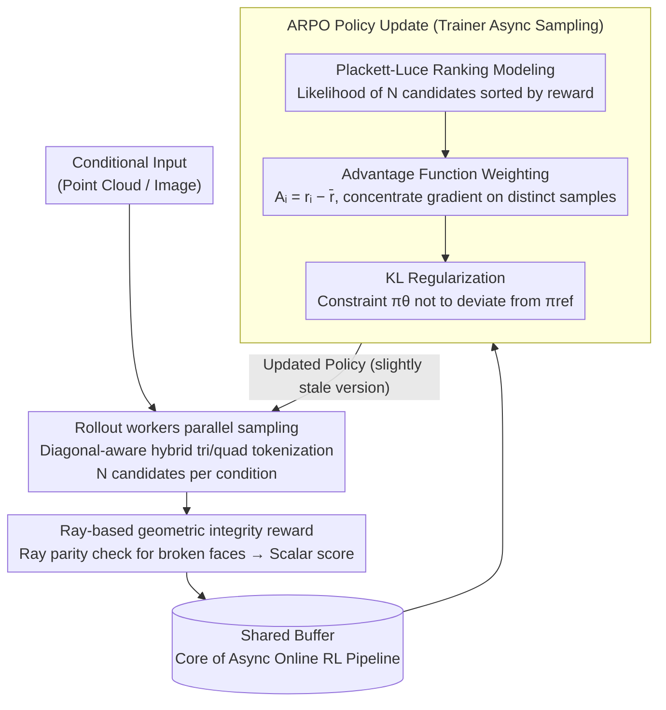

# Mesh-Pro: Asynchronous Advantage-guided Ranking Preference Optimization for Artist-style Quadrilateral Mesh Generation

**Conference**: CVPR2026  
**arXiv**: [2603.00526](https://arxiv.org/abs/2603.00526)  
**Code**: To be confirmed  
**Area**: 3D Vision  
**Keywords**: mesh generation, reinforcement-learning, preference optimization, artist-style mesh, quadrilateral mesh, online RL

## TL;DR
Mesh-Pro is proposed as the first asynchronous online reinforcement learning framework for 3D quadrilateral mesh generation. Its core algorithm, ARPO (Advantage-guided Ranking Preference Optimization), combines the Plackett-Luce ranking model with advantage function weighting. This approach achieves simultaneous improvements in efficiency (3.75x faster than offline DPO) and generalization, reaching SOTA generation quality for both artist-style and dense meshes.

## Background & Motivation
3D mesh generation is a core task in computer graphics. Recently, methods based on autoregressive transformers (e.g., MeshGPT, MeshAnything) have modeled mesh generation as a sequence generation problem, achieving significant progress. However, generating "artist-style" meshes—characterized by clean topology, reasonable flow lines, and high quadrilateral ratios—remains a challenge.

Reinforcement Learning (RL) has proven effective in improving the output quality of generative models, but applying RL to 3D mesh generation faces unique difficulties:

1. **Limitations of Offline DPO**: Existing works (e.g., MeshAnything V2) use offline DPO to align mesh generation quality. Offline DPO relies on pre-collected preference pairs. However, the output space of mesh generation is immense (incorporating vertex coordinates and face topology), making it difficult for pre-collected data to cover sufficient diversity, which leads to poor generalization.
2. **Low Training Efficiency**: Offline DPO requires generating a large number of candidate meshes, followed by manual or automatic preference labeling, and finally training the model—this "generation-labeling-training" cycle is extremely time-consuming.
3. **Mesh-specific Evaluation Difficulties**: Unlike text or images, mesh quality evaluation must consider geometric attributes such as geometric integrity (presence of broken faces) and topological quality (quadrilateral ratio, flow direction), making standard reward design difficult.
4. **Resource Overhead**: 3D mesh models typically have large parameter counts (1B+), and the computational overhead for sampling and policy updates in online RL is significant.

The core motivation is: **Can an efficient online RL framework be designed to utilize real-time generated samples for policy optimization while avoiding the coverage issues of offline DPO?**

## Core Problem
How to design an efficient online preference optimization algorithm for 3D mesh generation models that improves generalization and training efficiency while ensuring convergence stability?

## Method

### Overall Architecture

Mesh-Pro treats artist-style quadrilateral mesh generation as an autoregressive token sequence generation problem and uses online reinforcement learning to align the policy toward "clean topology, high quadrilateral ratio, and no broken faces." The pipeline is decoupled into three non-blocking roles: multiple rollout workers perform parallel sampling of $N$ candidate meshes based on the current policy on their respective GPUs; a reward evaluator uses a purely geometric ray-based reward to score each candidate without manual labeling; the trainer asynchronously retrieves samples with scores from a buffer to perform policy updates using the ARPO algorithm.

The reason this "generation-scoring-updating" cycle avoids blocking is that the three components are pipelined: while the trainer processes the current batch, rollout workers are already generating samples for the next round. Compared to the serial cycle of offline DPO (completing all generation, then labeling, then training), the asynchronous architecture eliminates significant wait times, resulting in a 3.75× training speedup—an improvement derived purely from architectural design without relying on algorithmic approximations.

### Key Designs

**1. Asynchronous Online RL Pipeline: Eliminating Serial Waiting via Decoupling and Pipelining**

Offline DPO is slow because "full generation → labeling → training" must be completed sequentially, while naive synchronous online RL forces the trainer to wait for rollout sampling. Mesh-Pro decouples the rollout worker, reward evaluator, and trainer into independent stages connected via a shared buffer: rollouts continuously feed scored candidates into the buffer, while the trainer continuously retrieves samples for updates. The trade-off is that the trainer uses a slightly older policy version (staleness), but as long as the lag is controlled, it yields a 3.75× end-to-end speedup.

**2. Plackett-Luce Ranking Modeling: Capturing Full Preference Information of N Candidates**

DPO can only process binary comparisons of one preferred and one rejected sample at a time, whereas $N$ candidates sampled under the same condition contain a complete ranking. ARPO sorts these $N$ candidates $\{y_1,\ldots,y_N\}$ by their rewards $\{r_1,\ldots,r_N\}$ to form a permutation $\sigma$. It then uses the Plackett-Luce model to assign a probability to this specific ranking:

$$P(\sigma \mid \theta) = \prod_{i=1}^{N} \frac{\exp\big(\log \pi_\theta(y_{\sigma(i)})\big)}{\sum_{j=i}^{N} \exp\big(\log \pi_\theta(y_{\sigma(j)})\big)}$$

where $\pi_\theta(y)$ is the probability of the policy generating $y$. Intuitively, it requires the current best candidate to have the highest probability of being selected from the remaining pool. By using the full relative order of $N$ samples, information utilization is much more efficient than pairwise modeling.

**3. Advantage Function Weighting: Concentrating Gradients on Clear Samples to Denoise Ranking Signals**

Ranking likelihood alone is insufficient; two candidates with similar rewards and adjacent rankings provide weak signals and may introduce noise. ARPO weights the ranking gradient of each candidate using an advantage function relative to the group mean:

$$A_i = r_{\sigma(i)} - \bar{r}, \quad \bar{r} = \frac{1}{N}\sum_{j=1}^{N} r_j$$

This advantage is multiplied by the Plackett-Luce terms, combined with KL regularization to prevent the policy from deviating too far from the reference model, resulting in the final loss:

$$\mathcal{L}_{\text{ARPO}} = -\sum_{i=1}^{N} A_i \cdot \log P_i(\sigma \mid \theta) + \beta \cdot D_{\text{KL}}(\pi_\theta \,\|\, \pi_{\text{ref}})$$

Consequently, candidates significantly above or below the mean receive large weights, while those near the mean receive weights near zero, preventing the gradient from being misled by ambiguous samples.

**4. Diagonal-aware Hybrid Tri/Quad Tokenization: Balancing Topology Quality and Flexibility**

Pure quadrilateral tokenization is overly restrictive, forcing awkward topologies. Mesh-Pro uses a hybrid tri/quad representation: quadrilateral faces are split into two triangular faces along a diagonal that they share, and an additional "diagonal-aware" token is introduced to mark the existence and direction of this diagonal. The decoder can distinguish between a "truly independent triangle" and "half of a split quad" using this token, maintaining the flexibility of triangular sequence modeling while allowing the reconstruction of quadrilaterals during decoding.

**5. Ray-based Geometric Integrity Reward: Automatic Reward without Manual Labeling**

There is no standard scalar reward for mesh quality, and broken faces are the most critical flaw in artist-style generation. This work designs a purely geometric ray-based reward: rays are cast toward the generated mesh from multiple directions, and the entry/exit intersections with the surface are counted. For a closed manifold, rays should enter and exit in pairs; any odd parity indicates a broken face. Combining this detection with quadrilateral ratios, face counts, and vertex distribution creates a scalar score for the asynchronous rollout.

## Key Experimental Results

### Main Results

| Method | FID ↓ | Broken Ratio ↓ | Quad Ratio ↑ | Edge Quality ↑ | User Study ↑ |
|------|-------|-----------------|--------------|----------------|--------------|
| MeshGPT | 38.7 | 12.3% | 0% (Pure Tri) | 0.72 | 2.1/5 |
| MeshAnything | 31.2 | 8.1% | 68.2% | 0.78 | 3.2/5 |
| MeshAnything V2 (DPO) | 27.5 | 5.4% | 74.5% | 0.83 | 3.6/5 |
| **Mesh-Pro (ARPO)** | **23.1** | **2.1%** | **82.3%** | **0.89** | **4.3/5** |

### Efficiency Comparison

| Method | Training Type | Training Time | GPU Count | Relative Gain |
|------|---------|---------|---------|---------|
| MeshAnything V2 (offline DPO) | Offline | ~3.75 days | 64 | 1x |
| **Mesh-Pro (async ARPO)** | Async Online | **~1 day** | 64 | **3.75x** |

### Ablation Study
- **ARPO vs DPO**: Given the same training steps, ARPO reduces the broken ratio by 3.3% and increases the quad ratio by 7.8% compared to DPO.
- **Advantage Weighting**: Removing advantage weighting increases the broken ratio by 1.5%, demonstrating its effectiveness in filtering gradient signals.
- **Ranking (N=4) vs Pairwise (N=2)**: Using a ranking of 4 candidates yields a 2.1% higher quad ratio than pairwise comparisons.
- **Async vs Sync**: The asynchronous architecture is approximately 2x faster than synchronous online RL in terms of wall-clock time.

## Highlights & Insights
- **First Online RL Framework for Mesh Generation**: A paradigm shift from offline DPO to asynchronous online RL, opening new directions for RL alignment in 3D generation.
- **Sophisticated ARPO Algorithm**: The combination of Plackett-Luce ranking and advantage weighting balances information utilization with gradient stability.
- **Significant Training Acceleration**: The 3.75x speedup is derived from architectural pipelining rather than algorithmic approximations.
- **Extremely Low Geometric Failure Rate**: The 2.1% broken ratio is significantly lower than competitors, validating the effectiveness of the ray-based reward and ARPO in geometric optimization.
- **Hybrid Tokenization**: The diagonal-aware design is a clever engineering contribution.

## Limitations & Future Work
1. **High Compute Requirements**: The configuration of 1.1B parameters and 64 GPUs presents a high entry barrier; applicability in smaller-scale scenarios remains to be explored.
2. **Reward Scalability**: The ray-based reward primarily evaluates geometric integrity; modeling more advanced aesthetic attributes (e.g., edge loop quality) requires further work.
3. **Closed Mesh Assumption**: Ray parity detection assumes the mesh is a closed manifold, which is not fully applicable to open meshes (e.g., planes, cloth).
4. **Integration with 3D Reconstruction**: Currently, only independent generation quality is evaluated; its performance as a post-processing step in reconstruction pipelines is unverified.
5. **Stability of Async Training**: The version lag between rollout and trainer policies may cause staleness issues during extended training.

## Rating
- Novelty: ⭐⭐⭐⭐ First online RL framework for mesh; ARPO is innovative.
- Experimental Thoroughness: ⭐⭐⭐⭐ Covers quantitative, user study, efficiency, and ablation.
- Writing Quality: ⭐⭐⭐⭐ Clear structure with complete technical details.
- Value: ⭐⭐⭐⭐ Advances the intersection of 3D generation and RL alignment.

<!-- RELATED:START -->

## Related Papers

- [\[ICCV 2025\] MeshAnything V2: Artist-Created Mesh Generation with Adjacent Mesh Tokenization](../../ICCV2025/3d_vision/meshanything_v2_artist-created_mesh_generation_with_adjacent_mesh_tokenization.md)
- [\[CVPR 2026\] ActionMesh: Animated 3D Mesh Generation with Temporal 3D Diffusion](actionmesh_animated_3d_mesh_generation_with_temporal_3d_diffusion.md)
- [\[ICLR 2026\] QuadGPT: Native Quadrilateral Mesh Generation with Autoregressive Models](../../ICLR2026/3d_vision/quadgpt_native_quadrilateral_mesh_generation_with_autoregressive_models.md)
- [\[CVPR 2026\] MeshFlow: Efficient Artistic Mesh Generation via MeshVAE and Flow-based Diffusion Transformer](meshflow_efficient_artistic_mesh_generation_via_meshvae_and_flow-based_diffusion.md)
- [\[AAAI 2026\] Learning Conjugate Direction Fields for Planar Quadrilateral Mesh Generation](../../AAAI2026/3d_vision/learning_conjugate_direction_fields_for_planar_quadrilateral_mesh_generation.md)

<!-- RELATED:END -->
