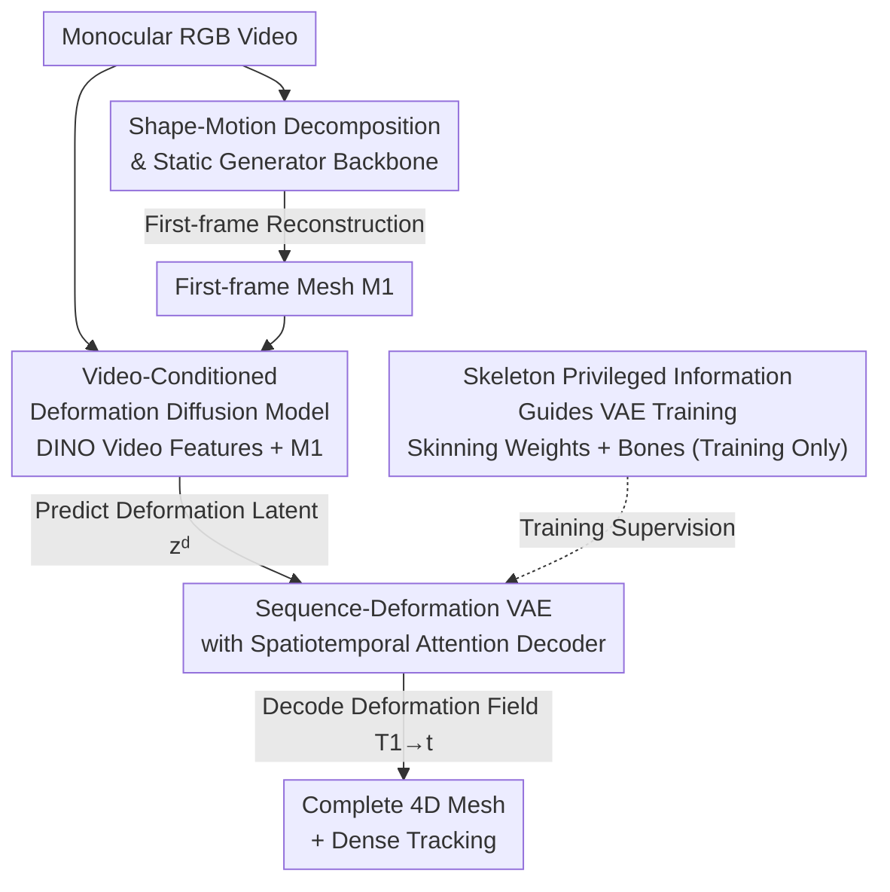

# Mesh4D: 4D Mesh Reconstruction and Tracking from Monocular Video

**Conference**: CVPR 2026  
**Paper**: [CVF Open Access](https://openaccess.thecvf.com/content/CVPR2026/html/Jiang_Mesh4D_4D_Mesh_Reconstruction_and_Tracking_from_Monocular_Video_CVPR_2026_paper.html)  
**Code**: mesh-4d.github.io (Project page, the paper notes that the code, models, and benchmark have been open-sourced)  
**Area**: 3D Vision  
**Keywords**: Monocular 4D Reconstruction, Mesh Deformation Field, Spatiotemporal Attention, Skeleton Prior, Latent Diffusion

## TL;DR
Mesh4D is a feed-forward monocular 4D mesh reconstruction model. It represents dynamic objects as "a first-frame static mesh + a deformation field spanning the entire video." It uses a VAE with spatiotemporal attention, supervised by skeleton information, to compress the entire deformation sequence into a compact latent representation. It then trains a latent diffusion model conditioned on the video and the first-frame mesh to predict this latent representation in a single forward pass, recovering the complete 3D shape, motion, and dense tracking. This approach outperforms prior SOTA on Objaverse reconstruction and novel view synthesis benchmarks.

## Background & Motivation

**Background**: Monocular 4D reconstruction aims to recover the 3D shape and motion of dynamic objects simultaneously from a standard RGB video, with applications in animation automation, graphics, and robotics. Traditional approaches rely on analysis-by-synthesis (per-scene fitting of NeRF or 3D Gaussian Splatting). Recently, feed-forward methods (e.g., DUSt3R/MonST3R series, Cut3R, Geo4D, 4DGT) have emerged, which can infer the geometry and inter-frame motion of dynamic scenes in a single forward pass.

**Limitations of Prior Work**: Optimization-based methods can only reconstruct the *visible* surface portions in the video, where occlusions and ambiguities introduce noise, and per-scene optimization is slow. Most feed-forward methods estimate motion only *between two frames* and reconstruct only visible points, failing to obtain the complete 4D structure of the object across the entire sequence. Another class of 3D-GS-based generative methods (e.g., L4GM, GVFD) aims to generate "plausible-looking novel view images," without truly prioritizing the accuracy of geometry and tracking, occasionally causing ghosting artifacts under large movements. Other methods (such as V2M4, ShapeGen4D) reconstruct meshes frame-by-frame independently and then perform temporal alignment, which lacks explicit motion modeling and struggles with cross-temporal texture consistency.

**Key Challenge**: Reconstructing and tracking *invisible* geometric parts in a video requires strong 3D and physical priors. Such priors can only be learned from data—which is precisely the strength of latent 3D generative models (which can "hallucinate" complete objects in static scenarios). The core question is: can these generative priors be extended to 4D while re-aligning the target from "rendering visually appealing images" to "reconstructing accurate shapes and motion"?

**Goal**: (1) Design a representation that can encode the full animation motion into a compact latent space; (2) Leverage the priors of static 3D generators to ensure generalization despite the scarcity of 4D training data; (3) Establish a benchmark that truly measures 3D geometric and motion quality, rather than focusing solely on rendered images.

**Key Insight**: The authors argue that motion should be *modeled holistically from the beginning to the end of the video*, rather than frame-by-frame or by stitching pair-wise frames. Concurrently, the object representation is *decomposed* into "a first-frame mesh + a deformation field" to decouple shape and motion.

**Core Idea**: Represent the 4D object using a "first-frame mesh $M_1$ + a deformation field $\{T_{1\to t}\}$ across the sequence." Compress the entire deformation sequence into a latent space using a skeleton-supervised, spatiotemporal attention VAE, and then generate this latent representation in one shot using a video-conditioned diffusion model.

## Method

### Overall Architecture

Given a monocular video $I=\{I_t\}_{t=1}^{T}$, Mesh4D outputs a first-frame 3D mesh $M_1=\langle V_1,F_1\rangle$ and a set of dense deformation fields $\{T_{1\to t}\}_{t=1}^{T}$, where $T_{1\to t}$ provides the displacement of all points on the mesh from time 1 to time $t$. Consequently, the mesh at any time $t$ can be expressed as $M_t=\langle V_1+T_{1\to t}(V_1),\,F_1\rangle$. This "shape + deformation" decomposition fixes the mesh topology and establishes native vertex correspondences, yielding dense tracking for free and ensuring cross-time texture consistency.

The entire pipeline consists of three cascaded components: First, an **off-the-shelf image-to-3D generator** (Hunyuan3D 2.1) reconstructs the static mesh $M_1$ from the first frame $I_1$ (acting as a scaffold, not a core contribution of this paper); second, a **deformation VAE** encodes the deformation of the entire mesh sequence into a compact latent space $z^d$, and decodes it back to vertex displacements; finally, a **deformation diffusion model**, conditioned on video $I$ and the first-frame mesh $M_1$, generates this $z^d$ in a feed-forward manner. During training, the VAE encoder leverages "privileged information" such as ground-truth mesh sequences and skeletons to learn the latent space; during inference, the encoder is discarded, and the diffusion model directly predicts $z^d$ from the video, which is then mapped to the deformation field by the VAE decoder.

### Key Designs

**1. Shape-Motion Decomposition and Static Generator Backbone: Focusing Invisible Geometry on Pre-trained 3D Priors**

Since monocular videos store limited information but require recovering invisible geometry, the authors split the problem into "obtaining the complete static shape of the first frame, and then overlaying the motion on top of it." Instead of learning from scratch, the first-frame mesh $M_1$ is obtained directly using Hunyuan3D 2.1, which is pre-trained on millions of 3D samples. Based on the VecSet representation, it first uniformly samples a point cloud $P$ (with normals $n$) from the mesh, encodes it into a shape latent $z^s=E_s(P;n)$, and then queries SDF values at mesh query points using the decoder $D_s(Q;z^s)$, which is converted into a triangular mesh via marching cubes. Texture is generated from the first frame using its texture generation model. Leveraging this static generator prior, the model can robustly generalize and "hallucinate" complete shapes for diverse object categories—a prerequisite for working under sparse 4D data. Compared to generating meshes frame-by-frame independently (e.g., V2M4, ShapeGen4D), this approach runs the backbone **only once** for the first frame, driving all subsequent frames with the deformation field so that motion is explicitly modeled rather than implicitly structured within a series of independent meshes.

**2. Sequence-Deformation VAE with Spatiotemporal Attention: Compressing Complete Motion into a Compact, Diffusable Latent Representation**

This is the core contribution of this work. Since the deformation field $T_{1\to t}$, like SDF, is an infinite-dimensional object, the authors employ a VAE to compress it into a compact latent space: the encoder $z^d\sim E_d(\{M_t\}_{t=1}^{T};n,w,b)$ processes the entire mesh sequence, and the decoder $T_{1\to t}(V_1)=D^d_t(V_1;z^d)$ recovers displacements at the vertices. The key is "jointly encoding the entire sequence": First, the first-frame point cloud $P_1$ is mapped via barycentric coordinates to other frames to obtain corresponding point clouds $\{P_t\}$ across all frames. Then, the corresponding points are concatenated and projected as $h_t=f_l(\mathrm{PE}(P_1)\oplus n_1\oplus \mathrm{PE}(P_t)\oplus n_t)$—since points correspond across time, this concatenation directly feeds the network with information on "how each point moves". Next, a transformer block sequentially applies **spatial attention** (within the same frame), **temporal attention** (same point across frames), and **global attention** (all tokens across all frames). A 1D RoPE positional encoding is added to the temporal and global attention to capture correlations along the entire trajectory. Because computing attention over all points and frames is prohibitively expensive, FPS (Farthest Point Sampling) is used to downsample the points, followed by cross-attention to obtain sparse latent tokens. After $L=8$ layers of alternating attention, the mean and variance of the frame-wise latent distribution are projected and sampled to obtain $z^d$. The decoder then applies 16 layers of spatiotemporal attention and performs cross-attention using the first-frame vertices $V_1$ as queries to recover the deformation field. The training loss is:

$$L_{VAE}=\sum_{t=1}^{T}\big\|(V_t-V_1)-D^d_t(V_1;z^d)\big\|_2^2+\lambda L_{KL},$$

which is the L2 reconstruction error of vertex displacements plus the KL divergence regularization on the latent space (computed on a random subset of vertices for efficiency). Jointly encoding the entire sequence is experimentally proven to be more stable and accurate than Motion2VecSet, which processes only two frames at a time.

**3. Skeleton Privileged Information-Guided VAE Training: Constraining Deformation Space via Skinning Weights and Bones**

Note that the encoder receives more information than the decoder outputs. While the decoder only outputs vertex displacements, the encoder additionally receives normals $n$, skinning weights $w\in\mathbb{R}^{M\times B_{\max}}$ ($B_{\max}=64$, set to zero if no skeleton weights are present), and bones $b$. This is "privileged information" used to learn a superior latent space during training, while being **entirely unnecessary** during inference (where the latent representation is generated from the video by the diffusion model). Skeletons are injected in two ways: First, by adding bias to the self-attention mechanism—constructing a mask $M^s$ based on skinning similarity. When the inner product of the skinning weights of two points exceeds $ww^\top>\epsilon_s$, attention is allowed; otherwise, it is set to $-\infty$:

$$\hat h_t=\mathrm{softmax}\!\Big(\tfrac{h_t h_t^\top+M^s}{\sqrt{c}}\Big)h_t+h_t,$$

encouraging points belonging to the same rigid part to move together. Second, the start and end positions of each bone $b^h_t,b^t_t$ are projected into bone features, and point features perform masked cross-attention with these bone features (the mask is also determined by skinning weights). Intuitively, the skeleton provides a strong prior on "which points move together rigidly," making the learned deformation physically plausible. Ablations show that removing skeletal information degrades rigid transformations (e.g., twisting rod-like objects). ⚠️ Refer to the original paper for precise details regarding thresholds and masking.

**4. Video-Conditioned Deformation Diffusion Model: Generating Deformation Latents from Videos in One Shot**

Once the compact latent space of the deformation VAE is established, reconstruction simplifies to "sampling $z^d$ given a video and the first-frame mesh." The authors extend the shape diffusion model of Hunyuan3D 2.1 to learn a velocity field $v^d_\theta$ using a flow-matching objective:

$$\min_{\theta}\ \mathbb{E}_{(z,I),t,\epsilon\sim\mathcal N(0,1)}\big\|v-v_\theta(z_t,t,\cdot)\big\|_2^2,\quad z_t=t\,z+(1-t)\,\epsilon,$$

During inference, starting from Gaussian noise, a first-order Euler ODE is used to iteratively denoise and obtain $\hat z^d$. Condition signals are incorporated from three pathways: video features extracted frame-by-frame via DINO-Giant, which are integrated through cross-attention with latent tokens; spatial embeddings $p_1$ (derived from the first frame, using FPS sparse feature locations during training and performing FPS on the reconstructed canonical mesh during inference) to provide spatial awareness to the initial noise and enhance spatial consistency; and additional temporal embeddings to improve temporal consistency, conditioned with high-dimensional shape features $z^s$ of the first-frame mesh. Compared to GVFD, which only uses spatial embeddings, this design incorporates temporal embeddings and shape conditions to render motion and appearance more consistent across frames.

> Self-check: The three blocks mentioned in the overall architecture—Static Generator Backbone, Deformation VAE, and Deformation Diffusion Model—correspond to Key Designs 1, 2, and 4, respectively, while the Skeleton Privileged Information corresponds to Key Design 3. The diagram nodes match the four Key Design titles in order (B $\leftrightarrow$ 1, E $\leftrightarrow$ 2, G $\leftrightarrow$ 3, D $\leftrightarrow$ 4; with C, F, A serving as scaffolding inputs/outputs). Consistent.

### Loss & Training
- **VAE Stage**: Minimize $L_{VAE}$ (vertex displacement L2 reconstruction + KL regularization weighted by $\lambda$), evaluated only on a random subset of vertices to save computation. The encoder takes privileged information such as normals, skinning weights, and bones.
- **Diffusion Stage**: Flow-matching velocity prediction objective (as in Eq. 2), conditioned on DINO video features, first-frame mesh $M_1$ spatial/temporal embeddings, and shape features $z^s$.
- **Data**: Animated assets are retrieved from the curated Objaverse-1.0 dataset within Diffusion4D. Skeletons, skinning weights, and paired vertex mesh sequences are extracted, filtering out instances with excessive vertices or bones. Approximately 9k instances remain, each rendered into frontal videos of up to 100 frames.

## Key Experimental Results

### Main Results

Geometric and tracking evaluation (Objaverse subset benchmark, 50 test sequences). Higher IoU is better; lower P2S, Chamfer, and $\ell_2$-Corr are better. Since 3D-GS methods do not explicitly define inner/outer surfaces and predict frames independently, some metrics are marked N/A.

| Method | IoU $\uparrow$ | P2S $\downarrow$ | Chamfer $\downarrow$ | $\ell_2$-Corr $\downarrow$ |
|------|-------|-------|-----------|-----------|
| HY3D 2.1 | 0.3071 | 0.0376 | 0.0370 | N/A |
| L4GM | N/A | 0.0459 | 0.0505 | N/A |
| GVFD | N/A | 0.0345 | 0.0378 | 0.0514 |
| **Ours** | 0.3731 | 0.0287 | 0.0273 | 0.0384 |
| **Ours (Aligned)** | **0.3949** | **0.0261** | **0.0243** | **0.0338** |

Mesh4D achieves the best performance across all geometric and tracking metrics. Compared to the previous SOTA GVFD, Chamfer distance drops from 0.0378 to 0.0273 (down to 0.0243 with Aligned), and tracking $\ell_2$-Corr decreases from 0.0514 to 0.0384 (0.0338 with Aligned). Frame-by-frame HY3D frequently produces incorrect poses/shapes due to the lack of temporal information.

Novel View Synthesis Evaluation (same benchmark). Higher PSNR, SSIM, and CLIP are better; lower LPIPS and FVD are better.

| Method | PSNR $\uparrow$ | SSIM $\uparrow$ | LPIPS $\downarrow$ | CLIP $\uparrow$ | FVD $\downarrow$ |
|------|--------|--------|---------|--------|-------|
| HY3D 2.1 | 19.14 | 0.8976 | 0.1195 | **0.9174** | 692.2 |
| L4GM | 18.07 | 0.8939 | 0.1453 | 0.8954 | 747.3 |
| GVFD | 17.31 | 0.8912 | 0.1459 | 0.8802 | 905.0 |
| **Ours** | 19.67 | 0.9018 | 0.1087 | 0.9141 | 601.9 |
| **Ours (Aligned)** | **19.88** | **0.9030** | **0.1052** | 0.9141 | **572.7** |

Except for a slightly lower CLIP score compared to HY3D, Ours achieves the best results across all metrics. Specifically, FVD drops from 692.2 (HY3D) to 572.7, showing significantly better temporal consistency. ⚠️ Note that the slightly lower CLIP score is because Ours renders textures strictly based on the first frame, whereas HY3D regenerates textures frame-by-frame, meaning this should not be interpreted simply as a disadvantage.

### Ablation Study

Ablation of key designs in the deformation VAE (evaluated on ground-truth first-frame meshes as canonical meshes during testing, leading to overall higher scores than the main table).

| Configuration | IoU $\uparrow$ | P2S $\downarrow$ | Chamfer $\downarrow$ | $\ell_2$-Corr $\downarrow$ | Description |
|------|-------|-------|-----------|-----------|------|
| w/o temp & global attention | 0.6328 | 0.0153 | 0.0113 | 0.0160 | Removes temporal & global attention |
| w/o skeleton information | 0.6704 | 0.0148 | 0.0107 | 0.0138 | Removes skeleton privileged info |
| **Full (Ours)** | **0.7039** | **0.0144** | **0.0099** | **0.0117** | Full VAE |

### Key Findings
- **Spatiotemporal attention contributes the most**: Removing temporal and global attention causes IoU to drop from 0.7039 to 0.6328, and tracking error $\ell_2$-Corr to rise from 0.0117 to 0.0160 (an increase of ~37%). Visualizations show jitters in feet and amplified errors, demonstrating that modeling the entire sequence's correlations is key to stable motion.
- **Skeleton information is secondary but significant**: Removing it drops IoU to 0.6704 and tracking to 0.0138. Rigid, rod-like structures exhibit warping, validating the effectiveness of the skeleton's prior on shared rigid movements.
- **Sequence-wide encoding > Pair-wise encoding**: Compared to Motion2VecSet's two-frame pipeline, sequence-wide encoding is superior in both reconstruction and tracking (confirming the original design motivation).
- **Canonical mesh quality is the bottleneck**: GVFD and L4GM often fail to reconstruct correct canonical mesh shapes. Relying on a large-scale static generator prevents "grossly incorrect canonical meshes," which is a prerequisite for high-quality 4D reconstruction.

## Highlights & Insights
- **The "first-frame mesh + deformation field" decomposition is elegant**: The fixed mesh topology naturally preserves vertex correspondence, and dense tracking as well as temporally consistent textures are obtained almost for free. This is much cleaner than reconstructing meshes frame-by-frame and attempting post-hoc alignment.
- **Privileged information (skeleton) is used strictly during training**: Incorporating skinning weights and bones as "training-only, inference-ignored" supervision to shape the latent space is a highly transferable paradigm. During inference, only monocular videos are required while still enjoying the benefits of rigid priors.
- **Holistic sequence modeling instead of splicing frame pairs**: Spatiotemporal attention (spatial, temporal, global + RoPE) allows the model to view the complete trajectory. Ablations show this is the most critical module, reinforcing the intuition that motion must be modeled globally.
- **Calibrated evaluation targets**: The authors developed a benchmark focusing on 3D geometric and motion accuracy instead of relying on rendered views, correcting the bias of prior 4D generation evaluations that prioritized purely "looking plausible."

## Limitations & Future Work
- **Reliance on high-quality canonical meshes**: The entire pipeline relies on the first-frame static reconstruction. If the first frame is wrong, subsequent predictions fail. It depends heavily on the capabilities of the static generator backbone.
- **Inability to represent topological variations**: The first-frame mesh topology is kept fixed while applying the deformation field. Thus, topological changes such as splitting, merging, or tearing cannot be represented.
- **Difficulties with highly non-rigid objects**: The training relies on animated assets with skeletal structures (rigid/articulated). Reconstructing highly non-rigid deformation (e.g., fluids, large cloth deformations) remains challenging.
- **Data requires skeleton/skinning annotations**: The method relies on animated assets from Objaverse with skeletal data (~9k), which limits dataset expansion and category coverage.
- **Future Work**: Relaxing topological constraints (allowing time-varying topologies), generalizing skeletal priors to non-skeletal assets, or introducing close-loop corrections for first-frame reconstruction errors.

## Related Work & Insights
- **vs GVFD**: GVFD embeds 4D meshes into a Gaussian Variation Field and projects latent codes from video, but its target is "visually plausible novel views" and lacks geometric accuracy. Mesh4D directly applies a spatiotemporal transformer on 4D meshes, yielding superior geometry and tracking metrics while introducing temporal and shape embeddings.
- **vs L4GM**: L4GM uses ImageDream to generate multi-view images before running a feed-forward 4D Gaussian reconstructor. It often suffers from geometry/canonical shape distortion and displays ghosting artifacts during large motion. Mesh4D explicitly models motion via mesh+deformation fields, avoiding ghosting and keeping tracking accurate.
- **vs V2M4 / ShapeGen4D**: These methods reconstruct meshes frame-by-frame or share query points to align latents at the first frame without directly predicting dense correspondences. Mesh4D uses sequence-wide joint encoding and queries the first-frame vertices to reconstruct dense deformation fields, naturally supporting tracking.
- **vs Motion2VecSet**: The latter encodes only two frames at a time. Mesh4D jointly encodes the entire sequence, which is proven to be more robust and accurate for long-range movements.
- **vs HY3D 2.1 (Per-frame)**: Reused as a backbone, but its frame-by-frame independent inference lacks temporal context, leading to incorrect poses/shapes and texturing flickers. Mesh4D adds spatiotemporal attention and deformation fields on top of it, upgrading it from static to a temporally consistent 4D representation.

## Rating
- **Novelty**: ⭐⭐⭐⭐ The combination of "sequence-wide deformation VAE + skeleton privileged information + video-conditioned diffusion" is creative and the decomposition representation is clean, though several components represent clever integrations of existing ideas.
- **Experimental Thoroughness**: ⭐⭐⭐⭐ Includes a comprehensive set of geometric, tracking, and NVS metrics against three SOTA methods with robust ablation studies. However, the evaluation is performed strictly on the self-built Objaverse subset and lacks extensive real-world video verification.
- **Writing Quality**: ⭐⭐⭐⭐ Clear motivation, well-aligned figures and text, and distinct contributions, though some details regarding attention masks and notations are dense.
- **Value**: ⭐⭐⭐⭐ Calibrates monocular 4D reconstruction back to absolute "geometric/motion accuracy" rather than just rendering aesthetics. The decomposition and training-only privileged information paradigms are valuable for future work.

<!-- RELATED:START -->

## Related Papers

- [\[CVPR 2026\] 4DEquine: Disentangling Motion and Appearance for 4D Equine Reconstruction from Monocular Video](4dequine_disentangling_motion_and_appearance_for_4d_equine_reconstruction_from_m.md)
- [\[CVPR 2026\] V-DPM: 4D Video Reconstruction with Dynamic Point Maps](v-dpm_4d_video_reconstruction_with_dynamic_point_maps.md)
- [\[CVPR 2026\] Illumination-Consistent Human-Scene Reconstruction from Monocular Video](illumination-consistent_human-scene_reconstruction_from_monocular_video.md)
- [\[CVPR 2026\] GP-4DGS: Probabilistic 4D Gaussian Splatting from Monocular Video via Variational Gaussian Processes](gp-4dgs_probabilistic_4d_gaussian_splatting_from_monocular_video_via_variational.md)
- [\[ICCV 2025\] Vivid4D: Improving 4D Reconstruction from Monocular Video by Video Inpainting](../../ICCV2025/3d_vision/vivid4d_improving_4d_reconstruction_from_monocular_video_by_video_inpainting.md)

<!-- RELATED:END -->
